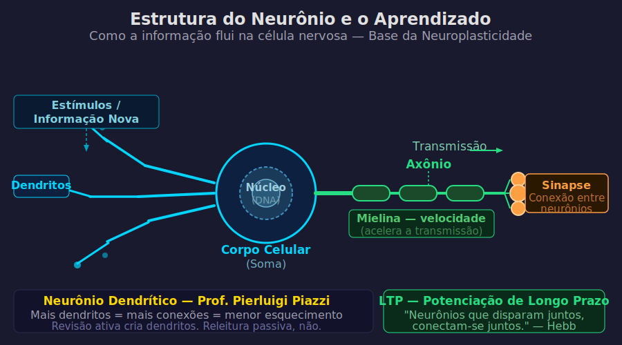
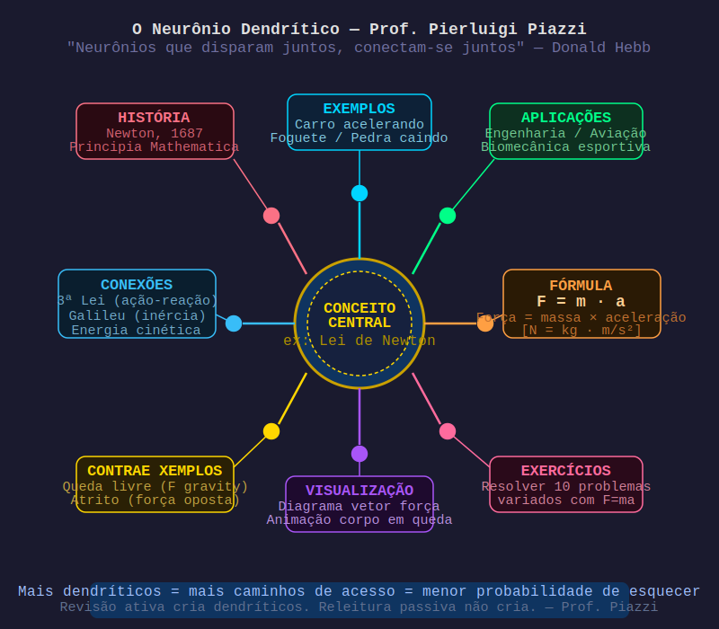

# Aula 02 — Neurociência: Sinapses, LTP e Neuroplasticidade

---

## Informações da Aula

| Campo | Detalhe |
|-------|---------|
| **Módulo** | 1 — Como o Cérebro Aprende |
| **Aula** | 02 de 06 |
| **Duração estimada** | 20 minutos |
| **Nível** | Iniciante |
| **Formato** | Videoaula com slides e animações |
| **Objetivos** | Entender a estrutura do neurônio; compreender sinapses e LTP; conhecer o conceito de neuroplasticidade; aplicar a Lei de Hebb ao estudo |

---

## Roteiro da Aula

| Parte | Tempo | Conteúdo |
|-------|-------|---------|
| Abertura | 2 min | Retomada e conexão com a aula anterior |
| Parte 1 | 4 min | Estrutura do neurônio: dendrito, axônio, sinapse |
| Parte 2 | 4 min | LTP — Long-Term Potentiation e a Lei de Hebb |
| Parte 3 | 4 min | Neuroplasticidade e o experimento dos taxistas de Londres |
| Parte 4 | 3 min | O neurônio dendrítico do Prof. Pier: a metáfora pedagógica |
| Encerramento | 3 min | Exercício prático + próxima aula |

---

## Narração em Primeira Pessoa

### Abertura

Na aula anterior, você entendeu por que aprender a aprender é a meta-habilidade mais importante do século XXI. Você viu que o Life Long Learning não é opcional — é a diferença entre prosperar e ficar para trás num mundo onde o conhecimento tem data de validade cada vez mais curta.

Agora vamos um nível abaixo. Vamos entrar de verdade no hardware que processa todo esse aprendizado: **o seu cérebro**.

Eu sei o que você pode estar pensando: "Almir, eu não preciso virar neurocientista para estudar melhor." E você tem razão — não precisa. Mas precisa entender o básico. Porque quando você entende como o aprendizado acontece biologicamente, as técnicas que vamos ver nos próximos módulos fazem muito mais sentido. E quando as técnicas fazem sentido, você as aplica de forma muito mais consistente.

Então vamos lá. Prepare-se para uma aula que vai mudar sua visão sobre o que acontece dentro da sua cabeça quando você estuda.

---

### Parte 1: O Neurônio — A Unidade Básica do Aprendizado

Seu cérebro tem aproximadamente **86 bilhões de neurônios**. Para ter uma ideia da escala: se você tentasse contar um neurônio por segundo, levaria mais de 2.700 anos para chegar ao fim. É uma quantidade absurda.

Mas o número de neurônios não é o que importa. O que importa são as **conexões entre eles**.

Cada neurônio tem três partes principais que você precisa conhecer:

```
                    ESTRUTURA DO NEURÔNIO
                    ─────────────────────

        Dendrito              Corpo Celular           Axônio
        (receptor)            (processador)           (transmissor)

    ╔═══════╗            ╔═══════════╗           ═══════════════════►
    ║▓▓▓▓▓▓▓╠════════════╣  NÚCLEO   ╠══════════►  Terminal Sináptico
    ╚═══════╝            ╚═══════════╝                     │
                                                           ▼
    ─────────────── SINAPSE ──────────────────────── (próximo neurônio)

    Neurotransmissores cruzam a fenda sináptica
    transportando o sinal elétrico/químico
```

> 📊 **Diagrama:** 

*Figura: Estrutura completa do neurônio — dendritos, soma, axônio com mielina e sinapse. Base neurobiológica do LTP e da neuroplasticidade.*

- **Dendritos**: São como antenas. Eles *recebem* sinais de outros neurônios. Quanto mais dendritos desenvolvidos, mais conexões possíveis.
- **Corpo Celular**: O núcleo de processamento. Integra os sinais recebidos.
- **Axônio**: O cabo de transmissão. Envia o sinal adiante para outros neurônios.
- **Sinapse**: O espaço entre o terminal do axônio de um neurônio e o dendrito do próximo. É onde a "mágica" acontece.

A informação viaja pelo neurônio como um impulso elétrico. Mas quando chega à sinapse, precisa "pular" esse espaço usando mensageiros químicos chamados **neurotransmissores** — como a dopamina, a serotonina, a acetilcolina.

Esse processo — elétrico dentro do neurônio, químico na sinapse — é a base de todo pensamento, memória e aprendizado.

Agora vem a parte mais importante: **o que acontece quando você aprende?**

---

### Parte 2: Long-Term Potentiation (LTP) — A Biologia da Memória

Em 1949, o psicólogo **Donald Hebb** (Universidade McGill, Canadá) propôs uma teoria que mudou a neurociência. Em seu livro *The Organization of Behavior*, ele escreveu o que hoje é uma das frases mais famosas da neurociência:

> *"Neurons that fire together, wire together."*
> — Donald Hebb, 1949

Em português: **"Neurônios que disparam juntos, se conectam."**

O que isso significa na prática?

Quando dois neurônios se ativam ao mesmo tempo repetidamente, a conexão sináptica entre eles fica mais forte e mais rápida. É como uma trilha no mato: a primeira vez que você passa, mal dá para ver o caminho. Mas se você passar 10, 20, 100 vezes, a trilha vai ficando cada vez mais larga e fácil de percorrer.

Em 1973, os neurocientistas **Tim Bliss** e **Terje Lømo** (Instituto Nacional de Saúde, Noruega) confirmaram experimentalmente esse processo. Eles chamaram de **Long-Term Potentiation (LTP)** — em português, Potenciação de Longa Duração.

O LTP é o processo biológico que explica como as memórias se formam e se consolidam. Quando você estuda algo repetidamente, o que está acontecendo no nível molecular é:

1. A sinapse libera mais neurotransmissores
2. Os receptores do neurônio seguinte ficam mais sensíveis
3. Novos receptores são criados
4. O dendrito pode até crescer fisicamente para aproximar os neurônios

| Fase do LTP | O que acontece | Tempo |
|-------------|----------------|-------|
| **LTP precoce** | Fortalecimento temporário da sinapse | Minutos a horas |
| **LTP tardio** | Síntese de novas proteínas, crescimento estrutural | Horas a dias |
| **Consolidação** | Mudança estrutural permanente no neurônio | Dias a semanas |

Isso tem uma implicação prática enorme: **uma única exposição a um conteúdo quase nunca é suficiente para criar LTP tardio**. É por isso que revisar uma única vez não funciona. Você precisa de múltiplas ativações ao longo do tempo.

E tem mais: o LTP é melhorado por **emoção**, **atenção**, **novidade** e **sono**. Veremos cada um desses fatores ao longo do curso.

---

### Parte 3: Neuroplasticidade — O Cérebro Adulto Muda

Até a década de 1990, a neurociência acreditava que o cérebro adulto era essencialmente estático. Depois da infância, os neurônios que você tinha eram os que você ia ter para sempre.

Essa crença estava **completamente errada**.

Em 2000, a pesquisadora **Eleanor Maguire** e sua equipe (University College London) publicaram um estudo que sacudiu a comunidade científica. Eles examinaram os cérebros de **taxistas de Londres** usando ressonância magnética.

Por que taxistas de Londres? Porque para obter a licença de taxista na cidade — conhecida como *"The Knowledge"* — um candidato precisa memorizar o layout completo de mais de 25.000 ruas e milhares de pontos de referência. O processo de estudo leva em média **3 a 4 anos**.

O resultado foi surpreendente: os taxistas com mais anos de experiência tinham um **hipocampo significativamente maior** do que pessoas comuns. O hipocampo é a região do cérebro associada à navegação espacial e à formação de memórias.

E mais importante: quanto **mais tempo de experiência**, maior era o hipocampo.

```
EXPERIMENTO DOS TAXISTAS DE LONDRES (MAGUIRE ET AL., 2000)
──────────────────────────────────────────────────────────

Grupo A: Não-taxistas        Grupo B: Taxistas novos
Hipocampo: ▓▓▓▓▓▓░░░░        Hipocampo: ▓▓▓▓▓▓▓░░░

Grupo C: Taxistas (5-10 anos)  Grupo D: Taxistas (>15 anos)
Hipocampo: ▓▓▓▓▓▓▓▓░░          Hipocampo: ▓▓▓▓▓▓▓▓▓▓

Conclusão: O cérebro adulto se reorganiza e cresce
em resposta ao aprendizado intenso e contínuo.
```

Esse fenômeno tem um nome: **neuroplasticidade**. É a capacidade do cérebro de se reorganizar — criando novas conexões, fortalecendo as existentes e até gerando novos neurônios em certas regiões (esse processo se chama neurogênese, e acontece principalmente no hipocampo).

O que isso significa para você e para o Life Long Learning?

Significa que **nunca é tarde para aprender**. Que o cérebro adulto não é uma estrutura rígida e fechada. Que cada vez que você aprende algo novo e o pratica, você está literalmente mudando a estrutura física do seu cérebro.

Isso não é metáfora. É biologia.

---

### Parte 4: O Neurônio Dendrítico do Prof. Pier

> 📊 **Diagrama:** 

*Figura: O conceito de neurônio dendrítico do Prof. Pier — quanto mais conexões entre conceitos, mais robusto e resistente ao esquecimento é o aprendizado.*

O Prof. **Pierluigi Piazzi** tem uma metáfora pedagógica que eu considero genial pela sua simplicidade e poder de clareza. Ele fala do **neurônio dendrítico**.

A ideia é a seguinte: imagine que cada coisa que você aprende é um dendrito que cresce em um neurônio. Quanto mais conexões você faz entre conceitos, mais dendritos você desenvolve. E neurônios com muitos dendritos são neurônios ricos, bem conectados, poderosos.

Quando você aprende um conceito isolado — sem conectá-lo a nada que já sabia — ele fica como um neurônio com poucos dendritos: fraco, pouco integrado, fácil de perder.

Mas quando você aprende algo e imediatamente busca conectá-lo a outros conhecimentos que você já tem — "isso me lembra aquele conceito de...", "isso é parecido com...", "como isso se aplica ao que estudei sobre..." — você está criando dendritos. Você está tornando o neurônio mais robusto.

> 🧠 **Conceito-Chave: Neurônio Dendrítico (Prof. Pier)**
>
> Quanto mais conexões você faz entre novos e velhos conhecimentos, mais rico e resistente ao esquecimento fica o aprendizado. Não aprenda conceitos isolados. Tece redes de significado.

Essa ideia tem base científica sólida: é o que os pesquisadores chamam de **elaboração** — uma das técnicas de aprendizado mais eficazes, que vamos estudar em profundidade no Módulo 3.

A pergunta que você deve se fazer toda vez que aprende algo novo é: **"Onde isso se encaixa no que eu já sei?"**

Essa pergunta simples ativa o processo de criação de dendritos. Ela transforma informação nova em conhecimento conectado.

---

### Mielinização: O Processo de Automatização

Existe um último processo biológico que preciso mencionar aqui: a **mielinização**.

A mielina é uma substância gordurosa que envolve o axônio dos neurônios. Quanto mais você pratica uma habilidade ou revisa um conhecimento, mais mielina é depositada ao redor do axônio correspondente.

E o efeito é impressionante: **o sinal elétrico viaja até 100 vezes mais rápido** em axônios bem mielinizados do que em axônios sem mielina.

É exatamente isso que acontece quando você "automatiza" uma habilidade. Quando você digitou pela primeira vez, precisou olhar para o teclado e pensar em cada letra. Depois de milhares de horas de prática, você digita sem pensar — porque os circuitos neuronais envolvidos estão fortemente mielinizados.

O mesmo processo acontece com qualquer conhecimento que você repete e pratica com consistência.

```
IMPACTO DA MIELINIZAÇÃO NA VELOCIDADE DE TRANSMISSÃO
──────────────────────────────────────────────────────

Axônio sem mielina:  ──────────────────► 0.5 m/s
Axônio mielinizado:  ══════════════════► até 120 m/s

Razão: 240x mais rápido

→ Prática deliberada + Repetição = Mais mielina = Mais velocidade
```

Isso tem uma implicação direta para o seu estudo: **a prática distribuída ao longo do tempo** (que vamos estudar na Aula 03) é a forma mais eficiente de construir mielina. Uma maratona de estudos de 8 horas constrói muito menos mielina do que 30 minutos por dia durante vários dias.

---

### Encerramento

Nesta aula, você aprendeu que:

- O cérebro tem 86 bilhões de neurônios que se comunicam por sinapses eletroquímicas
- O LTP é o processo biológico que cria memórias duradouras — e requer múltiplas ativações
- A neuroplasticidade prova que o cérebro adulto muda com o aprendizado (taxistas de Londres)
- O neurônio dendrítico do Prof. Pier nos ensina a criar redes de conhecimento, não ilhas
- A mielinização é o processo que automatiza habilidades — construída pela prática distribuída

Na próxima aula, vamos ver uma das descobertas mais impactantes da história da psicologia do aprendizado: a **curva do esquecimento de Ebbinghaus** — e o que ela significa para a sua rotina de estudos hoje.

Faça o exercício antes de continuar. O cérebro precisa processar o que acabou de aprender.

---

## Exercício Prático

**Exercício: Seu Neurônio Dendrítico**

Pegue uma folha de papel A4 na posição horizontal (paisagem).

1. No centro da folha, desenhe um círculo e escreva dentro: **"[TEMA QUE VOCÊ ESTÁ ESTUDANDO AGORA]"**

2. Trace **5 linhas saindo do círculo** (como dendritos). Em cada linha, escreva um conceito, fato ou aplicação relacionada a esse tema.

3. Agora trace **linhas secundárias** saindo de cada dendrito principal, conectando com outros conhecimentos que você já tem. Exemplo: se estudar IA, um dendrito pode ser "Machine Learning", e desse dendrito sair: "estatística" e "álgebra linear", que você já conhece de outra área.

4. Ao final, conte: **quantos dendritos e conexões você criou?**

**Objetivo**: Ter pelo menos 15 conexões totais. Quanto mais, melhor.

Esse exercício é uma versão simplificada do **mind map** (mapa mental), que vamos estudar com profundidade no Módulo 3.

---

## Quiz de Retrieval

**1. O que é uma sinapse?**
- a) O núcleo do neurônio
- b) O espaço de comunicação entre dois neurônios
- c) A substância que envolve o axônio
- d) O tipo de neurônio responsável por memórias

**2. O que afirma a Lei de Hebb?**
- a) Neurônios que não são usados morrem
- b) Neurônios que disparam juntos se conectam
- c) O cérebro adulto não pode criar novos neurônios
- d) A memória é armazenada no córtex pré-frontal

**3. O experimento dos taxistas de Londres (Maguire, 2000) demonstrou que:**
- a) Taxistas têm QI mais alto que a média
- b) O hipocampo encolhe com o envelhecimento
- c) O cérebro adulto cresce em regiões muito utilizadas
- d) A memória geográfica é inata, não aprendida

**4. Qual é o efeito da mielinização no axônio?**
- a) Diminui a velocidade do sinal elétrico
- b) Aumenta a velocidade de transmissão em até 100x
- c) Cria novos neurônios no hipocampo
- d) Reduz a necessidade de sono para consolidação

**5. Segundo o Prof. Pier, o neurônio dendrítico representa:**
- a) A importância de estudar em silêncio
- b) A importância de criar conexões entre conhecimentos
- c) A necessidade de revisar todos os dias
- d) O processo de esquecimento natural

### Gabarito
1. **b** — Sinapse é o espaço de comunicação entre neurônios
2. **b** — "Neurons that fire together, wire together" (Hebb)
3. **c** — O hipocampo cresceu em taxistas experientes
4. **b** — Mielina aumenta a velocidade em até 100x
5. **b** — Neurônio dendrítico = redes de conexões entre conhecimentos

---

## Leitura Recomendada

- **Piazzi, Pierluigi.** *Aprendendo Inteligência*. Editora Aleph. (Cap. 3 — O Neurônio Dendrítico)
- **Oakley, Barbara.** *Aprendendo a Aprender*. Elsevier. (Cap. 2 — Módulo de Memória)
- **Maguire, E.A. et al.** (2000). Navigation-related structural change in the hippocampi of taxi drivers. *PNAS*, 97(8), 4398–4403.
- **Ratey, John.** *Corpo em Movimento, Mente em Ação*. Objetiva. (Cap. 2)
