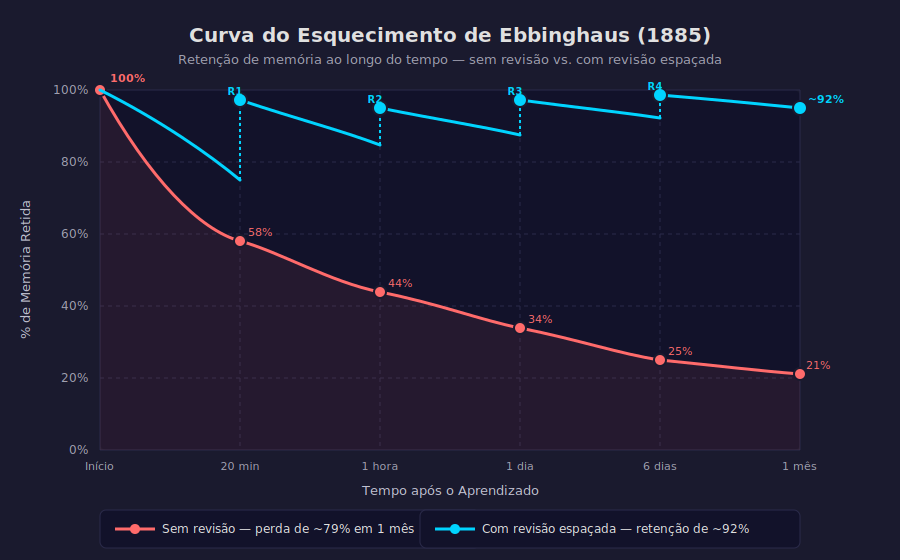

# Aula 03 — A Curva do Esquecimento de Ebbinghaus

---

## Informações da Aula

| Campo | Detalhe |
|-------|---------|
| **Módulo** | 1 — Como o Cérebro Aprende |
| **Aula** | 03 de 06 |
| **Duração estimada** | 20 minutos |
| **Nível** | Iniciante |
| **Formato** | Videoaula com gráficos e dados |
| **Objetivos** | Compreender a curva do esquecimento; calcular janelas de revisão ideais; entender o efeito do espaçamento; criar um plano de revisão pessoal |

---

## Roteiro da Aula

| Parte | Tempo | Conteúdo |
|-------|-------|---------|
| Abertura | 2 min | Pergunta provocadora sobre esquecimento |
| Parte 1 | 4 min | Hermann Ebbinghaus: o experimento mais importante da psicologia do aprendizado |
| Parte 2 | 4 min | Os dados: o que você perde e em quanto tempo |
| Parte 3 | 4 min | A solução: revisão espaçada e a regra do Prof. Pier |
| Parte 4 | 3 min | O efeito do espaçamento: 44% menos tempo de estudo |
| Encerramento | 3 min | Exercício prático + próxima aula |

---

## Narração em Primeira Pessoa

### Abertura

Você já passou horas estudando para uma prova, foi bem, e duas semanas depois não se lembrava de quase nada do que estudou? Se isso aconteceu com você, não é falta de inteligência, não é falta de esforço e não é defeito de fábrica.

É a **curva do esquecimento**. E ela afeta a todos nós — de forma previsível, quantificável e, mais importante: **controlável**.

Hoje vamos falar sobre um dos experimentos mais importantes da história da psicologia do aprendizado. Um experimento que um alemão realizou sozinho, usando a si mesmo como cobaia, no final do século XIX — e que continua sendo citado em todo livro sério sobre educação e memória.

E depois de entender o problema com precisão científica, vou te mostrar a solução exata.

---

### Parte 1: Hermann Ebbinghaus — O Homem que Mediu o Esquecimento

**Hermann Ebbinghaus** nasceu em 1850 na Alemanha e foi o primeiro psicólogo a estudar a memória de forma experimental e quantitativa. Isso pode parecer óbvio hoje, mas na época era revolucionário. A memória era considerada um território da filosofia, não da ciência.

Ebbinghaus passou anos memorizando listas de sílabas sem sentido — combinações como "DAX", "BUP", "LOF" — e testando a si mesmo em intervalos diferentes para medir quanto havia esquecido.

Por que sílabas sem sentido? Porque ele queria isolar o processo puro de memorização, sem a interferência do significado ou de associações com conhecimentos prévios. Era um experimento cirúrgico.

Depois de milhares de tentativas, em 1885, ele publicou seu monumental livro **"Über das Gedächtnis"** (*"Sobre a Memória"*). Os dados que ele encontrou foram, e continuam sendo, chocantes.

---

### Parte 2: Os Dados — O Que Você Perde e em Quanto Tempo

Olha o que Ebbinghaus descobriu. Após aprender uma lista de informações novas:

| Tempo após o aprendizado | % Retida | % Esquecida |
|--------------------------|----------|-------------|
| Imediatamente após | 100% | 0% |
| 20 minutos depois | 58% | **42%** |
| 1 hora depois | 44% | 56% |
| 1 dia depois | 34% | **66%** |
| 6 dias depois | 25% | 75% |
| 1 mês depois | 21% | **79%** |

Deixa isso afundar por um momento.

**Em apenas 1 dia, você esquece 66% do que aprendeu.** Em 1 mês, você mantém apenas 21%.

Isso significa que se você assistir uma aula hoje e não fizer nada nos próximos 30 dias, menos de 1/4 do conteúdo ainda estará acessível na sua memória.

```
CURVA DO ESQUECIMENTO DE EBBINGHAUS (1885)
──────────────────────────────────────────

100% ├────•
     │     ╲
 80% │      ╲
     │       ╲
 60% │        •──── 20 min: 58%
     │          ╲
 40% │           ╲•─ 1 hora: 44%
     │             ╲
 20% │              •── 1 dia: 34%
     │               •─ 6 dias: 25%
     │                •─ 1 mês: 21%
  0% └──────────────────────────────►
     0  20min  1h   1d   6d   1mês
                    Tempo

⚠️  Sem revisão, você perde ~79% do conteúdo em 1 mês
```

> 📊 **Diagrama:** 

*Figura: Curva do Esquecimento de Ebbinghaus (1885) — retenção sem revisão (vermelho) vs. com revisão espaçada (ciano). Fonte: Ebbinghaus, H. (1885). Über das Gedächtnis.*

Agora vem a parte boa: **Ebbinghaus também descobriu a solução**.

---

### Parte 3: A Solução — Revisão Espaçada e a Regra do Prof. Pier

Ebbinghaus não apenas mediu o esquecimento — ele mediu o que acontecia quando as pessoas revisavam o conteúdo. E descobriu algo que ele chamou de **"efeito do espaçamento"**: revisar o mesmo conteúdo em **momentos espaçados no tempo** é dramaticamente mais eficiente do que revisar o mesmo conteúdo várias vezes na mesma sessão.

A cada vez que você revisa antes de esquecer completamente, a curva do esquecimento recomeça de um nível mais alto e cai mais devagar.

```
COM REVISÃO ESPAÇADA
──────────────────────

100% ├────•                 •           •               •
     │     ╲              /│           /│              /│
 80% │      ╲            / │          / │             / │
     │       ╲          /  │         /  │            /  │
 60% │        ╲        /   │        /   │           /   │
     │         ╲      /    │       /    │          /    │
 40% │          •────/     │──────/     │─────────/     │
     │              ↑      ↑     ↑      ↑
  0% └──────────────────────────────────────────────────►
     Aprende  Revisão1  Revisão2  Revisão3  Revisão4
              (24h)     (1 sem)   (1 mês)   (6 meses)

✅  Com revisões, você mantém >80% mesmo após meses
```

O **Prof. Pierluigi Piazzi** vai um passo além de Ebbinghaus. Com base em décadas de experiência com estudantes brasileiros, ele define uma regra prática que funcionou para milhares de alunos:

> 📋 **A Regra de Revisão do Prof. Pier**
>
> Após aprender algo novo, revise nos seguintes intervalos:
> 1. **Em até 24 horas** (crítico — a janela mais importante)
> 2. **Em 1 semana**
> 3. **Em 1 mês**
> 4. **Em 6 meses**
>
> Quatro revisões. Quatro janelas. E o conteúdo vai para a memória de longo prazo.

Por que 24 horas é tão crítico? Porque olhando para a curva de Ebbinghaus, é exatamente nessa janela que a maior queda acontece. Se você revisar dentro de 24 horas, você "salva" o conteúdo antes da queda mais abrupta.

O Prof. Pier tem uma frase direta sobre isso: *"Estudar sem revisar no dia seguinte é como encher um balde furado. O esforço existe, mas o resultado some."*

---

### Parte 4: O Efeito do Espaçamento — 44% Menos Tempo de Estudo

Agora deixa eu te dar um dado que vai fazer você repensar completamente como organiza seus estudos.

O pesquisador **Harry Bahrick** (Ohio Wesleyan University) conduziu um estudo clássico comparando dois grupos de estudantes aprendendo o mesmo conteúdo:

- **Grupo 1**: Estudou o conteúdo de forma concentrada (massed practice / maratona de estudos)
- **Grupo 2**: Estudou o mesmo conteúdo distribuído em sessões espaçadas ao longo do tempo

Resultado após 5 anos: o Grupo 2 reteve significativamente mais. E mais surpreendente: para atingir o mesmo nível de retenção, o Grupo 2 precisou de **44% menos tempo total de estudo**.

Você leu certo: quase metade do tempo para o mesmo resultado — ou melhor.

| Estratégia | Tempo investido | Retenção (5 anos depois) |
|------------|----------------|--------------------------|
| Maratona de estudos | 100% | Baixa |
| Revisão espaçada | **56%** | Alta |

Isso destrói o mito de que estudar muito em um curto período (o famoso "virar a noite estudando") é eficiente. É justamente o oposto.

Existe até um nome para esse fenômeno negativo: **massed practice** (prática massed, ou concentrada). Parece funcionar no curto prazo — você consegue lembrar tudo na prova. Mas o conteúdo some em dias.

Já a **spaced practice** (prática espaçada) parece mais difícil e lenta no momento, mas produz retenção duradoura. Os pesquisadores chamam esse paradoxo de **"dificuldade desejável"** — a dificuldade que gera aprendizado real.

Para o Life Long Learning, isso é fundamental: não adianta fazer cursos intensivos de fim de semana se você não tem um plano de revisão estruturado. O conteúdo vai embora. Um praticante de LLL de verdade pensa em intervalos, não apenas em sessões.

---

### Como Aplicar a Revisão Espaçada na Prática

Existem três formas principais de implementar a revisão espaçada:

**1. Sistema Manual (Agenda ou Caderno)**
Após aprender algo, anote na agenda as datas de revisão:
- Dia de hoje: Aprendizado original
- Amanhã: Revisão 1
- +7 dias: Revisão 2
- +30 dias: Revisão 3
- +180 dias: Revisão 4

**2. Flashcards com Algoritmo de Espaçamento**
O aplicativo **Anki** usa o algoritmo SM-2, desenvolvido pelo pesquisador **Piotr Wozniak**, que automaticamente calcula quando você deve rever cada flashcard com base no seu desempenho. É a implementação tecnológica perfeita da curva de Ebbinghaus.

**3. Sistema de Leitmann (Caixa de Revisão)**
Um sistema físico com 5 caixas numeradas. Flashcards que você acerta passam para caixas com revisão menos frequente. Flashcards errados voltam para a caixa 1.

```
SISTEMA DE CAIXA DE REVISÃO (LEITMANN)
────────────────────────────────────────

Caixa 1: Revisar todo dia      [acertou → avança] [errou → volta]
Caixa 2: Revisar a cada 2 dias      ↑
Caixa 3: Revisar a cada 1 semana    ↑
Caixa 4: Revisar a cada 2 semanas   ↑
Caixa 5: Revisar a cada 1 mês       ↑ → Memória de Longo Prazo ✅
```

No Módulo 3, vamos ver como criar flashcards eficazes. Por enquanto, o importante é você entender o princípio: **o tempo entre revisões é o ingrediente ativo**.

---

### Encerramento

Nesta aula você aprendeu que:

- Ebbinghaus (1885) mediu que perdemos **79% do conteúdo em 1 mês** sem revisão
- A **janela das 24 horas** é a mais crítica — é onde a maior queda da curva acontece
- A revisão espaçada não apenas funciona melhor — ela exige **44% menos tempo** (Bahrick)
- A regra do Prof. Pier: revisar em 24h, 1 semana, 1 mês e 6 meses
- Para quem pratica LLL, ter um sistema de revisão não é opcional — é o que diferencia o aprendizado real do aprendizado temporário

Na próxima aula, vamos entender os diferentes tipos de memória — sensorial, de trabalho e de longo prazo — e por que seu cérebro só consegue processar 4 unidades de informação de cada vez.

---

## Exercício Prático

**Exercício: Seu Plano de Revisão Espaçada**

Pegue um conteúdo que você está estudando agora (pode ser um módulo deste curso, um livro técnico, um treinamento da empresa — qualquer coisa).

Preencha o modelo:

```
MEU PLANO DE REVISÃO ESPAÇADA
═══════════════════════════════════════

Conteúdo a revisar: _________________________________

Data do aprendizado original: ______/______/______

┌─────────────────────────────────────────────────┐
│                AGENDA DE REVISÕES               │
├──────────────┬──────────────────┬───────────────┤
│ Revisão      │ Data prevista    │ Concluída?    │
├──────────────┼──────────────────┼───────────────┤
│ Revisão 1    │ (+ 1 dia)        │ [ ]           │
│              │ ______/______    │               │
├──────────────┼──────────────────┼───────────────┤
│ Revisão 2    │ (+ 1 semana)     │ [ ]           │
│              │ ______/______    │               │
├──────────────┼──────────────────┼───────────────┤
│ Revisão 3    │ (+ 1 mês)        │ [ ]           │
│              │ ______/______    │               │
├──────────────┼──────────────────┼───────────────┤
│ Revisão 4    │ (+ 6 meses)      │ [ ]           │
│              │ ______/______    │               │
└──────────────┴──────────────────┴───────────────┘

Método de revisão que vou usar:
[ ] Flashcards (Anki)
[ ] Papel em branco (escrever tudo que lembro)
[ ] Resumo em voz alta
[ ] Ensinar para outra pessoa
[ ] Outro: _____________________________
```

**Dica**: Coloque as datas no seu calendário agora. Não quando der vontade — agora.

---

## Quiz de Retrieval

**1. Quanto conteúdo é esquecido em média após 1 dia, segundo Ebbinghaus?**
- a) 20%
- b) 42%
- c) 66%
- d) 79%

**2. Qual é a primeira janela de revisão mais crítica, segundo o Prof. Pier?**
- a) Imediatamente após aprender
- b) 24 horas após aprender
- c) 1 semana após aprender
- d) 1 mês após aprender

**3. O estudo de Bahrick demonstrou que a revisão espaçada requer quanto menos tempo para a mesma retenção?**
- a) 10%
- b) 25%
- c) 44%
- d) 60%

**4. O que é "massed practice"?**
- a) Revisão distribuída ao longo do tempo
- b) Estudar em grupo
- c) Estudo concentrado em um único período
- d) Uso de flashcards digitais

**5. Qual aplicativo usa o algoritmo SM-2 para implementar revisão espaçada automaticamente?**
- a) Notion
- b) Anki
- c) Quizlet
- d) Duolingo

### Gabarito
1. **c** — 66% esquecido em 1 dia (34% retido)
2. **b** — 24 horas é a janela mais crítica
3. **c** — 44% menos tempo para a mesma retenção (Bahrick)
4. **c** — Massed practice = estudo concentrado/maratona
5. **b** — Anki usa o algoritmo SM-2 de Piotr Wozniak

---

## Leitura Recomendada

- **Ebbinghaus, Hermann.** *Über das Gedächtnis* (1885). Disponível em tradução: *Memory: A Contribution to Experimental Psychology*.
- **Piazzi, Pierluigi.** *Aprendendo Inteligência*. Editora Aleph. (Cap. 5 — Revisões)
- **Bahrick, H.P.** (1979). Maintenance of knowledge: Questions about memory we forgot to ask. *Journal of Experimental Psychology: General*, 108(3), 296–308.
- **Roediger, H.L. & Karpicke, J.D.** (2006). The power of testing memory. *Perspectives on Psychological Science*, 1(3), 181–210.
