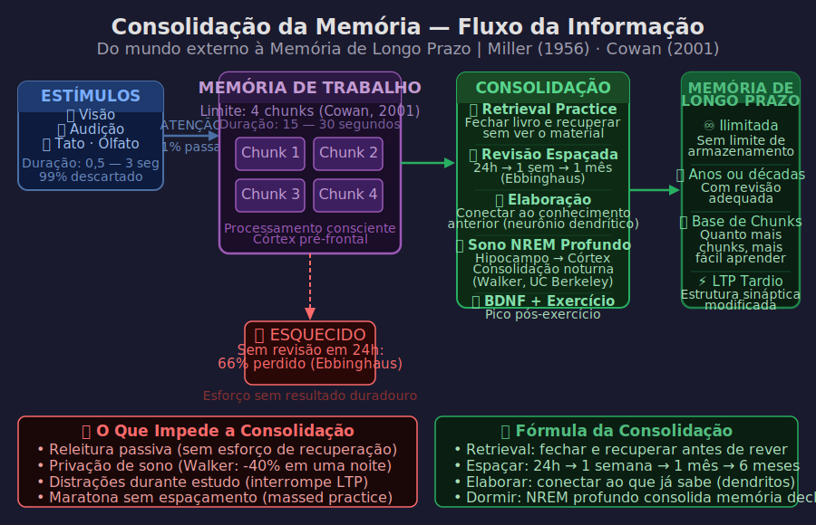

# Aula 04 — Memória de Trabalho e Memória de Longo Prazo

---

## Informações da Aula

| Campo | Detalhe |
|-------|---------|
| **Módulo** | 1 — Como o Cérebro Aprende |
| **Aula** | 04 de 06 |
| **Duração estimada** | 20 minutos |
| **Nível** | Iniciante |
| **Formato** | Videoaula com experimentos interativos |
| **Objetivos** | Diferenciar os tipos de memória; entender o limite da memória de trabalho; aplicar chunking para superar esse limite; compreender o processo de consolidação |

---

## Roteiro da Aula

| Parte | Tempo | Conteúdo |
|-------|-------|---------|
| Abertura | 2 min | Experimento ao vivo: teste de memória imediata |
| Parte 1 | 4 min | Três tipos de memória: sensorial, de trabalho, de longo prazo |
| Parte 2 | 4 min | George Miller e os 7±2 chunks; Nelson Cowan e os 4 reais |
| Parte 3 | 4 min | Chunking: como agrupar para caber na memória de trabalho |
| Parte 4 | 3 min | Consolidação: o caminho da memória de trabalho para o longo prazo |
| Encerramento | 3 min | Exercício prático + próxima aula |

---

## Narração em Primeira Pessoa

### Abertura — Experimento ao Vivo

Antes de começar, quero fazer um experimento com você. Vou te dar uma sequência de números e você vai tentar memorizar sem anotar. Pronto?

**4 — 7 — 2 — 9 — 1 — 5 — 8 — 3 — 6 — 0 — 4 — 7**

Agora, sem olhar para cima: quanto você conseguiu lembrar?

Se você lembrou os primeiros 4 a 7 números, você está dentro do esperado. Se lembrou os 12, ou você fez algum truque de memorização ou tem uma memória fora do padrão.

Esse experimento simples revela uma das limitações mais importantes da cognição humana — e entender essa limitação é chave para estudar de forma mais inteligente.

Vamos falar sobre **os tipos de memória** e por que o sistema funciona do jeito que funciona.

---

### Parte 1: Os Três Tipos de Memória

Quando os psicólogos cognitivos estudam memória, eles descrevem três sistemas principais que trabalham em sequência:

> 📊 **Diagrama:** 

*Figura: Do mundo externo à Memória de Longo Prazo — processo de consolidação, técnicas eficazes e o que impede a retenção. Miller (1956) · Cowan (2001).*

**1. Memória Sensorial**
É o primeiro filtro. Todos os estímulos do ambiente — sons, imagens, sensações — passam primeiro pela memória sensorial. Ela dura pouquíssimo: entre 0.5 e 3 segundos.

Nessa janela minúscula, seu cérebro decide o que merece atenção. O que passa pelo filtro da atenção vai para a memória de trabalho. O restante — que é a esmagadora maioria — é simplesmente descartado.

Isso explica por que estudar com distrações é tão prejudicial: cada notificação, cada mensagem, cada som diferente compete pela atenção e pode desviar o que deveria ir para a memória de trabalho.

**2. Memória de Trabalho**
É onde o pensamento consciente acontece. É onde você processa informação nova, resolve problemas, conecta ideias. Pense nela como a mesa de trabalho da sua mente.

O problema? Ela é pequena. Muito pequena. E tem uma duração limitada: sem ensaio ativo (repetir mentalmente, por exemplo), a informação some em 15 a 30 segundos.

**3. Memória de Longo Prazo**
É o arquivo. É onde fica tudo que você realmente "sabe". Ao contrário da memória de trabalho, a memória de longo prazo tem capacidade praticamente ilimitada — o problema nunca é falta de espaço.

O desafio é **transferir informação da memória de trabalho para o longo prazo** de forma eficiente. E é exatamente aí que a maioria das estratégias de estudo atua.

---

### Parte 2: O Limite da Memória de Trabalho — 7±2 e a Correção para 4

Em 1956, o psicólogo **George Miller** (Princeton University) publicou um artigo que se tornou um dos mais citados de toda a psicologia. O título era direto: ***"The Magical Number Seven, Plus or Minus Two: Some Limits on Our Capacity for Processing Information."***

Miller demonstrou que a memória de trabalho consegue armazenar, em média, **7 ± 2 unidades de informação** — ou seja, entre 5 e 9 itens.

O artigo teve impacto enorme. Por décadas, o "número mágico 7" foi citado como o limite do processamento humano. Os números de telefone foram originalmente definidos com 7 dígitos (excluindo o código de área) com base nessa pesquisa.

Mas a ciência avançou.

Em 2001, o pesquisador **Nelson Cowan** (University of Missouri) revisou décadas de estudos sobre memória de trabalho e chegou a uma conclusão diferente. Quando os experimentos controlavam adequadamente para ensaio verbal e outras estratégias compensatórias, o limite real era muito menor: **apenas 4 chunks** (± 1).

| Pesquisador | Ano | Limite encontrado |
|-------------|-----|-------------------|
| George Miller | 1956 | 7 ± 2 unidades |
| Nelson Cowan | 2001 | 4 ± 1 chunks |

A diferença? Miller media chunks de qualquer tamanho. Cowan controlou melhor as variáveis.

> 🧠 **Conceito-Chave: O Limite de 4 Chunks**
>
> Sua memória de trabalho consegue manter ativamente apenas **4 unidades de informação** ao mesmo tempo. Isso não é limitação sua — é o hardware de todos os seres humanos. Conhecer esse limite é o primeiro passo para trabalhar com ele, não contra ele.

Isso tem implicações profundas para o design de materiais de estudo, apresentações, aulas e até reuniões. Se você quer que alguém processe uma ideia, não bombardeie com 12 conceitos ao mesmo tempo.

---

### Parte 3: Chunking — Como Agrupar para Superar o Limite

Agora vem a parte inteligente: se o limite é 4 chunks, **o que é um "chunk"?**

Um chunk é uma unidade de informação que o cérebro trata como *uma única peça*, independentemente da sua complexidade interna.

Veja este exemplo: tente memorizar esta sequência de letras —

**C N P J C P F D N A I B G E**

14 letras. Impossível para a maioria das pessoas em uma passagem.

Agora reorganize:

**CNPJ — CPF — DNA — IBGE**

De repente, em vez de 14 elementos, você tem **4 chunks** — que cabem perfeitamente na memória de trabalho. E cada um desses chunks ativa um conhecimento que você já tem, tornando a memorização quase automática.

Isso é **chunking**: o processo de agrupar informações isoladas em unidades maiores e significativas. E quanto mais conhecimento prévio você tem sobre um assunto, maiores podem ser seus chunks — e mais eficiente fica seu aprendizado.

```
SEM CHUNKING — 12 itens (ultrapassa o limite)
─────────────────────────────────────────────
[C] [N] [P] [J] [C] [P] [F] [D] [N] [A] [I] [B] [G] [E]
 ⚠️  Memória de trabalho sobrecarregada

COM CHUNKING — 4 itens (dentro do limite)
──────────────────────────────────────────
[CNPJ] [CPF] [DNA] [IBGE]
 ✅  Memória de trabalho confortável
```

**Aplicação para o estudo**: quando você está aprendendo algo novo em uma área que não conhece, seus chunks são pequenos — cada termo, cada conceito, cada fórmula precisa de um slot. Por isso, iniciar uma nova disciplina é cognitivamente exaustivo.

À medida que você aprende, conceitos vão sendo agrupados em chunks maiores. O que antes ocupava 4 slots agora ocupa 1. Isso libera capacidade para processar conceitos mais complexos.

É por isso que especialistas conseguem pensar sobre problemas muito mais sofisticados do que iniciantes: não porque têm memória de trabalho maior, mas porque seus chunks são enormes, permitindo que processos complexos caibam em poucos slots.

O pesquisador **Chase & Simon** (1973) demonstraram isso com enxadristas: grandes mestres conseguem reconhecer e lembrar configurações complexas do tabuleiro de xadrez em segundos, não porque têm memória superior, mas porque reconhecem **padrões inteiros** como um único chunk.

---

### Parte 4: Consolidação — O Caminho para o Longo Prazo

Entender a memória de trabalho é só metade da equação. A outra metade é entender como a informação sai de lá e vai para o longo prazo — o processo de **consolidação**.

A consolidação não acontece automaticamente. Ela requer esforço ativo e, crucialmente, **tempo** (especialmente sono, que vamos ver na Aula 06).

Existem dois processos principais que transferem informação da memória de trabalho para o longo prazo:

**1. Repetição com Elaboração**
Não é simplesmente repetir a informação várias vezes (isso usa a memória de trabalho mas não consolida bem). É repeti-la *enquanto conecta com outros conhecimentos* — o que o Prof. Pier chamaria de criar dendritos.

**2. Retrieval Practice (Prática de Recuperação)**
Em vez de reler a informação (que mantém tudo na memória de trabalho), tente *recuperar* a informação sem olhar para o material. Esse esforço de busca ativa o hipocampo e sinaliza ao cérebro que essa informação é importante o suficiente para ser consolidada.

Veremos a prática de recuperação em profundidade no Módulo 3. Por ora, saiba que o quiz ao final desta aula não é apenas avaliação — é uma ferramenta de consolidação.

```
PROCESSO DE CONSOLIDAÇÃO DA MEMÓRIA
────────────────────────────────────────────────────────────

Memória de Trabalho          Processos de Consolidação
┌─────────────────┐          ┌────────────────────────────┐
│  Informação     │──────────►   Elaboração               │
│  nova           │          │   (conectar a conhecimento) │
│                 │──────────►   Retrieval Practice        │
│  [4 chunks max] │          │   (tentar recuperar)        │
│                 │──────────►   Sono NREM profundo        │
└─────────────────┘          │   (consolidação noturna)    │
                             └──────────┬─────────────────┘
                                        │
                                        ▼
                             Memória de Longo Prazo ✅
                             ┌─────────────────────────┐
                             │  Capacidade ilimitada   │
                             │  Dura anos ou décadas   │
                             │  Base para novos chunks │
                             └─────────────────────────┘
```

Há ainda um fator que a neurociência mostrou ser fundamental para a consolidação: **o estado emocional no momento do aprendizado**. A amígdala — região cerebral responsável por processar emoções — trabalha em conjunto com o hipocampo. Conteúdos aprendidos durante estados de alta relevância emocional (curiosidade, surpresa, satisfação) se consolidam melhor.

É por isso que lembrar de onde você estava quando ouviu uma notícia muito impactante é muito mais fácil do que lembrar o que comeu na semana passada.

Implicação prática: **crie relevância emocional** ao estudar. Conecte o conteúdo a por quê ele importa para sua vida, carreira, objetivos. Pergunte: "Se eu aprender isso, o que muda para mim?" Essa pergunta ativa a amígdala e melhora a consolidação.

---

### Encerramento

Nesta aula você aprendeu que:

- Existem três tipos de memória em sequência: **sensorial**, **de trabalho** e **de longo prazo**
- A memória de trabalho tem limite real de **4 chunks** (Cowan, 2001) — não 7 como se pensava
- **Chunking** é agrupar informações em unidades significativas para aumentar o que cabe no processamento consciente
- A **consolidação** é o processo ativo de transferência para o longo prazo — requer elaboração, retrieval e sono
- Criar relevância emocional melhora a consolidação via amígdala

Na próxima aula, vamos explorar um dos conceitos mais revolucionários trazidos por Barbara Oakley: os **modos focado e difuso** do cérebro — e por que as melhores ideias muitas vezes surgem quando você *para de pensar* no problema.

---

## Exercício Prático

**Exercício: Testando os Seus Limites de Memória de Trabalho**

**Parte A — Teste Básico**
Peça a alguém para ler as sequências abaixo em voz alta, uma de cada vez, em ritmo constante (um número por segundo). Após cada sequência, tente repetir sem ver.

```
Sequência de 4:   7 - 3 - 9 - 1
Sequência de 5:   4 - 8 - 2 - 6 - 0
Sequência de 6:   3 - 7 - 1 - 9 - 4 - 2
Sequência de 7:   8 - 1 - 5 - 3 - 7 - 0 - 4
Sequência de 8:   2 - 6 - 9 - 4 - 1 - 8 - 3 - 7
Sequência de 9:   5 - 0 - 8 - 3 - 6 - 1 - 9 - 4 - 2
```

Anote: **qual foi a última sequência que você acertou completamente?**

**Parte B — Teste com Chunking**
Agora tente memorizar estas letras: **BR-PIX-API-SPI-BCB**

Conta quantos elementos são esses: 5 chunks. Agora tente: quantos dígitos/letras totais existem? 17.

Você acabou de memorizar 17 elementos usando 5 chunks. Isso é chunking na prática.

**Parte C — Reflexão**
Escreva 3 áreas de conhecimento onde você já tem chunks grandes (onde você é especialista ou tem muito conhecimento) e 3 áreas onde seus chunks são pequenos (você está começando).

Observe como o aprendizado se sente diferente entre essas áreas. Isso tem uma causa neurológica clara.

---

## Quiz de Retrieval

**1. Segundo Nelson Cowan (2001), qual é o limite real da memória de trabalho?**
- a) 7 ± 2 chunks
- b) 5 chunks
- c) 4 ± 1 chunks
- d) 9 chunks

**2. O que é "chunking"?**
- a) Um tipo de revisão espaçada
- b) Agrupar informações isoladas em unidades maiores e significativas
- c) A técnica de sublinhar partes importantes do texto
- d) O processo de consolidação durante o sono

**3. Por que especialistas conseguem pensar em problemas mais complexos que iniciantes?**
- a) Têm memória de trabalho biologicamente maior
- b) Usam mais o hemisfério direito do cérebro
- c) Seus chunks são maiores, liberando slots para conceitos mais sofisticados
- d) Dormem mais horas por noite

**4. Qual região do cérebro, segundo a neurociência, colabora com a consolidação de memórias associadas a estados emocionais?**
- a) Córtex pré-frontal
- b) Amígdala
- c) Cerebelo
- d) Broca

**5. Qual é a duração média da memória de trabalho sem ensaio ativo?**
- a) 2 a 5 segundos
- b) 1 a 2 minutos
- c) 15 a 30 segundos
- d) Até 5 minutos

### Gabarito
1. **c** — 4 ± 1 chunks (Cowan, 2001)
2. **b** — Agrupar informações em unidades significativas
3. **c** — Chunks maiores liberam capacidade da memória de trabalho
4. **b** — Amígdala processa emoções e colabora com o hipocampo na consolidação
5. **c** — 15 a 30 segundos sem repetição ativa

---

## Leitura Recomendada

- **Miller, G.A.** (1956). The magical number seven, plus or minus two. *Psychological Review*, 63(2), 81–97.
- **Cowan, N.** (2001). The magical number 4 in short-term memory. *Behavioral and Brain Sciences*, 24(1), 87–114.
- **Oakley, Barbara.** *Aprendendo a Aprender*. Elsevier. (Cap. 3 — Blocos de Memória)
- **Chase, W.G. & Simon, H.A.** (1973). Perception in chess. *Cognitive Psychology*, 4(1), 55–81.
