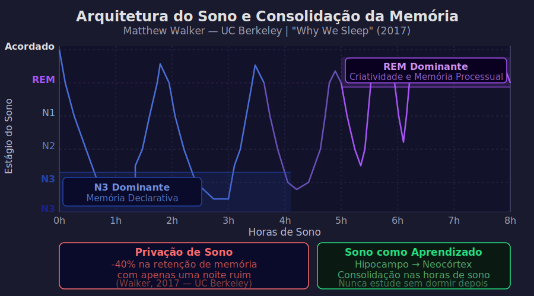

# Aula 06 — Sono, Exercício e BDNF: Os Pilares Biológicos do Aprendizado

---

## Informações da Aula

| Campo | Detalhe |
|-------|---------|
| **Módulo** | 1 — Como o Cérebro Aprende |
| **Aula** | 06 de 06 |
| **Duração estimada** | 20 minutos |
| **Nível** | Iniciante |
| **Formato** | Videoaula com dados e infográficos |
| **Objetivos** | Compreender o papel do sono na consolidação da memória; entender o BDNF e o efeito do exercício no aprendizado; criar uma rotina biologicamente fundamentada para potencializar o estudo |

---

## Roteiro da Aula

| Parte | Tempo | Conteúdo |
|-------|-------|---------|
| Abertura | 2 min | A verdade que ninguém te contou sobre estudar de madrugada |
| Parte 1 | 4 min | Sono e consolidação: NREM profundo vs. REM |
| Parte 2 | 4 min | Matthew Walker: privação de sono e retenção de memória |
| Parte 3 | 4 min | BDNF: o "Miracle-Gro para o cérebro" (John Ratey, Harvard) |
| Parte 4 | 3 min | Criando sua rotina de sono + exercício para o estudo |
| Encerramento | 3 min | Exercício prático + fechamento do Módulo 1 |

---

## Narração em Primeira Pessoa

### Abertura

O Prof. Pier tem uma frase que eu nunca esqueci: *"Estudar de madrugada é trabalhar para o lixo."*

Na primeira vez que ouvi, achei exagerado. Afinal, quem nunca passou a noite estudando antes de uma prova e sentiu que tinha dominado o assunto? Mas a neurociência é cruel com nossa intuição aqui.

Quando você fica acordado de madrugada estudando, você não está acumulando conhecimento. Você está preenchendo a memória de trabalho com informações que, sem o sono que deveria seguir, nunca vão ser consolidadas na memória de longo prazo.

É como tentar salvar um arquivo no computador sem clicar em "salvar". O trabalho existe momentaneamente, mas some quando o sistema é reiniciado.

Nesta aula vamos falar sobre os dois fatores biológicos que mais impactam a qualidade do seu aprendizado e que recebem menos atenção nas discussões sobre estudo: **sono** e **exercício físico**. E vamos falar de um dos fatores neuroquímicos mais fascinantes que a ciência descobriu: o **BDNF**.

---

### Parte 1: Sono e Consolidação — O Que Acontece Enquanto Você Dorme

Vamos começar com o sono.

O sono não é um período de inatividade cerebral. É exatamente o oposto: durante certas fases do sono, o cérebro está extremamente ativo, realizando um processo que não consegue fazer adequadamente enquanto você está acordado.

O sono é dividido em ciclos de aproximadamente 90 minutos, e cada ciclo tem fases distintas:

> 📊 **Diagrama:** 

*Figura: Arquitetura do sono ao longo de 8 horas — ciclos NREM/REM, consolidação de memória declarativa (N3) e criatividade (REM). Walker, M. (2017). Why We Sleep. Scribner.*

```
ARQUITETURA DO SONO — UM CICLO (90 MIN)
───────────────────────────────────────────────────────

Nível de
Consciência
     │
 Alta├──╮
     │  ╲     N1
     │   ╲    (sono leve: transição)
  Med├    ╲──────╮
     │           ╲   N2
     │            ╲  (sono leve: fusos do sono, complexos K)
  Bai├             ╲────────╮
     │                      ╲   N3/N4
     │                       ╲  (SONO PROFUNDO: memória declarativa)
  Mín├                        ╲──────────────────╮
     │                                           │  REM
     │                                           ╰──────╮
  R. │                                               (memória procedural
  E  │                                                + criatividade)
  M  │
     └────────────────────────────────────────────────────►
     0      15min    30min    50min    70min    90min

```

As duas fases mais importantes para o aprendizado são:

**NREM Profundo (N3/N4) — Sono de Ondas Lentas**
- Ocorre predominantemente na **primeira metade da noite**
- É o palco da consolidação de **memória declarativa**: fatos, conceitos, informações que você estudou conscientemente
- Durante essa fase, o hipocampo "reproduz" as experiências do dia para o córtex, transferindo informações da memória de curto para o longo prazo
- Pesquisadores da Universidade de Lübeck (Alemanha) mostraram que o sono NREM profundo pode aumentar a capacidade de resolver problemas em até **33%**

**REM (Rapid Eye Movement) — Sono dos Sonhos**
- Ocorre predominantemente na **segunda metade da noite**
- É o palco da consolidação de **memória procedural**: habilidades motoras, padrões, automatizações
- Mas também é onde o cérebro cria conexões entre ideias distantes — é por isso que sonhos frequentemente combinam elementos aparentemente não relacionados
- O sono REM é fortemente associado à **criatividade** e à resolução de problemas por analogia

> ⚠️ **Implicação Crítica**
>
> Se você dorme 4 horas antes de uma prova e "elimina" a segunda metade da noite, você perde **a maior parte do sono REM** — justamente onde as conexões entre conceitos se formam. Mesmo que você durma as 4 horas completas de NREM, o aprendizado está incompleto.

---

### Parte 2: Matthew Walker — O Que a Privação de Sono Faz com a Sua Memória

**Matthew Walker** é professor de neurociência e psicologia na UC Berkeley e diretor do Center for Human Sleep Science. Seu livro *"Por Que Dormimos"* (2017) é uma das obras mais impactantes sobre o tema.

Os dados que Walker apresenta são alarmantes:

| Condição | Impacto na Retenção de Memória |
|----------|-------------------------------|
| 8 horas de sono | Linha de base (100%) |
| 6 horas de sono | ~70% — significativamente prejudicada |
| 4 horas de sono | ~40% — **retenção reduzida em 40%** |
| Privação total | Praticamente zero de consolidação |

Walker demonstrou em seus experimentos que **uma única noite de sono privado reduz a capacidade de formar novas memórias em até 40%**. Não gradualmente ao longo de semanas — em uma única noite.

Mas a parte mais fascinante — e menos conhecida — é o que Walker chama de **"função de salvamento da memória"** do sono pré-aprendizado:

- Dormir **antes** de estudar prepara o hipocampo para receber novas informações (como formatar um pendrive antes de salvar arquivos)
- Dormir **depois** de estudar consolida o que foi aprendido

Isso significa que tanto a noite antes da aula quanto a noite depois da aula são críticas.

**E as sonecas estratégicas?**

A NASA publicou um estudo (Caldwell et al., 1995) mostrando que uma soneca de **26 minutos** melhora a performance cognitiva em **34%** e o estado de alerta em **100%**. Não 30 minutos — 26 minutos. Por quê?

Porque em 26 minutos, você entra no sono leve (N1 e N2) sem chegar ao sono profundo (N3). Acordar do sono profundo causa **inércia do sono** — aquela sensação de groguice que dura 30 a 60 minutos. Acordar do N2 é refrescante e não causa inércia.

```
A SONECA ESTRATÉGICA (NASA PROTOCOL)
──────────────────────────────────────────────

Ideal: 10-26 minutos
       ↕
 ╔════════════╗
 ║  N1 + N2  ║ ← Acordar aqui = refrescante
 ╚════════════╝
       ↓ (não passar desta linha)
 ╔════════════╗
 ║  N3 / N4  ║ ← Acordar aqui = groguice (inércia do sono)
 ╚════════════╝

Resultado da soneca de 26 min:
✅ +34% performance cognitiva
✅ +100% estado de alerta
✅ Sem inércia do sono
```

**O "Coffee Nap" (Soneca com Café)**:
Existe uma técnica usada por profissionais da área de saúde: tomar um café expresso imediatamente antes da soneca de 20 minutos. A cafeína leva cerca de 20 minutos para ser absorvida. Você acorda exatamente quando a cafeína começa a agir — efeito dobrado.

---

### Parte 3: BDNF — O "Miracle-Gro para o Cérebro"

Agora vou te apresentar um dos compostos mais fascinantes da neurociência: o **BDNF** — Brain-Derived Neurotrophic Factor (Fator Neurotrófico Derivado do Cérebro).

**John Ratey**, psiquiatra da Harvard Medical School e autor do livro *"Corpo em Movimento, Mente em Ação"* (Spark), chamou o BDNF de **"Miracle-Gro para o cérebro"** — uma referência ao famoso fertilizante de jardim americano.

O BDNF é uma proteína que:

- Promove o crescimento e a diferenciação de novos neurônios (neurogênese)
- Fortalece conexões sinápticas existentes
- Protege neurônios contra morte celular
- Facilita dramaticamente o processo de LTP (que aprendemos na Aula 02)

Em resumo: **BDNF é o substrato biológico que torna o aprendizado mais fácil e duradouro**.

E o gatilho mais poderoso para a produção de BDNF? **Exercício aeróbico**.

Um estudo da Universidade da Califórnia (Davis, 2013) mostrou que **20 a 30 minutos de exercício aeróbico** antes de uma sessão de estudos produz um pico de BDNF que dura aproximadamente 2 a 3 horas — a janela de ouro para o aprendizado intenso.

| Atividade | Produção de BDNF |
|-----------|-----------------|
| Repouso | Linha de base |
| Caminhada rápida 20 min | +2-3x a linha de base |
| Corrida 30 min | +3-5x a linha de base |
| HIIT (treino intervalado 20 min) | Pico mais alto |

```
LINHA DO TEMPO IDEAL: EXERCÍCIO + ESTUDO
──────────────────────────────────────────────────────────

6:30  ┌────────────────┐
      │ Exercício      │  ← BDNF começa a subir
7:00  │ aeróbico       │
      │ (30 min)       │
7:30  └────────────────┘
              │  ← Pico de BDNF atingido
7:30  ┌────────────────────────────────────────┐
      │ Sessão de estudo intenso               │  ← Janela de ouro
      │ Modo focado + retrieval practice       │     (2-3 horas de
9:30  └────────────────────────────────────────┘      BDNF elevado)
              │
9:30  ┌────────────────┐
      │ Almoço leve    │  ← Modo difuso ativo
10:00 │ + pausa        │
      └────────────────┘
              │
10:00 ┌────────────────────────────────────────┐
      │ Segunda sessão de estudo               │
11:30 └────────────────────────────────────────┘
              │
11:30 ┌────────────────┐
      │ Soneca 20 min  │  ← Consolidação + alerta renovado
11:50 └────────────────┘
```

Outro fator neuroquímico importante: o exercício também eleva os níveis de **norepinefrina** e **dopamina** — neurotransmissores associados ao estado de alerta, motivação e atenção. É por isso que depois de se exercitar você se sente mais alerta e de bom humor — condições ideais para aprender.

**Ratey** documentou casos fascinantes no livro Spark: em Naperville, Illinois (EUA), uma escola implementou aulas de educação física de alta intensidade **antes** das primeiras aulas do dia. O resultado: os alunos subiram de 18º para 1º lugar em matemática nos rankings internacionais TIMSS. Não foi uma mudança curricular. Foi simplesmente mudar a ordem: primeiro exercício, depois aula.

---

### Parte 4: Criando Sua Rotina de Sono + Exercício

Vamos colocar tudo isso junto em uma rotina prática.

**Princípios da Rotina Ideal para o Aprendizado:**

1. **Sono consistente**: 7 a 9 horas por noite, no mesmo horário. A consistência do horário importa tanto quanto a quantidade.

2. **Exercício aeróbico**: 20-30 minutos de intensidade moderada (você deve conseguir falar frases curtas, mas não ter uma conversa tranquila). Idealmente antes da sessão de estudos.

3. **Janela de ouro**: Usar o pico de BDNF (30-90 minutos após o exercício) para o conteúdo mais difícil do dia.

4. **Soneca estratégica**: Se possível, 15-26 minutos no meio do dia (não mais — para não prejudicar o sono noturno).

5. **Não estudar nas últimas 2 horas antes de dormir com alta intensidade**: Deixe o modo difuso trabalhar. Leituras leves são OK; exercícios intensos não são.

> ⚠️ **O que evitar**
>
> - Cafeína após 14h (a meia-vida da cafeína é 5-7 horas — café às 16h ainda está no sistema às 23h)
> - Telas com luz azul 1 hora antes de dormir (suprime a melatonina)
> - Álcool (mesmo pequenas quantidades suprimem dramaticamente o sono REM)
> - Estudar até o limite do cansaço — o estado de esgotamento prejudica a consolidação

Para o Life Long Learning de longo prazo, a rotina de sono e exercício não é um capricho de atleta. É o sistema de manutenção do hardware que vai processar todo o aprendizado ao longo da sua vida. Descuidar disso é como querer fazer um trabalho de alta precisão com ferramentas mal mantidas.

---

### Encerramento do Módulo 1

Com esta aula, encerramos o **Módulo 1 — Como o Cérebro Aprende**.

Você percorreu um caminho que muitos profissionais inteligentes nunca percorreram: você entendeu o hardware antes de instalar o software.

Vamos fazer uma revisão rápida do que você aprendeu neste módulo:

| Aula | Conceito Principal | Aplicação Prática |
|------|--------------------|-------------------|
| 01 | Meta-habilidade e LLL | Objetivos com porquê profundo |
| 02 | Neurônios, LTP, Neuroplasticidade | Mapa de conexões dendríticas |
| 03 | Curva do Esquecimento | Plano de revisão espaçada |
| 04 | Memória de trabalho e consolidação | Chunking e retrieval |
| 05 | Modo focado e difuso | Ciclo Pomodoro consciente |
| 06 | Sono, exercício e BDNF | Rotina biológica de estudo |

No **Módulo 2**, vamos virar a chave: em vez de falar sobre o que **facilita** o aprendizado, vamos expor as **ilusões e armadilhas** — as técnicas que parecem funcionar mas que a ciência já provou serem ineficazes. E spoiler: a maioria das pessoas usa exatamente essas técnicas.

Até lá!

---

## Exercício Prático

**Exercício: Minha Rotina de Sono e Exercício para o Estudo**

Preencha o template:

```
MINHA ROTINA BIOLÓGICA DE APRENDIZADO
══════════════════════════════════════════════════

SONO
────
Horário de dormir pretendido: ______:______
Horário de acordar pretendido: ______:______
Total de horas de sono: ______ h
Rotina de desaceleração (últimas 2h):
  [ ] Evitar cafeína após ______:______
  [ ] Telas desligadas ______ min antes de dormir
  [ ] Leitura leve ou meditação

EXERCÍCIO
─────────
Tipo de exercício escolhido: _____________________
Duração: ______ minutos
Horário: ______:______  (idealmente antes de estudar)
Frequência semanal: ______ dias

SESSÃO DE ESTUDO
────────────────
Início após exercício: ______ min (ideal: 30-60 min)
Duração total: ______ horas
Técnica Pomodoro:
  [ ] Usando 25 min foco + 5 min pausa
  [ ] Duração personalizada: ___ min foco + ___ min pausa

CONTEÚDO MAIS DIFÍCIL estuda em qual horário?
(Deve coincidir com o pico de BDNF pós-exercício)
Horário: ______:______ a ______:______

SONECA (se aplicável)
─────────────────────
[ ] Vou implementar soneca estratégica
Horário ideal: ______:______
Duração: ______ minutos (máx. 26 min)
```

Depois de preencher: **implemente por 7 dias** e anote diferenças percebidas no nível de energia, clareza mental e retenção do que estudou.

---

## Quiz de Retrieval

**1. Qual fase do sono é mais importante para a consolidação de memória declarativa (fatos e conceitos)?**
- a) REM
- b) N1 (sono leve inicial)
- c) NREM profundo (N3/N4)
- d) N2 (fusos do sono)

**2. Segundo Matthew Walker, uma única noite com privação de sono reduz a formação de memórias em quanto?**
- a) 10%
- b) 25%
- c) 40%
- d) 60%

**3. Qual é a duração ideal de soneca estratégica, segundo o protocolo da NASA?**
- a) 10 minutos
- b) 26 minutos
- c) 45 minutos
- d) 1 hora

**4. O que é BDNF e quem o chamou de "Miracle-Gro para o cérebro"?**
- a) Um neurotransmissor; Barbara Oakley
- b) Uma proteína que promove crescimento neural; John Ratey (Harvard)
- c) Um hormônio do sono; Matthew Walker (UC Berkeley)
- d) Uma enzima sináptica; Donald Hebb

**5. Quando é o melhor momento para a sessão de estudo mais intensa, em relação ao exercício físico?**
- a) Imediatamente antes do exercício
- b) 4 a 6 horas após o exercício
- c) 30 a 90 minutos após o exercício (pico de BDNF)
- d) Na noite seguinte ao exercício

### Gabarito
1. **c** — NREM profundo consolida memória declarativa; REM consolida procedural/criatividade
2. **c** — 40% de redução na formação de memórias (Walker, UC Berkeley)
3. **b** — 26 minutos (NASA); evita inércia do sono profundo
4. **b** — BDNF é proteína neurotrófica; John Ratey (Harvard Medical School)
5. **c** — 30-90 min pós-exercício é a janela de ouro do pico de BDNF

---

## Leitura Recomendada

- **Walker, Matthew.** *Por Que Dormimos*. Intrínseca. (Caps. 6 e 7 — Sono e Aprendizado)
- **Ratey, John.** *Corpo em Movimento, Mente em Ação* (Spark). Objetiva. (Cap. 2 e 3)
- **Piazzi, Pierluigi.** *Aprendendo Inteligência*. Editora Aleph. (Cap. sobre sono e revisões)
- **Caldwell, J.A. et al.** (1995). The efficacy of a brief nap and naproxen as a fatigue countermeasure during a simulated air traffic control task. *Sleep*, 18(6), 484–491.
