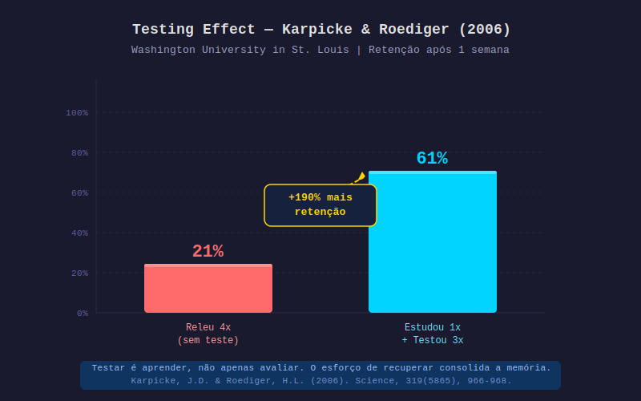

# Aula 07 — A Ilusão da Releitura e do Sublinhado

---

## Informações da Aula

| Campo | Detalhe |
|-------|---------|
| **Módulo** | 2 — Ilusões e Armadilhas do Estudo |
| **Aula** | 07 (01 do módulo) |
| **Duração estimada** | 20 minutos |
| **Nível** | Iniciante-Intermediário |
| **Formato** | Videoaula com dados de pesquisa e comparações |
| **Objetivos** | Conhecer o estudo Dunlosky (2013); entender por que releitura e sublinhado têm eficácia baixa; distinguir familiaridade de conhecimento; identificar alternativas eficazes |

---

## Roteiro da Aula

| Parte | Tempo | Conteúdo |
|-------|-------|---------|
| Abertura | 2 min | A pesquisa que mudou tudo: Dunlosky et al. (2013) |
| Parte 1 | 4 min | Releitura: eficácia BAIXA — os dados e o porquê |
| Parte 2 | 4 min | Sublinhado/marcador: eficácia BAIXA — a ilusão visual |
| Parte 3 | 4 min | O experimento de Karpicke & Roediger: testar vs. reler |
| Parte 4 | 3 min | O que realmente funciona: ranking de eficácia |
| Encerramento | 3 min | Exercício prático + próxima aula |

---

## Narração em Primeira Pessoa

### Abertura

Quero começar esta aula com uma confissão: eu estudei da forma errada por pelo menos 15 anos.

Eu relia os meus textos. Eu sublinhava tudo. Eu fazia resumos extensos copiando o livro com outras palavras. E eu me sentia estudando muito. Saía das sessões de estudo cansado, com a sensação de ter feito um bom trabalho.

O problema? Quando chegava a hora de usar aquele conhecimento, ele não estava lá. Ou estava lá fragmentado, mal consolidado, insuficiente para aplicação real.

Não era falta de esforço. Era esforço direcionado para as técnicas erradas.

Em 2013, um grupo de pesquisadores liderado por **John Dunlosky** (Kent State University) publicou um artigo que deveria ser leitura obrigatória em todas as escolas do mundo. O título: *"Improving Students' Learning With Effective Learning Techniques: Promising Directions From Cognitive and Educational Psychology."*

Publicado no periódico *Psychological Science in the Public Interest*, esse estudo fez algo que nenhum outro tinha feito de forma tão sistemática: **avaliou 10 das técnicas de estudo mais populares** com base em décadas de pesquisa científica acumulada.

Os resultados foram devastadores para o senso comum.

---

### Parte 1: Releitura — Eficácia Classificada Como BAIXA

A releitura é a técnica de estudo mais usada no mundo. E a pesquisa de Dunlosky classificou sua eficácia como **BAIXA**.

Não como "razoável". Não como "depende do contexto". Como **BAIXA**.

Por quê?

A releitura parece funcionar porque cria o que os pesquisadores chamam de **fluência de processamento** — a sensação de que você está processando a informação com facilidade. E o cérebro interpreta essa facilidade como sinal de que já sabe o conteúdo.

Mas facilidade de leitura não é o mesmo que aprendizado.

Pense assim: imagine que você lê uma receita de bolo cinco vezes. Você vai ficando cada vez mais rápido em ler. O texto vai parecendo cada vez mais familiar. Você pode sentir que "sabe" a receita.

Mas você consegue fazer o bolo sem a receita na frente?

Provavelmente não. Porque você reconhece o conteúdo — mas não consegue recuperá-lo. E para o aprendizado real, o que importa não é reconhecer: é **recuperar**.

```
RECONHECIMENTO vs. RECUPERAÇÃO
────────────────────────────────────────────────────

RECONHECIMENTO (o que a releitura treina):
"Esse conceito parece familiar"
"Eu acho que vi isso antes"
"Sim, concordo com o que está escrito"

→ Não exige esforço cognitivo real
→ Cria ilusão de conhecimento
→ Não funciona em provas ou aplicação prática

RECUPERAÇÃO (o que realmente importa):
"Sem olhar, o que eu sei sobre esse tema?"
"Consigo explicar isso com minhas próprias palavras?"
"Consigo aplicar esse conceito em um problema novo?"

→ Exige esforço cognitivo real
→ Sinaliza importância ao hipocampo
→ Consolida memória de longo prazo
```

O Prof. Pier tem uma metáfora direta: *"Reler é como passar o olho pelo mapa sem nunca sair de casa. Você sente que conhece o caminho, mas na hora H, se perderá na primeira esquina."*

---

### Parte 2: Sublinhado e Marcador — Eficácia Classificada Como BAIXA

Agora vem outra que vai doer: o querido marca-texto fluorescente.

**Dunlosky classificou sublinhado e uso de marcadores como BAIXA eficácia.** O artigo é explícito: "quase nenhum benefício para a aprendizagem".

Por que isso?

Vários estudos mostraram que estudantes que sublinham enquanto leem tendem a sublinhar de forma indiscriminada — frequentemente marcando tanto que o sublinhado perde o sentido. Isso cria uma **ilusão visual de organização** que não corresponde a organização mental real.

Além disso, o ato de sublinhar é um processo **passivo**. Você está recebendo informação, não processando ativamente. Não há geração de conteúdo, não há conexão com conhecimento anterior, não há recuperação.

E tem um efeito colateral insidioso: **sublinhado cria um falso senso de preparação**. Quando você abre o livro e vê páginas cheias de amarelo e rosa, parece que você trabalhou muito. Parece que o conteúdo está "organizado". Isso reduz a ansiedade — o que é psicologicamente confortante mas pedagogicamente enganoso.

| Técnica | Eficácia (Dunlosky 2013) | Por Que Falha |
|---------|--------------------------|---------------|
| Releitura | ❌ BAIXA | Cria familiaridade, não recuperação |
| Sublinhado/Marcador | ❌ BAIXA | Passivo, cria ilusão de organização |
| Resumo | ⚠️ MODERADA (depende da execução) | Eficaz apenas se o aluno já sabe resumir bem |
| Mnemônicos | ⚠️ MODERADA | Útil para listas específicas, não para compreensão |
| **Prática de recuperação (retrieval)** | ✅ ALTA | Força o cérebro a buscar ativamente |
| **Prática distribuída (espaçamento)** | ✅ ALTA | Combate a curva do esquecimento |
| **Prática elaborativa** | ✅ ALTA | Cria conexões profundas |

Deixa eu dar um nuance importante: sublinhado não é inútil em absoluto. O problema é **como** a maioria das pessoas o usa — de forma passiva, enquanto lê. Se você usa o sublinhado como parte de um processo ativo — por exemplo, lê o capítulo, fecha o livro, recupera o que lembra, e depois usa o marcador para verificar e complementar — aí o sublinhado se torna um apoio útil. Mas essa não é a forma como quase ninguém usa.

---

### Parte 3: O Experimento Definitivo — Karpicke & Roediger (2006)

> 📊 **Diagrama:** 

*Figura: Comparação de retenção — Releitura 4x (21%) vs. Estudar 1x + Testar 3x (61%). Karpicke, J.D. &amp; Roediger, H.L. (2006). Science, 319(5865), 966–968.*

O estudo mais impactante sobre a superioridade do teste sobre a releitura foi publicado em 2006 por **Jeffrey Karpicke** e **Henry Roediger III**, ambos da Washington University em St. Louis.

O experimento foi simples e elegante:

**Metodologia:**
- Estudantes aprenderam listas de pares de palavras em Swahili-Inglês
- Foram divididos em 4 grupos com estratégias diferentes de estudo

| Grupo | Estratégia | Resultado após 1 semana |
|-------|------------|------------------------|
| A | Estudou 4x (sem teste) | **36%** retido |
| B | Estudou 3x + testado 1x | 80% retido |
| C | Estudou 1x + testado 3x | **80%** retido |
| D | Testado 4x (sem reler) | **80%** retido |

Os grupos B, C e D alcançaram praticamente o mesmo resultado — todos muito superiores ao Grupo A.

```
COMPARAÇÃO VISUAL — KARPICKE & ROEDIGER (2006)
───────────────────────────────────────────────────────

Grupo A (4 releituras, sem teste):
Retido após 1 semana: ▓▓▓▓░░░░░░░░░░░░░░░░  36%

Grupo B (3 estudos + 1 teste):
Retido após 1 semana: ▓▓▓▓▓▓▓▓▓▓▓▓▓▓▓▓░░░░  80%

Grupo C (1 estudo + 3 testes):
Retido após 1 semana: ▓▓▓▓▓▓▓▓▓▓▓▓▓▓▓▓░░░░  80%

Grupo D (4 testes, sem estudo adicional):
Retido após 1 semana: ▓▓▓▓▓▓▓▓▓▓▓▓▓▓▓▓░░░░  80%

→ Um único teste vale mais que três releituras
```

A conclusão dos pesquisadores foi direta: **um único teste vale mais do que três releituras adicionais** para a retenção de longo prazo.

Isso ficou conhecido como o **"Efeito de Teste"** ou **Testing Effect**. E é a base da técnica de **retrieval practice** — prática de recuperação — que vamos estudar em profundidade no Módulo 3.

A razão neurológica agora faz sentido com o que você aprendeu no Módulo 1: quando você tenta recuperar informação (teste), você está ativando o hipocampo, criando LTP, sinalizando ao cérebro que essa informação é importante. Quando você relê, você está apenas passando os olhos por padrões familiares sem esforço de recuperação real.

Para o Life Long Learning, isso tem uma implicação prática imediata: em vez de reler um artigo que você já leu, feche-o e tente escrever tudo que lembra. Esse esforço de recuperação — mesmo que imperfeito — consolida o aprendizado de forma muito mais eficaz do que a releitura mais fluente.

---

### Parte 4: O que Realmente Funciona

Então, se releitura e sublinhado são ineficazes, o que funciona?

Dunlosky identificou duas técnicas com **alta eficácia** baseada em evidências sólidas:

**1. Prática de Recuperação (Retrieval Practice / Testing Effect)**
- Tentar recuperar informação sem olhar o material
- Flashcards, quizzes, papel em branco
- Vamos estudar em profundidade no Módulo 3

**2. Prática Distribuída (Spaced Practice)**
- Distribuir o estudo ao longo do tempo (curva de Ebbinghaus — já vimos!)
- Revisões espaçadas em intervalos crescentes
- Qualquer sistema de revisão que evite a maratona de estudos

Três técnicas com **eficácia moderada** (dependendo da execução):

**3. Elaboração Interrogativa**
- Perguntar "por que?" a cada conceito
- "Por que isso funciona assim?"
- "Por que esse fato é verdadeiro?"

**4. Auto-Explicação**
- Explicar o conceito com suas próprias palavras enquanto aprende
- A técnica Feynman (que veremos no Módulo 3)

**5. Uso de Exemplos Intercalados**
- Misturar exemplos de tipos diferentes de problemas
- Mais difícil que praticar um tipo de cada vez, mas muito mais eficaz

---

### Encerramento

Nesta aula você aprendeu que:

- **Releitura** tem eficácia BAIXA (Dunlosky, 2013) — cria familiaridade, não recuperação
- **Sublinhado** tem eficácia BAIXA — passivo, cria ilusão de organização
- Um **único teste** vale mais que três releituras adicionais (Karpicke & Roediger, 2006)
- **Prática de recuperação** e **prática distribuída** têm eficácia ALTA com ampla base científica
- A dificuldade de uma técnica não é obstáculo — é o ingrediente ativo do aprendizado

Na próxima aula, vamos aprofundar por que essas ilusões são tão persistentes: o **Efeito de Fluência** — e o conceito de metacognição que vai te ajudar a saber com mais precisão o que você realmente sabe.

---

## Exercício Prático

**Exercício: Inventário e Classificação de Técnicas**

Preencha honestamente:

```
INVENTÁRIO DAS MINHAS TÉCNICAS DE ESTUDO
══════════════════════════════════════════════════

Para cada técnica que você usa, marque a frequência
e depois classifique com base no que aprendeu hoje:

TÉCNICA             │ USO?    │ EFICÁCIA REAL │ VOU MUDAR?
────────────────────┼─────────┼───────────────┼──────────
Releitura           │ S [ ] N [ ] │ BAIXA     │ S [ ] N [ ]
Sublinhado/marcador │ S [ ] N [ ] │ BAIXA     │ S [ ] N [ ]
Resumo passivo      │ S [ ] N [ ] │ BAIXA-MOD │ S [ ] N [ ]
Assistir aula 2x    │ S [ ] N [ ] │ BAIXA     │ S [ ] N [ ]
Flashcards          │ S [ ] N [ ] │ ALTA      │ S [ ] N [ ]
Quizzes/testes      │ S [ ] N [ ] │ ALTA      │ S [ ] N [ ]
Espaçamento         │ S [ ] N [ ] │ ALTA      │ S [ ] N [ ]
Técnica Feynman     │ S [ ] N [ ] │ ALTA      │ S [ ] N [ ]
Papel em branco     │ S [ ] N [ ] │ ALTA      │ S [ ] N [ ]
Mapas mentais       │ S [ ] N [ ] │ MODERADA  │ S [ ] N [ ]

REFLEXÃO FINAL:
Quantas técnicas de ALTA eficácia você usa regularmente? ____
Quantas de BAIXA eficácia? ____
Qual técnica ineficaz você usa MAS nunca vai querer abandonar? ______
Por que você acha que é difícil abandonar? _________________________
```

---

## Quiz de Retrieval

**1. Qual a classificação de eficácia que Dunlosky (2013) atribuiu à releitura?**
- a) Alta
- b) Moderada
- c) Baixa
- d) Varia conforme o aluno

**2. Por que o sublinhado cria uma ilusão de aprendizado?**
- a) Porque ativa a memória procedural de forma equivocada
- b) Porque cria ilusão visual de organização sem processamento ativo real
- c) Porque suprime o modo difuso do cérebro
- d) Porque reduz a velocidade de leitura

**3. No estudo de Karpicke & Roediger (2006), qual grupo teve melhor retenção após 1 semana?**
- a) O grupo que releu 4 vezes
- b) O grupo que releu 3 vezes e foi testado 1 vez
- c) Os grupos com pelo menos 1 teste — todos empatados em ~80%
- d) O grupo que não foi testado mas estudou mais horas

**4. Quais duas técnicas Dunlosky classificou com ALTA eficácia?**
- a) Releitura e resumo
- b) Sublinhado e mapas mentais
- c) Prática de recuperação e prática distribuída
- d) Resumo e explicação em voz alta

**5. O que é o "Testing Effect" (Efeito de Teste)?**
- a) O efeito negativo da ansiedade de prova na performance
- b) O fenômeno em que testar a memória melhora a retenção mais que reler
- c) O efeito da repetição de testes falsos na calibração metacognitiva
- d) A tendência de estudantes a estudar mais quando sabem que serão testados

### Gabarito
1. **c** — Eficácia BAIXA (Dunlosky, 2013)
2. **b** — Ilusão visual de organização sem processamento ativo
3. **c** — Todos os grupos com teste empataram em ~80% (vs. 36% do grupo sem teste)
4. **c** — Prática de recuperação e prática distribuída
5. **b** — Testar a memória consolida mais do que reler o material

---

## Leitura Recomendada

- **Dunlosky, J. et al.** (2013). Improving Students' Learning With Effective Learning Techniques. *Psychological Science in the Public Interest*, 14(1), 4–58.
- **Karpicke, J.D. & Roediger, H.L.** (2006). The power of testing memory. *Perspectives on Psychological Science*, 1(3), 181–210.
- **Brown, P.C., Roediger, H.L. & McDaniel, M.A.** *Make It Stick: The Science of Successful Learning*. Belknap Press.
- **Piazzi, Pierluigi.** *Aprendendo Inteligência*. Editora Aleph.
