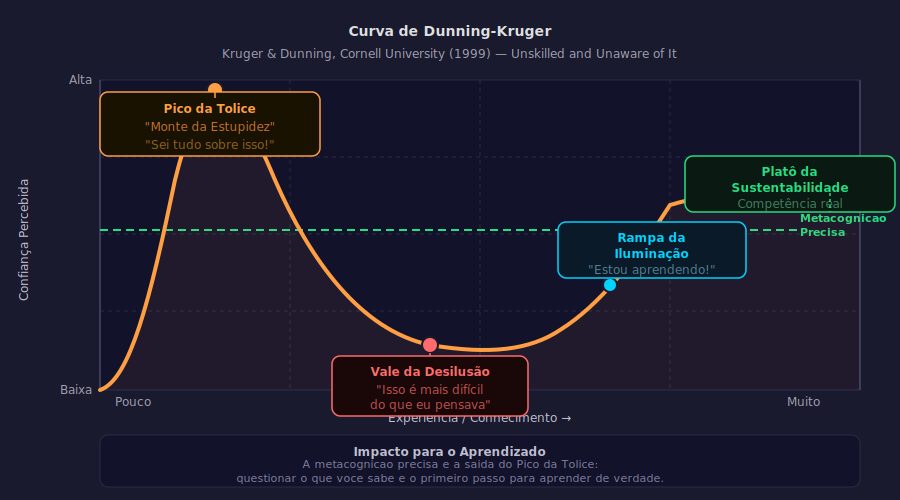

# Aula 10 — Dunning-Kruger e a Arte da Metacognição

---

## Informações da Aula

| Campo | Detalhe |
|-------|---------|
| **Módulo** | 2 — Ilusões e Armadilhas do Estudo |
| **Aula** | 10 (04 do módulo) |
| **Duração estimada** | 20 minutos |
| **Nível** | Intermediário |
| **Formato** | Videoaula com gráficos e exercícios de autoavaliação |
| **Objetivos** | Compreender o Efeito Dunning-Kruger; mapear as 4 fases de competência; desenvolver estratégias de metacognição aplicada; calibrar com precisão o autoconhecimento |

---

## Roteiro da Aula

| Parte | Tempo | Conteúdo |
|-------|-------|---------|
| Abertura | 2 min | O experimento de Kruger & Dunning (1999) |
| Parte 1 | 4 min | A curva de competência: 4 fases |
| Parte 2 | 4 min | Por que quem sabe pouco acha que sabe muito |
| Parte 3 | 4 min | Estratégias de metacognição: autoavaliação, predição e revisão de erros |
| Parte 4 | 3 min | Como usar Dunning-Kruger a seu favor no LLL |
| Encerramento | 3 min | Exercício prático + próxima aula |

---

## Narração em Primeira Pessoa

### Abertura

Em 1995, um homem chamado McArthur Wheeler assaltou dois bancos em Pittsburgh, em plena luz do dia, sem máscara ou disfarce — e ficou genuinamente surpreso quando a polícia o identificou pelos registros de câmera.

A justificativa de Wheeler? Ele havia esfregado suco de limão no rosto antes do crime. Ele acreditava — sinceamente — que suco de limão tornaria seu rosto invisível nas câmeras, porque suco de limão é usado como tinta invisível.

Quando a polícia mostrou a ele as imagens das câmeras, Wheeler ficou atônito: "Mas eu coloquei o suco no rosto."

Esse caso chegou às mãos do psicólogo **David Dunning** (Cornell University), que ficou fascinado por uma questão: como alguém pode ser tão incompetente e ao mesmo tempo tão confiante em sua própria competência?

Com seu aluno de pós-doutorado **Justin Kruger**, Dunning passou os anos seguintes investigando esse fenômeno. O resultado, publicado em 1999 no *Journal of Personality and Social Psychology*, ficou conhecido como o **Efeito Dunning-Kruger** — e mudou nossa compreensão sobre metacognição e autoavaliação.

---

### Parte 1: A Curva de Competência — 4 Fases

O Efeito Dunning-Kruger é melhor visualizado através de uma curva que descreve a relação entre competência real e confiança percebida ao longo de uma jornada de aprendizado:

> 📊 **Diagrama:** 

*Figura: Curva de Dunning-Kruger — Pico da Tolice, Vale da Desilusão, Rampa da Iluminação e Platô da Sustentabilidade. Kruger, J. &amp; Dunning, D. (1999). Journal of Personality and Social Psychology, 77(6), 1121–1134.*

**Fase 1: Incompetência Inconsciente**
"Eu não sei, e não sei que não sei."
- Pouquíssimo conhecimento real
- Confiança altíssima — o pico da curva (chamado de "Pico de Estupidez" ou "Monte da Estupidez" em versões populares)
- Não consegue avaliar o próprio desempenho porque não tem o referencial necessário
- Wheeler é o exemplo extremo; a maioria de nós já esteve aqui em alguma área

**Fase 2: Incompetência Consciente**
"Eu não sei, e agora sei que não sei."
- Conhecimento médio — suficiente para perceber o quão complexo é o tema
- Confiança despenca — o Vale da Desilusão
- É a fase mais desconfortável psicologicamente
- É também a fase onde a maioria das pessoas desiste

**Fase 3: Competência Consciente**
"Eu sei, mas tenho que pensar conscientemente para fazer."
- Conhecimento sólido
- Confiança volta a crescer de forma calibrada e realista
- Exige esforço deliberado — ainda não é automático
- O aprendizado explícito acontece principalmente aqui

**Fase 4: Competência Inconsciente**
"Eu sei, e faço sem precisar pensar."
- Alto conhecimento e alta competência
- Execução automatizada — mielinização plena (lembram da Aula 02?)
- Confiança alta e calibrada com a realidade
- O desafio: dificulta ensinar, porque o especialista esquece o que é não saber

---

### Parte 2: Por Que o Dunning-Kruger Acontece

A descoberta de Dunning e Kruger foi precisa: *"As habilidades necessárias para produzir respostas corretas são as mesmas habilidades necessárias para reconhecer que sua resposta está errada."*

Em outras palavras: para saber o que você não sabe, você precisa saber o suficiente para reconhecer a ausência.

Um iniciante em xadrez não sabe que está jogando mal porque não tem o referencial para avaliar o que é jogar bem. Um grande mestre sabe exatamente onde cada jogada pode ser melhorada — precisamente porque tem o domínio que permite essa análise.

| Fase | Competência real | Autoavaliação | Gap metacognitivo |
|------|-----------------|---------------|-------------------|
| Iniciante | Baixa | Alta | Enorme |
| Intermediário | Média | Baixa (desilusão) | Pequeno (bem calibrado para baixo) |
| Avançado | Alta | Alta e calibrada | Mínimo |

Existe um segundo mecanismo que potencializa o efeito: **o viés de confirmação**. Quando você sabe pouco sobre um tema, busca naturalmente informações que confirmam o que já acredita — porque não tem base para questionar. Quem sabe mais tende a buscar ativamente informações que possam contradizer suas crenças.

---

### Parte 3: Estratégias de Metacognição Aplicada

Conhecer o Dunning-Kruger é ótimo. Mas o que fazemos com esse conhecimento?

Aqui estão estratégias concretas para calibrar sua metacognição:

**1. Predição de Desempenho**

Antes de fazer qualquer teste ou exercício, faça uma predição:
- "Acho que vou acertar ____% desta avaliação"
- "Acho que vou conseguir explicar ____% do conteúdo sem consulta"

Depois compare o resultado real com sua predição.

O gap entre predição e resultado é o seu **índice de calibração metacognitiva**. Pesquisas mostram que experts tendem a ter gaps menores — não porque acertam mais, mas porque estimam melhor o que sabem.

```
CALIBRAÇÃO METACOGNITIVA
──────────────────────────────────────────────────────

GAP GRANDE (+ 30%)     = Dunning-Kruger ativo
Você previu 90%, acertou 60%.
→ Você está superestimando seu conhecimento
→ Precisa de mais retrieval practice, menos releitura

GAP PEQUENO (< 10%)    = Boa calibração
Você previu 70%, acertou 72%.
→ Metacognição bem calibrada para este tema
→ Continue com a estratégia atual

GAP NEGATIVO (- 20%)   = Síndrome do Impostor possível
Você previu 50%, acertou 78%.
→ Você está subestimando seu conhecimento
→ Considere revisitar sua auto-avaliação
```

**2. Revisão de Erros com Análise de Causa**

Quando você erra algo — em um quiz, numa conversa, numa situação prática — não apenas corrija o erro. Analise:

- Por que eu errei? (falta de conhecimento? confusão conceitual? distração?)
- Eu *achava* que sabia isso? (se sim, é sinal de Dunning-Kruger)
- O que preciso fazer de diferente para não repetir?

Esse processo de revisão de erros é uma das práticas mais poderosas do aprendizado. Os melhores estudantes não são aqueles que erram menos — são os que mais aprendem com cada erro.

**3. Buscar Feedback Externo**

Uma das formas mais eficientes de calibrar a metacognição é expor seu conhecimento a feedback externo:
- Fazer perguntas em comunidades especializadas
- Conversar com especialistas e pedir feedback
- Ensinar alguém com menos conhecimento (a resistência das perguntas deles revela suas lacunas)
- Participar de competições ou situações de aplicação prática

O "Vale da Desilusão" é na verdade um presente: é quando o feedback externo (ou o contato com mais conhecimento) revela o gap entre o que você achava saber e o que realmente sabe. É desconfortável, mas é o ponto de partida para o aprendizado real.

**4. O Método da Banca de Sábios**

Uma técnica que gosto muito: imaginar que está sendo avaliado por uma banca de especialistas no tema. Que perguntas eles fariam? Você consegue responder?

Essa técnica força você a se colocar no nível de quem *realmente sabe* — e o que você não consegue responder na banca imaginária é o que você ainda precisa aprender.

---

### Parte 4: Como Usar o Dunning-Kruger a Seu Favor no LLL

Para quem pratica Life Long Learning ao longo de toda a carreira, o Dunning-Kruger tem implicações profundas.

Ao longo da vida, você vai mergulhar em dezenas de novos temas — novas tecnologias, novas regulamentações, novas abordagens da sua área. Em cada novo tema, você vai passar pelas 4 fases.

Saber que o Vale da Desilusão é uma fase normal — e não um sinal de que você não tem talento para aquilo — é a diferença entre desistir e persistir.

O LLL maduro inclui:

1. **Identificar em qual fase você está** em cada área de conhecimento
2. **Não confundir o Pico de Estupidez com maestria** — quando você acha que aprendeu rapidinho demais, desconfie
3. **Celebrar o Vale da Desilusão** — é sinal de que você sabe o suficiente para perceber o que não sabe
4. **Usar predição de desempenho** como hábito para calibrar continuamente

```
SEU MAPA DE COMPETÊNCIAS PESSOAL
──────────────────────────────────────────────────────────

Para cada área relevante da sua vida profissional,
identifique em qual fase você está:

Área: _____________________  Fase: [1] [2] [3] [4]
Área: _____________________  Fase: [1] [2] [3] [4]
Área: _____________________  Fase: [1] [2] [3] [4]
Área: _____________________  Fase: [1] [2] [3] [4]

Áreas onde você está na Fase 1: ação urgente de aprendizado
Áreas onde você está na Fase 2: persistência e busca de feedback
Áreas onde você está na Fase 3: prática deliberada e expansão
Áreas onde você está na Fase 4: manutenção e ensino dos outros
```

Uma última reflexão: o Efeito Dunning-Kruger nos afeta a todos. O objetivo não é se tornar imune a ele — isso é impossível. O objetivo é ter sistemas de verificação constante (retrieval practice, feedback externo, predição de desempenho) que compensem a tendência natural do cérebro de superestimar o próprio conhecimento.

---

### Encerramento

Nesta aula você aprendeu que:

- O **Efeito Dunning-Kruger** mostra que quem sabe pouco tende a superestimar seu conhecimento
- As 4 fases de competência: incompetência inconsciente → consciente → competência consciente → inconsciente
- O gap metacognitivo é grande nos iniciantes e pequeno nos especialistas
- Estratégias de calibração: predição de desempenho, revisão de erros, feedback externo
- O **Vale da Desilusão** é um presente — é o ponto de honestidade cognitiva que precede o aprendizado real

Na próxima aula — a última do Módulo 2 — você vai fazer uma autoavaliação completa e honesta dos seus padrões de estudo, e criar um plano de mudança em 3 etapas concretas. Prepare-se para a aula mais prática do módulo.

---

## Exercício Prático

**Exercício: Antes e Depois — Mapeando o Dunning-Kruger**

**Parte 1 — Antes do Estudo:**
Escolha 3 temas que você deveria saber na sua área profissional.

Para cada um:
- Avalie sua confiança de 0 a 10: _____
- Escreva 5 pontos sobre esse tema sem consultar nada (papel em branco por 2 min): _____

**Parte 2 — Pesquisa:**
Agora pesquise cada tema por 10 minutos em fontes confiáveis (não Wikipedia, prefira artigos, livros ou documentação técnica).

**Parte 3 — Depois:**
- Reavalie sua confiança: _____
- Quantas das suas 5 afirmações iniciais estavam corretas? _____ / 5
- Quantas coisas sobre o tema você não sabia que não sabia? _____

```
ANÁLISE DUNNING-KRUGER PESSOAL
══════════════════════════════════════════════════

TEMA 1: _________________________________
Confiança antes: ___/10  │  Afirmações corretas: ___/5
Confiança depois: ___/10  │  Fase atual: [1] [2] [3] [4]

TEMA 2: _________________________________
Confiança antes: ___/10  │  Afirmações corretas: ___/5
Confiança depois: ___/10  │  Fase atual: [1] [2] [3] [4]

TEMA 3: _________________________________
Confiança antes: ___/10  │  Afirmações corretas: ___/5
Confiança depois: ___/10  │  Fase atual: [1] [2] [3] [4]

INSIGHT PESSOAL:
Em qual área você encontrou o gap mais surpreendente?
_____________________________________________
O que vai fazer diferente no estudo dessa área?
_____________________________________________
```

---

## Quiz de Retrieval

**1. O Efeito Dunning-Kruger demonstra que:**
- a) Especialistas tendem a superestimar sua competência por excesso de confiança
- b) Iniciantes tendem a superestimar sua competência por não terem o referencial para avaliar o que não sabem
- c) Todas as pessoas são igualmente ruins em avaliar sua própria competência
- d) O nível de confiança aumenta linearmente com o nível de competência

**2. O "Vale da Desilusão" na curva de competência representa:**
- a) A fase onde o aluno decide desistir do aprendizado
- b) A fase de incompetência consciente — quando você já sabe o suficiente para perceber o quão complexo é o tema
- c) A fase de máxima frustração antes de se tornar um especialista
- d) O momento em que o aluno percebe que seu método de estudo estava errado

**3. Segundo Dunning e Kruger, por que iniciantes não conseguem reconhecer sua própria incompetência?**
- a) Porque têm viés de otimismo inato
- b) Porque as habilidades para produzir respostas corretas são as mesmas para reconhecer respostas erradas
- c) Porque evitam feedback negativo por proteção emocional
- d) Porque não têm acesso a informações corretas

**4. O que é "predição de desempenho" como estratégia metacognitiva?**
- a) Antecipar quais materiais serão cobrados em uma prova
- b) Estimar seu desempenho antes de fazer um teste e comparar com o resultado real
- c) Criar um calendário de estudos baseado na dificuldade prevista
- d) Avaliar o desempenho de outros estudantes como benchmark

**5. Em qual fase da curva de competência o aprendizado explícito e consciente acontece principalmente?**
- a) Fase 1 — Incompetência Inconsciente
- b) Fase 2 — Incompetência Consciente
- c) Fase 3 — Competência Consciente
- d) Fase 4 — Competência Inconsciente

### Gabarito
1. **b** — Iniciantes superestimam porque não têm referencial para avaliar o que não sabem
2. **b** — Vale da Desilusão = incompetência consciente; sabe o suficiente para ver o gap
3. **b** — A habilidade para produzir e para reconhecer certo/errado são as mesmas
4. **b** — Estimar antes e comparar com resultado real (calibração metacognitiva)
5. **c** — Fase 3 (Competência Consciente): sabe, mas precisa pensar deliberadamente

---

## Leitura Recomendada

- **Kruger, J. & Dunning, D.** (1999). Unskilled and Unaware of It. *Journal of Personality and Social Psychology*, 77(6), 1121–1134.
- **Zimmerman, B.J.** (2002). Becoming a self-regulated learner. *Theory Into Practice*, 41(2), 64–70.
- **Dweck, Carol.** *Mindset: A Nova Psicologia do Sucesso*. Objetiva. (Cap. 3 e 4)
- **Young, Scott.** *Ultralearning*. Portfolio/Penguin. (Cap. 8 — Feedback)
