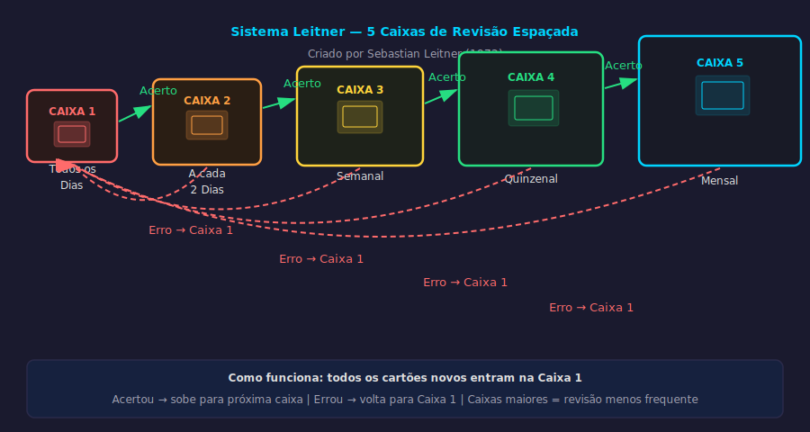

# Aula 13 — Repetição Espaçada: O Algoritmo do Esquecimento

---

## Informações da Aula

| Campo | Detalhe |
|-------|---------|
| **Módulo** | 3 — Técnicas Fundamentais de Alta Eficácia |
| **Aula** | 13 de 08 (Módulo 3) |
| **Duração estimada** | 20 minutos |
| **Nível** | Intermediário |
| **Formato** | Videoaula com slides |
| **Objetivos** | Entender a Curva do Esquecimento de Ebbinghaus; compreender o efeito do espaçamento e a dificuldade desejável de Bjork; aplicar intervalos otimizados; conhecer o Sistema Leitner e o algoritmo SM-2 |

---

## Roteiro da Aula

| Parte | Tempo | Conteúdo |
|-------|-------|---------|
| Abertura | 2 min | O problema de estudar às vésperas — e por que isso não funciona |
| Parte 1 | 4 min | Ebbinghaus e a Curva do Esquecimento |
| Parte 2 | 4 min | O Efeito do Espaçamento e a "dificuldade desejável" de Bjork |
| Parte 3 | 5 min | Intervalos otimizados, Sistema Leitner e algoritmo SM-2 |
| Encerramento | 3 min | Exercício prático + próxima aula |

---

## Narração em Primeira Pessoa

### Abertura

Deixa eu adivinhar uma cena da sua vida: é a véspera de uma prova importante. Você abre o material, estuda intensamente por 4, 6, 8 horas. Consegue passar pela prova. E três semanas depois... sumiu. Não lembra de quase nada.

Isso tem nome. E tem solução.

O problema não é falta de esforço. O problema é o **momento** em que você estava estudando. Você estava estudando no momento errado — e a ciência cognitiva sabe exatamente qual é o momento certo.

Essa aula vai te entregar esse conhecimento.

---

### Parte 1: Hermann Ebbinghaus e a Curva do Esquecimento

Em 1885, um psicólogo alemão chamado **Hermann Ebbinghaus** fez algo que nenhum cientista havia feito antes: usou a si mesmo como cobaia para estudar a memória.

Ebbinghaus passava meses memorizando listas de sílabas sem sentido — "DAX", "BUP", "LER" — e depois testava quanto tempo levava para esquecê-las e quanto esforço era necessário para rememorá-las. Eram anos de experimentos meticulosos, todos anotados.

O resultado mais famoso é a **Curva do Esquecimento**, uma das descobertas mais citadas na história da psicologia:

---


*Figura: Curva do Esquecimento — Hermann Ebbinghaus (1885) — o esquecimento é rápido e inevitável, mas cada revisão reconstrói e estabiliza a memória*

---

```
┌──────────────────────────────────────────────────────────────┐
│           CURVA DO ESQUECIMENTO — Ebbinghaus (1885)          │
│                                                              │
│  100% │▓▓                                                    │
│       │  ▓▓▓                                                 │
│   80% │     ▓▓                                               │
│       │       ▓▓                                             │
│   60% │         ▓▓▓                                          │
│       │            ▓▓▓▓                                      │
│   40% │                ▓▓▓▓▓                                 │
│       │                     ▓▓▓▓▓▓▓▓▓▓▓▓▓▓▓▓▓▓▓▓▓▓▓          │
│   20% │                                                      │
│       │                                                      │
│    0% └──────────────────────────────────────────────────── │
│        Imediato  20min  1h  9h  1dia  2dias  6dias  31dias   │
│                                                              │
│  Após 20 minutos: esqueçeu ~42%                              │
│  Após 1 hora:     esqueceu ~56%                              │
│  Após 9 horas:    esqueceu ~64%                              │
│  Após 1 dia:      esqueceu ~67%                              │
│  Após 31 dias:    esqueceu ~79%                              │
└──────────────────────────────────────────────────────────────┘
```

O esquecimento é agressivo, rápido e inevitável. Em 20 minutos, quase metade do que você acabou de aprender já foi. Em um dia, dois terços.

Mas aqui está o lado positivo que Ebbinghaus também descobriu: **cada vez que você revisa, a curva fica mais suave**. Você esquece mais devagar. E a quantidade de esforço necessário para lembrar diminui.

A revisão não apenas recupera — ela **remodela a curva do esquecimento**.

---

### Parte 2: O Efeito do Espaçamento e a Dificuldade Desejável

Aqui está onde fica interessante.

Ebbinghaus percebeu algo contraintuitivo: revisar o material logo depois de aprender — quando ainda está fresco — é muito menos eficaz do que revisar depois de um intervalo, quando você já esqueceu um pouco.

**Robert Bjork**, da **Universidade da Califórnia em Los Angeles**, passou décadas estudando esse fenômeno e cunhou o conceito de **"dificuldade desejável"**: certas condições de aprendizado que parecem dificultar o processo no curto prazo produzem retenção muito superior no longo prazo.

Revisar quando você ainda lembra tudo é fácil — e ineficiente. Revisar quando você esqueceu um pouco é difícil — e muito mais eficaz. O esforço de recuperar uma memória que está parcialmente desbotada é exatamente o que a consolida mais profundamente.

É como academia. Carregar um peso que você consegue fazer 50 repetições não vai te fazer crescer. Você precisa de um peso que te force ao limite — uma dificuldade que exija esforço real.

**Nicholas Cepeda** e colaboradores, em um meta-análise de 2008 que revisou 254 estudos, chegaram a uma fórmula prática para os intervalos ideais:

```
┌──────────────────────────────────────────────────────────────┐
│        INTERVALOS OTIMIZADOS — Cepeda et al. (2008)         │
│                                                              │
│  Para lembrar por 1 semana:   revisar depois de 1-2 dias    │
│  Para lembrar por 1 mês:      revisar depois de 1 semana    │
│  Para lembrar por 1 ano:      revisar depois de 3-4 semanas │
│  Para lembrar para sempre:    revisar depois de 1-3 meses   │
│                                                              │
│  Regra prática (adaptada):                                  │
│  ┌─────────────────────────────────────────────────────┐    │
│  │  1ª revisão: 1 dia depois                           │    │
│  │  2ª revisão: 1 semana depois                        │    │
│  │  3ª revisão: 1 mês depois                           │    │
│  │  4ª revisão: 3 meses depois                         │    │
│  └─────────────────────────────────────────────────────┘    │
└──────────────────────────────────────────────────────────────┘
```

Se você aprende algo hoje, a revisão mais eficaz é amanhã. Depois daqui a uma semana. Depois daqui a um mês. Depois de três meses. Com essas quatro revisões, a memória está consolidada por anos.

Compare com estudar tudo na véspera: você faz "revisão zero" num momento em que a memória ainda está forte, sem o benefício do esforço de recuperação. E daí a memória desaparece.

---

### Parte 3: O Sistema Leitner e o Algoritmo SM-2

Muito bem — os princípios são claros. Mas como implementar isso na prática sem virar louco gerenciando datas de revisão para centenas de conceitos?

A resposta vem de dois lugares: o **Sistema Leitner** e o **algoritmo SM-2**.

**Sebastian Leitner**, jornalista alemão, criou nos anos 1970 um sistema físico elegante usando caixas de flashcards:

---


*Figura: Sistema Leitner — cartões sobem de caixa ao acertar e voltam à Caixa 1 ao errar — Sebastian Leitner (1972)*

---

```
┌──────────────────────────────────────────────────────────────┐
│              SISTEMA LEITNER — 5 CAIXAS                      │
│                                                              │
│  CAIXA 1: revisar todo dia    ← cartões que você errou      │
│  CAIXA 2: revisar a cada 2 dias                             │
│  CAIXA 3: revisar a cada 4 dias                             │
│  CAIXA 4: revisar a cada 8 dias                             │
│  CAIXA 5: revisar a cada 16 dias ← cartões dominados        │
│                                                              │
│  Acertou → sobe uma caixa     Errou → volta à Caixa 1       │
└──────────────────────────────────────────────────────────────┘
```

Todos os cartões novos entram na Caixa 1. Se você acertar, o cartão sobe para a Caixa 2. Acertar de novo, vai para a Caixa 3. Erro em qualquer ponto — volta para a Caixa 1. O sistema garante que você revise mais o que não sabe e menos o que já domina.

**Piotr Wozniak**, cientista polonês, levou isso para o nível seguinte nos anos 1980. Ele estudou matematicamente as curvas de esquecimento e criou o **algoritmo SM-2** (SuperMemo 2) — uma fórmula precisa que calcula o intervalo ideal para cada flashcard com base na dificuldade que você teve ao lembrar.

O SM-2 é a base de todos os softwares modernos de repetição espaçada — incluindo o **Anki**, que vamos ver na próxima aula.

O princípio é simples: depois de revisar um cartão, você avalia o quão difícil foi lembrar numa escala de 0 a 5. O algoritmo usa essa resposta para calcular o próximo intervalo. Quanto mais fácil foi, maior o intervalo. Quanto mais difícil, menor o intervalo.

O resultado é um sistema que se adapta ao seu nível de memória para cada conceito específico, de forma individual. É personalização em escala.

---

### Como Usar Isso Sem Software

Mesmo sem nenhum aplicativo, você pode implementar repetição espaçada hoje:

**Método do Calendário**:
1. Quando estudar um tópico novo, anote no calendário: "+1 dia: revisar X"
2. Quando revisar, se foi fácil: "+1 semana: revisar X"
3. Se foi difícil: "+2 dias: revisar X"
4. Continue até chegar na revisão de 3 meses

É trabalhoso manualmente. Por isso o Anki existe — e é o que aprenderemos na Aula 15.

---

### A Conexão com Life Long Learning

No contexto do **Life Long Learning**, a repetição espaçada é especialmente poderosa porque resolve o maior problema do aprendizado contínuo: como manter na memória o que você aprendeu há meses ou anos enquanto continua aprendendo coisas novas?

Com repetição espaçada, você pode manter ativo um vocabulário de idioma estrangeiro, conceitos técnicos da sua área, marcos históricos relevantes — com apenas 10 a 20 minutos por dia de revisões. O custo de manutenção do conhecimento cai drasticamente.

É a diferença entre carregar um balde furado (estudar na véspera) e construir um reservatório (repetição espaçada).

---

### Encerramento

Revisando os pontos centrais desta aula:

A **Curva do Esquecimento** de Ebbinghaus mostra que esquecemos rápido e muito — mas cada revisão reconstrói e estabiliza a memória.

O **Efeito do Espaçamento** diz que revisar no momento certo — quando você já esqueceu um pouco — é muito mais eficaz do que revisar quando ainda está fresco.

Os **intervalos otimizados** de Cepeda et al. indicam: 1 dia, 1 semana, 1 mês, 3 meses.

O **Sistema Leitner** e o **algoritmo SM-2** são implementações práticas que funcionam manualmente ou via software.

Na próxima aula, vamos aprender a criar flashcards de alta eficácia — porque a ferramenta mais poderosa da repetição espaçada é tão boa quanto os cartões que você criar.

Agora, faça o exercício!

---

## Exercício Prático

**Título**: Meu Cronograma de Repetição Espaçada

**Instruções**:

1. Identifique um tópico real que você precisa dominar nos próximos 3 meses: pode ser para uma certificação, concurso, disciplina da faculdade, idioma, habilidade técnica do trabalho.

2. Liste os 10 principais conceitos/temas desse tópico.

3. Crie um cronograma de revisão espaçada para cada um, usando a tabela abaixo:

| Conceito | Data de Estudo | Rev. 1 (+1 dia) | Rev. 2 (+1 sem) | Rev. 3 (+1 mês) | Rev. 4 (+3 meses) |
|----------|---------------|-----------------|-----------------|-----------------|-------------------|
| Ex: Lei de Ohm | 16/03/2026 | 17/03 | 23/03 | 16/04 | 16/06 |
| 1. | | | | | |
| 2. | | | | | |
| 3. | | | | | |

4. Coloque os lembretes no seu calendário ou no app de tarefas que já usa.

**Reflexão**: Quantas revisões você normalmente faria desse material? Compare com o cronograma espaçado que criou.

**Tempo estimado**: 15 a 20 minutos

---

## Quiz de Retrieval

*Feche a aula e responda sem consultar.*

**Pergunta 1**: Quem criou a Curva do Esquecimento? Em que ano e onde?

**Pergunta 2**: Qual percentual de informação é esquecido após 1 hora de aprendizado, segundo Ebbinghaus?

**Pergunta 3**: O que Robert Bjork chama de "dificuldade desejável" no contexto do espaçamento?

**Pergunta 4**: Quais são os quatro intervalos de revisão otimizados segundo Cepeda et al. (2008)?

**Pergunta 5**: O que é o algoritmo SM-2 e quem o criou?

---

### Gabarito

1. **Hermann Ebbinghaus**, 1885, Alemanha (publicado em sua monografia "Über das Gedächtnis").
2. Aproximadamente **56%** após 1 hora. (Após 20 minutos: ~42%; após 1 dia: ~67%)
3. A ideia de que revisar quando você já esqueceu um pouco — mesmo sendo mais difícil — produz memória muito mais duradoura do que revisar quando ainda está fresco.
4. **1 dia, 1 semana, 1 mês, 3 meses** (para retenção de longo prazo).
5. Algoritmo matemático criado por **Piotr Wozniak** (polônia, anos 1980) que calcula o intervalo ideal de revisão para cada flashcard com base na dificuldade que o estudante teve ao lembrar. É a base do software Anki.

---

## Leitura Recomendada

- **"Distributed Practice in Verbal Recall Tasks: A Review and Quantitative Synthesis"** — Cepeda et al. (2008), *Psychological Bulletin*
- **"Make It Stick"** — Brown, Roediger & McDaniel (2014) — Capítulo sobre espaçamento
- **"Sobre a Memória"** (Über das Gedächtnis) — Hermann Ebbinghaus (1885) — versão traduzida disponível online
- Site **supermemo.com/articles/spacing.htm** — artigos de Piotr Wozniak sobre SM-2

---

*Aula 13 — Módulo 3 — Curso Aprender a Aprender | Educa com Talento*
