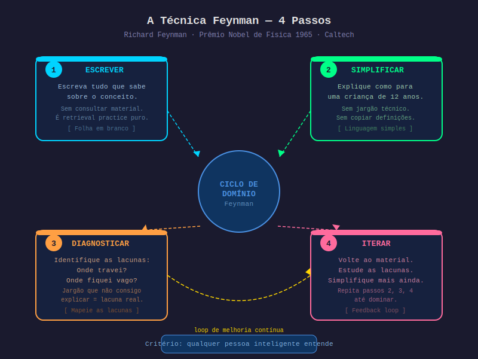

# Aula 21 — A Técnica Feynman: Explicar Simples é Entender de Verdade

---

## Informações da Aula

| Campo | Detalhe |
|-------|---------|
| **Módulo** | 4 — Técnicas de Processamento Profundo |
| **Aula** | 21 de 08 (Módulo 4) |
| **Duração estimada** | 20 minutos |
| **Nível** | Intermediário |
| **Formato** | Videoaula com slides |
| **Objetivos** | Conhecer Richard Feynman e sua filosofia de aprendizado; dominar os 4 passos da Técnica Feynman; entender por que a simplificação é o teste definitivo de compreensão; aplicar em qualquer área do conhecimento |

---

## Roteiro da Aula

| Parte | Tempo | Conteúdo |
|-------|-------|---------|
| Abertura | 2 min | Richard Feynman — o físico que aprendia ensinando |
| Parte 1 | 5 min | "Se não consegues explicar simples, não entendeste" — o princípio |
| Parte 2 | 6 min | Os 4 passos da Técnica Feynman em detalhe |
| Parte 3 | 4 min | Aplicação em diferentes áreas + combinação com outras técnicas |
| Encerramento | 3 min | Exercício prático + próxima aula |

---

## Narração em Primeira Pessoa

### Abertura

Em 1965, **Richard Feynman** recebeu o Prêmio Nobel de Física pela sua contribuição à eletrodinâmica quântica — uma das teorias mais complexas e abstrusas da física moderna.

Mas Feynman não era conhecido apenas por sua brilhantismo técnico. Era conhecido pelo seu talento extraordinário de explicar as coisas mais complexas de forma simples, apaixonada e acessível.

Ele lecionava física na **Caltech** (California Institute of Technology) e suas aulas eram famosas por algo incomum: qualquer estudante conseguia entender, mesmo quando o conteúdo era avançadíssimo.

Certa vez, um colega pediu a Feynman que explicasse por que os spins de partículas tendem a se alinhar quando entram em equilíbrio térmico. Feynman foi ao quadro, começou a esboçar, parou — e disse: "Sabe, se não consigo fazer uma aula de primeiro ano sobre isso, é porque eu mesmo não entendi ainda."

Essa frase encapsula a filosofia de toda a sua carreira.

Para Feynman, a simplicidade da explicação não era uma concessão para o público. Era a **prova do entendimento real**.

---

### Parte 1: "Se Não Consegues Explicar de Forma Simples, Não Entendeste"

Existe uma diferença fundamental entre dois tipos de conhecimento que Richard Feynman descreveu de forma magistral.

**Conhecimento do nome** (ou conhecimento superficial): você sabe o nome do conceito, reconhece o jargão, consegue repetir a definição do livro. Se alguém te perguntar, você vai parecer que sabe.

**Conhecimento do conceito** (ou compreensão real): você entende o mecanismo, consegue explicar sem usar o jargão, consegue criar exemplos novos, consegue prever o que acontece em situações que nunca estudou.

A maioria do que aprendemos na escola é conhecimento do nome. E o problema é que é muito fácil confundir um com o outro — porque ambos parecem iguais para quem os tem.

A Técnica Feynman é um **teste de realidade**. Quando você tenta explicar um conceito de forma simples, sem jargão, para alguém que não conhece a área, fica imediatamente claro se você realmente entendeu ou se estava apenas reconhecendo o vocabulário.

É uma das técnicas mais brutalmente honestas que existem.

```
┌──────────────────────────────────────────────────────────────┐
│        CONHECIMENTO DO NOME vs. COMPREENSÃO REAL            │
│                                                              │
│  "O que é inflação?"                                        │
│                                                              │
│  NOME:     "É o aumento generalizado e contínuo no nível   │
│             de preços, medido por índices como o IPCA"      │
│             [definição do livro — parece saber]             │
│                                                              │
│  CONCEITO: "Imagine que todo mês você vai ao mercado com   │
│             R$100 e consegue comprar a mesma cesta de       │
│             produtos. Inflação é quando, daqui a 3 meses,  │
│             essa mesma cesta custa R$108 — o dinheiro       │
│             perdeu poder de compra. Acontece quando tem     │
│             mais dinheiro na economia do que produtos,       │
│             ou quando custos de produção sobem e os         │
│             empresários repassam ao consumidor."             │
│             [sem jargão, com causa — realmente entendeu]    │
└──────────────────────────────────────────────────────────────┘
```

---

### Parte 2: Os 4 Passos da Técnica Feynman

---


*Figura: Os 4 Passos da Técnica Feynman — do free recall à simplificação iterativa — Richard Feynman, Caltech*

---

**Passo 1 — Escreva tudo que você sabe (Retrieval)**

Pegue uma folha em branco. Escreva o nome do conceito no topo. Agora, escreva tudo que você sabe sobre ele — sem consultar nenhum material.

Este passo é essencialmente **free recall** (que vimos na Aula 12). Você está recuperando ativamente da memória, o que já fortalece as conexões neurais.

Escreva como se estivesse explicando para alguém. Use linguagem natural, não jargão técnico.

**Passo 2 — Explique como para uma criança de 12 anos (Simplificação)**

Agora pegue o que você escreveu e reescreva. Desta vez, imagine que está explicando para uma criança inteligente de 12 anos que não tem nenhum conhecimento prévio da área.

Esta é a parte mais poderosa — e mais desconfortável — da técnica. Você vai notar exatamente onde usa jargão sem entender o que ele significa de verdade, onde assume que o leitor já sabe coisas que precisa explicar, onde seu raciocínio tem buracos.

A regra: se você usa uma palavra técnica, você precisa conseguir explicar essa palavra também. Se não consegue, ainda não entendeu.

**Passo 3 — Identifique as lacunas (Diagnóstico)**

Onde você travou? Onde a explicação ficou vaga ou circular? Onde você usou jargão sem conseguir substituir por linguagem simples?

Essas são suas lacunas reais. Não as lacunas que você achava que tinha — as lacunas verdadeiras.

Este passo é valiosíssimo porque a maioria das pessoas estuda as coisas que já sabe bem (porque é confortável) e evita as que não sabe (porque é difícil). A Técnica Feynman inverte isso: ela te força a confrontar exatamente o que você não entende.

**Passo 4 — Volte ao material e simplifique mais (Iteração)**

Com as lacunas mapeadas, volte ao material original — livro, videoaula, artigo — e estude especificamente para preencher aquelas lacunas. Não releia tudo — vai direto ao ponto.

Depois, reescreva a explicação. Dessa vez, mais simples ainda. Menos jargão. Mais exemplos. Mais metáforas.

Repita os passos 2, 3 e 4 até conseguir explicar o conceito de forma que qualquer pessoa inteligente sem conhecimento prévio consiga entender.

---

### Parte 3: Aplicação em Diferentes Áreas

**Ciências exatas (física, química, matemática):**

Explique o conceito sem a equação primeiro. Se você só consegue explicar usando a fórmula, não entendeu o que a fórmula representa.

> "Explique o que é uma derivada para alguém que nunca estudou cálculo."
> Se você consegue fazer isso com exemplos de velocidade, taxa de crescimento, e inclinação de curvas, você entendeu cálculo de verdade.

**Programação:**

Explique um algoritmo ou padrão de design em português comum.

> "Explique recursão como se você estivesse descrevendo para um cozinheiro."
> Se você consegue criar uma analogia culinária que capture a essência, você entendeu recursão.

**Direito:**

Explique um princípio jurídico sem usar latim e sem usar jargão do direito.

> "Explique o princípio da legalidade penal para seu vizinho que não é advogado."

**Negócios e gestão:**

> "Explique o que é EBITDA sem usar siglas ou termos financeiros."
> Se você consegue, você realmente entende o que está medindo e por quê importa.

---

### Combinando Feynman com Outras Técnicas

A Técnica Feynman não é isolada — ela amplifica tudo que você já aprendeu nos módulos anteriores:

| Técnica | Como o Feynman integra |
|---------|----------------------|
| Free Recall (Aula 12) | Passo 1 do Feynman é exatamente free recall |
| Elaborative Interrogation (Aula 17) | As lacunas do passo 3 são respondidas com perguntas "por quê" |
| Self-Explanation (Aula 18) | Feynman em escala de conceito; SE em escala de passo |
| Mapa de Dendríticos (Aula 20) | O Feynman alimenta os dendríticos — cada iteração adiciona conexões |

---

### Feynman e Life Long Learning

O que torna a Técnica Feynman especialmente relevante para o **Life Long Learning** é que ela é agnóstica em relação ao domínio. Funciona igualmente bem para física quântica, gestão empresarial, psicologia, programação, culinária ou filosofia.

Você pode usá-la com qualquer coisa que aprender pelo resto da vida. E toda vez que conseguir completar os 4 passos com sucesso para um novo conceito, você tem a certeza de que realmente aprendeu — não apenas reconheceu.

No mundo do LLL, essa certeza é essencial. Não há provas formais para confirmar se você aprendeu. A Técnica Feynman é seu próprio exame, que você pode fazer a qualquer hora, sobre qualquer assunto.

---

### Encerramento

Os 4 passos da Técnica Feynman:

1. **Escreva tudo que sabe** — free recall, sem consultar
2. **Explique para uma criança de 12 anos** — simplificação sem jargão
3. **Identifique as lacunas** — diagnóstico honesto
4. **Volte ao material e simplifique mais** — iteração até dominar

O critério de conclusão: qualquer pessoa inteligente sem conhecimento prévio consegue entender sua explicação.

Use agora: escolha um conceito deste módulo 4 e aplique os 4 passos. Você pode gravar em áudio se preferir.

Na próxima aula: **Cornell Notes** — o sistema de anotações ativo que transforma qualquer aula ou leitura em ferramenta de aprendizado.

---

## Exercício Prático

**Título**: Sua Primeira Sessão Feynman

**Instruções**:

1. Escolha um conceito que você está estudando agora — de preferência algo que você acha que entende bem (a técnica vai testar isso).
2. **Passo 1**: Pegue uma folha em branco. Escreva o nome do conceito. Escreva tudo que sabe — sem consultar nada. 5 minutos.
3. **Passo 2**: Reescreva a explicação como se fosse para uma criança de 12 anos. Sem jargão. Se usar uma palavra técnica, explique essa palavra também. 5 minutos.
4. **Passo 3**: Releia o que escreveu e identifique: onde ficou vago? Onde usou jargão que não consegue explicar? Onde travou? Anote as lacunas.
5. **Passo 4**: Abra o material original. Estude apenas as lacunas. Reescreva a explicação, mais simples ainda. 5-10 minutos.
6. (Opcional): grave em áudio — explique o conceito para o celular como se fosse um podcast de 2 minutos para iniciantes.

**Reflexão**: O que o exercício revelou que você achava que sabia mas não sabia de verdade?

**Tempo estimado**: 20 a 25 minutos

---

## Quiz de Retrieval

*Feche a aula e responda sem consultar.*

**Pergunta 1**: Quem é Richard Feynman? Qual Prêmio recebeu e em que área?

**Pergunta 2**: Qual é a diferença entre "conhecimento do nome" e "compreensão real" segundo a filosofia de Feynman?

**Pergunta 3**: Descreva os 4 passos da Técnica Feynman na sequência correta.

**Pergunta 4**: Por que o Passo 2 (explicar para uma criança de 12 anos) é o mais revelador? O que ele identifica?

**Pergunta 5**: Como a Técnica Feynman se conecta ao free recall e à self-explanation?

---

### Gabarito

1. **Richard Feynman** — físico americano, professor no Caltech (California Institute of Technology). Recebeu o **Prêmio Nobel de Física em 1965** pela contribuição à eletrodinâmica quântica. Conhecido também pelo talento excepcional em explicar conceitos complexos de forma simples.

2. **Conhecimento do nome**: saber o jargão, reconhecer a definição do livro, parecer que sabe. **Compreensão real**: entender o mecanismo, conseguir explicar sem jargão, criar exemplos novos, prever comportamentos em situações não estudadas. A distinção é: você pode ter conhecimento do nome sem compreensão real — e a maioria do ensino tradicional cria justamente isso.

3. (1) Escreva tudo que sabe sobre o conceito (free recall, sem consultar); (2) Reescreva a explicação como se fosse para uma criança de 12 anos, sem jargão; (3) Identifique as lacunas — onde travou, onde ficou vago, onde usou jargão inexplicável; (4) Volte ao material, estude as lacunas específicas, simplifique mais. Repita passos 2-4 até que qualquer pessoa inteligente entenda.

4. Porque a simplificação força você a substituir jargão por linguagem real — e jargão muitas vezes mascara a falta de compreensão. Quando você não consegue explicar sem usar o termo técnico, você identificou uma lacuna real: você sabe o nome, não o conceito. O critério "qualquer pessoa inteligente entende" é brutalmente honesto.

5. **Free recall** = Passo 1 do Feynman (escrever tudo sem consultar). **Self-explanation** = Feynman em escala micro (passo a passo durante resolução); o Feynman opera em escala macro (conceito inteiro). As duas se alimentam: a self-explanation cotidiana prepara você para o Feynman; o Feynman revela lacunas que a self-explanation vai preencher na próxima sessão.

---

## Leitura Recomendada

- **"Surely You're Joking, Mr. Feynman!"** — Richard Feynman (1985) — autobiografia brilhante que exemplifica a filosofia do aprendizado
- **"The Feynman Lectures on Physics"** — Feynman, Leighton & Sands — o exemplo definitivo da técnica em ação
- **"Ultralearning"** — Scott Young (2019) — Capítulo sobre directness e o papel da simplificação
- Canal **"3Blue1Brown"** no YouTube — exemplo moderno de explicação Feynman-level sobre matemática

---

*Aula 21 — Módulo 4 — Curso Aprender a Aprender | Educa com Talento*
