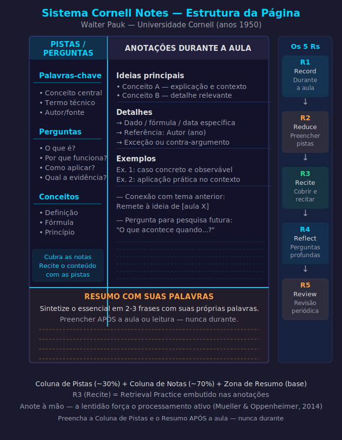

# Aula 22 — Cornell Notes: O Método dos 5 Rs

---

## Informações da Aula

| Campo | Detalhe |
|-------|---------|
| **Módulo** | 4 — Técnicas de Processamento Profundo |
| **Aula** | 22 de 08 (Módulo 4) |
| **Duração estimada** | 20 minutos |
| **Nível** | Intermediário |
| **Formato** | Videoaula com slides |
| **Objetivos** | Dominar a estrutura de página Cornell; aplicar os 5 Rs (Record, Reduce, Recite, Reflect, Review); entender por que anotações à mão superam digitação; adaptar Cornell para diferentes contextos |

---

## Roteiro da Aula

| Parte | Tempo | Conteúdo |
|-------|-------|---------|
| Abertura | 2 min | O problema com anotações tradicionais |
| Parte 1 | 5 min | Walter Pauk e a estrutura Cornell |
| Parte 2 | 6 min | Os 5 Rs em detalhe — o que fazer com as anotações |
| Parte 3 | 4 min | Cornell para diferentes contextos e versões digitais |
| Encerramento | 3 min | Exercício prático + próxima aula |

---

## Narração em Primeira Pessoa

### Abertura

Vou te fazer uma pergunta incômoda: o que você faz com as suas anotações depois que termina de anotar?

Se você é como a maioria dos estudantes, a resposta honesta é: "Quase nada. Elas ficam no caderno. Às vezes olho de novo antes de uma prova."

E aqui está o problema: anotações que servem apenas como registro passivo não são uma ferramenta de aprendizado. São uma ilusão de trabalho — a sensação de ter feito algo útil, sem o aprendizado de verdade que deveria acompanhar.

**Walter Pauk**, educador e pesquisador da **Universidade Cornell** nos anos 1950, percebeu isso. E criou um sistema de anotações que transforma o ato de anotar em um processo ativo de aprendizagem — não apenas de registro.

O sistema se chama **Cornell Notes**, e tem sido ensinado na Universidade Cornell há mais de 70 anos.

---

### Parte 1: Walter Pauk e a Estrutura Cornell

A genialidade do sistema Cornell não está em como você anota, mas em como a **estrutura da página** força um processo ativo depois de anotar.

A página é dividida em três zonas:

---


*Figura: Estrutura completa da página Cornell Notes com os 5 Rs — Walter Pauk, Universidade Cornell (anos 1950)*

---

```
┌──────────────────────────────────────────────────────────────┐
│                    PÁGINA CORNELL                            │
│                                                              │
│  COLUNA DE PISTAS          COLUNA DE NOTAS                  │
│  (3 cm de largura)         (6 cm de largura)                │
│                                                              │
│  Palavras-chave │           Anotações durante a aula/leitura│
│  Perguntas      │                                            │
│  Pistas de      │           • Ideias principais             │
│  recuperação    │           • Detalhes relevantes           │
│                 │           • Exemplos                      │
│                 │           • Datas, dados, fórmulas        │
│                 │                                            │
│                 │                                            │
│  ─────────────────────────────────────────────────────────  │
│  ZONA DE RESUMO (3 linhas no final da página)               │
│  Resumo com suas próprias palavras — após a aula            │
└──────────────────────────────────────────────────────────────┘
```

**Zona de Notas (6 cm)**: é a mais larga, onde você anota durante a aula ou leitura. Ideia principal, detalhes, exemplos, fórmulas, dados. Anote livremente, mas organize por ideias — não copie frases completas, use palavras-chave e frases curtas.

**Coluna de Pistas (3 cm)**: preenchida APÓS a aula. Você revisa as notas e para cada bloco de informação, escreve na coluna da esquerda: uma palavra-chave, uma pergunta, ou uma pista que vai te ajudar a lembrar o bloco da direita.

**Zona de Resumo (3 linhas no final)**: também preenchida APÓS a aula. Um resumo de 2 a 3 frases capturando as ideias mais importantes da página, em suas próprias palavras.

Por que essa estrutura funciona? Porque ela força você a processar as notas ativamente logo depois — criando a revisão de 24h que Piazzi defende — e cria automaticamente um sistema de retrieval: você cobre a coluna de notas, olha apenas a coluna de pistas, e tenta lembrar o conteúdo da direita.

---

### Parte 2: Os 5 Rs de Cornell

Walter Pauk sistematizou o processo em 5 Rs — cinco etapas que transformam anotações passivas em aprendizado ativo:

**R1 — Record (Registrar)**

Durante a aula ou leitura, anote na coluna de notas. Capture as ideias principais, exemplos, dados importantes. Não copie verbatim — resuma e parafraseie em suas próprias palavras.

**R2 — Reduce (Reduzir)**

Após a aula (idealmente nas primeiras 24 horas), revise as notas e preencha a coluna de pistas. Reduza cada bloco de informação a uma palavra-chave ou pergunta. Este processo já é uma forma de retrieval e elaboração.

**R3 — Recite (Recitar)**

Este é o passo mais poderoso. Cubra a coluna de notas com a mão ou uma folha. Olhe apenas a coluna de pistas. Para cada pista, **fale em voz alta** o que lembra do conteúdo correspondente.

Este passo é retrieval practice puro — exatamente o que Karpicke & Roediger (2006) mostraram ser a técnica de retenção mais eficaz. O "Recite" do Cornell é o Testing Effect embutido no sistema de anotações.

**R4 — Reflect (Refletir)**

Após recitar, faça perguntas mais profundas sobre o material: Como isso se conecta com o que aprendi antes? Qual a implicação disso? Onde eu poderia aplicar? Existem exceções?

Este passo é Elaborative Interrogation embutida no sistema — você está criando dendríticos adicionais.

**R5 — Review (Revisar)**

Revisite as notas regularmente — idealmente usando repetição espaçada. Semanalmente, mensalmente. Apenas 5 a 10 minutos por sessão, usando a coluna de pistas para recitar.

```
┌──────────────────────────────────────────────────────────────┐
│                    OS 5 Rs DE CORNELL                        │
│                                                              │
│  R1 RECORD   → Durante a aula: anote na coluna de notas    │
│  R2 REDUCE   → Após a aula: preencha a coluna de pistas    │
│  R3 RECITE   → Cubra as notas, recite com pistas apenas    │
│  R4 REFLECT  → Faça perguntas mais profundas (por quê?)    │
│  R5 REVIEW   → Revisite periodicamente (espaçamento)       │
│                                                              │
│  Cornell integra: Retrieval + Espaçamento + Elaboração     │
└──────────────────────────────────────────────────────────────┘
```

---

### Por que Anotações à Mão Superam Digitação

**Pam Mueller** e **Daniel Oppenheimer**, em um estudo clássico publicado na revista *Psychological Science* em 2014, compararam estudantes que anotavam à mão com estudantes que digitavam em laptops.

Resultado: estudantes que anotaram à mão se saíram significativamente melhor em questões conceituais (que exigiam compreensão e aplicação), mesmo que os digitadores tivessem mais texto anotado.

Por que? Porque digitar é rápido o suficiente para transcrever quase palavra por palavra — e essa transcrição mecânica não exige processamento. Anotar à mão é lento — você é forçado a selecionar, resumir, parafrasear. Essa seleção ativa já é processamento profundo.

Para Cornell Notes, o ideal é à mão. Mas se preferir digital, existem adaptações.

---

### Parte 3: Cornell em Diferentes Contextos e Versões Digitais

**Cornell para aula ao vivo:**

O mais clássico. Você anota na coluna de notas durante a aula, preenche a coluna de pistas na hora do intervalo ou logo após, e completa o resumo no mesmo dia.

**Cornell para videoaula:**

Pause a cada 5-10 minutos para processar. A vantagem da videoaula é que você pode voltar — então use isso: anote uma ideia, avance, confirme se anotou certo.

**Cornell para leitura de livro:**

Adapte: a coluna de pistas recebe os títulos das seções e as perguntas-chave. A coluna de notas recebe suas anotações. O resumo captura as ideias centrais do capítulo.

**Versões digitais:**

| Ferramenta | Como implementar Cornell |
|------------|-------------------------|
| **Notion** | Template de tabela com colunas |
| **OneNote** | Divisão manual da página com linhas |
| **Obsidian** | Bloco de callout para coluna de pistas |
| **papel** | Trace uma linha com caneta/régua — o mais eficaz |

---

### Cornell e Life Long Learning

No paradigma do **Life Long Learning**, Cornell Notes resolve um problema prático crucial: o que fazer com as anotações de décadas de aprendizado contínuo.

Um sistema Cornell bem organizado — seja em cadernos físicos ou em ferramentas digitais — se torna uma **base de conhecimento pessoal** navegável. Quando você precisa revisitar algo que aprendeu há 2 anos, as colunas de pistas funcionam como um índice cognitivo que te reorienta rapidamente.

Combinado com Zettelkasten (que veremos na Aula 25), Cornell se torna ainda mais poderoso: suas notas Cornell alimentam suas notas permanentes do Zettelkasten.

---

### Encerramento

Cornell Notes em resumo:

Três zonas: notas (6 cm) + pistas (3 cm) + resumo (final da página).

Cinco Rs: Record (durante a aula), Reduce (preencher pistas), Recite (cobrir notas, recitar com pistas), Reflect (perguntas profundas), Review (revisão periódica).

Anote à mão quando possível — a lentidão força processamento.

O Recite é o coração do sistema — é retrieval practice embutido nas suas anotações.

Próxima aula: **Mind Mapping** — a técnica de Tony Buzan para mapear conhecimento de forma visual e radial.

---

## Exercício Prático

**Título**: Cornell Notes em Ação

**Instruções**:

1. Prepare uma folha no formato Cornell: trace uma linha vertical a 6 cm da margem esquerda. Trace uma linha horizontal 6-7 linhas antes do fim da página.
2. Escolha uma videoaula que você ainda vai assistir (qualquer área) ou um capítulo de livro que você precisa ler.
3. Durante a videoaula/leitura, anote na coluna de notas (direita).
4. Imediatamente após (ou no máximo 24h depois):
   - Preencha a coluna de pistas (esquerda) com palavras-chave e perguntas
   - Escreva o resumo na zona inferior (3 linhas com suas próprias palavras)
5. 30 minutos depois: cubra a coluna de notas e pratique o **Recite** — para cada pista da esquerda, fale em voz alta o que lembra.
6. Anote: o que você conseguiu recitar? O que ficou em branco?

**Tempo estimado**: 30 a 40 minutos (incluindo a videoaula/leitura)

---

## Quiz de Retrieval

*Feche a aula e responda sem consultar.*

**Pergunta 1**: Quem criou o sistema Cornell Notes e em que universidade? Em que década?

**Pergunta 2**: Descreva as 3 zonas da página Cornell e o que vai em cada uma.

**Pergunta 3**: Quais são os 5 Rs do método Cornell? Liste-os na ordem correta.

**Pergunta 4**: Qual é o R mais poderoso para consolidação da memória e por quê?

**Pergunta 5**: Por que anotações à mão superam digitação, segundo Mueller & Oppenheimer (2014)?

---

### Gabarito

1. **Walter Pauk**, professor da **Universidade Cornell**, nos **anos 1950**. Publicou o sistema no livro "How to Study in College" (1962).

2. **Coluna de Notas (6 cm, direita)**: anotações durante a aula/leitura — ideias principais, exemplos, dados. **Coluna de Pistas (3 cm, esquerda)**: preenchida após — palavras-chave, perguntas e pistas de recuperação. **Zona de Resumo (3 linhas no final)**: preenchida após — resumo em suas próprias palavras.

3. R1 **Record** (registrar durante a aula), R2 **Reduce** (reduzir — preencher coluna de pistas), R3 **Recite** (recitar — cobrir notas, recitar com pistas), R4 **Reflect** (refletir — perguntas profundas), R5 **Review** (revisar — periodicamente com espaçamento).

4. **R3 — Recite** é o mais poderoso. É retrieval practice puro embutido no sistema de anotações — você cobre as notas e tenta lembrar o conteúdo baseado apenas nas pistas. Exatamente o Testing Effect que Karpicke & Roediger (2006) demonstraram ser a técnica de maior retenção.

5. Porque anotar à mão é lento, o que força seleção, resumo e paráfrase — processos ativos. Digitar é rápido o suficiente para transcrever mecanicamente, sem processar o conteúdo. Estudantes digitadores tinham mais texto mas desempenho inferior em questões que exigiam compreensão e aplicação.

---

## Leitura Recomendada

- **"How to Study in College"** — Walter Pauk & Ross Owens (2010, 11ª edição) — o livro original do sistema Cornell
- **"Mueller, P.A. & Oppenheimer, D.M. (2014). The Pen Is Mightier Than the Keyboard"** — *Psychological Science*
- Site **cornelltakes.com** — templates e tutoriais do sistema Cornell (grátis)

---

*Aula 22 — Módulo 4 — Curso Aprender a Aprender | Educa com Talento*
