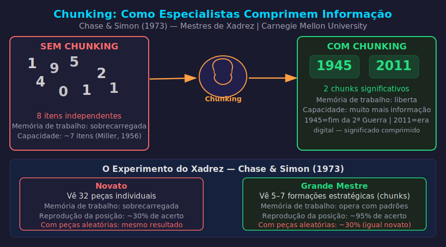

# Aula 24 — Chunking: Como a Mente dos Mestres Funciona

---

## Informações da Aula

| Campo | Detalhe |
|-------|---------|
| **Módulo** | 4 — Técnicas de Processamento Profundo |
| **Aula** | 24 de 08 (Módulo 4) |
| **Duração estimada** | 20 minutos |
| **Nível** | Intermediário-Avançado |
| **Formato** | Videoaula com slides |
| **Objetivos** | Entender o conceito de chunk cognitivo; compreender as limitações da memória de trabalho de George Miller; aplicar o processo de criação de chunks; conectar chunking com overlearning e fluência |

---

## Roteiro da Aula

| Parte | Tempo | Conteúdo |
|-------|-------|---------|
| Abertura | 2 min | O experimento do xadrez que revelou como os mestres pensam |
| Parte 1 | 5 min | George Miller e os limites da memória de trabalho |
| Parte 2 | 5 min | Como criar chunks — o processo de 4 etapas |
| Parte 3 | 5 min | Chunking em diferentes áreas e conexão com fluência |
| Encerramento | 3 min | Exercício prático + próxima aula |

---

## Narração em Primeira Pessoa

### Abertura

Nos anos 1970, dois pesquisadores da **Carnegie Mellon University** fizeram um experimento que mudou a forma como entendemos a expertise.

**William Chase** e **Herbert Simon** estudaram jogadores de xadrez de diferentes níveis — novatos, intermediários e grandes mestres. Eles mostravam posições de peças no tabuleiro por apenas 5 segundos, depois pediam para recriar a posição de memória.

O resultado foi extraordinário: **grandes mestres reproduziam quase perfeitamente**. Jogadores intermediários lembravam de algumas peças. Novatos mal conseguiam colocar metade.

Mas aqui está a parte fascinante: quando as peças eram colocadas em posições **aleatórias** — sem sentido estratégico — os grandes mestres iam tão mal quanto os novatos.

O que esse experimento revelou? Que os mestres não tinham memória melhor. Eles tinham algo diferente: **chunks**.

---


*Figura: Chunking — sem chunking, a memória de trabalho se sobrecarrega; com chunks, o mesmo espaço processa muito mais — Chase & Simon (1973)*

---

Um grande mestre de xadrez não vê 32 peças em 64 casas. Ele vê 5 a 7 **formações** — padrões conhecidos que carregam informação estratégica. Cada formação é um chunk: uma unidade de informação comprimida que representa muito mais do que parece.

Isso é exatamente o que vamos aprender hoje.

---

### Parte 1: George Miller e os Limites da Memória de Trabalho

Em 1956, o psicólogo cognitivo **George Miller**, da **Universidade de Princeton** (depois Harvard), publicou um artigo que se tornou um dos mais citados da história da psicologia: **"The Magical Number Seven, Plus or Minus Two"**.

A descoberta central: a memória de trabalho — o "RAM" do cérebro, onde você processa informação no momento presente — consegue manter apenas **7 ± 2 itens** simultaneamente. Pesquisas mais recentes, como as de **Nelson Cowan** da Universidade do Missouri, sugerem que o número real pode ser ainda menor — entre 4 e 5 chunks.

Essa é uma limitação fundamental e universal. Não importa quão inteligente você seja, você não consegue manter mais do que isso ativo ao mesmo tempo.

Mas aqui está o truque genial que a mente usa para contornar isso: **compressão**.

Se cada "item" na memória de trabalho pode ser um único dígito ou uma frase inteira com significado, você usa a capacidade de forma muito mais eficiente com significado do que com itens individuais.

Um expert na sua área tem chunks muito maiores do que um novato. Por isso o expert parece processar mais rápido, cometer menos erros, e "ver" coisas que o novato não vê — ele está operando com unidades de informação mais densas.

---

### Parte 2: Como Criar Chunks — O Processo de 4 Etapas

**Barbara Oakley**, da **Universidade de Oakland**, em seu livro "A Mind for Numbers" e no famoso MOOC "Learning How to Learn" do Coursera, descreveu o processo de chunking de forma clara e aplicável.

Para criar um chunk, você precisa de quatro condições:

**Etapa 1 — Foco Total**

Você não cria chunks com atenção dividida. A memória de trabalho precisa estar completamente disponível para conectar os elementos que formarão o chunk.

Isso significa: sem notificações, sem multitarefa, sem distrações. O foco é o pré-requisito.

**Etapa 2 — Entender o Conceito Central**

Antes de praticar, você precisa entender o que está tentando chunkar. Não necessariamente nos detalhes todos — mas a lógica central, o porquê, a estrutura.

Um chunk baseado em decoração sem entendimento é frágil — quebra facilmente quando o problema muda um pouco. Um chunk com compreensão é flexível e transferível.

**Etapa 3 — Contexto**

Um chunk isolado não serve muito. Você precisa entender quando e como usá-lo — em que situações esse chunk se aplica, quais são os sinais que indicam que ele é o certo, e quando NÃO se aplica.

**Etapa 4 — Prática Deliberada Até Automatizar**

Aqui está onde os chunks se consolidam: prática repetida, com feedback, até que o padrão se torne automático. O chunk está formado quando você executa sem precisar pensar — quando libera a memória de trabalho para processar o próximo nível.

```
┌──────────────────────────────────────────────────────────────┐
│           PROCESSO DE CRIAÇÃO DE CHUNKS                      │
│                       (Oakley, 2014)                         │
│                                                              │
│  1. FOCO TOTAL ──→ Memória de trabalho disponível           │
│         ↓                                                    │
│  2. ENTENDER ──→ A lógica central, o porquê                 │
│         ↓                                                    │
│  3. CONTEXTO ──→ Quando usar? Quando não usar?              │
│         ↓                                                    │
│  4. PRATICAR ──→ Repetir até automatizar                    │
│         ↓                                                    │
│     CHUNK FORMADO → libera memória de trabalho              │
│                     para o próximo nível                    │
└──────────────────────────────────────────────────────────────┘
```

---

### Parte 3: Chunking em Diferentes Áreas

**Música:**

Um iniciante lê nota por nota: Dó... Ré... Mi... Fá. Um músico experiente vê acordes — C major, Am7, F — que são chunks de 3 a 7 notas cada. Um músico avançado vê progressões harmônicas inteiras — I-IV-V — que são chunks de acordes. Cada nível de expertise = chunks maiores.

**Programação:**

Um iniciante vê cada linha de código. Um programador intermediário vê padrões — um loop for, uma condição if-else, uma função. Um sênior vê arquiteturas — MVC, microserviços, pipeline — cada uma um chunk de dezenas de linhas e decisões de design.

```python
# Iniciante: vê 7 linhas individuais
result = []
for item in data:
    if item > threshold:
        result.append(item * factor)

# Sênior: vê 1 chunk — "list comprehension com filtro e transform"
result = [item * factor for item in data if item > threshold]
```

**Idiomas:**

Iniciante: palavras individuais. Intermediário: frases idiomáticas (chunks). Avançado: estruturas conversacionais inteiras (chunks de frases). Fluente: chunking automático — você pensa em inglês sem traduzir.

**Matemática:**

Iniciante: resolve cada passo consciente. Proficiente: reconhece o tipo de problema como um chunk e aplica a técnica automaticamente. A resolução de uma equação de segundo grau não exige mais memória de trabalho — é um chunk consolidado.

---

### Decompor para Dominar, Reintegrar para Fluir

Aqui está o paradoxo do chunking que os aprendizes avançados entendem:

Para criar chunks maiores, você precisa temporariamente **decompor** — identificar as partes menores, praticar cada uma separadamente, construir competência micro. Só então você **reintegra** — as partes se tornam um chunk maior e fluente.

É o ciclo de todo aprendizado profundo: decomposição consciente → prática deliberada das partes → reintegração automática.

Um cirurgião novato pensa em cada movimento da mão. Um cirurgião experiente realiza procedimentos inteiros como sequências fluidas — chunks cirúrgicos. O novato não chegará ao nível do experiente pulando a fase de decomposição.

---

### Chunking e Life Long Learning

O chunking é a razão pela qual cada nova habilidade que você aprende ao longo da vida fica progressivamente mais fácil de adquirir — desde que você continue praticando intencionalmente.

No contexto do **Life Long Learning**, quem construiu uma biblioteca rica de chunks em sua área tem um enorme ponto de partida para aprender tópicos adjacentes. A transferência de chunks entre domínios relacionados é o que possibilita o aprendizado acelerado de experts.

Um programador que aprende Python depois de dominar Java não está começando do zero — os chunks de lógica de programação, estruturas de dados e padrões de design transferem. O que falta são os chunks específicos da sintaxe Python, que são adquiridos muito mais rápido.

---

### Encerramento

Para consolidar:

**Chunk** = unidade comprimida de informação que o cérebro trata como um item único na memória de trabalho. Experts têm chunks maiores — por isso parecem mais inteligentes e rápidos.

**George Miller**: memória de trabalho suporta 7 ± 2 itens. Com chunks maiores, você usa essa capacidade para processar muito mais.

**4 etapas para criar chunks**: Foco → Entender → Contexto → Praticar até automatizar.

Aplique: identifique os 5 chunks principais de uma matéria sua e pratique cada um isoladamente.

Próxima aula: **Zettelkasten** — o sistema de notas de Niklas Luhmann que cria uma rede de conhecimento que pensa por você.

---

## Exercício Prático

**Título**: Mapeando e Praticando os Meus Chunks

**Instruções**:

1. Escolha uma área de estudo ou habilidade profissional que você quer aprofundar.
2. Identifique os **5 chunks fundamentais** dessa área — os padrões ou conceitos centrais que, quando dominados, desbloqueiam o restante.
3. Para cada chunk, avalie seu nível atual: (a) não sei, (b) sei mas preciso pensar muito, (c) faço com algum esforço, (d) automático.
4. Escolha o chunk mais importante no nível (a) ou (b) e crie um plano de prática deliberada para ele esta semana:
   - Qual é o exercício específico para praticar?
   - Quantas repetições por sessão?
   - Por quantos dias?
5. Execute o plano e observe: após a prática, o chunk ficou mais automático?

**Exemplo** para programação Python: chunks poderiam ser — (1) list comprehension, (2) dictionary operations, (3) funções e escopo, (4) leitura/escrita de arquivos, (5) tratamento de exceções.

**Tempo estimado**: 20 minutos para planejar + implementação ao longo da semana

---

## Quiz de Retrieval

*Feche a aula e responda sem consultar.*

**Pergunta 1**: Quem foi William Chase e Herbert Simon? O que revelou o experimento com jogadores de xadrez?

**Pergunta 2**: Qual é a capacidade da memória de trabalho segundo George Miller (1956)?

**Pergunta 3**: O que é um "chunk" cognitivo? Dê um exemplo em 3 níveis de expertise (novato, intermediário, expert) em qualquer área.

**Pergunta 4**: Quais são as 4 etapas para criar um chunk segundo Barbara Oakley?

**Pergunta 5**: Por que os grandes mestres de xadrez iam tão mal quanto novatos com peças em posições aleatórias?

---

### Gabarito

1. **William Chase** e **Herbert Simon**, pesquisadores da **Carnegie Mellon University**. Experimento com posições de xadrez: grandes mestres reproduziam quase perfeitamente posições reais (5 segundos de exposição), mas iam tão mal quanto novatos com posições aleatórias sem sentido estratégico. Revelou que a memória dos mestres não é superior — eles reconhecem **padrões (chunks)**, não peças individuais.

2. **7 ± 2 itens** (entre 5 e 9). Pesquisas mais recentes de Nelson Cowan sugerem que o número real pode ser 4 a 5 chunks.

3. Um **chunk** é uma unidade comprimida de informação que o cérebro trata como um item único na memória de trabalho. Exemplo (música): (novato) lê nota por nota — Dó, Ré, Mi; (intermediário) vê acordes — C major, Am7; (expert) vê progressões harmônicas — I-IV-V. Cada nível tem chunks maiores e mais densos.

4. (1) **Foco total** — memória de trabalho completamente disponível; (2) **Entender** — a lógica central e o porquê; (3) **Contexto** — quando e como usar (e quando não usar); (4) **Praticar** — repetição deliberada até automatizar.

5. Porque as posições aleatórias não formam **padrões reconhecíveis**. Os chunks dos mestres são formações estratégicas significativas — se não há padrão, não há chunk para reconhecer, e a vantagem desaparece. Isso prova que a superioridade dos mestres é baseada em padrões, não em capacidade de memória bruta.

---

## Leitura Recomendada

- **"The Magical Number Seven, Plus or Minus Two"** — George Miller (1956), *Psychological Review* — o artigo original
- **"A Mind for Numbers"** — Barbara Oakley (2014) — capítulos 4, 5 e 6 sobre chunking
- **"Chase, W.G. & Simon, H.A. (1973). Perception in chess"** — *Cognitive Psychology* — estudo original do xadrez
- MOOC **"Learning How to Learn"** — Coursera (Oakley & Sejnowski) — gratuito, em inglês, com legendas em português

---

*Aula 24 — Módulo 4 — Curso Aprender a Aprender | Educa com Talento*
