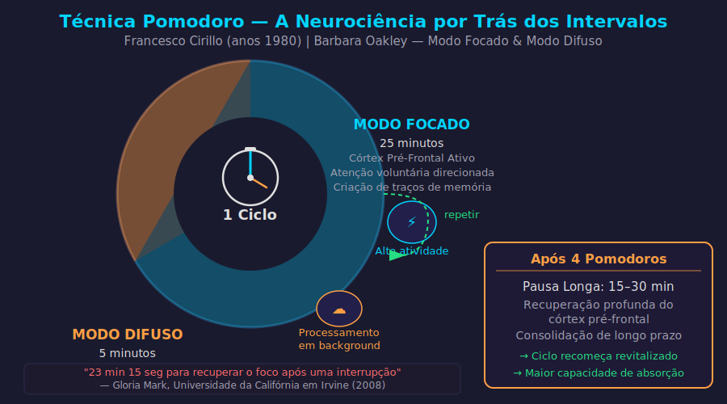

# Aula 30 — Técnica Pomodoro

---

## Informações da Aula

| Campo | Detalhe |
|-------|---------|
| **Módulo** | 5 — Gestão de Foco e Atenção |
| **Aula** | 30 de 45 (03 de 06 no módulo) |
| **Duração estimada** | 20 minutos |
| **Nível** | Iniciante a Intermediário |
| **Formato** | Videoaula com slides |
| **Objetivos** | Conhecer a história e o protocolo Pomodoro; entender a base neurocientífica das pausas restauradoras; aprender variações do Pomodoro para diferentes perfis; escolher ferramentas adequadas e implementar imediatamente |

---

## Roteiro da Aula

| Parte | Tempo | Conteúdo |
|-------|-------|---------|
| Abertura | 2 min | A história do timer de tomate que mudou a produtividade mundial |
| Parte 1 | 4 min | O protocolo Pomodoro: como funciona na prática |
| Parte 2 | 4 min | Por que as pausas não são tempo perdido: neurociência do modo difuso |
| Parte 3 | 4 min | Variantes do Pomodoro para diferentes perfis e situações |
| Parte 4 | 3 min | Ferramentas e como registrar a qualidade do foco |
| Encerramento | 3 min | Exercício + próxima aula |

---

## Narração em Primeira Pessoa

### Abertura

Quero começar essa aula com uma história que vai de um timer de cozinha em forma de tomate para uma das técnicas de produtividade mais usadas no mundo.

Era o final dos anos 1980. Francesco Cirillo era um estudante universitário na Itália que estava tendo dificuldades sérias para se concentrar durante os estudos. Provavelmente você se identifica com essa situação — a sensação de sentar na frente do material e a mente ir para qualquer outro lugar menos para o conteúdo.

Cirillo decidiu fazer um experimento consigo mesmo. Ele foi até a cozinha, pegou o timer de tomate que sua família usava para cozinhar — *pomodoro* em italiano — e se comprometeu a estudar com foco total pelo tempo que o timer durasse: 25 minutos.

Sem interrupções. Sem desvios. Só o estudo e o tick-tock do timer.

Depois que o timer tocou, ele fez uma pausa de 5 minutos. E repetiu.

O resultado foi tão positivo que Cirillo passou anos refinando esse método, testando variações, coletando dados. No início dos anos 1990, ele formalizou o que ficou conhecido mundialmente como a **Técnica Pomodoro**.

Hoje essa técnica tem dezenas de millions de praticantes no mundo inteiro. É ensinada em universidades, adotada por empresas de tecnologia e recomendada por neurocientistas. E a razão pela qual funciona tão bem não é mistério — tem base sólida na ciência do cérebro.

---

### Parte 1: O Protocolo Pomodoro

O protocolo clássico é elegante na sua simplicidade:

---


*Figura: Um ciclo Pomodoro completo — Modo Focado (25 min) + Modo Difuso (5 min) + Pausa Longa após 4 ciclos — Francesco Cirillo / Barbara Oakley*

---

A regra da reinicialização pode parecer draconiana, mas tem uma função importante: ela torna as interrupções custosas o suficiente para que você faça esforço real para evitá-las. Quando você sabe que uma interrupção de 30 segundos vai zerar 20 minutos de trabalho, você pensa duas vezes antes de pegar o celular.

O processo de um Pomodoro completo tem cinco etapas:

1. **Escolha a tarefa** que vai trabalhar (seja específico)
2. **Defina o timer** para 25 minutos
3. **Trabalhe na tarefa** até o timer tocar — sem pausas
4. **Marque um X** numa folha de papel (registro visual do progresso)
5. **Faça a pausa** de 5 minutos (levante, estique, hidrate — não fique na tela)

Esse X no papel é mais poderoso do que parece. Ele transforma uma atividade abstrata ("estudei") em progresso concreto e visível. E visibilidade de progresso é um dos maiores motivadores conhecidos pela psicologia.

---

### Parte 2: Por que as Pausas Não São Tempo Perdido

Aqui é onde a maioria das pessoas erra — incluindo eu mesmo, por muitos anos.

Quando alguém me dizia "faça pausas regulares no estudo", meu instinto era resistir. "Mas estou no ritmo! Se eu parar, vou perder o embalo. Pausa é perda de tempo."

Isso era meu intuito de estudante, e estava completamente errado.

Vou te explicar a ciência por trás das pausas, porque quando você entender, vai parar de resistir a elas e vai começar a protegê-las como parte sagrada do processo.

Barbara Oakley, professora de Engenharia na Oakland University e criadora do curso mais popular de todos os tempos na plataforma Coursera — o *Learning How to Learn* —, descreve dois modos fundamentais de processamento cerebral.

O **modo focado** é aquele em que você está ativamente concentrado em um problema ou conteúdo. O cérebro está em alta atividade na área relevante para a tarefa — é o modo do Pomodoro.

O **modo difuso** é um estado de processamento mais relaxado, ativado quando você não está ativamente pensando em um problema específico. É o modo da pausa, do banho, da caminhada. E aqui está o ponto crucial: **o modo difuso é onde a consolidação, a integração e os insights acontecem**.

Quando você aprende algo novo no modo focado e depois descansa, o cérebro não para de trabalhar. Ele continua processando a informação no background, criando conexões entre o conteúdo novo e o que você já sabe, identificando padrões, consolidando na memória de longo prazo.

```
NEUROCIÊNCIA DAS PAUSAS
═══════════════════════

MODO FOCADO (durante o Pomodoro):
│ Processamento ativo do conteúdo
│ Alta demanda do córtex pré-frontal
│ Criação de traços de memória iniciais
│ [ESGOTAMENTO GRADUAL DA ATENÇÃO SUSTENTADA]
▼

PAUSA (5-15 min):
│ Ativação da Default Mode Network (DMN)
│ Consolidação e integração de memórias
│ Restauração do córtex pré-frontal
│ Criação de conexões entre ideias
│ Geração de insights (o "eureka" da pausa)
▼

PRÓXIMO MODO FOCADO:
│ Córtex pré-frontal restaurado
│ Conteúdo anterior mais consolidado
│ Maior capacidade de absorção
└── APRENDIZADO MAIS EFICIENTE
```

Sabe aquele momento em que você estava preso num exercício, saiu para beber água, e voltou com a solução? Isso foi o modo difuso entregando o resultado do processamento que aconteceu durante a pausa.

As pausas do Pomodoro não são tempo perdido. São o momento em que boa parte do aprendizado de fato acontece.

E tem mais: o córtex pré-frontal — responsável pela atenção voluntária que discutimos na aula anterior — se esgota com o uso sustentado, assim como um músculo. A pausa é a recuperação ativa desse músculo. Sem ela, a qualidade do foco nos Pomodoros subsequentes degrada progressivamente.

---

### Parte 3: Variantes do Pomodoro

O protocolo de 25/5 de Cirillo é um ponto de partida, não uma lei imutável. Ao longo dos anos, praticantes e pesquisadores desenvolveram variações para diferentes situações:

**Para iniciantes (atenção ainda não treinada)**
- Blocos de 15 minutos + 5 min pausa
- Reduzir gradualmente para 20, depois 25 minutos ao longo de semanas
- O objetivo é treinar o músculo da atenção sem sobrecarregar

**Para conteúdo de alta complexidade (matemática, programação, idiomas)**
- Blocos de 50 minutos + 10 min pausa
- A complexidade requer mais tempo para entrar no nível necessário de processamento
- Pesquisa de Staffan Noteberg (autor de *Pomodoro Technique Illustrated*) sugere que para problemas muito complexos, a fase de aquecimento cognitivo leva mais de 25 min

**Flowmodoro (para quando o Flow aparece)**
- Regra: se você entrou em estado de flow durante um Pomodoro, NÃO toque no timer
- Estenda o bloco enquanto o estado de flow se mantiver
- Ao sair do flow naturalmente, faça a pausa proporcional ao tempo adicional
- O objetivo é não interromper artificialmente um dos estados mais produtivos que existem

**Tabela de Variantes**:

```
┌──────────────────┬──────────────┬──────────────┬───────────────────────┐
│ Variante         │ Foco         │ Pausa curta  │ Pausa longa           │
├──────────────────┼──────────────┼──────────────┼───────────────────────┤
│ Iniciante        │ 15 min       │ 5 min        │ 15 min (após 4 pomos) │
│ Clássico         │ 25 min       │ 5 min        │ 15-30 min             │
│ Intermediário    │ 35 min       │ 7 min        │ 20-30 min             │
│ Profissional     │ 50 min       │ 10 min       │ 30 min                │
│ Flowmodoro       │ Até o flow   │ Proporcional │ Proporcional          │
└──────────────────┴──────────────┴──────────────┴───────────────────────┘
```

Qual variante usar? A regra de ouro é: **a que você consegue manter com consistência**. Uma sessão de 15 minutos que você de fato fez é infinitamente superior a uma sessão de 50 minutos que você planejou mas não executou.

Para quem está construindo o hábito de aprendizado contínuo — seja você um estudante tradicional ou um profissional praticando Life Long Learning —, a consistência supera a intensidade em qualquer análise de longo prazo.

---

### Parte 4: Ferramentas e Registro de Qualidade

**Ferramentas para implementar o Pomodoro**:

**Timer físico (recomendação número 1)**
- Um timer de cozinha simples ou de mesa
- Vantagem: não exige olhar para a tela, não tem notificações, o som mecânico do tick cria um ritmo condicionante

**Forest App**
- Planta uma árvore virtual que cresce durante o Pomodoro
- Se você sair do app para checar outras coisas, a árvore morre
- Gamificação simples e eficaz; opção de árvores reais via parceria ambiental

**Pomofocus.io**
- Web app minimalista, gratuito, sem cadastro
- Interface limpa, segue o protocolo clássico com variações configuráveis

**Focus@Will**
- Música cientificamente calibrada para manter foco
- Combina bem com qualquer timer

**Registro de qualidade de foco**:

Ao final de cada Pomodoro, anote em uma escala de 1 a 5:
- 1 = Quase não consegui focar, mente divagou muito
- 3 = Foco razoável, algumas dispersões
- 5 = Foco excelente, completamente imerso

Essa prática de metacognição — refletir sobre a qualidade do próprio processo — é uma das marcas dos aprendizes de alto desempenho. Ela cria um feedback loop que você usa para ajustar o protocolo progressivamente.

---

### Encerramento

Nessa aula você aprendeu que a Técnica Pomodoro, criada por Francesco Cirillo nos anos 1980, não é apenas uma "dica de produtividade" — ela tem base neurocientífica sólida.

Os blocos de foco treinam a atenção voluntária. As pausas ativam o modo difuso de Oakley, onde a consolidação e os insights acontecem. E a variante certa para cada pessoa existe — você só precisa experimentar.

O exercício desta aula é executar 4 Pomodoros seguidos de estudo real e registrar a qualidade do foco em cada um.

Na próxima aula, vamos entrar em terreno ainda mais profundo com Cal Newport e o conceito de Deep Work. Você vai entender por que o trabalho cognitivo profundo está se tornando simultaneamente mais raro e mais valioso.

Vejo você lá!

---

## Exercício Prático

### 4 Pomodoros Documentados

**Objetivo**: Implementar o protocolo Pomodoro completo em uma sessão real e coletar dados sobre a qualidade do foco.

**Instruções**:

1. **Escolha uma matéria ou projeto** que precisa de atenção. Algo real, não fictício.

2. **Prepare o ambiente**: celular em modo avião, ambiente silencioso ou com ruído branco, água na mesa, blocos e notificações eliminados.

3. **Execute 4 Pomodoros** (25 min + 5 min pausa × 4, com pausa longa de 20 min após o quarto):

| Pomodoro | O que estudou/fez | Nº de distrações | Qualidade (1-5) | Observações |
|----------|-------------------|------------------|-----------------|-------------|
| 1° | | | | |
| 2° | | | | |
| 3° | | | | |
| 4° | | | | |

4. **Análise ao final**:
   - A qualidade melhorou ou piorou ao longo dos Pomodoros?
   - O que causou mais distrações?
   - A pausa realmente ajudou na recuperação do foco?
   - Qual variante de tempo se encaixou melhor no seu perfil?

5. **Decisão**: Qual protocolo Pomodoro você vai adotar como padrão a partir de amanhã?

---

## Quiz de Retrieval

**1. Quem criou a Técnica Pomodoro e em que época?**

a) Cal Newport, nos anos 2010
b) Francesco Cirillo, nos anos 1980, na Itália
c) Barbara Oakley, na Oakland University
d) James Clear, no livro Hábitos Atômicos

**Gabarito**: b) — Francesco Cirillo, anos 1980, Itália

---

**2. O que acontece durante as pausas do Pomodoro, do ponto de vista neurocientífico?**

a) O cérebro para de processar completamente
b) A memória de curto prazo apaga o que foi aprendido
c) Ativa-se o modo difuso (Default Mode Network), que consolida memórias, integra informações e gera insights
d) O cortex pré-frontal fica em modo de espera sem atividade

**Gabarito**: c) — Modo difuso = consolidação, integração e insights

---

**3. Quando deve ser usada a variante "Flowmodoro"?**

a) Quando a tarefa é muito chata
b) Quando o timer toca mas você ainda não terminou
c) Quando você entrou em estado de flow — não interrompa artificialmente; estenda o bloco
d) Nos primeiros dias de treino com Pomodoro

**Gabarito**: c) — Flow é um estado ótimo que não deve ser interrompido artificialmente

---

**4. Qual é a duração da pausa longa que ocorre após cada conjunto de 4 Pomodoros?**

a) 5 minutos
b) 10 minutos
c) 15-30 minutos
d) 1 hora

**Gabarito**: c) — 15 a 30 minutos de pausa longa após 4 Pomodoros

---

**5. Por que um timer físico (em vez de app) é frequentemente recomendado para o Pomodoro?**

a) É mais preciso que apps digitais
b) É mais barato
c) Não exige olhar para a tela, não tem notificações e o som mecânico cria um ritmo condicionante de foco
d) Apps não têm função de timer adequada

**Gabarito**: c) — Timer físico elimina a necessidade de interagir com dispositivos digitais

---

## Leitura Recomendada

- **Cirillo, Francesco**. *The Pomodoro Technique*. Cirillo Consulting, 2006. (gratuito em pomodorotechnique.com)
- **Oakley, Barbara; Sejnowski, Terrence**. *Aprendendo a Aprender: Como Ter Sucesso em Matemática, Ciências e Qualquer Disciplina Difícil*. Alta Books, 2019.
- **Noteberg, Staffan**. *Pomodoro Technique Illustrated*. Pragmatic Bookshelf, 2009.

---

*Aula 30 | Módulo 05 | Curso Aprender a Aprender | Educa com Talento*
