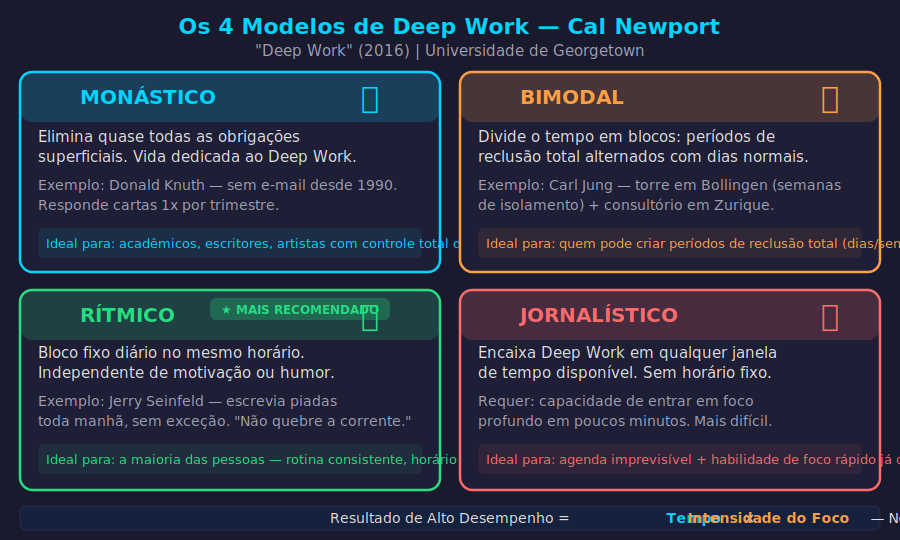

# Aula 31 — Deep Work: Trabalho Cognitivo Profundo

---

## Informações da Aula

| Campo | Detalhe |
|-------|---------|
| **Módulo** | 5 — Gestão de Foco e Atenção |
| **Aula** | 31 de 45 (04 de 06 no módulo) |
| **Duração estimada** | 20 minutos |
| **Nível** | Intermediário a Avançado |
| **Formato** | Videoaula com slides |
| **Objetivos** | Compreender o conceito de Deep Work de Cal Newport; distinguir Deep Work de Shallow Work; conhecer os 4 modelos de prática de Deep Work; criar um protocolo pessoal semanal de trabalho profundo |

---

## Roteiro da Aula

| Parte | Tempo | Conteúdo |
|-------|-------|---------|
| Abertura | 2 min | O paradoxo da era digital: o que é mais raro também é mais valioso |
| Parte 1 | 4 min | Cal Newport: Deep Work vs. Shallow Work |
| Parte 2 | 4 min | Os 4 modelos de prática de Deep Work |
| Parte 3 | 4 min | As regras do Deep Work: rotina, grande gesto, métricas |
| Parte 4 | 3 min | Aplicação para estudantes: blocos de estudo profundo |
| Encerramento | 3 min | Exercício prático + próxima aula |

---

## Narração em Primeira Pessoa

### Abertura

Cal Newport é professor de Ciência da Computação na Universidade de Georgetown, em Washington, e é uma anomalia interessante no mundo acadêmico: ele nunca teve conta em nenhuma rede social. Nenhuma. Nem durante a faculdade, nem durante o doutorado, nem agora como professor publicado.

E, ao mesmo tempo, ele é um dos acadêmicos mais produtivos da sua geração: publicou livros, artigos científicos, e mantém uma carreira de pesquisa prolífica.

A coincidência não é acidental. Em 2016, Newport publicou o livro *Deep Work* — Trabalho Focado, em português —, e nele ele apresenta uma hipótese que vai contra toda a cultura corporativa e acadêmica moderna: a capacidade de trabalhar com foco profundo, sem distrações, está se tornando cada vez mais rara. E, por isso mesmo, está se tornando cada vez mais valiosa.

Raro e valioso. Esse é o paradoxo que quero que você entenda hoje.

---

### Parte 1: Deep Work vs. Shallow Work

Newport define os dois tipos de trabalho com precisão cirúrgica:

**Deep Work** — Atividades cognitivamente exigentes executadas em estado de concentração sem distrações, que empurram suas habilidades cognitivas ao limite. Esses esforços criam novo valor, melhoram sua habilidade e são difíceis de replicar.

**Shallow Work** — Tarefas logisticamente necessárias, frequentemente realizadas com distração, que não criam muito novo valor no mundo e são fáceis de replicar.

```
┌────────────────────────────────────────────────────────────┐
│              DEEP WORK vs. SHALLOW WORK                    │
├────────────────────────┬───────────────────────────────────┤
│      DEEP WORK         │        SHALLOW WORK               │
├────────────────────────┼───────────────────────────────────┤
│ Escrever um artigo     │ Responder e-mails                 │
│ Resolver um problema   │ Participar de reuniões sem pauta  │
│   complexo de código   │ Atualizar planilhas               │
│ Estudar um tema difícil│ Montar apresentação de slides     │
│   do zero              │ Fazer ligações de rotina          │
│ Criar uma estratégia   │ Checar notificações               │
│ Aprender um novo       │ Fazer tarefas administrativas     │
│   idioma intensamente  │ Navegar em redes sociais          │
│ Compor música original │ Marcar reuniões                   │
├────────────────────────┼───────────────────────────────────┤
│ Cria valor único       │ Pouco ou nenhum valor único       │
│ Dificilmente replicável│ Facilmente replicável (ou por IA) │
│ Exige foco total       │ Tolerante a distrações            │
│ Escasso no mercado     │ Abundante no mercado              │
└────────────────────────┴───────────────────────────────────┘
```

Aqui está o insight que Newport desenvolve: em uma economia onde a inteligência artificial está automatizando progressivamente as tarefas de Shallow Work, os profissionais que conseguem executar Deep Work com regularidade estão em vantagem enorme.

E para estudantes, isso é ainda mais direto: aprender de verdade — absorver um conceito difícil, resolver um problema nunca visto antes, desenvolver uma habilidade complexa — é Deep Work. Fazer o que a maioria dos estudantes faz — reler passivamente, sublinhar com caneta colorida, estudar enquanto ouve música com letra — é Shallow Work disfarçado de estudo.

Newport tem uma fórmula para o resultado do Deep Work:

**Resultado de Alto Desempenho = Tempo × Intensidade do Foco**

Note que o tempo sozinho não é o diferencial. Intensidade do foco multiplicada pelo tempo é o que produz resultados excepcionais. Isso explica por que algumas pessoas produzem muito mais em 4 horas de Deep Work do que outras em 10 horas de Shallow Work disfarçado.

---

### Parte 2: Os 4 Modelos de Deep Work

Newport reconhece que não existe uma forma única de praticar Deep Work. As pessoas têm diferentes responsabilidades, horários e estilos de vida. Então ele descreve quatro modelos, e você vai se identificar com um deles.

---


*Figura: Os 4 Modelos de Deep Work (Monástico, Bimodal, Rítmico, Jornalístico) — Cal Newport, "Deep Work" (2016)*

---

**Modelo Monástico**

O praticante monástico elimina ou minimiza radicalmente todas as obrigações superficiais e dedica a vida quase inteiramente ao Deep Work.

Exemplo: Donald Knuth, o cientista da computação que escreveu a série de livros *The Art of Computer Programming* — um dos mais importantes da área. Knuth literalmente não tem e-mail. Publicou um aviso no seu site dizendo que aposentou o e-mail em 1990 e que pessoas que queiram se comunicar devem enviar cartas para o seu departamento, que ele lê uma vez por trimestre.

Esse modelo é para poucos — acadêmicos, escritores, artistas. A maioria das pessoas tem obrigações que não permite essa abordagem.

**Modelo Bimodal**

O praticante bimodal divide o tempo em dois: períodos de Deep Work intenso (dias ou semanas inteiras de reclusão total) alternados com períodos de disponibilidade normal.

Exemplo: Carl Jung, o psicólogo suíço, construiu uma torre em Bollingen às margens de um lago suíço onde se recolhia periodicamente por semanas sem interrupções para escrever e pensar. Depois voltava ao trabalho clínico normal em Zurique.

Para estudantes: pode ser implementado como uma semana por mês de estudo intensivo, ou fins de semana inteiros dedicados a Deep Work em algum projeto.

**Modelo Rítmico**

O praticante rítmico incorpora o Deep Work em uma rotina diária com um horário fixo. Todos os dias, no mesmo horário, independentemente de motivação, ele executa seu bloco de Deep Work.

Exemplo: o autor Jerry Seinfeld disse uma vez que escrevia piadas todo dia pela manhã, sem exceção. Cada dia que conseguia escrever, marcava um X num calendário. O objetivo era "não quebrar a corrente". Resultado: décadas de produção consistente.

Esse é o modelo mais acessível para a maioria das pessoas — e especialmente para estudantes. Bloco fixo de Deep Work todos os dias, mesmo que de 90 minutos.

**Modelo Jornalístico**

O praticante jornalístico encaixa o Deep Work em qualquer janela de tempo livre disponível no dia — assim como jornalistas treinados escrevem artigos com qualidade mesmo em 45 minutos de prazo apertado.

É o modelo mais difícil para iniciantes, porque requer a capacidade de entrar rapidamente em estado de foco profundo. Mas é o mais flexível.

```
┌────────────────────────────────────────────────────────────┐
│           QUAL MODELO É O CERTO PARA VOCÊ?                 │
├─────────────────┬──────────────────────────────────────────┤
│ Monástico       │ Você tem controle total da agenda e       │
│                 │ pode eliminar quase tudo superficial      │
├─────────────────┼──────────────────────────────────────────┤
│ Bimodal         │ Você pode criar períodos de reclusão      │
│                 │ total (dias/semanas) periodicamente       │
├─────────────────┼──────────────────────────────────────────┤
│ Rítmico         │ Você tem rotina consistente e pode        │
│                 │ reservar um horário fixo diariamente      │
│                 │ [MAIS RECOMENDADO PARA A MAIORIA]         │
├─────────────────┼──────────────────────────────────────────┤
│ Jornalístico    │ Sua agenda é imprevisível mas você        │
│                 │ consegue entrar em foco rapidamente       │
└─────────────────┴──────────────────────────────────────────┘
```

---

### Parte 3: As Regras do Deep Work

Newport propõe regras específicas para quem quer desenvolver uma prática de Deep Work. Vou te passar as mais importantes.

**Trabalhe profundamente — crie rituais**

Assim como falamos do hiperfoco na Aula 28, o Deep Work funciona melhor com rituais. Defina: onde vai trabalhar? Por quanto tempo? Como vai eliminar distrações? O que vai acontecer se precisar de algo durante a sessão? (anote numa lista para depois).

**Faça um Grande Gesto**

Newport descreve o fenômeno do "grande gesto" como uma mudança radical de contexto que sinaliza para o cérebro a importância excepcional do trabalho que está prestes a fazer.

JK Rowling alugou uma suíte em um hotel de luxo em Edimburgo para terminar o último livro de Harry Potter. Bill Gates fazia seus "Think Weeks" semi-anuais numa cabana isolada para pensar sem interrupção sobre o futuro da Microsoft.

Para estudantes, um grande gesto pode ser: estudar durante um fim de semana inteiro numa biblioteca longe de casa, alugar um espaço de coworking para uma semana de provas, ou reservar as primeiras 2 horas da manhã em um café tranquilo como espaço sagrado de estudo.

**Não use a internet**

Durante as sessões de Deep Work, internet só se for estritamente necessária para a tarefa. Não abrir e-mail, não checar redes sociais, não navegar. A internet é o oposto do Deep Work — ela foi projetada para fragmentar a atenção.

**Meça a profundidade**

Newport sugere medir o tempo gasto em Deep Work versus Shallow Work. Uma meta razoável para quem está desenvolvendo essa habilidade: 4 horas de Deep Work por dia é excepcional. 1-2 horas diárias já é superior à maioria dos profissionais.

---

### Parte 4: Aplicação para Estudantes

Para estudantes, o Deep Work tem uma tradução direta: **sessões de estudo deliberado sem distrações**.

O protocolo que recomendo, construindo sobre o Pomodoro da aula anterior:

```
PROTOCOLO DE DEEP WORK PARA ESTUDANTES
════════════════════════════════════════

BLOCO DIÁRIO: 90-120 minutos
├── Horário fixo (preferencialmente manhã)
├── Ambiente exclusivo para estudo (mesma cadeira, mesa, café)
├── Celular em modo avião e fora do campo visual
├── Apenas o material necessário acessível
├── Objetivo específico definido antes de começar
└── Sem exceções durante dias de semana

COMPOSIÇÃO DO BLOCO:
[25 min foco] + [5 min pausa] + [25 min foco] + [5 min pausa] + [25 min foco]
= 75 min de foco real + 10 min de pausa = 85 min totais

ALTERNATIVA AVANÇADA:
[50 min foco] + [10 min pausa] + [50 min foco]
= 100 min de foco real + 10 min de pausa = 110 min totais
```

A chave é a regularidade. O modelo rítmico — todos os dias, mesmo horário — é o que cria o deep work como prática permanente.

E é aqui que o conceito de **Life Long Learning** se conecta ao Deep Work de forma inevitável. Um aprendiz permanente, que se compromete a crescer e aprender ao longo de toda a carreira e vida, não pode depender de estudar apenas quando há prazo ou pressão. Precisa de um sistema de Deep Work incorporado na rotina como higiene — não como exceção.

Newport afirma que quem desenvolve a capacidade de Deep Work não apenas aprende mais rápido e produz com mais qualidade. Ele também experimenta maior satisfação e significado no trabalho. Há algo profundamente humano em estar completamente imerso num desafio cognitivo difícil — é exatamente o que Csikszentmihalyi chama de Flow, que vamos ver na próxima aula.

---

### Encerramento

Nessa aula você aprendeu a distinção fundamental entre Deep Work e Shallow Work de Cal Newport, os quatro modelos de prática, e como construir um protocolo pessoal de trabalho profundo.

O exercício desta aula é identificar seu modelo ideal e criar um protocolo semanal real — não um plano teórico, mas algo que você vai implementar a partir de amanhã.

Na próxima aula, vamos explorar o estado de Flow de Csikszentmihalyi — o estado psicológico ótimo que aparece naturalmente quando as condições certas de Deep Work estão presentes.

---

## Exercício Prático

### Identificar Modelo e Criar Protocolo Semanal de Deep Work

**Objetivo**: Definir seu modelo de Deep Work e criar um protocolo semanal executável.

**Parte 1 — Identifique seu modelo**:

Responda honestamente:
- Você pode reservar blocos fixos diários no mesmo horário? → **Rítmico**
- Você pode criar períodos de reclusão total de dias/semanas? → **Bimodal**
- Sua agenda é imprevisível mas você entra em foco rápido? → **Jornalístico**
- Você pode eliminar quase tudo que não é trabalho profundo? → **Monástico**

**Parte 2 — Crie seu protocolo**:

Preencha:
- Modelo escolhido: _______________
- Horário fixo de Deep Work: _____ às _____
- Local escolhido: _______________
- Duração dos blocos: _____________
- Protocolo de eliminação de distrações: _______________
- Como vai medir: _______________

**Parte 3 — Calcule sua meta**:
- Horas semanais de Deep Work planejadas: _____
- Horas semanais de Shallow Work estimadas: _____
- Proporção Deep/Total: _____% (meta: acima de 40%)

**Compromisso**: Implementar esse protocolo por 2 semanas sem modificação, depois avaliar e ajustar.

---

## Quiz de Retrieval

**1. Como Cal Newport define Deep Work?**

a) Qualquer trabalho que leva muito tempo
b) Atividades cognitivamente exigentes executadas em concentração sem distrações, que criam novo valor e são difíceis de replicar
c) Estudo realizado em horários não convencionais
d) Trabalho executado sem colaboração de outras pessoas

**Gabarito**: b) — Definição exata de Newport: cognitivamente exigente + foco total + valor único + difícil de replicar

---

**2. Qual é o modelo de Deep Work mais acessível e recomendado para a maioria das pessoas?**

a) Monástico
b) Bimodal
c) Rítmico — bloco fixo diário no mesmo horário, independentemente de motivação
d) Jornalístico

**Gabarito**: c) — Rítmico é o mais acessível pela consistência e previsibilidade

---

**3. O que é um "Grande Gesto" no contexto de Deep Work?**

a) Um grande projeto ou entrega profissional
b) Uma mudança radical de contexto que sinaliza ao cérebro a importância excepcional do trabalho — como JK Rowling alugando uma suíte de hotel para terminar Harry Potter
c) Um gesto físico usado para entrar em foco
d) A meta de 4 horas de Deep Work por dia

**Gabarito**: b) — Grande Gesto = mudança radical de contexto como sinal de comprometimento

---

**4. Qual é a fórmula de Newport para o resultado de alto desempenho?**

a) Resultado = Tempo + Esforço
b) Resultado = Horas trabalhadas × Número de tarefas
c) Resultado de Alto Desempenho = Tempo × Intensidade do Foco
d) Resultado = Talento + Oportunidade

**Gabarito**: c) — Tempo × Intensidade do Foco = o diferencial não é horas, é qualidade da atenção

---

**5. Por que o Shallow Work está se tornando menos valioso com o avanço da IA?**

a) Porque a IA cobra menos que humanos
b) Porque o Shallow Work é composto por tarefas logísticas, repetitivas e de pouco valor único — exatamente o tipo que a IA automatiza com mais facilidade
c) Porque as empresas estão cortando custos
d) Porque Shallow Work requer habilidades que a IA aprende rapidamente

**Gabarito**: b) — Shallow Work = baixo valor único + fácil replicação = alvo óbvio para automação por IA

---

## Leitura Recomendada

- **Newport, Cal**. *Trabalho Focado: Como Ter Sucesso em um Mundo Distraído*. Alta Books, 2016.
- **Newport, Cal**. *Seja tão bom que eles não possam ignorar você*. Alta Books, 2012.
- **Newport, Cal**. Blog: calnewport.com/blog (gratuito, atualizado regularmente)

---

*Aula 31 | Módulo 05 | Curso Aprender a Aprender | Educa com Talento*
