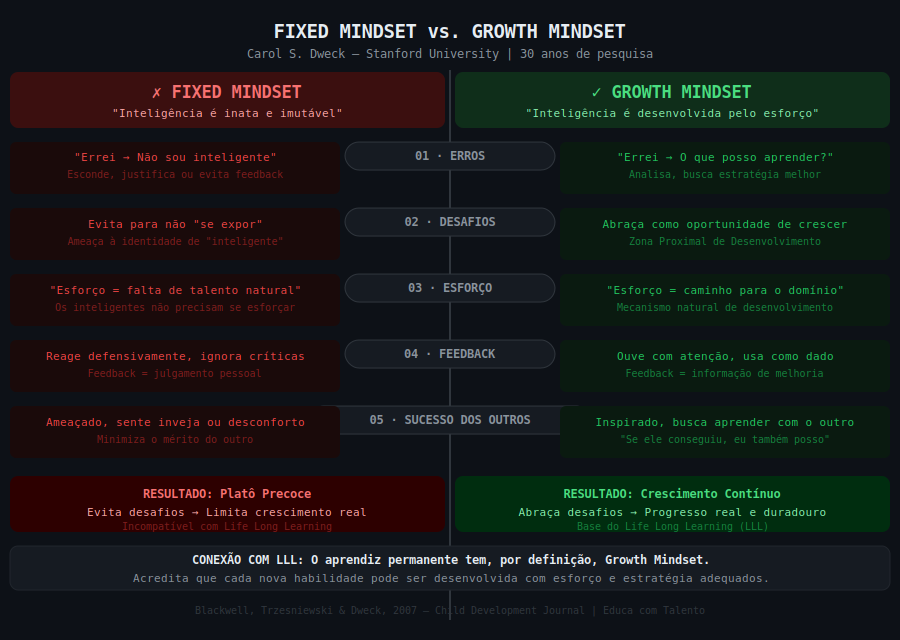

# Aula 34 — Growth Mindset

---

## Informações da Aula

| Campo | Detalhe |
|-------|---------|
| **Módulo** | 6 — Mentalidade e Psicologia do Aprendizado |
| **Aula** | 34 de 45 (01 de 06 no módulo) |
| **Duração estimada** | 20 minutos |
| **Nível** | Iniciante a Intermediário |
| **Formato** | Videoaula com slides |
| **Objetivos** | Compreender a distinção Fixed vs. Growth Mindset de Carol Dweck; identificar manifestações de Fixed Mindset no comportamento; entender a relação entre Growth Mindset e LLL; reformular crenças fixas com linguagem de crescimento |

---

## Roteiro da Aula

| Parte | Tempo | Conteúdo |
|-------|-------|---------|
| Abertura | 2 min | Carol Dweck e 30 anos pesquisando por que algumas pessoas crescem e outras ficam estagnadas |
| Parte 1 | 4 min | Fixed Mindset vs. Growth Mindset: a distinção fundamental |
| Parte 2 | 4 min | Como cada mindset responde a erros, desafios, feedback e esforço |
| Parte 3 | 4 min | A pesquisa de 7ª série: evidência científica da mudança de mindset |
| Parte 4 | 3 min | Growth Mindset e Life Long Learning: a conexão inevitável |
| Encerramento | 3 min | Exercício prático + próxima aula |

---

## Narração em Primeira Pessoa

### Abertura

Deixa eu te fazer uma pergunta que parece simples mas que vai revelar algo importante sobre como você pensa sobre si mesmo:

Quando você enfrenta uma matéria muito difícil — aquela que parece que não foi feita para você, que os outros pegam rápido e você fica horas tentando entender — o que você pensa?

Opção A: "Não sou bom nessa área. Algumas pessoas têm facilidade, outras não. Eu não tenho."

Opção B: "Essa matéria ainda está além do meu nível atual. Preciso de mais prática, de uma estratégia diferente, talvez de ajuda. Mas posso melhorar."

Essas duas respostas não são apenas filosofias diferentes. Elas produzem resultados radicalmente diferentes no aprendizado, na carreira e na vida. E Carol Dweck, professora de Psicologia na Universidade de Stanford, passou 30 anos de pesquisa documentando exatamente essa diferença.

---

### Parte 1: Fixed Mindset vs. Growth Mindset

Carol Dweck publicou o livro *Mindset: A Nova Psicologia do Sucesso* em 2006, após décadas estudando por que algumas pessoas florescem diante de desafios enquanto outras murcham. O que ela encontrou foi uma distinção elegante e profundamente importante: as pessoas operam a partir de um de dois mindsets fundamentais.

**Fixed Mindset — Mentalidade Fixa**

Quem tem Fixed Mindset acredita que as qualidades básicas — inteligência, talento, habilidades — são características fixas, inatas e imutáveis. "Você tem ou não tem." A inteligência é como a altura: você não pode mudá-la pelo esforço.

A consequência dessa crença é devastadora para o aprendizado: se a inteligência é fixa, todo desafio se torna um teste de quanto dessa inteligência você tem. Errar significa que você não é inteligente. Não entender algo significa que aquela área "não é para você". Esforçar-se significa que você não é naturalmente capaz — porque os verdadeiramente inteligentes não precisam se esforçar tanto.

**Growth Mindset — Mentalidade de Crescimento**

Quem tem Growth Mindset acredita que habilidades e inteligência podem ser desenvolvidas através do esforço, das estratégias certas e da ajuda das pessoas certas. Isso não significa que todos são iguais ou que qualquer um pode ser o Einstein — significa que o ponto de partida não é o ponto de chegada.

A consequência para o aprendizado é igualmente poderosa: desafios são oportunidades de crescimento. Erros são informações sobre o que precisa melhorar. Esforço é o mecanismo de desenvolvimento, não a prova da falta de talento. Feedback é combustível, não julgamento.

```
FIXED MINDSET vs. GROWTH MINDSET
══════════════════════════════════

┌─────────────────────────────┬──────────────────────────────┐
│      FIXED MINDSET          │      GROWTH MINDSET          │
├─────────────────────────────┼──────────────────────────────┤
│ "Inteligência é inata"      │ "Inteligência é desenvolvida"│
│ "Ou sou bom nisso ou não"   │ "Ainda não sei, mas posso    │
│                             │  aprender"                   │
│ Evita desafios              │ Abraça desafios              │
│ Desiste diante de           │ Persiste diante de           │
│  obstáculos                 │  obstáculos                  │
│ Vê esforço como fraqueza    │ Vê esforço como caminho      │
│ Ignora feedback crítico     │ Aprende com feedback         │
│ Ameaçado pelo sucesso       │ Inspirado pelo sucesso       │
│  dos outros                 │  dos outros                  │
│ Resultado: platô precoce    │ Resultado: crescimento       │
│ de realização               │ contínuo                     │
└─────────────────────────────┴──────────────────────────────┘
```

---


*Figura: Fixed Mindset vs. Growth Mindset — as duas mentalidades fundamentais segundo Carol Dweck (Stanford)*

---

### Parte 2: Como Cada Mindset Responde às Situações

A diferença não é apenas teórica. Ela se manifesta em comportamentos concretos e observáveis. Vou te dar quatro situações e mostrar como cada mindset responde:

**Situação 1: Você erra feio numa prova**

Fixed Mindset: "Sou burro. Não tenho cabeça para essa matéria. Nunca vou conseguir."

Growth Mindset: "Errei. Que partes não entendi? Qual foi a estratégia de estudo que não funcionou? O que preciso mudar para a próxima?"

**Situação 2: Você enfrenta um desafio muito difícil**

Fixed Mindset: Evita o desafio ou o abandona rapidamente para não "expor" a falta de capacidade.

Growth Mindset: Vê o desafio como oportunidade de esticar os limites atuais. Fica desconfortável, mas persiste.

**Situação 3: Alguém te dá feedback crítico sobre seu trabalho**

Fixed Mindset: Reage defensivamente. O feedback é uma ameaça à autoimagem. Pode até atacar a credibilidade da pessoa que deu o feedback.

Growth Mindset: Ouve com atenção, mesmo que doa. Separa o feedback da autoimagem. "O que posso aprender com isso?"

**Situação 4: Um colega se sai muito bem**

Fixed Mindset: Sente ameaça. O sucesso do outro revela a própria inferioridade relativa. Pode minimizar o mérito do colega.

Growth Mindset: Sente-se inspirado. "O que ele fez que funcionou? O que posso aprender com a abordagem dele?"

Você já vivenciou essas situações. E agora que tem os nomes para os dois padrões, provavelmente está reconhecendo qual opera em você com mais frequência.

---

### Parte 3: A Pesquisa de 7ª Série — Evidência Científica

Agora eu sei o que você pode estar pensando: "Legal a teoria, mas isso realmente muda alguma coisa na prática?"

Sim. E existe uma pesquisa que é um dos meus exemplos favoritos no mundo da psicologia educacional para demonstrar isso.

Lisa Blackwell, Kali Trzesniewski e Carol Dweck publicaram em 2007 no *Child Development Journal* um estudo com alunos de sétima série em Nova York. A situação dos alunos era clássica: ao fazer a transição para o ensino médio, as notas de matemática de muitos estudantes caem significativamente — o conteúdo fica mais difícil, as exigências aumentam, e quem tem Fixed Mindset interpreta essa dificuldade como prova de que "não é bom em matemática".

Os pesquisadores dividiram os alunos em dois grupos:

- **Grupo controle**: recebeu um seminário de 8 sessões sobre técnicas de estudo
- **Grupo intervenção**: recebeu o mesmo seminário de técnicas de estudo + 2 sessões sobre neurociência do Growth Mindset (o cérebro cria novas conexões com o esforço, a inteligência não é fixa)

O resultado após dois anos de acompanhamento:

- No grupo controle, as notas continuaram declinando como esperado
- No grupo intervenção, as notas pararam de cair e começaram a subir

Duas sessões sobre Growth Mindset produziram resultados mensuráveis nas notas de matemática por dois anos.

Dweck e seus colegas repetiram variações desse estudo múltiplas vezes, em diferentes países, diferentes faixas etárias, diferentes matérias. Os resultados são consistentes: **a crença sobre a natureza da inteligência afeta o desempenho real**.

---

### Parte 4: Growth Mindset e Life Long Learning

Aqui está a conexão que me parece mais importante de toda essa aula.

O **Life Long Learning** — o compromisso de aprender ao longo de toda a vida, não apenas durante os anos formais de escola — só é possível de forma sustentável para quem tem Growth Mindset.

Pensa comigo: o mundo está mudando em velocidade exponencial. Tecnologias que não existiam há 5 anos são agora essenciais em diversas profissões. Habilidades que eram suficientes há 10 anos ficaram obsoletas. Um profissional que entrou no mercado de trabalho em 2010 e parou de aprender naquele ponto está hoje trabalhando com um conjunto de habilidades progressivamente desatualizado.

Quem tem Fixed Mindset em relação à aprendizagem interpreta essa necessidade de aprendizado contínuo como uma ameaça — um sinal de incompetência, de não ser suficientemente bom. "Se eu precisasse aprender, é porque não era bom o suficiente."

Quem tem Growth Mindset interpreta como oportunidade — "Há algo novo para dominar. Ótimo. Como faço?" Essa é a mentalidade fundamental do aprendiz permanente.

E não é coincidência que as pessoas mais bem-sucedidas em carreiras de longo prazo — nas ciências, nas artes, nos negócios, no esporte — são notoriamente curiosas e dispostas a aprender continuamente. Einstein aprendeu violino. Darwin estudou geologia além da biologia. Elon Musk leu livros de física de foguetes quando decidiu entrar no setor espacial.

Growth Mindset não é ingenuidade. É a postura epistemológica correta diante de um mundo que nunca para de mudar.

---

### Encerramento

Nessa aula você aprendeu a distinção fundamental de Carol Dweck entre Fixed e Growth Mindset, como cada um responde às quatro situações-chave de aprendizado, e a evidência científica de que o mindset é modificável e tem impacto real no desempenho.

No exercício, você vai identificar três crenças fixas sobre sua própria inteligência e reescrevê-las com linguagem de Growth Mindset.

Na próxima aula, vamos aprofundar uma das descobertas mais contraintuitivas de Dweck: por que a forma como você recebe elogios — sim, elogios — pode criar Fixed ou Growth Mindset.

---

## Exercício Prático

### Reformulando Crenças Fixas

**Objetivo**: Identificar manifestações pessoais de Fixed Mindset e reformulá-las com linguagem de Growth Mindset.

**Parte 1 — Identificação** (15 min):

Liste 3 frases que você já disse (ou pensou) sobre si mesmo, relacionadas à aprendizagem ou habilidades. Exemplos de Fixed Mindset para referência:
- "Não tenho cabeça para matemática"
- "Nunca fui bom em idiomas"
- "Escrita não é para mim"
- "Sou desorganizado por natureza"
- "Não tenho memória boa"

Suas 3 frases:
1. _______________________________________________
2. _______________________________________________
3. _______________________________________________

**Parte 2 — Reformulação** (15 min):

Para cada frase Fixed Mindset, reescreva com linguagem de Growth Mindset. A fórmula é: substitua "sou/não sou" por "ainda não desenvolvi" ou "com a estratégia certa, posso".

| Crença Fixa | Reformulação Growth Mindset |
|-------------|----------------------------|
| (1) | |
| (2) | |
| (3) | |

**Parte 3 — Análise** (10 min):

Responda:
- Qual das três crenças fixas tem o maior impacto no seu aprendizado atual?
- Que evidências contradizem essa crença fixa? (Coisas que você aprendeu com esforço no passado)
- O que você poderia fazer diferente se operasse a partir da reformulação?

**Parte 4 — Comprometimento**:

Escolha uma das três áreas e defina uma ação concreta de Growth Mindset para os próximos 7 dias.

---

## Quiz de Retrieval

**1. Carol Dweck é professora em qual universidade e pesquisa mindset há quantos anos?**

a) Harvard, 20 anos
b) Stanford, ~30 anos
c) Yale, 15 anos
d) Cambridge, 25 anos

**Gabarito**: b) — Stanford University, pesquisa desenvolvida ao longo de aproximadamente 30 anos

---

**2. Qual é a crença central do Fixed Mindset sobre inteligência?**

a) Inteligência pode ser desenvolvida com esforço e estratégia
b) Inteligência é uma característica fixa, inata e imutável
c) Inteligência é distribuída igualmente entre todas as pessoas
d) Inteligência depende principalmente do ambiente educacional

**Gabarito**: b) — Fixed Mindset: inteligência é fixa, inata, não pode ser mudada pelo esforço

---

**3. O estudo de Blackwell, Trzesniewski & Dweck (2007) com alunos de 7ª série mostrou que:**

a) Técnicas de estudo por si só melhoram notas significativamente
b) O mindset não tem impacto mensurável nas notas de matemática
c) Apenas 2 sessões sobre Growth Mindset produziram melhora nas notas de matemática por 2 anos, enquanto o grupo que recebeu apenas técnicas de estudo continuou declinando
d) O Growth Mindset funciona apenas para alunos de alto desempenho inicial

**Gabarito**: c) — Intervenção de Growth Mindset produziu efeito mensurável e duradouro nas notas

---

**4. Como alguém com Growth Mindset reage ao feedback crítico?**

a) Reage defensivamente e questiona a credibilidade de quem deu o feedback
b) Ignora o feedback para proteger a autoestima
c) Ouve com atenção, separa o feedback da autoimagem e pergunta "o que posso aprender com isso?"
d) Aceita qualquer feedback sem questionamento

**Gabarito**: c) — Growth Mindset usa feedback como informação de aprendizado, não como julgamento pessoal

---

**5. Por que o Growth Mindset é condição necessária para o Life Long Learning?**

a) Porque pessoas com Growth Mindset têm mais tempo livre
b) Porque LLL exige a crença de que novas habilidades podem ser desenvolvidas — algo impossível de sustentar com Fixed Mindset, que interpreta a necessidade de aprender como sinal de incompetência
c) Porque Growth Mindset torna o aprendizado mais rápido
d) Porque LLL não exige esforço com Growth Mindset

**Gabarito**: b) — LLL requer crer que novas habilidades são aprendíveis — exatamente a premissa do Growth Mindset

---

## Leitura Recomendada

- **Dweck, Carol S**. *Mindset: A Nova Psicologia do Sucesso*. Objetiva, 2017.
- **Blackwell, Lisa S.; Trzesniewski, Kali H.; Dweck, Carol S**. "Implicit theories of intelligence predict achievement across an adolescent transition". *Child Development*, 78(1), 2007.
- **Dweck, Carol S**. "The secret to raising smart kids". *Scientific American Mind*, 2007. (disponível online, gratuito)

---

*Aula 34 | Módulo 06 | Curso Aprender a Aprender | Educa com Talento*
