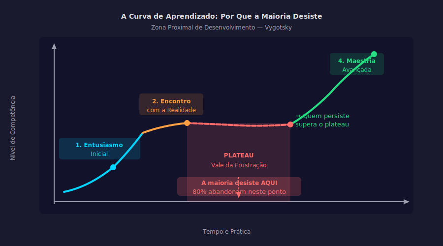

# Aula 36 — Frustração e Plateau

---

## Informações da Aula

| Campo | Detalhe |
|-------|---------|
| **Módulo** | 6 — Mentalidade e Psicologia do Aprendizado |
| **Aula** | 36 de 45 (03 de 06 no módulo) |
| **Duração estimada** | 20 minutos |
| **Nível** | Intermediário |
| **Formato** | Videoaula com slides |
| **Objetivos** | Compreender a curva natural do aprendizado de qualquer habilidade; reconhecer o plateau como pré-requisito para saltos de qualidade; usar a frustração como sinal de zona de crescimento; aplicar estratégias concretas para atravessar o plateau |

---

## Roteiro da Aula

| Parte | Tempo | Conteúdo |
|-------|-------|---------|
| Abertura | 2 min | O Vale da Desilusão e o momento em que 80% das pessoas desiste |
| Parte 1 | 4 min | As 4 etapas da curva de aprendizado de qualquer habilidade |
| Parte 2 | 4 min | Por que a frustração é sinal de crescimento, não de fracasso |
| Parte 3 | 4 min | 5 estratégias para atravessar o plateau |
| Parte 4 | 3 min | A história dos ultralearners: frustração é o caminho |
| Encerramento | 3 min | Exercício prático + próxima aula |

---

## Narração em Primeira Pessoa

### Abertura

Existe um momento no aprendizado de qualquer habilidade nova — programação, idioma estrangeiro, instrumento musical, gestão de projetos, qualquer coisa — em que você sente que parou de progredir.

Você estava avançando, avançando, e de repente... nada. Dias, às vezes semanas, com a sensação de estar no mesmo lugar. O que era emocionante ficou frustrante. O que parecia um caminho claro parece um labirinto sem saída.

E então a voz aparece: "Talvez eu não tenha jeito para isso. Talvez não seja para mim. Talvez eu devesse tentar outra coisa."

Se você já sentiu isso, você chegou ao que os pesquisadores de aprendizado chamam de **plateau** — e, mais dramaticamente, ao que o consultor de tecnologia Gartner batizou de "Vale da Desilusão" no famoso Ciclo Hype.

A notícia ruim: todo aprendiz vai passar por isso. É inevitável.

A notícia boa — e isso é o que vai mudar como você se relaciona com a frustração para sempre: você chega ao plateau exatamente quando está **prestes a dar um salto de qualidade**. A frustração não é sinal de fracasso. É sinal de que você está no limite do crescimento.

Vamos entender isso com precisão.

---

### Parte 1: As 4 Etapas da Curva de Aprendizado

Toda habilidade, sem exceção, passa por uma curva de aprendizado com quatro etapas. Quanto mais você entender essa curva, menos vai ser pego de surpresa quando a frustração aparecer.

**Etapa 1: Entusiasmo Inicial**

No começo de qualquer habilidade nova, há uma fase de entusiasmo e progresso rápido. Você aprende a tocar as primeiras notas no violão. Você faz as primeiras conversas básicas em inglês. Você escreve seu primeiro programa que realmente funciona.

O progresso é visível, rápido e satisfatório. O cérebro libera dopamina a cada pequena vitória. Essa é a fase mais fácil de sustentar — a motivação é externa (o progresso visível) e abundante.

**Etapa 2: Realidade**

O progresso começa a desacelerar. As coisas ficam mais difíceis. O que estava fluindo agora trava. Você percebe o tamanho real da distância entre onde está e onde quer chegar.

Essa é a fase de "aterrissagem" — quando a empolgação inicial cede lugar à avaliação mais realista do desafio. Muitas pessoas começam a desacelerar aqui.

**Etapa 3: Frustração e Plateau**

Aqui está o vale. O progresso parece ter parado completamente. Você pratica, estuda, se esforça — e não sente melhora. Às vezes parece que está piorando.

Essa é a fase de maior abandono em qualquer processo de aprendizado. Academias de ginástica sabem disso muito bem: a maioria das pessoas que se matricula em janeiro desistiu até março — exatamente quando chegam ao plateau de adaptação física.

**Etapa 4: Maestria**

Quem atravessa o plateau emerge numa qualidade diferente de desempenho. As conexões neurais que estavam sendo formadas durante o plateau consolidam-se. O que era difícil torna-se automático. E então um novo patamar de progresso começa — até o próximo plateau.

```
A CURVA DE APRENDIZADO
═══════════════════════

Desempenho
    │
    │                                      ╭──── Maestria
    │                              ╭───────╯
    │              ╭───────────────╯ ◄── Atravessa o plateau
    │      ╭───────╯
    │  ╭───╯ ◄── Entusiasmo inicial (progresso rápido)
    │──╯
    │      ┗━━━━━━━━━━┛
    │        PLATEAU ◄── 80% desiste aqui
    │          (Vale da Desilusão)
    └────────────────────────────────────────────── Tempo

  ● A maioria desiste no plateau
  ● O salto maior de qualidade vem DEPOIS do plateau
  ● Frustração = você está no limite de crescimento
```

---


*Figura: A Curva de Aprendizado — as 4 etapas e o Vale da Frustração onde 80% abandona antes do salto de qualidade (Vygotsky — Zona Proximal de Desenvolvimento)*

---

### Parte 2: Frustração Como Sinal de Crescimento

Aqui está o reframe mais importante desta aula — e talvez de todo o módulo.

Lev Vygotsky, psicólogo russo do início do século XX, desenvolveu o conceito de **Zona Proximal de Desenvolvimento**: a região entre o que você consegue fazer sozinho e o que consegue fazer com apoio adequado. É essa zona — desconfortável, desafiante, às vezes frustrante — onde o crescimento real acontece.

Quando você está frustrado num aprendizado, isso significa que você está na Zona Proximal de Desenvolvimento. Você está além do que já domina, mas ainda não chegou ao ponto de domínio do novo nível. Essa posição de "nem lá nem cá" é exatamente onde as novas conexões neurais estão sendo forjadas.

O neurocientista Andrew Huberman, da Stanford School of Medicine, descreve o mecanismo neural: quando o cérebro está em estado de confusão cognitiva — quando encontra algo que não consegue resolver facilmente com os padrões existentes — ele libera epinefrina (adrenalina) em pequenas quantidades. Essa liberação é o estado neural necessário para a neuroplasticidade. A epinefrina literalmente "abre" o cérebro para novas conexões.

A frustração não é o obstáculo ao crescimento. A frustração é o sinal de que o crescimento está acontecendo no nível neural.

O problema não é a frustração. O problema é a interpretação da frustração — especialmente para quem tem Fixed Mindset. Se você interpreta a frustração como "sinal de que não tenho jeito para isso", você vai sair da Zona Proximal de Desenvolvimento exatamente quando estava prestes a avançar.

Se você interpreta como "sinal de que estou no limite — vou usar estratégias para atravessar", você fica. E cresce.

---

### Parte 3: Estratégias para Atravessar o Plateau

Ok. Você está no plateau. A frustração está presente. O que fazer na prática?

**Estratégia 1: Mudar o tipo de prática**

Se você está fazendo a mesma coisa do mesmo jeito esperando resultados diferentes, vai continuar no plateau. O plateau frequentemente é sinal de que a estratégia de prática precisa mudar, não que você precisa de mais da mesma coisa.

Exemplos concretos:
- Se está relendo passivamente → mudar para retrieval practice (Aula 13 do nosso curso)
- Se está praticando a habilidade completa → mudar para prática deliberada de sub-habilidades específicas
- Se está estudando sozinho → buscar um grupo, tutor ou mentor

**Estratégia 2: Buscar Feedback Externo**

No plateau, a percepção subjetiva de progresso é pouco confiável. Você sente que não está avançando, mas pode estar avançando em aspectos que não consegue observar de dentro. Um professor, mentor, ou par experiente consegue ver o que você não vê.

**Estratégia 3: Decompor a Habilidade em Sub-Habilidades**

Scott Young, no *Ultralearning*, descreve como a prática de habilidades complexas em nível "completo" frequentemente esconde onde estão os gargalos. Decompor a habilidade em componentes e praticar o componente que está travado é muito mais eficiente do que praticar a habilidade completa repetidamente.

Exemplo: se você está travado no inglês conversacional, o gargalo pode estar especificamente no vocabulário de conectivos, não na gramática geral. Praticar conectivos especificamente é mais eficiente do que praticar "inglês" em geral.

**Estratégia 4: Reduzir Velocidade Antes de Aumentar**

Contraintuitivo, mas poderoso: quando você está travado num plateau, reduzir a velocidade de execução permite que o cérebro processe e corrigir padrões com mais precisão. É o que músicos fazem ao praticar — tocam o trecho difícil em câmera lenta até que se torne fluido, para depois aumentar a velocidade gradualmente.

**Estratégia 5: Descanso Estratégico**

Às vezes o plateau não é falta de prática — é excesso de prática sem recuperação. A consolidação de memórias acontece durante o descanso e o sono. Um descanso de 2-3 dias pode ser o que o cérebro precisa para consolidar o que foi aprendido e criar espaço para o próximo nível.

```
DIAGNÓSTICO DO PLATEAU
═══════════════════════

Sintoma                  │ Possível Causa         │ Solução
─────────────────────────┼────────────────────────┼────────────────────────
Pratico muito mas        │ Estratégia de prática  │ Mudar tipo de prática
não melhoro              │ ineficaz               │ (retrieval, deliberada)
─────────────────────────┼────────────────────────┼────────────────────────
Sinto que piorei         │ Consciência aumentou;  │ Buscar feedback externo
                         │ percebo mais erros     │ (professor, mentor)
─────────────────────────┼────────────────────────┼────────────────────────
Tudo parece difícil      │ Gargalo em sub-         │ Identificar e praticar
ao mesmo tempo           │ habilidade específica   │ o componente travado
─────────────────────────┼────────────────────────┼────────────────────────
Parece que               │ Saturação cognitiva;   │ Descanso de 2-3 dias
"não entra mais nada"    │ falta de consolidação  │ antes de retomar
```

---

### Parte 4: A História dos Ultralearners

Scott Young passou um ano aprendendo o currículo de 4 anos do MIT em Ciência da Computação — sozinho, sem ser aluno oficial, passando nos mesmos exames dos alunos regulares. Ele documentou cada semana desse processo.

O que mais me impressionou ao ler *Ultralearning* não foram as vitórias. Foram as descrições dos platôs. Young descreve semanas inteiras em que parecia ter parado de progredir. Períodos de frustração genuína. Momentos de dúvida sobre se a abordagem estava funcionando.

E então vinha o salto. Um insight repentino. Uma conexão que se formava. Um nível de compreensão que de repente tornava tudo mais claro.

Josh Waitzkin, campeão mundial de xadrez e depois de Tai Chi Chuan (um dos poucos que alcançou elite em duas disciplinas completamente diferentes), escreve em *The Art of Learning* sobre como o plateau é onde os melhores aprendizes se separam dos medianos: não porque sejam mais talentosos, mas porque são mais capazes de permanecer no desconforto do plateau sem desistir.

Todo aprendiz permanente — todo praticante de **Life Long Learning** que cresce ao longo de décadas — conhece o plateau intimamente. Não é um obstáculo que um dia vai desaparecer. É uma visita recorrente em cada nova habilidade, em cada novo nível de uma habilidade existente.

A diferença é que quem tem Growth Mindset e conhece a curva de aprendizado encontra no plateau um local familiar, não um inimigo. "Ah, chegamos aqui. Ótimo. Hora de ajustar a estratégia e continuar."

---

### Encerramento

Nessa aula você aprendeu as 4 etapas da curva de aprendizado, por que a frustração é o sinal de que você está na Zona Proximal de Desenvolvimento, e 5 estratégias concretas para atravessar o plateau.

O exercício é mapear onde você está na curva de aprendizado de uma habilidade atual e criar um plano de ação para o plateau.

Na próxima aula, vamos mergulhar na psicologia da motivação — especificamente por que a motivação intrínseca sustenta o aprendizado de longo prazo enquanto a extrínseca eventualmente falha.

---

## Exercício Prático

### Mapeamento na Curva de Aprendizado

**Objetivo**: Identificar onde você está na curva de aprendizado de uma habilidade atual e criar um plano de ação específico.

**Parte 1 — Escolha uma habilidade**:

Selecione uma habilidade que você está desenvolvendo atualmente (ou quer desenvolver). Deve ser algo real e concreto.

Habilidade escolhida: ___________________________

**Parte 2 — Identifique sua posição**:

Em qual etapa você está agora?

- [ ] **Entusiasmo inicial**: progresso rápido e visível, motivação alta
- [ ] **Realidade**: progresso desacelerou, percebo a distância real para o domínio
- [ ] **Plateau e Frustração**: parece que parei de progredir, tentação de desistir
- [ ] **Emergindo do plateau**: sinto que algo está desbloqueando, mesmo que ainda difícil

**Parte 3 — Diagnóstico do plateau** (se aplicável):

Se você está no plateau, responda:
- O que exatamente está travado? (seja específico)
- Há quanto tempo você está nesse nível?
- Qual estratégia de prática está usando atualmente?
- Quando foi a última vez que buscou feedback externo?

**Parte 4 — Plano de 3 ações**:

Com base no diagnóstico, defina 3 ações concretas para a próxima semana:

| Ação | O que vou fazer | Quando |
|------|----------------|--------|
| 1 | | |
| 2 | | |
| 3 | | |

**Compromisso**: Implementar o plano por 2 semanas e então reavaliar a posição na curva.

---

## Quiz de Retrieval

**1. O que é o "Vale da Desilusão" no contexto do aprendizado?**

a) Uma fase inicial de dificuldades antes do progresso começar
b) A fase de plateau onde o progresso parece ter parado e a maioria das pessoas desiste — exatamente antes do salto de qualidade
c) O período após atingir a maestria onde novas habilidades parecem irrelevantes
d) A sensação de que uma matéria é muito difícil no primeiro contato

**Gabarito**: b) — O plateau antes do salto de qualidade, onde a maioria desiste

---

**2. O que o neurocientista Andrew Huberman descreve como mecanismo neural da frustração no aprendizado?**

a) Frustração ativa o sistema de fuga, impedindo o aprendizado
b) Frustração libera cortisol que prejudica a memória de longo prazo
c) Confusão cognitiva libera epinefrina que "abre" o cérebro para neuroplasticidade — a frustração é o estado neural do crescimento
d) Frustração desativa o hipocampo temporariamente

**Gabarito**: c) — Confusão cognitiva → epinefrina → neuroplasticidade

---

**3. O que é a Zona Proximal de Desenvolvimento de Vygotsky e como se relaciona com o plateau?**

a) A zona de conteúdo já dominado onde o desempenho é mais fluente
b) O espaço entre o que você faz sozinho e o que faz com apoio — onde o crescimento real acontece; o plateau situa-se nessa zona
c) A distância entre iniciante e expert numa habilidade
d) O nível de desafio que cria flow, segundo Csikszentmihalyi

**Gabarito**: b) — Zona Proximal = espaço do crescimento real; plateau acontece exatamente nessa zona

---

**4. Por que reduzir a velocidade de prática pode ajudar a sair do plateau?**

a) Porque prática lenta consome menos energia cognitiva
b) Porque velocidade reduzida permite ao cérebro processar e corrigir padrões com mais precisão, como músicos fazendo trechos difíceis em câmera lenta
c) Porque é mais fácil manter o foco em velocidade lenta
d) Porque menos velocidade significa menos erros

**Gabarito**: b) — Velocidade reduzida = processamento mais preciso de padrões e erros

---

**5. O que separa quem atravessa o plateau de quem desiste, segundo Josh Waitzkin em "The Art of Learning"?**

a) Nível de talento inato superior
b) Acesso a professores melhores
c) Capacidade de permanecer no desconforto do plateau sem desistir — não é talento, é tolerância ao desconforto e uso de estratégias
d) Horas totais de prática

**Gabarito**: c) — Permanecer no desconforto do plateau sem desistir é o diferencial, não o talento

---

## Leitura Recomendada

- **Young, Scott**. *Ultralearning: Aprenda Habilidades Radicais e Mude Sua Carreira*. Alta Books, 2019. (Cap. 8: Retenção)
- **Waitzkin, Josh**. *The Art of Learning*. Free Press, 2007.
- **Ericsson, Anders; Pool, Robert**. *Peak: Secrets from the New Science of Expertise*. Mariner Books, 2016.

---

*Aula 36 | Módulo 06 | Curso Aprender a Aprender | Educa com Talento*
