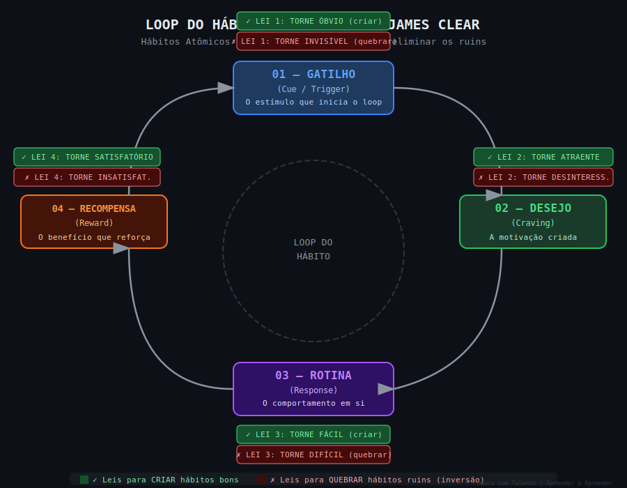

# Aula 40 — Hábitos Atômicos

---

## Informações da Aula

| Campo | Detalhe |
|-------|---------|
| **Módulo** | 7 — Hábitos e Sistemas de Aprendizado |
| **Aula** | 40 de 45 (01 de 06 no módulo) |
| **Duração estimada** | 20 minutos |
| **Nível** | Iniciante a Intermediário |
| **Formato** | Videoaula com slides |
| **Objetivos** | Compreender o Loop do Hábito segundo James Clear; aplicar as 4 Leis para criar hábitos de estudo; aplicar as 4 Leis inversas para eliminar hábitos que sabotam o aprendizado; entender o poder do 1% de melhoria |

---

## Roteiro da Aula

| Parte | Tempo | Conteúdo |
|-------|-------|---------|
| Abertura | 2 min | James Clear e a obra que vendeu mais de 15 milhões de cópias |
| Parte 1 | 4 min | O Loop do Hábito: Gatilho → Desejo → Rotina → Recompensa |
| Parte 2 | 4 min | As 4 Leis para criar hábitos bons e quebrá-los ruins |
| Parte 3 | 4 min | O poder do 1% ao dia e o compound effect |
| Parte 4 | 3 min | Aplicando ao estudo: hábitos de onde, quando e como |
| Encerramento | 3 min | Exercício prático + próxima aula |

---

## Narração em Primeira Pessoa

### Abertura

Em 2018, James Clear publicou um livro que eu recomendo para praticamente todo mundo que quero ver crescendo. Não é exagero dizer que *Hábitos Atômicos* é um dos livros mais práticos já escritos sobre mudança de comportamento. Vendeu mais de 15 milhões de cópias em mais de 50 idiomas — e se você me perguntar por que tantas pessoas o leram, a resposta é simples: funciona.

Clear não inventou a ciência dos hábitos. Ele sintetizou décadas de pesquisa em psicologia comportamental, neurociência e ciência cognitiva num framework elegante e aplicável que qualquer pessoa consegue usar no dia a dia.

E o título é proposital: *hábitos atômicos* porque são pequenos como átomos — quase invisíveis individualmente — mas que, combinados, têm o poder de uma reação em cadeia.

Hoje vamos entender esse framework e aplicá-lo diretamente ao estudo.

---

### Parte 1: O Loop do Hábito

A base do framework de Clear é o que ele chama de Loop do Hábito. Na verdade, ele está construindo sobre pesquisas anteriores — especialmente o trabalho de Charles Duhigg em *O Poder do Hábito* —, mas adiciona precisão e aplicabilidade.

O loop tem quatro componentes:

**Gatilho (Cue)**
O gatilho é o estímulo que inicia o comportamento. Pode ser externo (horário, lugar, evento, pessoa, objeto) ou interno (estado emocional, pensamento). O gatilho é o "start" do loop.

**Desejo (Craving)**
O desejo é a motivação, o impulso que o gatilho cria. É a antecipação da recompensa que virá após o comportamento. Importante: não é o hábito em si que você deseja, é o estado que o hábito produz.

**Rotina (Response)**
A rotina é o comportamento em si — a ação que você executa em resposta ao gatilho e ao desejo. É aqui que o "hábito" na sua forma visível existe.

**Recompensa (Reward)**
A recompensa é o benefício que a rotina entrega — o estado que satisfaz o desejo inicial. A recompensa também ensina ao cérebro se vale a pena repetir aquele loop no futuro.

---


*Figura: O Loop do Hábito (Gatilho → Desejo → Rotina → Recompensa) e as 4 Leis para criar bons hábitos — James Clear, Hábitos Atômicos*

---

O cérebro aprende esses loops automaticamente. Com repetição suficiente, o loop vai se tornando progressivamente mais automático — exigindo menos energia cognitiva, menos tomada de decisão consciente.

E essa é a chave: **hábitos são loops automáticos**. O objetivo é criar loops automáticos benéficos e eliminar loops automáticos prejudiciais.

---

### Parte 2: As 4 Leis para Criar Hábitos Bons

Clear propõe quatro leis, cada uma correspondendo a um elemento do Loop do Hábito:

**Lei 1: Torne Óbvio (Gatilho)**

O hábito só funciona se o gatilho é perceptível. Para criar um novo hábito, torne o gatilho visível e frequente.

Aplicações ao estudo:
- Deixe o livro aberto na mesa antes de dormir, para estar visível pela manhã
- Coloque o app de flashcards na tela inicial do celular
- Use o método de intenção de implementação: "Quando [SITUAÇÃO], farei [COMPORTAMENTO]" — ex: "Quando ligar o computador de manhã, farei 15 min de Anki antes de abrir o e-mail"

**Lei 2: Torne Atraente (Desejo)**

Quanto mais atraente o comportamento parece, mais forte o desejo que o gatilho cria. Para tornar o estudo mais atraente:

- Ligue o estudo a algo que você genuinamente gosta — seu café favorito, seus fones de ouvido, um ritual prazeroso
- Use bundling de tentações: faça algo que você gosta JUNTO com o estudo. "Só ouço esse podcast durante a caminhada de revisão mental"
- Encontre comunidade de aprendizado — estudar com/para pessoas aumenta o apelo social do comportamento

**Lei 3: Torne Fácil (Rotina)**

Quanto menos atrito existe para executar o comportamento, mais provável que ele ocorra. Para facilitar o estudo:

- Reduza o número de passos entre você e o estudo (material já aberto, ambiente já configurado)
- Use a Regra dos 2 Minutos (aula 43) para eliminar a resistência inicial
- Automatize o que puder — horário fixo elimina a decisão de "quando vou estudar hoje?"

**Lei 4: Torne Satisfatório (Recompensa)**

O loop só se fortalece se a recompensa é sentida. O problema do estudo: muitos benefícios são retardados (passar na prova é meses depois), mas o loop de hábito funciona melhor com recompensas imediatas.

Soluções:
- Crie recompensas imediatas simbólicas: marcar um X no calendário, registrar o estudo num app de streak, uma pequena celebração ao final da sessão
- Use o tracker de hábitos — ver a corrente crescer é satisfatório por si só
- Peça feedback imediato sobre o aprendizado (exercícios com gabarito, revisão Anki, autoexplicação)

**As 4 Leis Inversas — Para Quebrar Hábitos Ruins**:

```
LEIS PARA CRIAR            LEIS INVERSAS (PARA QUEBRAR)
════════════════           ══════════════════════════════
1. Torne Óbvio         →   1. Torne Invisível
   (Gatilho visível)          (Remova o gatilho do campo)

2. Torne Atraente      →   2. Torne Desinteressante
   (Aumente o desejo)         (Reduza o apelo)

3. Torne Fácil         →   3. Torne Difícil
   (Reduza atrito)            (Aumente o atrito)

4. Torne Satisfatório  →   4. Torne Insatisfatório
   (Recompensa imediata)      (Torne custoso)
```

---

### Parte 3: O Poder do 1% ao Dia

Aqui está um dos conceitos matemáticos mais poderosos de todo o livro de Clear:

Se você melhora 1% todo dia durante um ano, você se torna 37,78 vezes melhor ao final do ano.
(1,01)^365 = 37,78

Se você piora 1% todo dia durante um ano, você fica quase zerado.
(0,99)^365 = 0,03

```
O PODER DO COMPOUND EFFECT NO APRENDIZADO
═══════════════════════════════════════════

         37,78x
           │
           │                              ╭───
           │                         ╭───╯
           │                    ╭────╯
           │               ╭────╯
           │          ╭────╯   ▲ +1% ao dia
     1,00x ├──────────╯        (365 dias)
           │
           │ ▼ -1% ao dia
     0,03x └─────────────────────────────────
           Início               1 ano depois

  ● Melhoria de 1% ao dia = 37x melhor em 1 ano
  ● Piora de 1% ao dia = quase zero em 1 ano
  ● A diferença é invisível no curto prazo, esmagadora no longo
```

O que isso significa para o aprendizado?

Significa que a consistência importa infinitamente mais do que a intensidade no longo prazo. Vinte minutos de estudo todo dia supera, de forma esmagadora no longo prazo, estudar 3 horas uma vez por semana.

Mas — e isso é crítico — a diferença é invisível nos primeiros dias e semanas. Nos primeiros 30 dias de melhoria de 1%, você está em 1,35x. Modesto. Não impressionante. É quando a maioria das pessoas desiste por não ver resultado "suficiente".

A mágica acontece nos meses 6, 9, 12. Quando o compound effect começa a mostrar seu poder de forma inegável.

---

### Parte 4: Hábitos de Estudo — Onde, Quando e Como

Aplicando as 4 Leis ao design de hábitos de estudo específicos:

**Onde**:
- Escolha um local específico (ambiente de gatilho — aula 33)
- Garanta que esse local está associado apenas ao estudo (Lei 1: Torne Óbvio)
- Configure o ambiente para reduzir atrito (Lei 3: Torne Fácil)

**Quando**:
- Escolha um horário específico e consistente (mesma hora todos os dias = Lei 1)
- Prefira o horário de pico de energia para o estudo mais exigente
- Use habit stacking (aula 42) para ancorar no horário a um evento existente

**Como**:
- Protocolo claro e pré-definido (o que faz no primeiro minuto da sessão)
- Duração fixada antes de começar (25 min Pomodoro, 45 min Deep Work, etc.)
- Registro de conclusão (lei 4: torne satisfatório — o X no calendário)

```
HÁBITO DE ESTUDO BEM DESENHADO
════════════════════════════════

GATILHO: Despertador às 6h30 (ou café na mão, ou computador ligado)
       ↓
DESEJO: Antecipação do progresso e da recompensa (X no calendário)
       ↓
ROTINA: 25 min de revisão Anki + 25 min de leitura ativa
       ↓
RECOMPENSA: Marcar X no tracker + café/lanche preferido

ATRITO REDUZIDO: Material já aberto na véspera, celular em modo avião
GATILHO ÓBVIO: Timer visível na mesa, caderno aberto
SATISFAÇÃO: Streak no app de hábitos, X no calendário físico
```

---

### Encerramento

Nessa aula você aprendeu o Loop do Hábito — Gatilho, Desejo, Rotina, Recompensa —, as 4 Leis para criar hábitos bons e quebrá-los ruins, e a matemática poderosa do 1% de melhoria diária.

O exercício é aplicar as 4 Leis para criar 1 hábito de estudo específico que está faltando na sua vida agora.

Na próxima aula, vamos aprofundar a distinção que torna tudo isso sustentável: por que sistemas superam metas — e como transformar seus objetivos de aprendizado em sistemas concretos.

---

## Exercício Prático

### Criando 1 Hábito de Estudo com as 4 Leis

**Objetivo**: Aplicar o framework das 4 Leis de Clear para criar um hábito de estudo específico e bem-projetado.

**Parte 1 — Identifique o hábito**:

Qual hábito de estudo você mais precisa criar? (seja específico)
Exemplo: "Revisar flashcards no Anki por 15 minutos todos os dias"

Hábito escolhido: ___________________________

**Parte 2 — Aplique as 4 Leis**:

| Lei | Pergunta | Minha implementação |
|-----|----------|-------------------|
| **1. Torne Óbvio** | Qual gatilho vou usar? Onde/quando o hábito acontece? | |
| **2. Torne Atraente** | Como vou tornar esse hábito mais atraente? O que posso fazer junto que gosto? | |
| **3. Torne Fácil** | O que posso preparar de antemão para reduzir o atrito? | |
| **4. Torne Satisfatório** | Qual recompensa imediata vou criar? Como vou registrar? | |

**Parte 3 — Anti-hábito**:

Existe um hábito ruim que está bloqueando o bom? (ex: checar o celular logo ao acordar, quando deveria estudar)

Aplique as 4 Leis Inversas:
- Torne Invisível: _______________
- Torne Desinteressante: _______________
- Torne Difícil: _______________
- Torne Insatisfatório: _______________

**Parte 4 — Implementação**:

Praticarei esse hábito por 21 dias consecutivos e registrarei diariamente. Meta: nunca quebrar a corrente mais de 1 vez seguida.

---

## Quiz de Retrieval

**1. Quais são os 4 elementos do Loop do Hábito segundo James Clear?**

a) Gatilho → Ação → Resultado → Repetição
b) Gatilho (Cue) → Desejo (Craving) → Rotina (Response) → Recompensa (Reward)
c) Intenção → Planejamento → Execução → Avaliação
d) Estímulo → Resposta → Reforço → Extinção

**Gabarito**: b) — Gatilho → Desejo → Rotina → Recompensa (Framework de Clear)

---

**2. Quanto você fica melhor se melhorar 1% todo dia por 365 dias?**

a) 3,65 vezes melhor (365 × 1%)
b) 10 vezes melhor
c) 37,78 vezes melhor (1,01^365 = 37,78)
d) 100 vezes melhor

**Gabarito**: c) — (1,01)^365 = 37,78 — o compound effect exponencial

---

**3. A Lei 3 de Clear ("Torne Fácil") tem como objetivo principal:**

a) Simplificar o conteúdo do que vai ser estudado
b) Reduzir o atrito entre você e o comportamento desejado, aumentando a probabilidade de execução
c) Encontrar versões mais simples do hábito para iniciantes
d) Eliminar completamente a dificuldade do processo de aprendizado

**Gabarito**: b) — Reduzir atrito = aumentar probabilidade de execução do comportamento

---

**4. Por que o problema da recompensa imediata é desafiante para hábitos de estudo?**

a) Estudantes não gostam de recompensas
b) Muitos benefícios do estudo são retardados (aprovação, domínio, carreira) — enquanto o loop de hábito é mais eficaz com recompensas imediatas; exige criar recompensas simbólicas imediatas
c) A Lei 4 não é aplicável ao contexto educacional
d) Recompensas imediatas criam motivação extrínseca que prejudica o aprendizado

**Gabarito**: b) — Benefícios do estudo são retardados; precisam ser complementados com recompensas imediatas simbólicas (X no calendário, streak, etc.)

---

**5. A Lei Inversa de "Torne Óbvio" é "Torne Invisível". Qual é um exemplo prático para quebrar o hábito de checar o celular durante o estudo?**

a) Colocar o celular em silencioso
b) Desativar as notificações específicas que mais distraem
c) Remover o celular completamente do campo visual — colocá-lo em outro cômodo, eliminando o gatilho visual que inicia o loop de verificação
d) Usar modo noturno para tornar a tela menos atraente

**Gabarito**: c) — Torne invisível = remova o gatilho do campo. Celular em outro cômodo elimina o estímulo que inicia o loop

---

## Leitura Recomendada

- **Clear, James**. *Hábitos Atômicos: Como Construir Bons Hábitos e Eliminar os Maus*. Alta Books, 2019. (Cap. 1-7)
- **Fogg, BJ**. *Tiny Habits: The Small Changes That Change Everything*. Houghton Mifflin Harcourt, 2019.
- **Duhigg, Charles**. *O Poder do Hábito: Por que fazemos o que fazemos na vida e nos negócios*. Objetiva, 2012.

---

*Aula 40 | Módulo 07 | Curso Aprender a Aprender | Educa com Talento*
