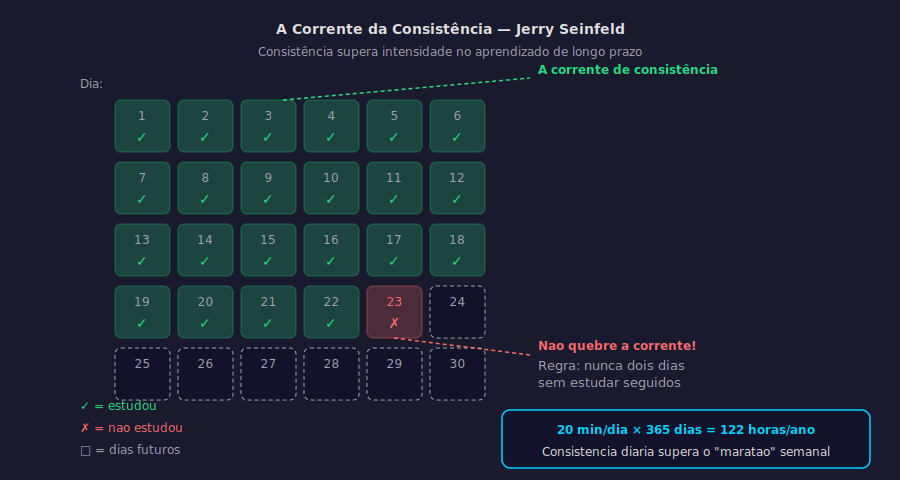

# Aula 44 — Consistência vs. Intensidade

---

## Informações da Aula

| Campo | Detalhe |
|-------|---------|
| **Módulo** | 7 — Hábitos e Sistemas de Aprendizado |
| **Aula** | 44 de 45 (05 de 06 no módulo) |
| **Duração estimada** | 20 minutos |
| **Nível** | Iniciante a Intermediário |
| **Formato** | Videoaula com slides |
| **Objetivos** | Compreender por que consistência supera intensidade no aprendizado de longo prazo; entender a curva de retenção e a importância de exposições frequentes; aplicar a regra "não quebre a corrente" como mecanismo de consistência; criar um sistema de rastreamento visual de consistência |

---

## Roteiro da Aula

| Parte | Tempo | Conteúdo |
|-------|-------|---------|
| Abertura | 2 min | O maior mito dos estudantes: o "maratão" de fim de semana |
| Parte 1 | 4 min | A matemática da consistência: dados sobre retenção e frequência |
| Parte 2 | 4 min | Prof. Piazzi e a visão brasileira sobre estudo diário |
| Parte 3 | 4 min | "Don't break the chain" — a regra de Seinfeld |
| Parte 4 | 3 min | Consistência quando não há motivação: sistemas, identidade e ambiente |
| Encerramento | 3 min | Exercício prático + próxima aula |

---

## Narração em Primeira Pessoa

### Abertura

Existe um padrão de comportamento que eu vejo repetidamente entre estudantes que estão lutando para progredir. Não é falta de inteligência. Não é falta de material. É a ilusão de que estudar muito de uma vez compensa não estudar por dias ou semanas.

"Vou compensar no fim de semana."
"Tem um feriado na semana que vem — vou estudar 8 horas num dia."
"Durante a semana não dá, mas no sábado eu pego tudo de volta."

Isso é o que eu chamo do mito do "maratão de estudo". E a pesquisa em ciências cognitivas é absolutamente clara sobre isso: **o maratão não funciona para aprendizado de longo prazo**.

Não é opinião. São dados.

Hoje vamos entender por que a consistência — mesmo que em volumes menores diariamente — supera de forma esmagadora a intensidade episódica. E vamos criar sistemas práticos que tornam a consistência o caminho de menor resistência.

---

### Parte 1: A Matemática da Consistência

Para entender por que consistência vence, precisamos voltar à curva do esquecimento de Ebbinghaus — que vimos nos módulos anteriores — e adicionar uma perspectiva de frequência de exposição.

Hermann Ebbinghaus demonstrou que, sem revisão, esquecemos aproximadamente:
- 40% do que aprendemos em 20 minutos
- 56% após 1 hora
- 66% após 1 dia
- 75% após 6 dias
- 79% após 1 mês

Mas o ponto crucial que Ebbinghaus também descobriu: cada revisão **reseta a curva** e suaviza a inclinação. Depois da primeira revisão, você esquece mais devagar. Depois da segunda, mais devagar ainda.

Isso significa que a frequência de revisão importa mais do que o volume em cada sessão.

Vamos fazer o cálculo concreto:

**Cenário A — Intensidade sem consistência**:
Estudo 3 horas na sexta-feira. Não estudo mais durante a semana.
Retenção ao longo da semana: alta na sexta, desaba rapidamente.
Na próxima sexta, boa parte foi esquecida e precisa ser "reaprendida".

**Cenário B — Consistência sem intensidade**:
Estudo 25 minutos todos os dias.
Total semanal: 175 minutos (~3 horas) — similar ao Cenário A.
Mas: cada dia, o conteúdo é revisado enquanto ainda está relativamente fresco.
Retenção muito maior ao longo da semana.

```
CONSISTÊNCIA vs. INTENSIDADE — COMPARAÇÃO
═══════════════════════════════════════════

CENÁRIO A: 3h sexta-feira
Retenção:  Sex ██████████ 100%
           Sáb ████████░░  82%
           Dom ███████░░░  65%
           Seg ██████░░░░  55%
           Ter █████░░░░░  45%
           Qua ████░░░░░░  38%
           Qui ████░░░░░░  35%
           Sex ███░░░░░░░  30% ← começa do 30%

CENÁRIO B: 25 min/dia (7 dias)
           Sex ██████████ 100% (+25 min estudo)
           Sáb ████████░░  85% (+25 min revisão)
           Dom ███████░░░  78% (+25 min revisão)
           Seg ████████░░  85% (+25 min revisão)
           ...
           Sex ████████░░  80% ← começa do 80%

TOTAL SEMANAL: similar — mas RETENÇÃO é 2-3x maior no B
```

O estudo de 25 minutos por dia não apenas produz mais retenção — ele produz mais retenção com o **mesmo volume total de tempo**.

---

### Parte 2: Prof. Piazzi e a Visão do Estudo Diário

Pierluigi Piazzi — neurocientista e professor brasileiro, autor dos livros "Aprendendo Inteligência" —, chegou à mesma conclusão pela via da neurociência clínica e da observação de alunos ao longo de décadas.

A frase que mais uso do Prof. Pier é esta:

*"Estudar todo dia, mesmo que pouco, é melhor do que estudar muito de vez em quando."*

Pier argumenta que o cérebro precisa de exposição **regular e frequente** para criar memórias de longo prazo robustas. A memória não é como uma gaveta onde você joga informação e ela fica lá. É como um músculo que responde à frequência do uso, não apenas à intensidade de uma sessão única.

Ele também descreve o que chama de "custo de retomada": quando você não estuda por vários dias e retoma, o cérebro precisa de um tempo considerável para "reaquerer" o nível de ativação que havia antes. Esse tempo de retomada é puro desperdício — você está reconstruindo acesso a algo que poderia ter mantido com exposições regulares.

Outro ponto poderoso de Piazzi: o estudo diário, mesmo que de 20-30 minutos, mantém o tema "ativo" no background do processamento cognitivo. O cérebro continua processando informações mesmo quando você não está conscientemente pensando nelas — especialmente durante o sono. A exposição frequente alimenta esse processamento de background de forma que a exposição esporádica não consegue.

---

### Parte 3: "Don't Break the Chain" — A Regra de Seinfeld

Jerry Seinfeld é considerado por muitos o maior comediante de stand-up de todos os tempos. Quando foi perguntado como ele havia desenvolvido um repertório tão vasto e consistentemente bom ao longo de décadas, sua resposta foi surpreendentemente simples.

Ele disse que para se tornar um comediante melhor, você precisa escrever piadas melhores. E para escrever piadas melhores, você precisa escrever piadas todos os dias. Então ele comprou um calendário grande e, cada dia que escrevia piadas, colocava um grande X vermelho naquele dia.

"Depois de alguns dias, você tem uma corrente. Você só continua e a corrente vai ficar mais longa a cada dia. Você vai gostar de ver essa corrente, especialmente quando você tem algumas semanas para trás. Seu único trabalho é não quebrar a corrente."

**Não quebre a corrente.**

```
CALENDÁRIO DE CONSISTÊNCIA
═══════════════════════════

Jan: X X X X X X X X X X X X X X X X X _ X X X X X X X X X X X X X
                                         ↑
                                   não quebre aqui

  X = dia estudou (mesmo que 2 minutos)
  _ = dia não estudou (o único objetivo é minimizar esses)

  NUNCA dois _ seguidos (a regra dos 2 minutos garante isso)
```

---


*Figura: A Corrente da Consistência — calendário de 30 dias mostrando o impacto de quebrar a corrente e a matemática do estudo diário (20 min/dia × 365 = 122 horas/ano) — Jerry Seinfeld*

---

Esse sistema funciona porque usa o progresso visível como recompensa (Lei 4 de Clear — Torne Satisfatório). A corrente crescendo é satisfatória por si só. E a perspectiva de quebrar uma corrente longa é suficientemente desagradável para motivar o comportamento mesmo em dias difíceis.

Ferramentas para "Don't Break the Chain":
- Calendário físico na parede (recomendação para início — a visualização física é poderosa)
- App Streaks (iOS/Android)
- App Habitify
- App Productive
- Planilha simples (Google Sheets) com condicional colorido

---

### Parte 4: Consistência Quando Não Há Motivação

Aqui está o ponto mais importante desta aula — e, honestamente, de muitas aulas do nosso curso:

A consistência real não é construída em dias de alta motivação. É construída em dias de baixa motivação.

Qualquer um consegue estudar quando está animado, descansado, sem pressão e com vontade. O diferencial do aprendiz de alto desempenho — e do **Life Long Learner** de verdade — é o que ele faz quando não está com vontade nenhuma.

E esse "o que ele faz" não é força de vontade heroica. É sistema, identidade e ambiente.

**Sistema**: A Regra dos 2 Minutos garante que sempre há uma versão mínima executável. Mesmo no pior dia, "abrir o caderno" é possível.

**Identidade**: "Sou o tipo de pessoa que aprende algo todo dia" — quando isso é identidade, não meta, você estuda porque é o que você é, não porque você quer.

**Ambiente**: O material na mesa, o app na tela inicial, o ambiente preparado — tudo isso reduz o atrito ao ponto em que a inércia do repouso é superada com facilidade.

Esses três pilares — que percorremos ao longo de todo este módulo — são o que torna a consistência possível independentemente da motivação do momento.

E isso é o que distingue quem aprende por anos dos que aprendem por semanas.

---

### Encerramento

Nessa aula você viu, com dados concretos, por que a consistência supera a intensidade no aprendizado de longo prazo — através da curva de retenção de Ebbinghaus, da perspectiva do Prof. Piazzi, e da regra "Don't Break the Chain" de Seinfeld.

O exercício é criar um calendário visual de 30 dias e marcar cada dia em que estudar — mesmo que por apenas 20 minutos.

Na próxima e última aula do módulo — e do bloco de hábitos e sistemas —, vamos aprender o protocolo completo de revisão semanal: como fechar o loop, avaliar o progresso e ajustar o sistema continuamente.

---

## Exercício Prático

### 30 Dias de Consistência Visível

**Objetivo**: Criar um sistema visual de rastreamento de consistência e construir uma corrente de 30 dias de estudo.

**Instruções**:

**Parte 1 — Criar o calendário** (5 min):

Imprima ou desenhe um calendário de 30 dias. Cole em um lugar visível (parede do quarto, geladeira, mesa de estudo).

Defina o mínimo diário:
- Mínimo absoluto: 20 minutos de qualquer aprendizado
- Meta ideal: _______ minutos ou _______ sessão completa

**Parte 2 — Regras do calendário**:
- X verde = estudou (mesmo que só os 20 minutos mínimos)
- X vermelho = não estudou (tente nunca ter dois seguidos)
- Objetivo: maior corrente possível em 30 dias

**Parte 3 — Registro ao final dos 30 dias**:

| Métrica | Resultado |
|---------|-----------|
| Maior corrente consecutiva | ___ dias |
| Total de dias com X | ___ dias |
| % de consistência (X/30) | ___% |
| Dias com estudo mínimo (20 min) | ___ |
| Dias com estudo completo | ___ |

**Parte 4 — Análise**:
- Que dias da semana foram mais difíceis de manter?
- Que situações causaram quebra da corrente?
- Como o sistema pode ser ajustado para os próximos 30 dias?

**Extensão**: Após os 30 dias, avalie a diferença na retenção do conteúdo estudado de forma consistente vs. o que você costumava estudar de forma episódica.

---

## Quiz de Retrieval

**1. Por que estudar 25 min por dia produz mais retenção do que 3 horas uma vez por semana, com volume semanal similar?**

a) Porque sessões curtas ativam mais neurônios
b) Porque a frequência diária mantém o conteúdo na curva de retenção antes de cair abaixo do nível de consolidação — cada sessão reseta a curva e suaviza o esquecimento
c) Porque o cérebro não consegue processar mais de 45 minutos de conteúdo novo por vez
d) Porque o exercício de memória é mais eficiente em volumes menores

**Gabarito**: b) — Frequência reseta a curva do esquecimento; retenção diária acumulada > retenção semanal em bloco

---

**2. O que é o "custo de retomada" descrito pelo Prof. Piazzi?**

a) O custo financeiro de materiais de estudo
b) O tempo necessário para o cérebro "reaquerer" o nível de ativação anterior após dias sem estudar — tempo puro de reconstrução de acesso, não de aprendizado novo
c) O esforço extra exigido para lembrar o conteúdo de uma prova antiga
d) O custo cognitivo de mudar de um tema para outro

**Gabarito**: b) — Custo de retomada = tempo gasto reconstruindo acesso ao que poderia ter sido mantido com frequência

---

**3. Qual é a origem da regra "Don't Break the Chain"?**

a) James Clear a desenvolveu como parte do framework de Hábitos Atômicos
b) É uma regra da neurociência soviética adaptada por Ebbinghaus
c) Jerry Seinfeld a descreveu como sua estratégia de desenvolvimento de repertório: marcar um X no calendário todo dia que escrevia piadas, e não quebrar a corrente
d) É uma variação do método Pomodoro adaptada para criadores de conteúdo

**Gabarito**: c) — Seinfeld: calendário + X diário + "não quebre a corrente"

---

**4. Por que a corrente visual de Xs no calendário funciona como motivador?**

a) Porque cria pressão social quando outras pessoas veem o calendário
b) Porque ativa a Lei 4 de Clear (Torne Satisfatório) — o progresso visual é recompensador, e a perspectiva de quebrar uma corrente longa é suficientemente desagradável para motivar o comportamento mesmo em dias difíceis
c) Porque o ato de marcar um X libera dopamina diretamente
d) Porque o calendário físico é mais eficaz que apps digitais para rastreamento

**Gabarito**: b) — Corrente visual = recompensa imediata por progresso + custo de quebra

---

**5. Segundo a aula, o que realmente constrói consistência nos dias de baixa motivação?**

a) Força de vontade e disciplina heroica
b) Ter um professor ou mentor que cobre presença
c) Sistema (Regra dos 2 Minutos), Identidade (aprendiz permanente como autodefinição) e Ambiente (que torna o aprendizado o caminho de menor resistência) — não motivação
d) Recompensas externas suficientemente atrativas

**Gabarito**: c) — Sistema + Identidade + Ambiente = consistência independente de motivação

---

## Leitura Recomendada

- **Piazzi, Pierluigi**. *Aprendendo Inteligência*. Aleph, 2007.
- **Piazzi, Pierluigi**. *Ensinando Inteligência*. Aleph, 2008.
- **Clear, James**. *Hábitos Atômicos*. Alta Books, 2019. (Cap. 16: Como Manter Bons Hábitos Todos os Dias)
- **Ebbinghaus, Hermann**. *Memory: A Contribution to Experimental Psychology*. Teachers College, 1913.

---

*Aula 44 | Módulo 07 | Curso Aprender a Aprender | Educa com Talento*
