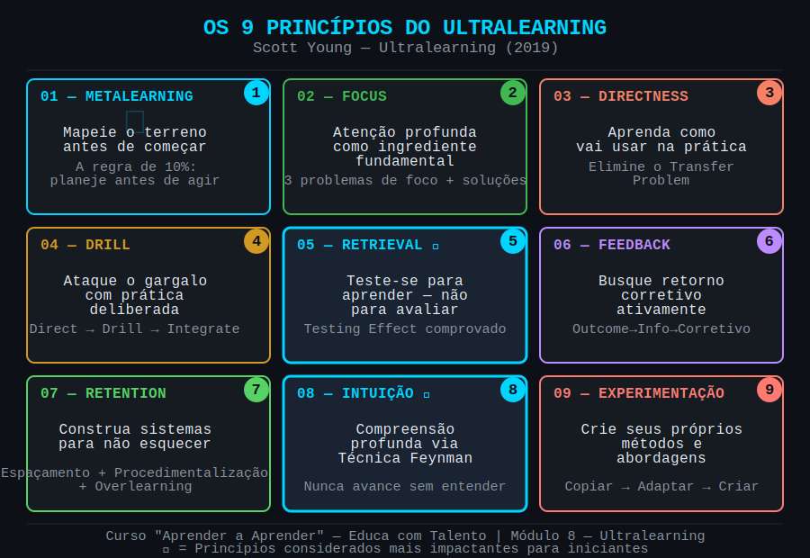

# Aula 46 — Conceito de Ultralearning: Aprendizado Agressivo e Autodirigido

---

## Informações da Aula

| Campo | Detalhe |
|-------|---------|
| **Módulo** | 8 — Ultralearning: Aprendizado Acelerado em Projetos |
| **Aula** | 46 (1 de 8 do módulo) |
| **Duração estimada** | 20 minutos |
| **Nível** | Avançado |
| **Formato** | Videoaula com slides |
| **Objetivos** | Compreender o que é Ultralearning e como difere do aprendizado convencional; conhecer os 9 princípios em visão geral; identificar quando usar Ultralearning na vida e carreira; iniciar o esboço de um projeto pessoal de Ultralearning |

---

## Roteiro da Aula

| Parte | Tempo | Conteúdo |
|-------|-------|---------|
| Abertura | 2 min | A história do MIT Challenge — o dia em que tudo mudou |
| Parte 1 | 4 min | Quem é Scott Young e o que é Ultralearning |
| Parte 2 | 4 min | Ultralearning vs. aprendizado convencional |
| Parte 3 | 5 min | Os 9 princípios — visão geral e casos históricos |
| Parte 4 | 2 min | Quando usar Ultralearning + conexão com LLL |
| Encerramento | 3 min | Exercício prático + próxima aula |

---

## Narração em Primeira Pessoa

### Abertura

Setembro de 2011. Um jovem canadense de 23 anos chamado **Scott Young** publica no seu blog um anúncio que a maioria das pessoas na época considerou simplesmente impossível.

Ele iria completar o currículo inteiro de 4 anos do **MIT em Ciências da Computação** em apenas **12 meses**. Usando apenas os materiais gratuitos disponíveis no site do MIT — gravações de aulas, listas de exercícios, projetos. Sem matrícula. Sem professor. Sem diploma no final. Só o aprendizado.

A maioria das pessoas ao redor dele disse que era loucura. "Você não vai aprender nada de verdade." "Isso é impossível." "4 anos de MIT em 12 meses — sério?"

Doze meses depois, Scott Young havia completado os 33 cursos do currículo oficial do MIT. Com aprovação nos testes. Com projetos funcionando. Com portfólio construído. Em 1/4 do tempo e com uma fração ínfima do custo.

E isso não foi um fluke, uma sorte, uma aberração genética. Foi o resultado de um **sistema**. Um método. Uma abordagem completamente diferente de aprender.

Scott chamou esse método de **Ultralearning**.

E nos próximos minutos, eu vou te apresentar o que é, como funciona, e — mais importante — como você pode usar isso na sua própria vida para dominar habilidades que pareciam impossíveis.

Isso é o que chamamos de **Life Long Learning (LLL)** na prática mais intensa possível: não apenas aprender continuamente, mas saber quando turbinar esse aprendizado com projetos de alta voltagem.

---

### Parte 1: Quem é Scott Young e o que é Ultralearning

**Scott Young** nasceu em 1988 no Canadá. Não é um gênio. Não é produto de uma família acadêmica especial. Ele é um blogueiro, escritor e pesquisador do aprendizado — alguém que ficou obcecado com uma pergunta simples: **"Como se aprende da forma mais eficaz possível?"**

Depois do MIT Challenge, ele não parou. Fez mais experimentos radicais:
- Aprendeu 4 idiomas em 1 ano viajando por países sem falar inglês
- Aprendeu a desenhar em 30 dias com intensidade máxima
- Estudou cada um dos 9 princípios que descobriu durante anos de prática e pesquisa

Em 2019, ele lançou o livro **"Ultralearning: Master Hard Skills, Outsmart the Competition, and Accelerate Your Career"** — um dos livros mais importantes sobre aprendizado da última década.

A definição oficial dele é essa:

> *"Ultralearning é uma estratégia de aprendizado agressivo, autodirigido, que permite dominar habilidades difíceis e adquirir conhecimento valioso de forma mais rápida do que você imaginaria possível."*

Quero destacar três palavras dessa definição:

**Agressivo** — não no sentido de violento, mas no sentido de intencional ao extremo. Sem half-measures. Sem "vou estudar quando der."

**Autodirigido** — você é o arquiteto do seu próprio aprendizado. Não uma grade curricular, não um professor, não um semestre. Você decide o quê, como e quando aprender.

**Habilidades difíceis** — Ultralearning não é para aprender coisas fáceis. É para atacar o que parece impossível ou muito demorado.

---

### Parte 2: Ultralearning vs. Aprendizado Convencional

Antes de continuar, preciso ser honesto com você: o aprendizado convencional tem um problema enorme.

Não é que as faculdades e os cursos sejam ruins. É que o **sistema convencional foi desenhado para ser genérico** — para servir a centenas de alunos ao mesmo tempo, respeitar prazos institucionais, cobrir currículos extensos e distribuir certificados.

O problema? Ele frequentemente otimiza para a **aparência de aprendizado**, não para o aprendizado real.

Deixa eu mostrar a diferença:

```
┌────────────────────────────────────────────────────────────────────┐
│         ULTRALEARNING vs. APRENDIZADO CONVENCIONAL                 │
├────────────────────────┬───────────────────────────────────────────┤
│  APRENDIZADO           │  ULTRALEARNING                            │
│  CONVENCIONAL          │                                           │
├────────────────────────┼───────────────────────────────────────────┤
│  Currículo fixo        │  Objetivo definido pelo aprendiz          │
│  Passivo               │  Ativo e intencional                      │
│  Prazo institucional   │  Prazo autoestabelecido                   │
│  Foco na nota          │  Foco na habilidade real                  │
│  Teoria primeiro       │  Aplicação desde o dia 1 (Directness)     │
│  Feedback esparso      │  Feedback contínuo e ativo                │
│  Releitura e resumo    │  Retrieval e prática deliberada            │
│  Esquecer é normal     │  Retenção é parte do sistema              │
│  Genérico              │  Personalizado ao objetivo final           │
│  Anos/semestres        │  Semanas/meses focados                    │
└────────────────────────┴───────────────────────────────────────────┘
```

Pensa comigo: quantas horas você passou em sala de aula aprendendo coisas que esqueceu completamente em 6 meses? Quantos cursos você fez que não resultaram em habilidade real aplicável?

O aprendizado convencional não é ruim. Mas ele raramente está otimizado para **você** e para **seus objetivos específicos**.

O Ultralearning coloca você no controle.

---

### Parte 3: Os 9 Princípios — Visão Geral e Casos Históricos

Scott Young identificou 9 princípios que aparecem em todos os casos de Ultralearning de sucesso. Vamos fazer um sobrevoo agora — e vamos mergulhar em cada um nas próximas aulas.

---


*Figura: Os 9 Princípios do Ultralearning — visão geral do framework de Scott Young para aprendizado agressivo e autodirigido*

---

Agora deixa eu te contar alguns casos históricos que mostram esses princípios em ação — porque o mais importante que você precisa entender é que **Ultralearning não é para gênios**. É um método.

**Benny Lewis — O Pologlota de Dublin**

Benny Lewis é irlandês. Até os 21 anos, só falava inglês. Após 6 meses morando na Espanha, ainda não falava espanhol — e estava frustrado. Então ele mudou radicalmente sua abordagem: começou a **falar desde o primeiro dia**, aceitar erros como dados, buscar feedback nativo constantemente.

Resultado? Hoje fala mais de 10 idiomas em nível de fluência conversacional. Seu livro "Fluent in 3 Months" virou um bestseller mundial. O segredo? Directness + Feedback + Recuperação ativa. Nenhum gênio linguístico — método deliberado.

**Eric Barone — ConcernedApe e o Stardew Valley**

Em 2012, Eric Barone era um estudante universitário sem emprego, morando em Seattle. Ele decidiu criar um videogame sozinho. Sozinho mesmo: programação, arte, música, design, roteiro, tudo.

Ele não sabia fazer nada disso. Mas passou **4 anos e meio** aprendendo cada habilidade com intensidade focada, praticando projetos reais desde o início (Directness), buscando feedback da comunidade de jogadores, iterando sem parar.

Em 2016, lançou o **Stardew Valley**. Mais de 20 milhões de cópias vendidas. Mais de US$500 milhões em receita. Um único ser humano.

**Tristan de Montebello — Do Zero ao Top Mundial em Oratória**

Em 2017, Tristan de Montebello era um músico francês vivendo em Nova York. Ele decidiu se tornar um grande orador público em 7 meses. Partindo praticamente do zero em oratória competitiva.

Ele aplicou Ultralearning: mapeou o campo (Metalearning), praticou discursos reais todo dia (Directness), gravou cada discurso e analisou (Feedback), treinou partes isoladas como pausas e contato visual (Drill).

7 meses depois, chegou ao **top 5% mundial** no campeonato Toastmasters International.

**Nigel Richards — O Campeão de Scrabble**

Esta é minha favorita. Nigel Richards é americano e já era campeão mundial de Scrabble em inglês. Em 2015, decidiu competir no campeonato mundial de Scrabble **em francês**. Pequeno detalhe: ele não falava francês.

Ele pegou o dicionário oficial do campeonato — cerca de 386.000 palavras em francês — e memorizou em 9 semanas. Não o significado. As palavras como sequências de letras para jogar Scrabble.

Ganhou o campeonato mundial. **Em francês. Sem falar francês.**

O que todos esses casos têm em comum? Eles aplicaram os 9 princípios de forma consciente e intensa. E nenhum deles era um gênio. Eram pessoas comuns com um método extraordinário.

---

### Parte 4: Quando Usar Ultralearning + Conexão com LLL

Ultralearning não é para usar em tudo, o tempo todo. Ele tem um custo: exige alta intensidade e foco por um período. Pense nele como um sprint dentro de uma maratona.

**Quando o Ultralearning é ideal:**

- Quando você tem um **objetivo claro e específico** — dominar Python, aprender piano, falar espanhol, aprender UX Design
- Quando você tem um **prazo definido** — 30 dias, 3 meses, 6 meses
- Quando o aprendizado convencional é **muito lento, caro ou inacessível** para o que você precisa
- Quando você quer um **salto de competência** em uma área específica da carreira
- Quando você está em **transição de carreira** e precisa de novas habilidades rapidamente

**Quando NÃO é ideal:**

- Para aprendizados que requerem anos de prática acumulada (isso é outra coisa — LLL)
- Quando você não tem clareza sobre o objetivo final
- Quando sua capacidade de atenção está muito comprometida no momento

E aqui é onde o **Life Long Learning** entra como o contexto maior. O LLL é a prática permanente de aprender continuamente ao longo de toda a vida. O Ultralearning é a ferramenta de alto impacto que você usa dentro do LLL para dar saltos específicos de competência.

Pensa assim: o LLL é o jardim que você cultiva todos os dias. O Ultralearning é quando você decide plantar uma árvore nova — e dedica energia intensa para que ela cresça forte e rápido.

Ambos são necessários. Ambos se alimentam mutuamente.

---

### Encerramento

Nesta aula, você conheceu o que é Ultralearning, quem é Scott Young, quais são os 9 princípios em visão geral, e viu casos reais que provam que isso funciona para pessoas comuns.

Nas próximas 7 aulas deste módulo, vamos mergulhar em cada princípio com profundidade. E na aula final — Aula 53 — você vai desenhar seu próprio projeto de Ultralearning de 30 dias.

Mas antes disso, quero que você já comece a pensar. Porque o Ultralearning começa na cabeça, antes de qualquer ação.

---

## Elementos Visuais de Apoio

```
┌────────────────────────────────────────────────────────────────────┐
│               ULTRALEARNING — LINHA DO TEMPO DE SCOTT YOUNG        │
├──────────┬─────────────────────────────────────────────────────────┤
│  2011    │  MIT Challenge: 4 anos de CS em 12 meses                │
│  2012    │  "No English Year": 4 idiomas em 4 países               │
│  2014    │  Curso de arte intensivo: rosto humano em 30 dias        │
│  2016    │  Publicação de artigos sobre os 9 princípios             │
│  2019    │  Livro "Ultralearning" publicado pela HarperBusiness     │
│  2020+   │  Método adotado por milhões ao redor do mundo            │
└──────────┴─────────────────────────────────────────────────────────┘
```

```
┌────────────────────────────────────────────────────────────────────┐
│         A RELAÇÃO ENTRE LLL E ULTRALEARNING                        │
│                                                                     │
│   Life Long Learning (LLL)                                         │
│   ┌────────────────────────────────────────────────────────────┐   │
│   │  aprendizado contínuo, cotidiano, ao longo de toda a vida  │   │
│   │                                                            │   │
│   │   Sprint 1          Sprint 2          Sprint 3             │   │
│   │  ┌─────────┐      ┌─────────┐       ┌─────────┐           │   │
│   │  │ ULTRA-  │      │ ULTRA-  │       │ ULTRA-  │           │   │
│   │  │LEARNING │ ~~~~ │LEARNING │  ~~~~ │LEARNING │ ~~~~>     │   │
│   │  │ Python  │      │ Inglês  │       │ UX Des. │           │   │
│   │  └─────────┘      └─────────┘       └─────────┘           │   │
│   └────────────────────────────────────────────────────────────┘   │
│                                                                     │
│   LLL = maratona permanente                                         │
│   Ultralearning = sprints de alta intensidade dentro da maratona   │
└────────────────────────────────────────────────────────────────────┘
```

---

## Exercício Prático

**Título**: Esboçando meu primeiro projeto de Ultralearning

**Objetivo**: Começar a identificar um tema real para o seu projeto de Ultralearning que será construído ao longo do módulo.

**Instruções**:

1. **Escolha um tema** que você sempre quis dominar mas nunca conseguiu. Pode ser:
   - Uma habilidade técnica (programação, design, fotografia, idioma)
   - Uma habilidade profissional (oratória, negociação, análise de dados)
   - Uma habilidade criativa (música, escrita, pintura)
   - Um campo de conhecimento (economia, filosofia, biologia)

2. **Responda as 3 perguntas iniciais**:
   - Por que esse tema importa para você? (motivação real, não só "seria legal")
   - O que você seria capaz de fazer ao dominar essa habilidade?
   - Quanto tempo você tem disponível por semana para dedicar?

3. **Estime um prazo**: 30 dias? 60 dias? 3 meses? (Não precisa ser perfeito agora — vai refinar ao longo do módulo)

4. **Guarde este esboço** — vamos construir sobre ele em cada aula até ter um plano completo na Aula 53.

**Tempo estimado**: 20 minutos de reflexão e escrita.

---

## Quiz de Retrieval

**Instruções**: Antes de verificar as respostas, escreva o que lembra de cada pergunta.

**1.** O que é Ultralearning, segundo a definição de Scott Young?

**2.** Cite 3 dos 9 princípios do Ultralearning (qualquer 3).

**3.** Qual foi o "MIT Challenge" de Scott Young?

**4.** Qual é a diferença entre Ultralearning e Life Long Learning (LLL)?

**5.** O caso de Eric Barone (ConcernedApe) demonstra qual característica fundamental do Ultralearning?

---

### Gabarito

**1.** Uma estratégia de aprendizado **agressivo e autodirigido** que permite dominar habilidades difíceis e adquirir conhecimento valioso de forma mais rápida do que seria possível com métodos convencionais.

**2.** Qualquer 3 entre: Metalearning, Focus, Directness, Drill, Retrieval, Feedback, Retention, Intuition, Experimentation.

**3.** Em 2011, Scott Young completou o currículo de 4 anos do MIT em Ciências da Computação em apenas **12 meses**, usando apenas materiais gratuitos disponíveis online.

**4.** O **LLL** é uma filosofia e prática contínua de aprendizado ao longo de toda a vida. O **Ultralearning** é uma ferramenta de alta intensidade e curto prazo usada dentro do LLL para dominar habilidades específicas rapidamente — como sprints dentro de uma maratona.

**5.** Que Ultralearning **não é para gênios** — é um método. Eric Barone não tinha nenhum talento prévio em programação, arte ou música. Ele aprendeu cada habilidade com intensidade focada, usando Directness (praticando projetos reais desde o início) e Feedback contínuo da comunidade.

---

## Leitura Recomendada

- **YOUNG, Scott**. *Ultralearning: Master Hard Skills, Outsmart the Competition, and Accelerate Your Career*. HarperBusiness, 2019.
- **YOUNG, Scott**. Blog: scotthyoung.com — artigos sobre o MIT Challenge e os 9 princípios
- **ERICSSON, Anders; POOL, Robert**. *Peak: Secrets from the New Science of Expertise*. Houghton Mifflin Harcourt, 2016.

---

*Aula 46 | Módulo 8 — Ultralearning | Curso Aprender a Aprender | Educa com Talento*
