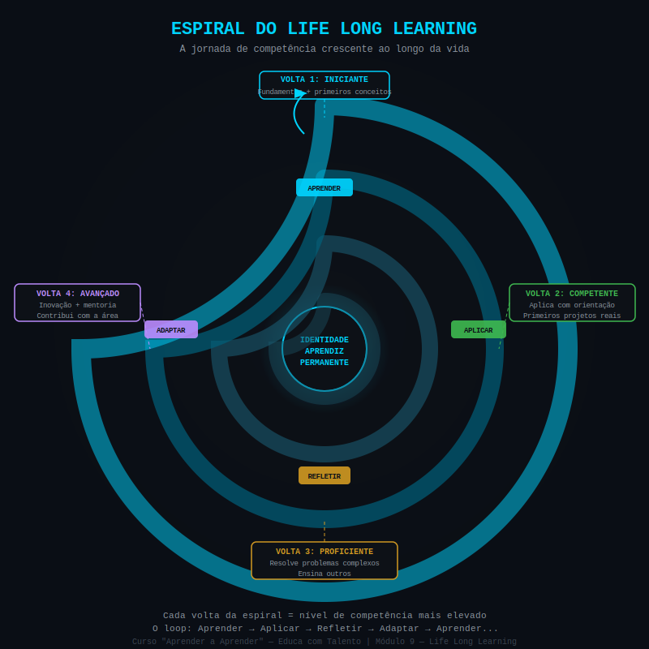

# Aula 54 — Conceito de Life Long Learning: Aprender, Desaprender e Reaprender

---

## Informações da Aula

| Campo | Detalhe |
|-------|---------|
| **Módulo** | 9 — Life Long Learning: Aprender para a Vida Toda |
| **Aula** | 54 (1 de 6 do módulo) |
| **Duração estimada** | 20 minutos |
| **Nível** | Todos os níveis |
| **Formato** | Videoaula com slides |
| **Objetivos** | Compreender o que é Life Long Learning — definição, origem e contexto histórico; entender por que o LLL é uma resposta necessária ao mundo BANI; distinguir os 3 pilares do LLL; mapear áreas da vida e carreira onde o LLL é urgente |

---

## Roteiro da Aula

| Parte | Tempo | Conteúdo |
|-------|---------|---------|
| Abertura | 2 min | A profecia de Alvin Toffler e por que ela chegou |
| Parte 1 | 5 min | O que é LLL — definição, origem e contexto |
| Parte 2 | 4 min | O mundo BANI e a meia-vida do conhecimento |
| Parte 3 | 5 min | Os 3 pilares do LLL: aprender, desaprender e reaprender |
| Encerramento | 3 min | Exercício prático + próxima aula |

---

## Narração em Primeira Pessoa

### Abertura

Em 1970, um escritor e futurista americano chamado **Alvin Toffler** publicou um livro chamado "Future Shock" — Choque do Futuro, na tradução brasileira. Nesse livro, ele fez uma previsão que, na época, muita gente considerou exagerada.

Toffler escreveu: **"O analfabeto do século XXI não é quem não sabe ler ou escrever. É quem não sabe aprender, desaprender e reaprender."**

1970. Cinquenta e seis anos atrás. Antes da internet. Antes do computador pessoal. Antes do smartphone. Antes da inteligência artificial.

E hoje, em 2026, essa frase soa menos como previsão e mais como descrição literal da realidade.

Nós vivemos em um mundo onde um profissional formado hoje já tem parte do seu conhecimento técnico em processo de obsolescência. Onde tecnologias que eram estado da arte há 3 anos são hoje substituídas por versões radicalmente diferentes. Onde a habilidade mais valiosa que um ser humano pode ter não é o que ele sabe — mas a velocidade e a qualidade com que ele aprende coisas novas.

Bem-vindo ao **Módulo 9** — o módulo final do nosso curso, e talvez o mais importante de todos.

Porque aqui não vamos falar sobre mais uma técnica. Vamos falar sobre uma **filosofia de vida**. O **Life Long Learning** — LLL — não é um método de estudo. É uma forma de existir no mundo.

E eu vou te mostrar por que adotar essa filosofia pode ser a decisão mais impactante que você toma hoje.

---

### Parte 1: O que é Life Long Learning

**Life Long Learning** — literalmente, "aprendizado por toda a vida" — é um conceito que tem raízes na filosofia educacional, mas ganhou urgência prática nas últimas décadas com a aceleração tecnológica e as mudanças no mundo do trabalho.

A definição mais completa vem da **Comissão Europeia de Educação**: LLL é "toda atividade de aprendizagem empreendida ao longo da vida com o objetivo de melhorar conhecimento, habilidades, competências e perspectivas dentro de uma perspectiva pessoal, cívica, social e/ou relacionada ao emprego."

Mas deixa eu traduzir isso para linguagem humana.

**LLL não é:**
- Fazer um curso atrás do outro compulsivamente
- Colecionar certificados na estante
- Estar sempre matriculado em alguma formação formal
- Uma atividade que começa quando você termina a escola ou a faculdade

**LLL é:**
- Uma **filosofia**: a crença de que o crescimento humano é um processo que dura a vida inteira
- Uma **identidade**: "Eu sou um aprendiz permanente" — não "eu estou estudando agora"
- Uma **prática**: hábitos cotidianos de aprendizagem ativa e reflexiva
- Uma **resposta adaptativa**: a capacidade de atualizar conhecimento e habilidades conforme o mundo muda

A diferença entre filosofia e técnica é fundamental. Técnicas você aplica quando lembra e abandona quando a vida fica difícil. Filosofia é quem você é — ela permanece mesmo quando a rotina desaparece.

**Origem histórica do LLL**: o conceito ganhou tração institucional nos anos 1970 com a **UNESCO** e organizações internacionais, mas sua raiz filosófica é muito mais antiga. **Confúcio** dizia "Não importa quão devagar você vá, desde que você não pare." **Aristóteles** falava do aprendizado como a felicidade máxima do ser humano. **John Dewey** construiu toda uma filosofia educacional baseada na ideia de que "educação não é preparação para a vida — educação é a vida em si."

O que mudou hoje é a **urgência**. Nos séculos passados, o conhecimento adquirido numa juventude era suficiente para uma vida inteira de trabalho. Hoje, não é mais. E é isso que torna o LLL não apenas desejável, mas necessário.

---

### Parte 2: O Mundo BANI e a Meia-Vida do Conhecimento

Você provavelmente já ouviu falar do mundo VUCA — Volátil, Incerto, Complexo e Ambíguo — que descrevia o ambiente empresarial desde os anos 1990.

Pois bem: em 2020, o pesquisador e futurista **Jamais Cascio** propôs que o VUCA já não captura adequadamente o mundo atual. Ele introduziu o conceito de mundo **BANI**:

```
┌──────────────────────────────────────────────────────────────────┐
│                      O MUNDO BANI (2020+)                        │
│                          Jamais Cascio                           │
├──────────────────────────────────────────────────────────────────┤
│                                                                  │
│  B — BRITTLE (Frágil)                                            │
│      Sistemas que parecem sólidos colapsam repentinamente        │
│      → Empresas sólidas falindo em meses (Kodak, Blockbuster)    │
│      → Carreiras estáveis tornando-se obsoletas em anos          │
│                                                                  │
│  A — ANXIOUS (Ansioso)                                           │
│      A velocidade das mudanças cria ansiedade generalizada       │
│      → Dificuldade de decidir com tantas variáveis em jogo       │
│      → FOMO (medo de ficar para trás) como estado permanente     │
│                                                                  │
│  N — NONLINEAR (Não-linear)                                      │
│      Causas e efeitos não têm proporção previsível               │
│      → Um vírus muda o mundo do trabalho permanentemente         │
│      → Uma tecnologia (IA generativa) revoluciona dezenas        │
│        de indústrias em 18 meses                                 │
│                                                                  │
│  I — INCOMPREHENSIBLE (Incompreensível)                          │
│      A quantidade de informação e a velocidade das mudanças      │
│      superam a capacidade humana de compreensão completa         │
│      → Ninguém entende tudo — especialização extrema necessária  │
│      → E ao mesmo tempo, conexões entre áreas são cruciais       │
└──────────────────────────────────────────────────────────────────┘
```

E aqui está o dado mais alarmante de tudo:

**A meia-vida do conhecimento técnico está encolhendo dramaticamente.**

"Meia-vida do conhecimento" é o tempo que leva para metade do que você sabe numa área se tornar desatualizado ou obsoleto.

- Em **Tecnologia da Informação**: estimativas apontam para 2,5 anos
- Em **Medicina**: cerca de 5 anos (um médico formado em 2020 já encontra diretrizes revisadas em inúmeras áreas)
- Em **Engenharia**: 5-7 anos
- Em **Ciências Sociais e Humanidades**: 15-20 anos

O **Relatório "Future of Jobs" do Fórum Econômico Mundial (WEF), edição 2023**, estimou que **50% dos trabalhadores precisarão de reskilling (requalificação) significativo nos próximos 5 anos** em função da automação, da IA e das mudanças nos modelos de negócio.

Isso não é futurismo especulativo. É 2026, e já estamos vivendo isso.

A **única resposta eficaz** ao mundo BANI com meia-vida de conhecimento em queda é exatamente o Life Long Learning: a capacidade contínua de aprender, desaprender e reaprender mais rápido do que o mundo muda.

---

### Parte 3: Os 3 Pilares do LLL

Alvin Toffler colocou três verbos na sua frase profética: **aprender, desaprender e reaprender**. Esses são os 3 pilares do LLL.

**PILAR 1: APRENDER**

Este é o mais óbvio — adquirir conhecimento e habilidades novas. É o que os módulos anteriores deste curso ensinaram com profundidade: como aprender de forma eficaz, eficiente e duradoura.

No contexto do LLL, o "aprender" é uma prática permanente — não restrita a períodos formais de estudo, mas integrada ao cotidiano. Você aprende com experiências, com conversas, com leituras, com projetos, com feedbacks.

**PILAR 2: DESAPRENDER**

Este é o menos óbvio e o mais subestimado. Desaprender não significa esquecer — significa **soltar crenças, práticas e modelos mentais que não servem mais** para dar espaço ao que é mais atual e eficaz.

Exemplos de desaprendizagem necessária:
- Um médico formado nos anos 1990 precisa desaprender diretrizes de tratamento que foram substituídas por evidências mais recentes
- Um profissional de marketing precisa desaprender que "mais conteúdo = mais resultado" para aprender que relevância e precisão importam mais do que volume
- Um líder que foi criado na cultura de "mando e controle" precisa desaprender esse estilo para liderar equipes remotas e autônomas

**Carol Dweck**, psicóloga da **Universidade de Stanford**, mostrou que a principal barreira ao desaprendizado é o **ego investido** no conhecimento antigo. Quanto mais experiente uma pessoa é, mais difícil pode ser desaprender — porque o conhecimento antigo é parte da identidade profissional.

A mente que consegue desaprender é a que **permanece aberta** mesmo depois de anos de expertise. É o que **Shunryu Suzuki**, mestre Zen japonês, chamava de "mente de principiante": "Na mente do expert, há poucas possibilidades. Na mente do principiante, há muitas."

**PILAR 3: REAPRENDER**

Reaprender é o ciclo que fecha o loop: depois de desaprender o que estava desatualizado, você adquire o novo entendimento, a nova habilidade, o novo modelo mental.

É diferente de "aprender pela primeira vez" porque você parte de uma base de experiência e prática — o que torna o reaprendizado frequentemente mais rápido e mais profundo do que o aprendizado inicial.

---


*Figura: A Espiral do Life Long Learning — o ciclo contínuo de aprender, desaprender e reaprender ao longo de toda a vida — Alvin Toffler (1970)*

---

### Encerramento

Alvin Toffler tinha razão. O analfabeto do século XXI é quem não sabe aprender, desaprender e reaprender.

Mas a boa notícia — a razão pela qual este curso existe — é que essa tríade não é um talento. É uma habilidade. E habilidades se desenvolvem com método, prática e mentalidade certa.

Você chegou até aqui. Você aprendeu sobre neurociência, retrieval, foco, mentalidade, hábitos e Ultralearning. Agora é hora de amarrar tudo numa filosofia de vida que vai durar décadas.

Nas próximas aulas, vamos explorar como o LLL se aplica na carreira, como a curiosidade o alimenta, como comunidades o amplificam, como o portfólio o torna visível — e na aula final, você vai criar seu Plano de Vida Aprendiz.

---

## Elementos Visuais de Apoio

```
┌──────────────────────────────────────────────────────────────────┐
│         MEIA-VIDA DO CONHECIMENTO TÉCNICO — ESTIMATIVAS 2025     │
├─────────────────────────────┬────────────────────────────────────┤
│  ÁREA                       │  ESTIMATIVA DE MEIA-VIDA           │
├─────────────────────────────┼────────────────────────────────────┤
│  Tecnologia da Informação   │  ~2,5 anos                         │
│  IA e Machine Learning      │  ~1-2 anos (aceleração recente)    │
│  Cibersegurança             │  ~2 anos                           │
│  Medicina clínica           │  ~5 anos                           │
│  Engenharia                 │  ~5-7 anos                         │
│  Marketing digital          │  ~3 anos                           │
│  Direito (regulatório)      │  Variável — pode ser meses         │
│  Humanidades                │  ~15-20 anos                       │
│  Habilidades humanas        │  Décadas (empatia, liderança)      │
└─────────────────────────────┴────────────────────────────────────┘
```

---

## Exercício Prático

**Título**: Mapeando meu LLL — O que Aprender, Desaprender e Reaprender

**Objetivo**: Identificar áreas concretas da sua vida e carreira onde cada um dos 3 pilares do LLL é mais urgente.

**Instruções**:

Preencha a tabela abaixo com honestidade. Pode ser difícil — especialmente a coluna "Desaprender", que exige autocrítica genuína.

| Dimensão | O que Aprender (novo) | O que Desaprender (soltar) | O que Reaprender (atualizar) |
|----------|----------------------|---------------------------|------------------------------|
| Carreira/Profissão | | | |
| Relações/Comunicação | | | |
| Saúde e Bem-estar | | | |
| Tecnologia | | | |
| Área de conhecimento favorita | | | |

**Prazo para as ações mais urgentes**:
- Nos próximos 3 meses, a ação de LLL mais importante que vou tomar é: ___________
- Em 1 ano, o que quero ter aprendido/desaprendido/reaprendido: ___________

**Tempo estimado**: 30 minutos de reflexão genuína.

---

## Quiz de Retrieval

**1.** Qual é a citação de Alvin Toffler sobre o analfabetismo do século XXI, e em que ano foi escrita?

**2.** O que significam as letras do mundo BANI?

**3.** Quais são os 3 pilares do Life Long Learning?

**4.** O que é "desaprender" e por que é o pilar mais difícil?

**5.** Qual a estimativa de meia-vida do conhecimento técnico em Tecnologia da Informação?

---

### Gabarito

**1.** "O analfabeto do século XXI não é quem não sabe ler ou escrever. É quem não sabe aprender, desaprender e reaprender." — **Alvin Toffler**, no livro *Future Shock*, publicado em **1970**.

**2.** BANI significa: **B**rittle (Frágil) — sistemas que colapsam repentinamente; **A**nxious (Ansioso) — a velocidade das mudanças gera ansiedade generalizada; **N**onlinear (Não-linear) — causas e efeitos desproporcionais e imprevisíveis; **I**ncomprehensible (Incompreensível) — a quantidade de informação supera a capacidade humana de compreensão total.

**3.** Os 3 pilares são: (1) **Aprender** — adquirir conhecimento e habilidades novas continuamente; (2) **Desaprender** — soltar crenças, práticas e modelos mentais obsoletos; (3) **Reaprender** — reconstruir entendimento atualizado sobre temas que mudaram.

**4.** "Desaprender" é **soltar crenças, práticas e modelos mentais que não servem mais**. É o pilar mais difícil porque, segundo Carol Dweck (Stanford), o **ego está investido** no conhecimento antigo — especialmente em profissionais experientes, para quem o conhecimento acumulado é parte da identidade. Desaprender exige humildade intelectual e "mente de principiante" (Shunryu Suzuki).

**5.** A estimativa de meia-vida do conhecimento técnico em **TI é de aproximadamente 2,5 anos** — o que significa que metade do que um profissional de TI sabe hoje já estará desatualizado em menos de 3 anos.

---

## Leitura Recomendada

- **TOFFLER, Alvin**. *Future Shock* (Choque do Futuro). Random House, 1970.
- **World Economic Forum**. *Future of Jobs Report 2023*. (Disponível gratuitamente em weforum.org)
- **DWECK, Carol**. *Mindset: A Nova Psicologia do Sucesso*. Objetiva, 2017.

---

*Aula 54 | Módulo 9 — Life Long Learning | Curso Aprender a Aprender | Educa com Talento*
