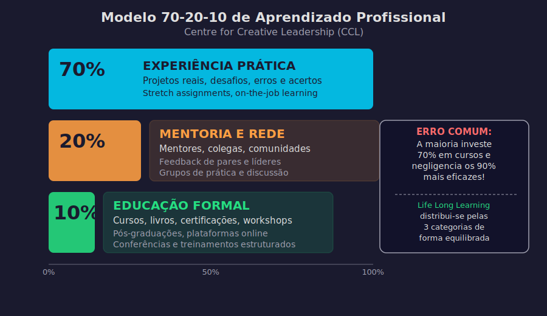

# Aula 55 — LLL e Carreira: Aprendizado como Vantagem Competitiva Sustentável

---

## Informações da Aula

| Campo | Detalhe |
|-------|---------|
| **Módulo** | 9 — Life Long Learning: Aprender para a Vida Toda |
| **Aula** | 55 (2 de 6 do módulo) |
| **Duração estimada** | 20 minutos |
| **Nível** | Todos os níveis |
| **Formato** | Videoaula com slides |
| **Objetivos** | Compreender o LLL como vantagem competitiva sustentável na carreira; entender o conceito de T-shaped skills; conhecer o modelo 70-20-10 de aprendizagem profissional; construir um PDI (Plano de Desenvolvimento Individual) de 12 meses |

---

## Roteiro da Aula

| Parte | Tempo | Conteúdo |
|-------|-------|---------|
| Abertura | 2 min | A Shell e a empresa mais longeva do mundo |
| Parte 1 | 5 min | LLL como vantagem competitiva — o argumento de Arie de Geus |
| Parte 2 | 4 min | T-shaped skills: profundidade + largura |
| Parte 3 | 5 min | O modelo 70-20-10 e como criar seu PDI |
| Encerramento | 3 min | Exercício prático + próxima aula |

---

## Narração em Primeira Pessoa

### Abertura

Em 1988, **Arie de Geus**, então chefe de planejamento estratégico da **Shell** — uma das maiores corporações do mundo — publicou um artigo na Harvard Business Review que se tornou um clássico da gestão.

O artigo se chamava *"Planning as Learning"* — Planejamento como Aprendizado.

Nele, de Geus apresentou um achado perturbador: ao estudar as empresas mais longevas do mundo — as que sobreviveram por 100, 200, até 700 anos — ele descobriu que a **capacidade de aprender mais rápido do que os concorrentes** era o único diferencial sustentável a longo prazo.

Não tecnologia. Não capital. Não marca. Não tamanho.

**Aprendizagem.**

E de Geus foi além: ele disse que o **único recurso verdadeiramente renovável** que uma organização tem é a **capacidade de aprender e se adaptar**. Tudo o mais — tecnologia, produtos, estratégias, vantagens de mercado — tem prazo de validade. A aprendizagem não.

Agora pensa: o que vale para uma organização, vale com ainda mais força para um indivíduo.

Num mercado de trabalho em transformação acelerada, com automação avançando, IA redefinindo funções e novas carreiras surgindo enquanto outras desaparecem, **a capacidade de aprender rapidamente é a vantagem competitiva mais sustentável que você pode cultivar**.

E é isso que o Life Long Learning oferece na dimensão da carreira: não apenas desenvolvimento pessoal, mas **competitividade profissional duradoura**.

---

### Parte 1: LLL como Vantagem Competitiva Sustentável

Deixa eu ser direto com você sobre o que está acontecendo no mercado de trabalho.

O **Relatório Future of Jobs do WEF (2023)** estima que:
- 44% das habilidades dos trabalhadores serão disruptadas nos próximos 5 anos
- 60% dos trabalhadores precisarão de treinamento significativo antes de 2027
- Empregos que crescem mais rápido incluem: analistas de dados, especialistas em IA, especialistas em sustentabilidade — todos com forte componente de aprendizagem contínua

Em outras palavras: **não aprender continuamente é, na prática, perder terreno**.

Mas o LLL não é apenas sobre sobrevivência. É sobre **vantagem ativa**.

```
┌──────────────────────────────────────────────────────────────────┐
│     LLL NA CARREIRA — O DIFERENCIAL COMPETITIVO                  │
│                                                                  │
│  Profissional Estático         Profissional LLL                  │
│  ────────────────────          ────────────────────              │
│  Aprende na formação,          Aprende continuamente             │
│  para no "emprego"                                               │
│                                                                  │
│  Expertise fixa no tempo       Expertise que evolui              │
│                                                                  │
│  Vulnerável à automação        Mais difícil de substituir —      │
│  e à obsolescência             combina profundidade + adaptação  │
│                                                                  │
│  Ansioso com mudanças          Vê mudanças como oportunidades    │
│                                                                  │
│  Currículo que envelhece       Portfólio que cresce              │
│                                                                  │
│  "Tenho 15 anos de             "Aprendi ativamente nos últimos  │
│   experiência"                  15 anos"                         │
│  (pode ser 1 ano               (isso sim é diferenciador)       │
│   repetido 15 vezes)                                             │
└──────────────────────────────────────────────────────────────────┘
```

A distinção do último ponto é brutal, mas real. "15 anos de experiência" pode significar 15 anos de aprendizado ativo e crescimento — ou 1 ano repetido 15 vezes. O LLL é o que garante que você está na primeira categoria.

**Cal Newport**, pesquisador de produtividade e carreira da **Universidade de Georgetown**, usa o conceito de "career capital" — capital de carreira. A ideia é simples: habilidades raras e valiosas são o capital que você usa para negociar autonomia, propósito e remuneração na carreira. E o LLL é o sistema de acumulação contínua desse capital.

---

### Parte 2: T-Shaped Skills — Profundidade + Largura

Um dos conceitos mais poderosos para pensar a carreira no século XXI é o das **T-shaped skills** (habilidades em formato T), popularizado por **Tim Brown**, CEO da consultoria IDEO.

A ideia é visual e direta:

```
┌──────────────────────────────────────────────────────────────────┐
│               T-SHAPED SKILLS — O PERFIL DO FUTURO               │
│                                                                  │
│  ████████████████████████████████████████████████████████████   │
│  ← LARGURA: conhecimento amplo e variado de muitas áreas →      │
│                         ██                                       │
│                         ██                                       │
│                         ██  PROFUNDIDADE:                        │
│                         ██  Expertise profunda em uma            │
│                         ██  (ou poucas) área(s) de              │
│                         ██  especialização                       │
│                         ██                                       │
│                         ██                                       │
│                                                                  │
│  BARRA HORIZONTAL: você pode colaborar, entender e contribuir   │
│                    com diversas áreas e disciplinas              │
│                                                                  │
│  BARRA VERTICAL:   você tem profundidade suficiente em sua       │
│                    especialidade para ser irreplaçável           │
└──────────────────────────────────────────────────────────────────┘
```

**Por que isso importa?**

No passado, a especialização profunda (o "I-shaped" — apenas vertical) era suficiente. Você era o especialista em X, e o mundo precisava de especialistas em X.

Hoje, as soluções para os problemas mais relevantes exigem **integração de múltiplas perspectivas**. Um produto digital bem-sucedido precisa de tecnologia + design + psicologia do usuário + negócios. Uma política de saúde eficaz precisa de medicina + economia + ciências sociais + comunicação.

O profissional T-shaped consegue **colaborar através das fronteiras disciplinares** — e isso o torna exponencialmente mais valioso do que alguém com apenas especialização vertical.

**Como o LLL constrói o T:**

- **A barra vertical** (profundidade) é construída com anos de prática deliberada, projetos de Ultralearning na área de especialização e feedback de experts
- **A barra horizontal** (largura) é construída com o LLL cotidiano: leitura diversificada, curiosidade ativa, conversas com pessoas de áreas diferentes, cursos curtos e projetos interdisciplinares

Qual é a sua barra vertical atual? E como você pode expandir sua barra horizontal nos próximos 12 meses?

---

### Parte 3: O Modelo 70-20-10 e o PDI

Se você quer construir um LLL profissional eficaz, o **Modelo 70-20-10** é um framework muito útil e baseado em pesquisa.

Desenvolvido originalmente por **Morgan McCall, Robert Eichinger e Michael Lombardo** no **Center for Creative Leadership (CCL)** nos anos 1980, o modelo descreve como os profissionais mais eficazes aprendem:

```
┌──────────────────────────────────────────────────────────────────┐
│              O MODELO 70-20-10 DE APRENDIZAGEM                   │
│              Center for Creative Leadership (CCL)                │
├──────────────────────────────────────────────────────────────────┤
│                                                                  │
│  70% — EXPERIÊNCIA (on-the-job)                                  │
│  Aprendizado que vem de desafios reais no trabalho               │
│  → Projetos desafiadores e novos                                 │
│  → Stretch assignments (tarefas acima do conforto atual)         │
│  → Errar, refletir, ajustar e tentar novamente                   │
│  → Construir sobre projetos anteriores com complexidade maior    │
│                                                                  │
│  20% — SOCIAL (mentoria e rede)                                  │
│  Aprendizado que vem de outras pessoas                           │
│  → Mentores formais e informais                                  │
│  → Feedback de pares e superiores                                │
│  → Observar e conversar com experts                              │
│  → Comunidades de prática e grupos de estudo                     │
│                                                                  │
│  10% — EDUCAÇÃO FORMAL                                           │
│  Cursos, livros, treinamentos estruturados                       │
│  → Cursos online (Coursera, Alura, edX)                         │
│  → Livros técnicos e de negócios                                 │
│  → Workshops e conferências                                      │
│  → Pós-graduações e certificações                                │
└──────────────────────────────────────────────────────────────────┘
```

---


*Figura: Modelo 70-20-10 de Aprendizagem Profissional — 70% Experiência Prática, 20% Mentoria e Rede, 10% Educação Formal — Centre for Creative Leadership (CCL)*

---

O insight mais importante desse modelo: **a maioria das pessoas faz o inverso**. Investe 70% do tempo em educação formal (cursos, livros) e negligencia a experiência desafiadora e a rede social de aprendizagem — que juntas são responsáveis por 90% do desenvolvimento.

Isso não significa que você deve parar de fazer cursos. Significa que você deve **equilibrar as 3 fontes** intencionalmente.

**Como criar seu PDI (Plano de Desenvolvimento Individual) de 12 meses:**

Um PDI é um documento simples mas poderoso — um mapa do que você vai desenvolver nos próximos 12 meses, organizado nas 3 dimensões do 70-20-10.

```
╔══════════════════════════════════════════════════════════════════╗
║              PDI — PLANO DE DESENVOLVIMENTO INDIVIDUAL           ║
║                        12 MESES — 2026/2027                     ║
╠══════════════════════════════════════════════════════════════════╣
║                                                                  ║
║  NOME: _______________________  DATA: ____________              ║
║  CARGO/ÁREA: ____________________                               ║
║                                                                  ║
║  OBJETIVO DE CARREIRA EM 3 ANOS:                                ║
║  _________________________________________________________       ║
║                                                                  ║
╠══════════════════════════════════════════════════════════════════╣
║                                                                  ║
║  HABILIDADES A DESENVOLVER                                       ║
║  Técnicas (3 habilidades): _________________________________     ║
║  1.                                                              ║
║  2.                                                              ║
║  3.                                                              ║
║  Transversais (2 habilidades): ____________________________      ║
║  1.                                                              ║
║  2.                                                              ║
║                                                                  ║
╠══════════════════════════════════════════════════════════════════╣
║                                                                  ║
║  70% — EXPERIÊNCIA                                               ║
║  Projeto desafiador 1: ______________________________            ║
║  Projeto desafiador 2: ______________________________            ║
║  Stretch assignment buscado: ________________________            ║
║                                                                  ║
╠══════════════════════════════════════════════════════════════════╣
║                                                                  ║
║  20% — SOCIAL                                                    ║
║  Mentor identificado: ________________________________           ║
║  Comunidade de prática: ______________________________           ║
║  Pares para troca regular: ___________________________           ║
║                                                                  ║
╠══════════════════════════════════════════════════════════════════╣
║                                                                  ║
║  10% — EDUCAÇÃO FORMAL                                           ║
║  Curso/livro 1 (Q1): _________________________________           ║
║  Curso/livro 2 (Q2): _________________________________           ║
║  Certificação alvo: __________________________________           ║
║                                                                  ║
╠══════════════════════════════════════════════════════════════════╣
║                                                                  ║
║  MARCOS DE REVISÃO                                               ║
║  Revisão trimestral: _______ / _______ / _______ / _______      ║
║                                                                  ║
╚══════════════════════════════════════════════════════════════════╝
```

---

### Encerramento

No mundo BANI, o profissional que não tem um PDI ativo está essencialmente deixando sua carreira ao acaso — esperando que o ambiente seja favorável em vez de construir proativamente as habilidades que o ambiente vai demandar.

O LLL na carreira não é sobre ser o mais estudioso ou o que fez mais cursos. É sobre ter **estratégia clara** sobre o que você precisa aprender, **sistemas ativos** para aprender de forma eficaz e **consistência** para executar ao longo do tempo.

Na próxima aula, vamos falar sobre o que alimenta o LLL no nível mais profundo — a **curiosidade** — e como cultivá-la de forma ativa e sustentável.

---

## Exercício Prático

**Título**: Meu PDI de 12 Meses

**Objetivo**: Criar o Plano de Desenvolvimento Individual dos próximos 12 meses.

**Instruções**:

1. **Defina seu objetivo de carreira em 3 anos**: seja específico. Não "crescer na empresa", mas "tornar-me gerente de produtos em uma empresa de tecnologia B2B" ou "me tornar freelancer de design UX com 5 clientes fixos".

2. **Identifique as habilidades necessárias**: liste 3 habilidades técnicas e 2 habilidades transversais (comunicação, liderança, negociação, etc.) que esse objetivo requer.

3. **Preencha o PDI** usando o template acima, garantindo que as 3 dimensões do 70-20-10 estejam presentes.

4. **Agende as revisões trimestrais** no calendário agora — não depois.

**Tempo estimado**: 1 hora (é o investimento mais importante que você vai fazer hoje na sua carreira).

---

## Quiz de Retrieval

**1.** O que Arie de Geus descobriu que as empresas mais longevas do mundo tinham em comum?

**2.** O que são "T-shaped skills" e por que são importantes no mercado atual?

**3.** Quais são as 3 fontes de aprendizagem no Modelo 70-20-10 e suas proporções?

**4.** Por que o modelo 70-20-10 revela um erro comum na forma como as pessoas investem em desenvolvimento?

**5.** O que é um PDI e qual é sua função no LLL profissional?

---

### Gabarito

**1.** Arie de Geus (Shell) descobriu que as empresas mais longevas — sobrevivendo por 100 a 700 anos — tinham como único diferencial sustentável a longo prazo a **capacidade de aprender mais rápido do que os concorrentes**. Não tecnologia, capital, marca ou tamanho — apenas a aprendizagem organizacional.

**2.** T-shaped skills são um perfil de competências que combina: a **barra vertical** (profundidade de expertise em uma área específica) com a **barra horizontal** (conhecimento amplo e variado de múltiplas áreas que permite colaboração interdisciplinar). São importantes porque as soluções para os problemas mais relevantes hoje exigem integração de múltiplas perspectivas.

**3.** O Modelo 70-20-10 (CCL): **70% de experiência** (projetos desafiadores on-the-job), **20% de aprendizagem social** (mentoria, feedback, comunidades), **10% de educação formal** (cursos, livros, treinamentos).

**4.** O modelo revela que a maioria das pessoas investe **de forma invertida** — gastando 70% do tempo em educação formal (cursos e livros) e negligenciando a experiência desafiadora e a rede social, que juntas representam 90% do desenvolvimento efetivo dos profissionais mais bem-sucedidos.

**5.** O PDI (Plano de Desenvolvimento Individual) é um documento que **mapeia estrategicamente** o que o profissional vai aprender nos próximos 12 meses, organizado nas 3 dimensões do 70-20-10 e alinhado com um objetivo de carreira de médio prazo. Ele transforma o LLL de intenção vaga em sistema estruturado e mensurável.

---

## Leitura Recomendada

- **DE GEUS, Arie**. "Planning as Learning." *Harvard Business Review*, Março-Abril 1988.
- **NEWPORT, Cal**. *So Good They Can't Ignore You: Why Skills Trump Passion in the Quest for Work You Love*. Business Plus, 2012.
- **World Economic Forum**. *Future of Jobs Report 2023*. Disponível em weforum.org/reports.

---

*Aula 55 | Módulo 9 — Life Long Learning | Curso Aprender a Aprender | Educa com Talento*
