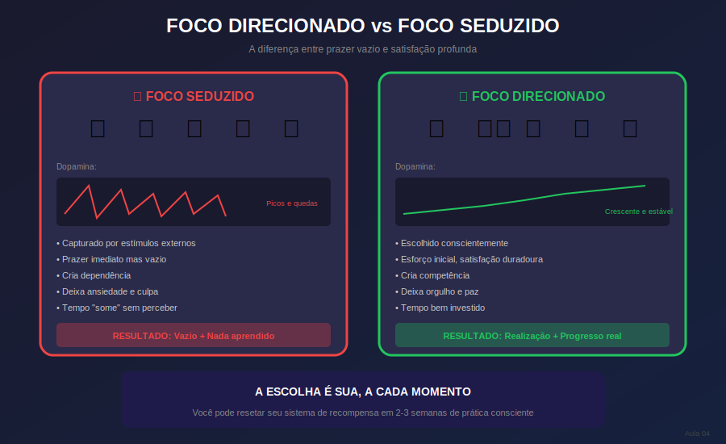

# Aula 04: Foco Direcionado vs. Foco Seduzido

## Informações da Aula

| Item | Descrição |
|------|-----------|
| **Módulo** | 1 - Hiperfoco e Hiperprodutividade |
| **Bloco** | Fundamentos |
| **Duração Estimada** | 22 minutos |
| **Nível** | Introdutório |

---

## 1. Roteiro da Aula

### Abertura (2 min)
- A pergunta: "Por que é fácil focar em Netflix mas difícil focar no estudo?"
- Introdução aos dois tipos de foco
- O que vamos descobrir hoje

### Desenvolvimento (17 min)

#### Parte 1: Foco Seduzido - O vilão disfarçado (5 min)
- O que é foco seduzido
- Como apps e redes sociais sequestram atenção
- O ciclo de dopamina
- Por que parece tão fácil e é tão vazio

#### Parte 2: Foco Direcionado - O herói da história (5 min)
- O que é foco direcionado
- Por que é mais difícil no início
- A recompensa genuína
- A satisfação profunda

#### Parte 3: A neurociência por trás (4 min)
- Dopamina fácil vs. dopamina de conquista
- O cérebro de recompensa
- Reset do sistema de recompensa

#### Parte 4: Estratégias para cultivar o foco direcionado (3 min)
- Reduzir exposição ao foco seduzido
- Tornar o foco direcionado mais atrativo
- Criar rituais de transição

### Encerramento (3 min)
- Resumo dos dois tipos
- A escolha que você faz todo dia
- Preview da próxima aula

---

## 2. Narração em Primeira Pessoa

### Abertura

Seja bem-vindo à Aula 4! Hoje vamos responder uma pergunta que talvez você já tenha se feito:

**"Por que é tão fácil passar horas no Netflix, no Instagram, no TikTok... mas estudar por 30 minutos parece uma tortura?"**

Se você já se pegou pensando que talvez tenha algum problema, que talvez seja preguiçoso, ou que simplesmente "não nasceu pra estudar"... respira. O problema não é você. O problema é que você está lutando contra um sistema cuidadosamente projetado para capturar sua atenção.

Hoje você vai entender a diferença entre **Foco Seduzido** e **Foco Direcionado**, e essa compreensão vai mudar sua relação com os estudos.

### Desenvolvimento

#### Foco Seduzido - O vilão disfarçado

Vamos começar pelo **Foco Seduzido**. Esse é o tipo de foco que acontece quando você está rolando o feed do Instagram, assistindo vídeos no YouTube, ou jogando aquele jogo no celular.

Perceba: você está focado. Às vezes por horas. Então tecnicamente sua capacidade de foco existe. O problema é **onde** esse foco está direcionado.

O foco seduzido acontece quando **estímulos externos capturam sua atenção sem seu consentimento**. Esses estímulos são projetados para serem irresistíveis. Literalmente.

As grandes empresas de tecnologia empregam os melhores psicólogos e neurocientistas do mundo para uma única missão: fazer você não conseguir parar de usar seus produtos. Cada cor, cada som de notificação, cada mecanismo de rolagem infinita foi testado e otimizado para sequestrar sua atenção.

O mecanismo principal é o **ciclo de dopamina**. Dopamina é o neurotransmissor do prazer e da antecipação. Cada vez que você recebe uma curtida, um comentário, uma mensagem, seu cérebro libera um pouquinho de dopamina. E você quer mais.

O problema? Esse prazer é vazio. É como junk food para o cérebro. Te dá uma satisfação momentânea, mas deixa você mais vazio e ansioso depois.

E o pior: quanto mais você consome esse tipo de estímulo, mais seu cérebro se acostuma. Você precisa de doses cada vez maiores para sentir o mesmo prazer. E coisas que antes eram interessantes - como estudar - passam a parecer incrivelmente entediantes em comparação.

#### Foco Direcionado - O herói da história

Agora, o **Foco Direcionado** é completamente diferente.

Foco direcionado é quando **você escolhe conscientemente onde colocar sua atenção**, baseado no que é importante para seus objetivos de longo prazo, não no que é mais estimulante no momento.

Estudar para um concurso é foco direcionado. Ler um livro técnico é foco direcionado. Praticar uma habilidade é foco direcionado.

E sim, no início é mais difícil. Seu cérebro, acostumado com a dopamina fácil, vai protestar. Vai querer ir pro celular. Vai achar o conteúdo "chato". Isso é normal - é a abstinência da dopamina rápida.

Mas aqui está a mágica: quando você persiste, uma coisa incrível acontece.

O foco direcionado traz uma **recompensa genuína**. É a satisfação de entender um conceito difícil. É o orgulho de ver seu progresso. É a confiança de saber que você está construindo algo real.

Essa satisfação é profunda e duradoura. Não é vazia como a dopamina das redes sociais. É o tipo de prazer que te faz dormir em paz à noite, sabendo que você fez algo que importa.

#### A neurociência por trás

Vamos entender o que acontece no cérebro.

Existem dois tipos de dopamina relevantes aqui:

A **dopamina fácil** vem de estímulos rápidos e sem esforço. Redes sociais, jogos, fofoca. Ela ativa o sistema de recompensa de forma intensa mas breve. E cria dependência.

A **dopamina de conquista** vem de alcançar algo que exigiu esforço. Completar um capítulo difícil. Resolver um problema que estava te travando. Ela ativa o sistema de recompensa de forma mais moderada mas muito mais duradoura. E cria motivação sustentável.

A boa notícia? Você pode fazer um **reset do seu sistema de recompensa**.

Quando você reduz a exposição à dopamina fácil e aumenta experiências de dopamina de conquista, seu cérebro se recalibra. Coisas que antes pareciam entediantes voltam a ser interessantes. O esforço do estudo deixa de ser sofrimento e passa a ser desafio.

Esse processo leva algumas semanas, mas os resultados são transformadores.

#### Estratégias para cultivar o foco direcionado

Como você cultiva o foco direcionado na prática?

**Primeiro: reduza a exposição ao foco seduzido.**
- Desinstale apps de redes sociais do celular (use pelo computador se precisar)
- Configure limites de tempo de uso
- Desative notificações não essenciais
- Crie "zonas livres de telas" na sua casa

**Segundo: torne o foco direcionado mais atrativo.**
- Estude assuntos conectando com seus interesses
- Divida grandes tarefas em pequenas vitórias
- Celebre seu progresso, mesmo o pequeno
- Use técnicas de gamificação (que veremos em aulas futuras)

**Terceiro: crie rituais de transição.**
- Um ritual específico para entrar no modo estudo
- Pode ser fazer um chá, organizar a mesa, colocar uma música específica
- Isso sinaliza para o cérebro: "agora é hora de foco direcionado"

### Encerramento

Então, resumindo:

- **Foco Seduzido** é capturado por estímulos externos, traz prazer vazio e cria dependência
- **Foco Direcionado** é escolhido conscientemente, exige esforço inicial mas traz satisfação profunda
- Você pode resetar seu sistema de recompensa reduzindo um e aumentando outro

A partir de agora, toda vez que pegar o celular "só pra dar uma olhada", lembre-se: você está fazendo uma escolha. Entre o prazer vazio do foco seduzido e a satisfação profunda do foco direcionado.

Na **Aula 5**, vamos fechar o bloco de Fundamentos falando sobre **Equilíbrio Estável e Eliminação de Distrações**. Você vai aprender a criar um sistema sustentável de foco, que não depende de força de vontade infinita.

Hora da atividade!

---

## 3. Recursos Utilizados

### Slides/Apresentação
- Comparativo visual: Foco Seduzido vs. Foco Direcionado
- Gráfico: Ciclo de dopamina (pico rápido vs. satisfação sustentada)
- Infográfico: "O Design da Distração" (como apps nos manipulam)
- Lista visual: Estratégias práticas

### Materiais de Apoio
- Artigo: "Como as redes sociais são projetadas para viciar"
- Template: Auditoria de tempo de tela semanal
- Lista de apps para limitar tempo de uso

### Referências
- Harris, Tristan. "Center for Humane Technology"
- Alter, Adam. "Irresistible"
- Bailey, Chris. "Hyperfocus" - Capítulo sobre atenção

---

## 4. Chamada para Ferramentas e Atividades

### Atividade Prática: "Detox de Dopamina - Dia 1"

> **Uma experiência transformadora de 24 horas!**

#### Instruções:

1. **Preparação** (15 minutos)
   - Escolha um dia para fazer o "detox de dopamina"
   - Avise pessoas importantes que estará menos disponível
   - Anote: quais são suas 3 principais fontes de "dopamina fácil"?

2. **O Detox** (24 horas)
   Durante um dia completo:
   - Nada de redes sociais
   - Nada de vídeos de entretenimento
   - Nada de jogos
   - Celular apenas para ligações e mensagens essenciais

   Em vez disso:
   - Estude usando técnicas de foco
   - Leia um livro físico
   - Faça exercício ou caminhe
   - Tenha conversas presenciais

3. **Registro** (durante o dia)
   A cada 2 horas, anote:
   - Como está se sentindo? (ansioso, entediado, tranquilo?)
   - Quantas vezes sentiu vontade de pegar o celular?
   - O que fez em vez de usar telas?

4. **Reflexão Final** (20 minutos após o detox)
   - Como foi a experiência geral?
   - O que foi mais difícil?
   - O que te surpreendeu?
   - Conseguiu focar melhor nos estudos?

#### Entrega:
Submeta seu diário do detox + reflexão na área **"📤 Envio de Atividade - Aula 4"** do Moodle.

---

## 5. Conclusão da Aula

### Resumo dos Pontos-Chave

✅ Foco seduzido = capturado por estímulos, prazer vazio, dependência

✅ Foco direcionado = escolha consciente, esforço recompensado, satisfação profunda

✅ O sistema de recompensa pode ser resetado

✅ Estratégias: reduzir, tornar atrativo, criar rituais

### Conexão com a Próxima Aula

Na **Aula 5**, última do bloco de Fundamentos, vamos aprender sobre **Equilíbrio Estável e Eliminação de Distrações**. Você vai descobrir como criar um sistema de foco que funciona no longo prazo, sem depender de motivação ou força de vontade.

### Frase de Encerramento

> "Você não é viciado em celular. Você é humano, com um cérebro que responde a estímulos. A diferença está em escolher conscientemente quais estímulos você permite entrar."

---

## Notas de Produção

### Elementos Visuais Sugeridos
- Animação comparando os dois tipos de foco
- Screenshots de apps mostrando "dark patterns"
- Gráfico de dopamina ao longo do tempo

### Tom da Apresentação
- Empático (não é culpa do espectador)
- Revelador (como se tirasse uma venda dos olhos)
- Empoderador (você pode mudar isso)

### Dica de Gravação
- Usar tom de "vou te contar um segredo"
- Ser enfático sobre o design manipulativo das redes
- Terminar com esperança e poder de escolha

---

*Aula 04 de 30 - Curso Foco e Produtividade nos Estudos - Educa com Talento*

## Infográfico da Aula

Compare visualmente o Foco Seduzido versus o Foco Direcionado. A escolha é sua a cada momento.

> **Dica de uso**: Este infográfico pode ser exibido durante a videoaula ou disponibilizado como material de apoio para download.

