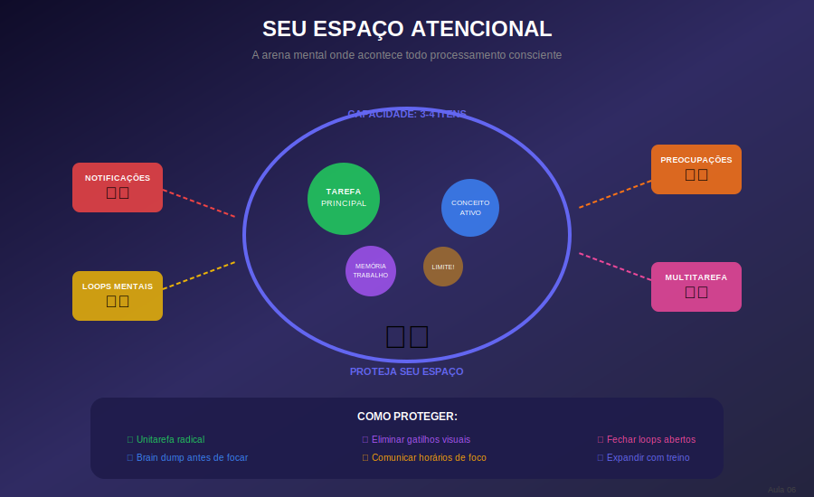

# Aula 06: Definindo e Protegendo Seu Espaço Atencional

## Informações da Aula

| Item | Descrição |
|------|-----------|
| **Módulo** | 1 - Hiperfoco e Hiperprodutividade |
| **Bloco** | Atenção |
| **Duração Estimada** | 22 minutos |
| **Nível** | Intermediário |

---

## 1. Roteiro da Aula

### Abertura (2 min)
- Início do bloco Atenção
- O conceito de "espaço atencional"
- Por que protegê-lo é fundamental

### Desenvolvimento (17 min)

#### Parte 1: O que é espaço atencional (4 min)
- Definição e metáfora da "arena mental"
- Capacidade limitada (3-4 itens)
- Qualidade vs. quantidade no espaço

#### Parte 2: Os invasores do espaço atencional (5 min)
- Tarefas concorrentes
- Preocupações não resolvidas
- Estímulos ambientais
- Loops mentais repetitivos

#### Parte 3: Técnicas de proteção (5 min)
- Fechamento de "loops abertos"
- Unitarefa radical
- Blindagem temporal
- Comunicação de limites

#### Parte 4: Exercícios de expansão (3 min)
- Meditação focada
- Prática gradual
- Treinamento da atenção

### Encerramento (3 min)
- Resumo das técnicas
- Atividade prática
- Preview da próxima aula

---

## 2. Narração em Primeira Pessoa

### Abertura

Bem-vindo ao **Bloco 2: Atenção**! Nas próximas cinco aulas, vamos mergulhar fundo em como funciona sua atenção e como dominá-la.

Hoje, vamos falar sobre um conceito que vai mudar sua forma de pensar sobre foco: o **Espaço Atencional**.

Imagine sua atenção como uma arena, um espaço mental onde acontece o processamento consciente. Tudo que você percebe, pensa e trabalha ativamente ocupa lugar nessa arena. E aqui está o ponto crucial: **esse espaço é limitado**.

### Desenvolvimento

#### O que é espaço atencional

Pense na sua atenção como uma mesa de trabalho mental. Você só consegue trabalhar efetivamente com o que está em cima da mesa. Se a mesa está lotada de coisas, você não consegue trabalhar em nada direito.

Pesquisas mostram que conseguimos manter apenas **3 a 4 itens** no espaço atencional ao mesmo tempo. Não mais. Isso é fisiológico, não é falta de capacidade sua.

Quando você tenta colocar mais itens, algo precisa sair. Ou então tudo fica sendo processado superficialmente. É por isso que estudar enquanto pensa na conversa de ontem, na conta que precisa pagar, e na mensagem que acabou de chegar resulta em zero absorção.

A qualidade do seu foco depende diretamente de **quão limpo está seu espaço atencional**.

#### Os invasores do espaço atencional

Existem quatro tipos principais de invasores:

**1. Tarefas concorrentes:** Tentar fazer duas coisas ao mesmo tempo divide o espaço. Estudar enquanto responde mensagens significa que nem estuda direito nem responde direito.

**2. Preocupações não resolvidas:** Aquele problema que você está evitando? Ele ocupa espaço mesmo quando você não está pensando ativamente nele. É um processo de fundo que drena recursos.

**3. Estímulos ambientais:** Cada notificação, cada barulho, cada movimento no seu campo de visão pede um pedacinho de atenção. Mesmo que você não reaja, o cérebro precisa processar e decidir ignorar.

**4. Loops mentais repetitivos:** Pensamentos que ficam voltando. "Será que fiz certo?" "E se der errado?" Esses loops são particularmente drenantes porque você gasta energia sem resolver nada.

#### Técnicas de proteção

**1. Fechamento de loops abertos:**
- Antes de estudar, faça uma lista de tudo que está "pendente" na sua mente
- Para cada item, defina: vou fazer agora, vou agendar para depois, ou vou deletar
- O ato de decidir fecha o loop, mesmo que a ação fique para depois

**2. Unitarefa radical:**
- Uma coisa de cada vez, sem exceção
- Se precisa responder uma mensagem urgente, pare, responda completamente, depois volte
- Melhor dois blocos de foco puro que um bloco longo interrompido

**3. Blindagem temporal:**
- Defina horários específicos para foco (ex: 9h-11h)
- Comunique que você estará indisponível
- Trate esse tempo como uma reunião importante - porque é

**4. Comunicação de limites:**
- "Estou em período de foco, respondo em 2 horas"
- Crie um sinal físico (porta fechada, fone de ouvido)
- Eduque as pessoas ao redor sobre seus horários

#### Exercícios de expansão

A boa notícia? O espaço atencional pode ser **treinado**:

**Meditação focada:** 10 minutos por dia focando na respiração. Quando a mente vagar, gentilmente voltar. Isso fortalece o "músculo" do foco.

**Prática gradual:** Comece com blocos de 25 minutos de foco puro. Gradualmente aumente para 45, depois 60, depois 90.

**Desafios de atenção:** Leia um artigo complexo sem fazer mais nada. Assista uma palestra sem olhar o celular. Cada vez que resiste a uma distração, fica mais forte.

### Encerramento

Seu espaço atencional é seu recurso mais valioso para o aprendizado. Proteja-o como protegeria algo precioso:

- Mantenha poucos itens de cada vez
- Feche loops abertos antes de estudar
- Pratique a unitarefa radical
- Comunique seus limites
- Treine para expandir sua capacidade

Na **Aula 7**, vamos aprender sobre **Rituais de Entrada no Foco** - sequências específicas que sinalizam para seu cérebro que é hora de entrar em hiperfoco.

---

## 3. Recursos Utilizados

### Slides/Apresentação
- Ilustração da "arena mental"
- Diagrama dos 4 invasores
- Checklist de proteção
- Gráfico de evolução com treino

### Materiais de Apoio
- Template: "Lista de Loops Abertos"
- Guia de meditação focada (10 minutos)
- Script de comunicação de limites

---

## 4. Chamada para Ferramentas e Atividades

### Atividade Prática: "Limpeza do Espaço Atencional"

#### Instruções:

1. **Brain Dump Completo** (15 minutos)
   - Escreva TUDO que está ocupando espaço na sua mente
   - Tarefas, preocupações, ideias, pendências
   - Não julgue, apenas despeje

2. **Categorização** (10 minutos)
   - Para cada item: Fazer / Agendar / Deletar / Delegar
   - Agende os itens com data e hora específicos

3. **Sessão Teste** (45 minutos)
   - Após a limpeza, faça uma sessão de estudo
   - Compare: como foi o foco comparado ao normal?

#### Entrega:
Submeta seu brain dump + categorização + reflexão da sessão teste na área **"📤 Envio de Atividade - Aula 6"**.

---

## 5. Conclusão da Aula

### Resumo dos Pontos-Chave

✅ Espaço atencional é limitado (3-4 itens)

✅ Invasores: tarefas, preocupações, estímulos, loops

✅ Proteção: fechar loops, unitarefa, blindagem, comunicação

✅ Expansão é possível com treino consistente

### Frase de Encerramento

> "Sua mente é um santuário. Escolha com cuidado o que você permite entrar."

---

*Aula 06 de 30 - Curso Foco e Produtividade nos Estudos - Educa com Talento*

## Infográfico da Aula

Visualize seu Espaço Atencional como uma arena mental com capacidade limitada (3-4 itens). O infográfico mostra os 4 tipos de invasores e como protegê-lo.

> **Dica de uso**: Este infográfico pode ser exibido durante a videoaula ou disponibilizado como material de apoio para download.

