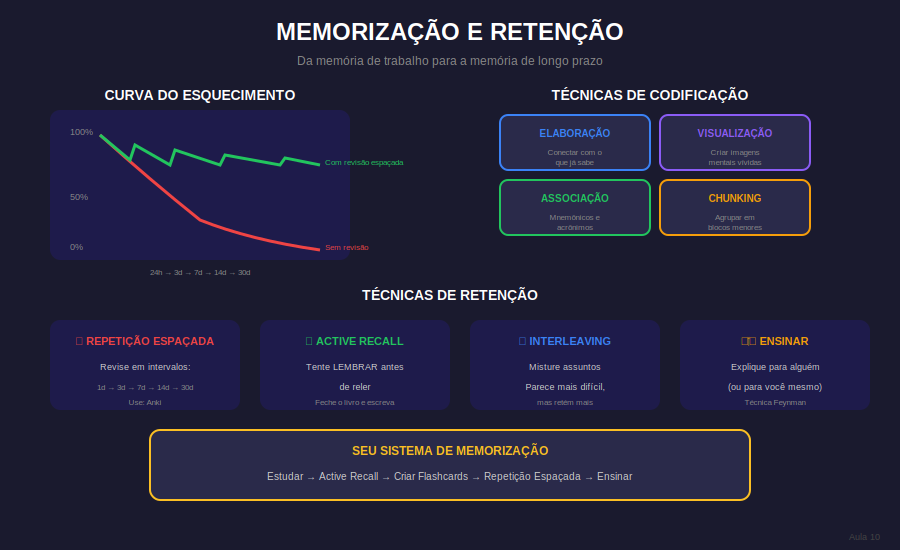

# Aula 10: Técnicas de Memorização e Retenção

## Informações da Aula

| Item | Descrição |
|------|-----------|
| **Módulo** | 1 - Hiperfoco e Hiperprodutividade |
| **Bloco** | Atenção |
| **Duração Estimada** | 25 minutos |
| **Nível** | Intermediário |

---

## 1. Roteiro da Aula

### Abertura (2 min)
- Foco sem retenção é tempo perdido
- O problema do "estudei mas não lembro"
- Fechamento do bloco Atenção

### Desenvolvimento (20 min)

#### Parte 1: Como a memória funciona (5 min)
- Memória de trabalho vs. longo prazo
- O processo de consolidação
- A curva do esquecimento

#### Parte 2: Técnicas de codificação (5 min)
- Elaboração (conectar com o que sabe)
- Visualização (imagens mentais)
- Associação (mnemônicos)
- Chunking (agrupamento)

#### Parte 3: Técnicas de retenção (5 min)
- Repetição espaçada
- Prática de recuperação (active recall)
- Interleaving (misturar assuntos)
- Ensinar para aprender

#### Parte 4: Criando seu sistema (5 min)
- Flashcards inteligentes (Anki)
- Mapas mentais para revisão
- Ciclos de revisão
- Teste como ferramenta de estudo

### Encerramento (3 min)

---

## 2. Narração em Primeira Pessoa

### Abertura

De que adianta ter foco total se, uma semana depois, você não lembra de nada do que estudou?

Essa é a realidade de muita gente. Horas de estudo que evaporam. A sensação de que o cérebro é um balde furado. Mas não precisa ser assim.

Hoje você vai aprender as técnicas mais eficazes, baseadas em ciência, para **memorizar e reter** o que estuda.

### Desenvolvimento

#### Como a memória funciona

Você tem dois tipos principais de memória:

**Memória de trabalho:** Limitada, temporária. É onde você processa informação no momento. Dura segundos a minutos.

**Memória de longo prazo:** Ilimitada, permanente (teoricamente). É onde o conhecimento duradouro fica.

O desafio é **transferir** informação da memória de trabalho para a de longo prazo. Isso se chama **consolidação**.

A **Curva do Esquecimento** de Ebbinghaus mostra que, sem revisão, esquecemos cerca de 70% do que aprendemos em 24 horas. Parece terrível, mas a boa notícia é que revisões estratégicas podem praticamente eliminar esse esquecimento.

#### Técnicas de codificação

**Elaboração:** Não apenas leia - conecte com o que você já sabe. "Isso me lembra de..." "Isso é similar a..." Quanto mais conexões, mais forte a memória.

**Visualização:** Crie imagens mentais vívidas. O cérebro memoriza imagens muito melhor que texto abstrato.

**Associação (Mnemônicos):** Técnicas como acrônimos (PEMDAS), histórias, método dos loci (palácio da memória).

**Chunking:** Agrupe informações relacionadas. Em vez de 10 itens soltos, 3 grupos de 3-4 itens.

#### Técnicas de retenção

**Repetição Espaçada:** Revise em intervalos crescentes: 1 dia, 3 dias, 7 dias, 14 dias, 30 dias. Apps como Anki automatizam isso.

**Prática de Recuperação (Active Recall):** Não releia - tente lembrar. Feche o livro e escreva o que sabe. A dificuldade de lembrar fortalece a memória.

**Interleaving:** Misture assuntos em vez de estudar em blocos. Parece mais difícil, mas a retenção é muito maior.

**Ensinar para Aprender:** Explique o conceito para alguém (ou para você mesmo). Se não consegue explicar de forma simples, não entendeu de verdade.

#### Criando seu sistema

Monte um sistema prático:

1. **Durante o estudo:** Use elaboração, visualização, chunking
2. **Logo após:** Faça active recall - escreva o que lembra sem olhar
3. **Crie flashcards:** Use Anki ou similar para repetição espaçada
4. **Revisões programadas:** Siga o algoritmo de espaçamento
5. **Periodicamente:** Ensine o conteúdo a alguém

### Encerramento

Memorização não é dom - é técnica. Com as estratégias certas, você pode lembrar muito mais do que estuda.

Com isso, fechamos o **Bloco Atenção**! Você agora sabe proteger seu espaço atencional, criar rituais, gerenciar interrupções, eliminar ladrões de tempo e memorizar efetivamente.

No **próximo bloco (Aprendizagem)**, vamos explorar técnicas avançadas de leitura, mapas mentais, inteligência emocional, energia e a técnica Pomodoro.

---

## 3. Recursos Utilizados

- Diagrama: Curva do Esquecimento
- Tutorial: Como usar o Anki
- Template: Flashcards eficazes
- Infográfico: Intervalos de repetição espaçada

---

## 4. Chamada para Ferramentas e Atividades

### Atividade Prática: "Sistema de Memorização"

1. **Escolha um tópico** que precisa memorizar

2. **Aplique as técnicas:**
   - Elabore (conecte com conhecimento prévio)
   - Crie visualizações
   - Use chunking

3. **Crie 10 flashcards** no Anki ou similar

4. **Pratique active recall:** Tente lembrar tudo sem olhar

5. **Programe revisões** para 1, 3 e 7 dias

6. **Registre:** Quanto lembrou em cada revisão?

#### Entrega:
Submeta prints dos flashcards + registro das revisões na área **"📤 Envio de Atividade - Aula 10"**.

---

## 5. Conclusão da Aula

### Resumo do Bloco Atenção (Aulas 6-10)

| Aula | Tema | Técnica Principal |
|------|------|-------------------|
| 6 | Espaço Atencional | Proteção e limpeza |
| 7 | Rituais de Entrada | Condicionamento |
| 8 | Interrupções | Protocolos de resposta |
| 9 | Ladrões de Tempo | Auditoria e eliminação |
| 10 | Memorização | Repetição espaçada + Active recall |

✅ Codificação: elaboração, visualização, chunking

✅ Retenção: espaçamento, recall, interleaving

✅ Sistema: estudo → flashcards → revisão → ensino

> "A memória não é um gravador. É um músculo. Treine-a com as técnicas certas."

---

*Aula 10 de 30 - Curso Foco e Produtividade nos Estudos - Educa com Talento*

## Infográfico da Aula

A Curva do Esquecimento e técnicas de retenção mostram como transformar informação em conhecimento permanente.

> **Dica de uso**: Este infográfico pode ser exibido durante a videoaula ou disponibilizado como material de apoio para download.

