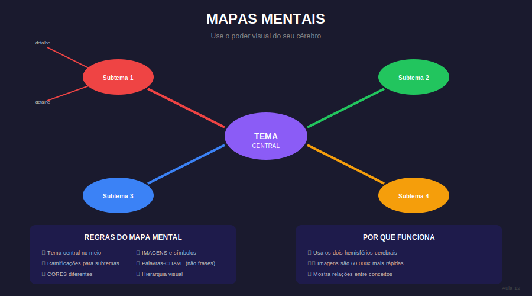

# Aula 12: Mapas Mentais e Técnicas Visuais

## Informações da Aula

| Item | Descrição |
|------|-----------|
| **Módulo** | 1 - Hiperfoco e Hiperprodutividade |
| **Bloco** | Aprendizagem |
| **Duração Estimada** | 20-25 minutos |
| **Nível** | Intermediário |

---

## 1. Roteiro da Aula

### Abertura (2 min)
- Conexão com aula anterior
- Apresentação do tema
- Objetivos da aula

### Desenvolvimento (15-18 min)
#### Parte 1: O poder do pensamento visual (4 min)
- Por que imagens são mais memoráveis
- Hemisférios cerebrais
- Mapas mentais vs. anotações lineares

#### Parte 2: Como criar mapas mentais eficazes (5 min)
- Estrutura radial (centro → ramificações)
- Uso de cores e imagens
- Palavras-chave vs. frases
- Hierarquia e conexões

#### Parte 3: Outras técnicas visuais (4 min)
- Diagramas de fluxo
- Infográficos pessoais
- Sketchnotes
- Linha do tempo visual

#### Parte 4: Quando usar cada técnica (4 min)
- Mapas mentais: brainstorming, resumos
- Fluxogramas: processos, sequências
- Linha do tempo: história, evolução
- Combinando técnicas

### Encerramento (3 min)
- Síntese dos pontos principais
- Atividade prática
- Preview da próxima aula

---

## 2. Narração em Primeira Pessoa

### Abertura

Seu cérebro processa imagens **60.000 vezes mais rápido** que texto. É por isso que você lembra do rosto de alguém mas esquece o nome. Hoje vamos usar esse superpoder visual a favor dos seus estudos.

### Desenvolvimento

**Mapas Mentais** são a ferramenta mais versátil do pensamento visual:

1. Comece com o tema central no meio da página
2. Ramifique para subtemas principais (galhos grossos)
3. Adicione detalhes nos galhos menores
4. Use CORES diferentes para cada ramificação
5. Inclua IMAGENS e SÍMBOLOS
6. Use PALAVRAS-CHAVE, não frases longas

O segredo está nas **conexões visuais** - quando você vê a relação espacial entre conceitos, entende melhor como eles se relacionam.

Outras técnicas complementares:
- **Fluxogramas** para processos com etapas
- **Sketchnotes** para anotações de aulas/palestras
- **Linhas do tempo** para eventos cronológicos

### Encerramento

Técnicas visuais não são "frescura artística" - são ferramentas cognitivas poderosas. Mesmo se você não desenha bem, rabiscos simples já ativam o processamento visual.

---

## 3. Recursos Utilizados

- Slides com conceitos principais
- Infográficos e diagramas
- Templates e checklists
- Materiais complementares

---

## 4. Chamada para Ferramentas e Atividades

### Atividade Prática

1. **Crie um mapa mental** de um tema que está estudando:
   - Tema central claro
   - Mínimo 5 ramificações principais
   - Pelo menos 3 cores diferentes
   - Inclua símbolos ou pequenos desenhos

2. **Teste de retenção:** Sem olhar o mapa, tente recriar a estrutura de memória

3. **Reflexão:** Foi mais fácil lembrar com o mapa visual?

#### Entrega:
Submeta sua atividade na área **"📤 Envio de Atividade - Aula 12"** do Moodle.

---

## 5. Conclusão da Aula

### Resumo dos Pontos-Chave

✅ Conceitos fundamentais apresentados

✅ Técnicas práticas demonstradas

✅ Aplicação imediata possível

✅ Conexão com próximos conteúdos

---

*Aula 12 de 30 - Curso Foco e Produtividade nos Estudos - Educa com Talento*

## Infográfico da Aula

A estrutura visual de um Mapa Mental mostra como usar o poder visual do cérebro.

> **Dica de uso**: Este infográfico pode ser exibido durante a videoaula ou disponibilizado como material de apoio para download.

