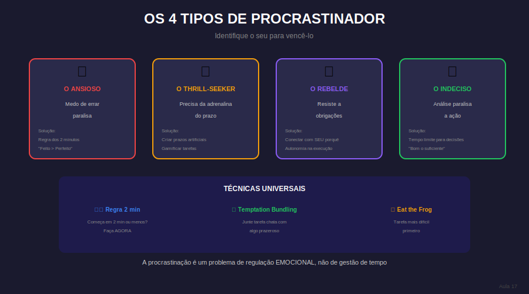

# Aula 17: Procrastinação: Entendendo e Superando

## Informações da Aula

| Item | Descrição |
|------|-----------|
| **Módulo** | 1 - Hiperfoco e Hiperprodutividade |
| **Bloco** | Produtividade |
| **Duração Estimada** | 23 minutos |
| **Nível** | Intermediário |

---

## 1. Roteiro da Aula

### Abertura (2 min)
- Procrastinação não é preguiça
- O que realmente está por trás
- Por que força de vontade não é a solução

### Desenvolvimento (18 min)

#### Parte 1: A psicologia da procrastinação (5 min)
- Evitação de desconforto
- Medo do fracasso (e do sucesso)
- Perfeccionismo paralisante
- Falta de clareza

#### Parte 2: Os tipos de procrastinador (4 min)
- O Perfeccionista
- O Sonhador
- O Rebelde
- O Ansioso
- Identificando seu padrão

#### Parte 3: Técnicas de superação (6 min)
- Regra dos 2 minutos
- Temptation bundling
- Compromissos públicos
- Quebrando em micro-tarefas
- Removendo decisões

#### Parte 4: Prevenção (3 min)
- Sistema vs. Decisão
- Planejamento do dia anterior
- Accountability partner

### Encerramento (3 min)

---

## 2. Narração em Primeira Pessoa

### Abertura

Procrastinação não é preguiça. Não é falta de caráter. Não é falta de vontade. É um mecanismo de **evitação de desconforto** que todo ser humano tem.

Hoje vamos entender de verdade por que você procrastina - e mais importante, como parar.

### Desenvolvimento

**Por que procrastinamos:**
Seu cérebro prefere prazer imediato a recompensa futura. Estudar é desconfortável AGORA; os benefícios vêm DEPOIS. Seu cérebro primitivo não gosta dessa equação.

**O que realmente está por trás:**
- **Evitação de desconforto:** O assunto é difícil, chato ou cansativo
- **Medo do fracasso:** Se não tentar, não pode falhar
- **Medo do sucesso:** E se der certo e as expectativas aumentarem?
- **Perfeccionismo:** Se não posso fazer perfeito, melhor não fazer
- **Falta de clareza:** Não sei por onde começar

**Técnicas que funcionam:**

1. **Regra dos 2 minutos:** Se você consegue se comprometer com 2 minutos, o impulso de continuar geralmente surge

2. **Temptation Bundling:** Una algo que precisa fazer com algo que quer fazer. Só pode ouvir podcast favorito enquanto revisa

3. **Micro-tarefas:** "Estudar matemática" vira "Resolver exercício 1 da página 45". Quanto mais específico, menos assustador

4. **Remova decisões:** Não decida SE vai estudar, apenas QUANDO e O QUÊ

5. **Compromisso público:** Conte a alguém sua meta. A vergonha social é motivadora

**Prevenção:**
Planeje no dia anterior. Quando você acorda e já sabe exatamente o que fazer, a procrastinação tem menos espaço.

### Encerramento

Procrastinação é humana. O objetivo não é nunca mais procrastinar - é ter ferramentas para sair dela rapidamente quando acontecer.

---

## 3. Recursos Utilizados

- Teste: Qual seu tipo de procrastinador?
- Infográfico: Técnicas anti-procrastinação
- Template: Planejamento do dia anterior
- Lista: Micro-tarefas para tarefas comuns

---

## 4. Chamada para Ferramentas e Atividades

### Atividade Prática: "Dissecando Minha Procrastinação"

1. **Identifique** 3 tarefas que você tem procrastinado

2. **Para cada uma, analise:**
   - O que estou evitando? (desconforto, medo, perfeccionismo?)
   - Qual o gatilho da procrastinação?
   - O que faço em vez disso?

3. **Aplique técnicas:**
   - Quebre em micro-tarefas
   - Planeje os primeiros 2 minutos
   - Defina um compromisso público

4. **Execute e registre** o resultado

#### Entrega:
Submeta sua análise + resultado da aplicação na área **"📤 Envio de Atividade - Aula 17"**.

---

## 5. Conclusão da Aula

✅ Procrastinação = evitação de desconforto, não preguiça

✅ Tipos: perfeccionista, sonhador, rebelde, ansioso

✅ Técnicas: 2 minutos, bundling, micro-tarefas

✅ Prevenção: planejamento prévio + sistemas

> "Você não precisa estar motivado para começar. Mas frequentemente, começar te motiva."

---

*Aula 17 de 30 - Curso Foco e Produtividade nos Estudos - Educa com Talento*

## Infográfico da Aula

Os 4 Tipos de Procrastinador ajudam você a identificar seu padrão e aplicar a solução.

> **Dica de uso**: Este infográfico pode ser exibido durante a videoaula ou disponibilizado como material de apoio para download.

