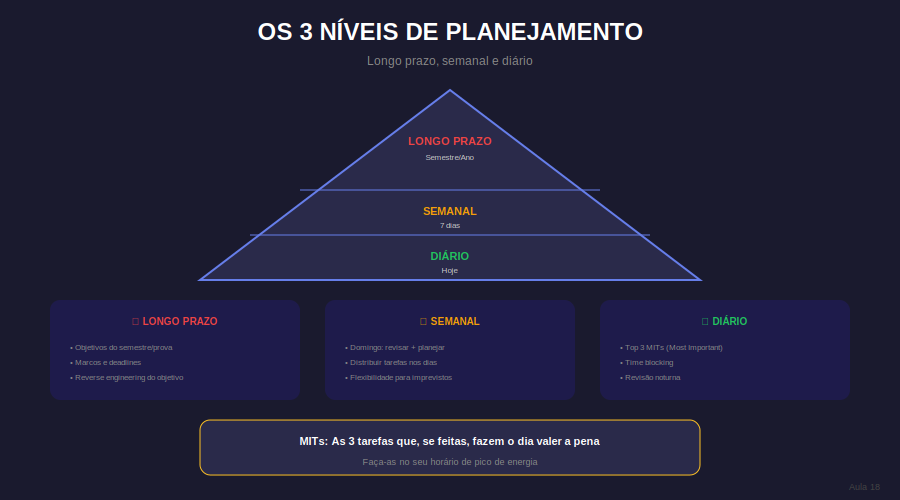

# Aula 18: Planejamento Estratégico Pessoal

## Informações da Aula

| Item | Descrição |
|------|-----------|
| **Módulo** | 1 - Hiperfoco e Hiperprodutividade |
| **Bloco** | Produtividade |
| **Duração Estimada** | 22 minutos |
| **Nível** | Intermediário |

---

## 1. Roteiro da Aula

### Abertura (2 min)
- Sem plano = à deriva
- Os níveis de planejamento
- Estratégico vs. Operacional

### Desenvolvimento (17 min)

#### Parte 1: Planejamento de longo prazo (4 min)
- Definindo objetivos macro (concurso, prova, formatura)
- Reverse engineering: do objetivo ao hoje
- Marcos e milestones

#### Parte 2: Planejamento semanal (5 min)
- A revisão semanal
- Alocando blocos de estudo
- Buffers e flexibilidade
- Sunday setup

#### Parte 3: Planejamento diário (5 min)
- As 3 tarefas mais importantes (MITs)
- Time blocking
- Planejando na noite anterior
- Ajustes ao longo do dia

#### Parte 4: Revisão e ajuste (3 min)
- Avaliando o que funcionou
- Ajustando o plano
- Iteração contínua

### Encerramento (3 min)

---

## 2. Narração em Primeira Pessoa

### Abertura

Imagina fazer uma viagem sem mapa, sem GPS, sem saber o destino. Você até anda, mas provavelmente em círculos. Estudar sem planejamento é a mesma coisa.

Hoje você vai aprender a criar seu **mapa de estudo** - do objetivo final até as ações de hoje.

### Desenvolvimento

**Três níveis de planejamento:**

**1. LONGO PRAZO (meses/anos):**
- Qual seu objetivo final? (passar no concurso X, terminar faculdade, etc.)
- Quando precisa estar pronto?
- Reverse engineering: quantas semanas você tem? Quanto conteúdo total? Divida.
- Crie marcos: "Até mês X, ter completado Y"

**2. SEMANAL:**
- No domingo (ou sexta), planeje a semana
- Aloque blocos de estudo no calendário (trate como compromissos)
- Defina o tema principal de cada bloco
- Deixe buffers (imprevistos acontecem)
- Revise: a semana passada funcionou?

**3. DIÁRIO:**
- Na noite anterior, planeje o próximo dia
- Defina 3 MITs (Most Important Tasks) - se você só fizer essas, o dia foi produtivo
- Time blocking: horário X-Y = assunto A
- Mantenha flexível: ajuste se necessário, mas com consciência

**Revisão contínua:**
- Semanalmente: o que funcionou? O que não funcionou?
- Ajuste o plano baseado na realidade
- Plano é um guia, não uma lei imutável

### Encerramento

Um plano ruim executado é melhor que um plano perfeito nunca feito. Comece simples, ajuste semanalmente, melhore continuamente.

---

## 3. Recursos Utilizados

- Template: Planejamento reverso (do objetivo ao hoje)
- Modelo: Revisão semanal
- Template: Planejamento diário com MITs
- Calendário de blocos de estudo

---

## 4. Chamada para Ferramentas e Atividades

### Atividade Prática: "Meu Mapa de Estudo"

1. **Objetivo final:** Defina claramente (o quê, quando)

2. **Reverse engineering:**
   - Quantas semanas/meses até lá?
   - Quanto conteúdo total?
   - Quanto por semana?

3. **Plano semanal:** Monte esta semana
   - Blocos de estudo alocados
   - Temas definidos
   - Buffer incluído

4. **Plano de amanhã:**
   - 3 MITs definidos
   - Horários bloqueados

#### Entrega:
Submeta seu planejamento reverso + plano semanal + plano diário na área **"📤 Envio de Atividade - Aula 18"**.

---

## 5. Conclusão da Aula

✅ Três níveis: longo prazo, semanal, diário

✅ Reverse engineering do objetivo ao hoje

✅ MITs: 3 tarefas que definem um dia produtivo

✅ Revisar e ajustar continuamente

> "Um objetivo sem um plano é apenas um desejo."

---

*Aula 18 de 30 - Curso Foco e Produtividade nos Estudos - Educa com Talento*

## Infográfico da Aula

Os 3 Níveis de Planejamento formam uma pirâmide onde cada nível alimenta o próximo.

> **Dica de uso**: Este infográfico pode ser exibido durante a videoaula ou disponibilizado como material de apoio para download.

