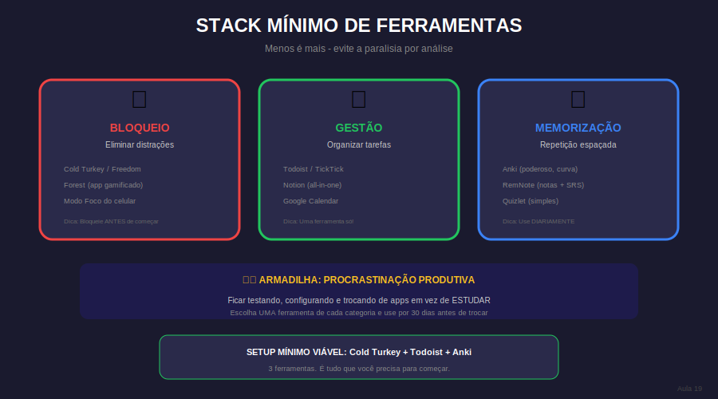

# Aula 19: Ferramentas Digitais para Foco e Produtividade

## Informações da Aula

| Item | Descrição |
|------|-----------|
| **Módulo** | 1 - Hiperfoco e Hiperprodutividade |
| **Bloco** | Produtividade |
| **Duração Estimada** | 20 minutos |
| **Nível** | Intermediário |

---

## 1. Roteiro da Aula

### Abertura (2 min)
- Ferramentas são meios, não fins
- O perigo de colecionar apps
- Minimalismo digital

### Desenvolvimento (15 min)

#### Parte 1: Ferramentas de foco (4 min)
- Bloqueadores de distração (Cold Turkey, Freedom, Forest)
- Apps de Pomodoro
- Música para foco (Brain.fm, Noisli)

#### Parte 2: Ferramentas de organização (4 min)
- Gerenciadores de tarefas (Todoist, Things, Notion)
- Calendários e time blocking
- Second brain (Notion, Obsidian)

#### Parte 3: Ferramentas de memorização (4 min)
- Flashcards (Anki, Quizlet)
- Mapas mentais (XMind, Miro)
- Anotações inteligentes

#### Parte 4: Montando seu stack (3 min)
- Menos é mais
- Integração entre ferramentas
- Testar antes de adotar

### Encerramento (3 min)

---

## 2. Narração em Primeira Pessoa

### Abertura

Existe uma doença moderna chamada "colecionismo de apps". A pessoa baixa 15 ferramentas de produtividade e fica menos produtiva porque passa tempo demais organizando ferramentas.

Hoje vou te mostrar as melhores ferramentas em cada categoria - e mais importante, como escolher POUCAS e usá-las bem.

### Desenvolvimento

**FOCO:**
- **Cold Turkey / Freedom:** Bloqueiam sites e apps. Você define, e não tem como contornar
- **Forest:** Gamifica o foco - plante árvores virtuais que morrem se você sair do app
- **Brain.fm:** Música gerada por IA para foco (não é para todos, mas quem gosta, ama)

**ORGANIZAÇÃO:**
- **Todoist:** Simples, rápido, multiplataforma. Para quem quer tarefas sem complicação
- **Notion:** Canivete suíço. Faz tudo, mas requer tempo para configurar
- **Google Calendar:** Subestimado. Time blocking aqui funciona muito bem

**MEMORIZAÇÃO:**
- **Anki:** O padrão ouro de flashcards com repetição espaçada. Gratuito
- **XMind / Miro:** Mapas mentais bonitos e funcionais
- **Obsidian:** Para quem quer conectar conhecimentos (second brain)

**Seu stack ideal:**
- 1 bloqueador de distração
- 1 gerenciador de tarefas
- 1 sistema de flashcards
- Seu calendário

Não mais que isso inicialmente. Domine essas, depois pense em expandir.

### Encerramento

Ferramentas são amplificadores. Amplificam tanto seus bons hábitos quanto os ruins. Use-as conscientemente.

---

## 3. Recursos Utilizados

- Tabela comparativa: Principais ferramentas por categoria
- Tutorial básico: Anki para iniciantes
- Template: Notion para estudos
- Lista: Configurações recomendadas

---

## 4. Chamada para Ferramentas e Atividades

### Atividade Prática: "Montando Meu Stack Digital"

1. **Avalie** suas ferramentas atuais:
   - O que você usa de verdade?
   - O que tem instalado mas não usa?

2. **Defina seu stack mínimo:**
   - Foco: ___
   - Tarefas: ___
   - Memorização: ___
   - Calendário: ___

3. **Configure** cada uma adequadamente

4. **Use por 1 semana** e avalie: está funcionando?

#### Entrega:
Submeta seu stack definido + screenshot das configurações na área **"📤 Envio de Atividade - Aula 19"**.

---

## 5. Conclusão da Aula

✅ Menos ferramentas, melhor usadas

✅ Foco: bloqueadores + timer + música

✅ Organização: tarefas + calendário + anotações

✅ Memorização: flashcards + mapas mentais

> "A melhor ferramenta é aquela que você realmente usa."

---

*Aula 19 de 30 - Curso Foco e Produtividade nos Estudos - Educa com Talento*

## Infográfico da Aula

O Stack Mínimo de Ferramentas mostra as 3 categorias essenciais.

> **Dica de uso**: Este infográfico pode ser exibido durante a videoaula ou disponibilizado como material de apoio para download.

