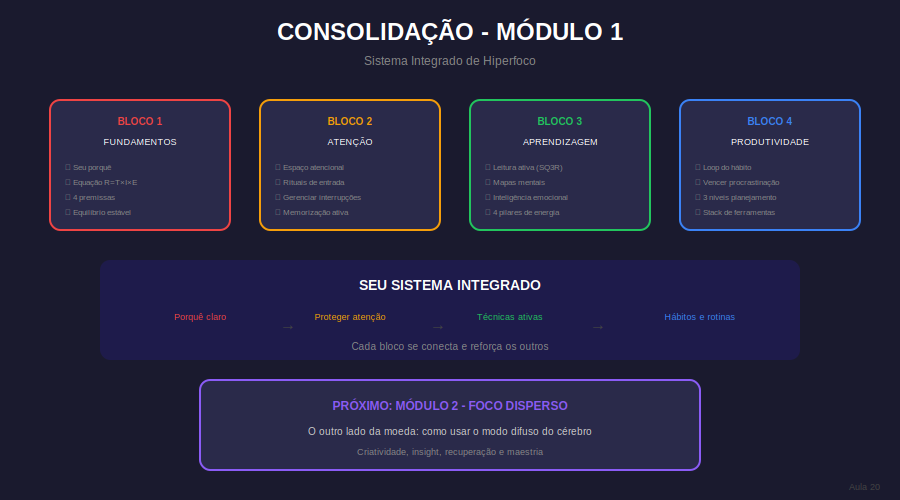

# Aula 20: Consolidação do Módulo 1 - Hiperfoco Integrado

## Informações da Aula

| Item | Descrição |
|------|-----------|
| **Módulo** | 1 - Hiperfoco e Hiperprodutividade |
| **Bloco** | Produtividade (Fechamento) |
| **Duração Estimada** | 25 minutos |
| **Nível** | Intermediário |

---

## 1. Roteiro da Aula

### Abertura (2 min)
- Chegamos ao fim do Módulo 1!
- O caminho percorrido
- Integrando tudo

### Desenvolvimento (20 min)

#### Parte 1: Revisão dos fundamentos (5 min)
- Hiperfoco e hiperprodutividade (Aula 2)
- As 4 premissas (Aula 3)
- Foco direcionado (Aula 4)
- Equilíbrio estável (Aula 5)

#### Parte 2: Revisão de atenção (5 min)
- Espaço atencional (Aula 6)
- Rituais (Aula 7)
- Interrupções (Aula 8)
- Ladrões de tempo (Aula 9)
- Memorização (Aula 10)

#### Parte 3: Revisão de aprendizagem e produtividade (5 min)
- Leitura ativa (Aula 11)
- Mapas mentais (Aula 12)
- Inteligência emocional (Aula 13)
- Energia (Aula 14)
- Pomodoro (Aula 15)
- Hábitos (Aula 16)
- Procrastinação (Aula 17)
- Planejamento (Aula 18)
- Ferramentas (Aula 19)

#### Parte 4: Criando seu sistema integrado (5 min)
- Juntando as peças
- Seu protocolo diário de foco
- Seu sistema semanal
- Ajustes contínuos

### Encerramento (3 min)
- O que vem no Módulo 2
- Celebração do progresso
- Preparação para nova fase

---

## 2. Narração em Primeira Pessoa

### Abertura

Parabéns! Você chegou ao final do **Módulo 1**. Isso não é pouco. Em 20 aulas, você construiu uma base sólida de conhecimento sobre foco e produtividade.

Mas conhecimento espalhado não ajuda muito. Hoje vamos **integrar tudo** em um sistema coerente que você pode aplicar no dia a dia.

### Desenvolvimento

**O que você aprendeu:**

**FUNDAMENTOS (1-5):** A teoria por trás do foco
- Hiperfoco é um estado alcançável por escolha
- Sua atenção é limitada e precisa ser protegida
- Foco direcionado traz satisfação, foco seduzido traz vazio
- Equilíbrio estável é sobre sistemas, não força de vontade

**ATENÇÃO (6-10):** Como proteger e usar sua atenção
- Seu espaço atencional comporta 3-4 itens
- Rituais criam condicionamento para entrar em foco
- Interrupções custam 23 minutos
- Ladrões de tempo se disfarçam de produtividade
- Memorização é técnica, não dom

**APRENDIZAGEM (11-15):** Como aprender melhor
- Leitura ativa > releitura passiva
- Visualização potencializa memória
- Emoções afetam aprendizado
- Corpo saudável = mente produtiva
- Ciclos de foco + pausa

**PRODUTIVIDADE (16-19):** Como manter consistência
- Hábitos > motivação
- Procrastinação é evitação, não preguiça
- Planejamento em três níveis
- Ferramentas mínimas, bem usadas

**SEU SISTEMA INTEGRADO:**

1. **Noite anterior:** Planeje 3 MITs para amanhã
2. **Manhã:** Ritual de entrada (5 min)
3. **Sessão de foco:** 45-90 min, unitarefa, sem interrupções
4. **Pausa ativa:** 15 min, sem telas
5. **Repetir:** 2-3 ciclos por período
6. **Fim do dia:** Revisão + captura de aprendizados
7. **Semanal:** Revisão + planejamento da próxima semana

### Encerramento

Você tem todas as peças. Agora é sobre **prática consistente**.

No **Módulo 2**, vamos explorar o outro lado da moeda: o **Foco Disperso**. Você vai descobrir que relaxar a mente de forma estratégica é tão importante quanto focá-la. Criatividade, insights e consolidação de memória acontecem quando a mente vaga - mas de forma intencional.

Continue praticando o que aprendeu no Módulo 1 enquanto avançamos para novos territórios.

---

## 3. Recursos Utilizados

- Mapa mental: Visão geral do Módulo 1
- Checklist: Sistema integrado de foco
- Template: Rotina diária de hiperfoco
- Resumo em 1 página: Conceitos-chave

---

## 4. Chamada para Ferramentas e Atividades

### Atividade Prática: "Meu Sistema Integrado de Hiperfoco"

1. **Revise** todas as atividades que você fez no módulo

2. **Crie seu sistema diário:**
   - Ritual de entrada (qual?)
   - Duração dos blocos de foco (quanto?)
   - Pausas (o que fazer?)
   - Técnicas de estudo (quais?)

3. **Crie seu sistema semanal:**
   - Dia/hora da revisão semanal
   - Como você vai planejar
   - Como vai medir progresso

4. **Execute por 1 semana** e documente

5. **Reflexão final do módulo:**
   - O que mais impactou seus estudos?
   - O que ainda precisa melhorar?
   - O que vai levar para o Módulo 2?

#### Entrega:
Submeta seu sistema integrado + reflexão na área **"📤 Envio de Atividade - Aula 20"**.

---

## 5. Conclusão da Aula

### Resumo do Módulo 1

| Bloco | Aulas | Foco Principal |
|-------|-------|----------------|
| Fundamentos | 1-5 | Teoria e mindset |
| Atenção | 6-10 | Proteção e uso |
| Aprendizagem | 11-15 | Técnicas de estudo |
| Produtividade | 16-20 | Consistência |

### O que vem no Módulo 2

- Aula 21-25: O poder do Foco Disperso
- Aula 26-30: Maestria e sistemas sustentáveis

> "Você não é a mesma pessoa que começou este módulo. Agora você tem conhecimento E ferramentas. Use-os."

---

*Aula 20 de 30 - Curso Foco e Produtividade nos Estudos - Educa com Talento*

## Infográfico da Aula

A Consolidação do Módulo 1 integra visualmente os 4 blocos em um sistema único.

> **Dica de uso**: Este infográfico pode ser exibido durante a videoaula ou disponibilizado como material de apoio para download.

