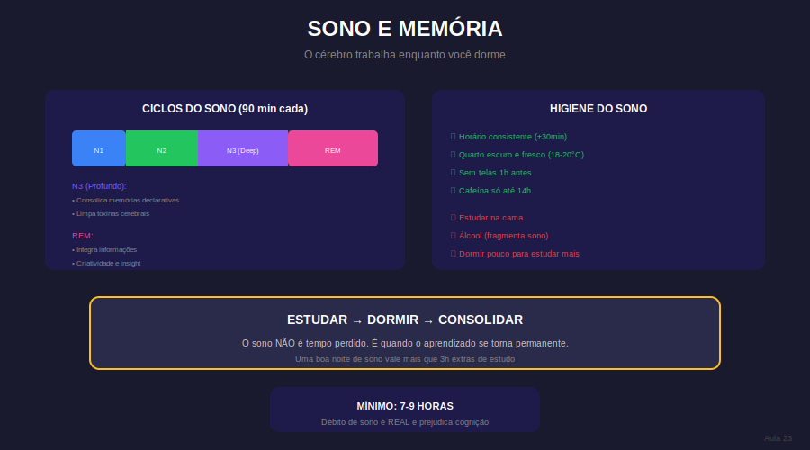

# Aula 23: Sono e Consolidação da Memória

## Informações da Aula

| Item | Descrição |
|------|-----------|
| **Módulo** | 2 - Foco Disperso e Maestria |
| **Bloco** | Foco Disperso |
| **Duração Estimada** | 23 minutos |
| **Nível** | Intermediário |

---

## 1. Roteiro da Aula

### Abertura (2 min)
- O sono não é "tempo perdido"
- O que acontece enquanto você dorme
- Por que estudar até tarde é contraproducente

### Desenvolvimento (18 min)

#### Parte 1: Neurociência do sono e memória (5 min)
- Ciclos de sono (REM e não-REM)
- Consolidação de memórias durante o sono
- Limpeza de toxinas cerebrais (sistema glinfático)
- Sono e criatividade

#### Parte 2: O custo da privação de sono (4 min)
- Impacto na cognição
- Impacto na memória
- Impacto no humor e motivação
- "Dormir pouco para estudar mais" = mito

#### Parte 3: Otimizando seu sono (5 min)
- Quantidade ideal (7-9 horas)
- Qualidade vs. quantidade
- Regularidade do horário
- Ambiente de sono

#### Parte 4: Higiene do sono para estudantes (4 min)
- Rotina noturna
- Evitando telas
- Cafeína e timing
- Cochilos estratégicos

### Encerramento (3 min)

---

## 2. Narração em Primeira Pessoa

### Abertura

"Vou dormir menos para estudar mais." Essa é uma das frases mais autodestrutivas que um estudante pode dizer.

O sono não é desperdício de tempo. É quando seu cérebro faz o trabalho mais importante: **consolidar** tudo que você estudou durante o dia.

### Desenvolvimento

**O que acontece durante o sono:**

Enquanto você dorme, seu cérebro está intensamente ativo:
- **Memórias são consolidadas:** Informação sai da memória de curto prazo e vai para longo prazo
- **Conexões são fortalecidas:** Sinapses importantes se fortalecem, fracas são podadas
- **Toxinas são removidas:** O sistema glinfático "lava" o cérebro
- **Criatividade aumenta:** Conexões improváveis são testadas

Estudar e não dormir é como plantar sementes e não regar.

**O custo da privação:**
- Cada hora de sono perdida reduz performance cognitiva significativamente
- Memória de trabalho diminui (lembra das 3-4 itens? Viram 2)
- Regulação emocional piora (irritabilidade, ansiedade)
- Capacidade de foco despenca

**Otimização:**
- **Quantidade:** 7-9 horas para adultos (não 5, não 6)
- **Regularidade:** Dormir e acordar nos mesmos horários
- **Qualidade:** Quarto escuro, fresco, silencioso
- **Pré-sono:** Rotina de desaceleração (não direto da tela pra cama)

**Higiene do sono:**
- Evite telas 1h antes de dormir (luz azul suprime melatonina)
- Última cafeína até 14h (meia-vida de 5-6 horas)
- Cochilos: máximo 20 minutos, até 15h
- Se não conseguir dormir, não fique na cama rolando

### Encerramento

Sono é parte do estudo, não competição com o estudo. Proteja seu sono como protege seu tempo de foco.

---

## 3. Recursos Utilizados

- Infográfico: Ciclos de sono
- Checklist: Higiene do sono
- Calculadora: Horários ideais de sono
- Artigo: "O que a ciência diz sobre sono e aprendizado"

---

## 4. Chamada para Ferramentas e Atividades

### Atividade Prática: "Otimizando Meu Sono"

1. **Rastreie seu sono** por 1 semana:
   - Hora de dormir, hora de acordar
   - Qualidade (1-10)
   - Como se sentiu no dia seguinte

2. **Implemente 3 mudanças** na higiene do sono

3. **Compare:** Após as mudanças, como está seu foco nos estudos?

#### Entrega:
Submeta seu rastreamento + mudanças + comparação na área **"📤 Envio de Atividade - Aula 23"**.

---

## 5. Conclusão da Aula

✅ Sono consolida memórias e fortalece aprendizado

✅ Privação de sono sabota todo esforço de estudo

✅ 7-9 horas, regularidade, qualidade

✅ Higiene: rotina, sem telas, ambiente adequado

> "Dormir bem não é preguiça. É inteligência estratégica."

---

*Aula 23 de 30 - Curso Foco e Produtividade nos Estudos - Educa com Talento*

## Infográfico da Aula

Os Ciclos do Sono e sua relação com memória.

> **Dica de uso**: Este infográfico pode ser exibido durante a videoaula ou disponibilizado como material de apoio para download.

