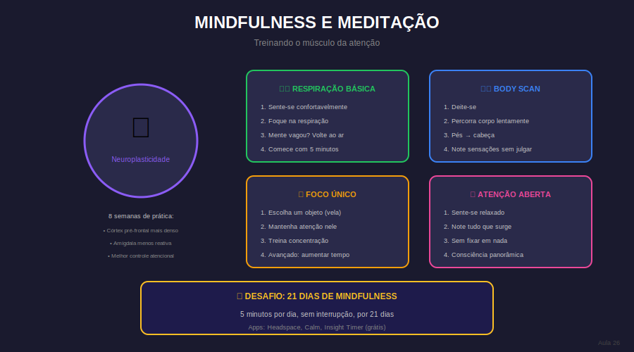

# Aula 26: Mindfulness e Meditação para Foco

## Informações da Aula

| Item | Descrição |
|------|-----------|
| **Módulo** | 2 - Foco Disperso e Maestria |
| **Bloco** | Maestria |
| **Duração Estimada** | 22 minutos |
| **Nível** | Intermediário |

---

## 1. Roteiro da Aula

### Abertura (2 min)
- Início do bloco final: Maestria
- Mindfulness não é misticismo
- Treinamento mental baseado em ciência

### Desenvolvimento (17 min)

#### Parte 1: O que é mindfulness (4 min)
- Definição: atenção plena ao presente
- O que não é (não é "esvaziar a mente")
- A ciência por trás (neuroplasticidade)

#### Parte 2: Benefícios para foco e estudo (4 min)
- Fortalece o "músculo" da atenção
- Reduz ansiedade e ruminação
- Melhora regulação emocional
- Aumenta metacognição

#### Parte 3: Técnicas práticas (6 min)
- Meditação de respiração (básica)
- Body scan
- Atenção plena nas atividades
- Mini-práticas ao longo do dia

#### Parte 4: Construindo o hábito (3 min)
- Começando com 5 minutos
- Consistência > duração
- Apps e recursos
- Integrando na rotina de estudo

### Encerramento (3 min)

---

## 2. Narração em Primeira Pessoa

### Abertura

Mindfulness pode soar como algo esotérico, mas é pura ciência. Décadas de pesquisa mostram que a prática regular de atenção plena **literalmente muda a estrutura do cérebro** - aumentando áreas ligadas ao foco e reduzindo áreas ligadas ao estresse.

Se você quer maestria em foco, mindfulness não é opcional. É treinamento mental.

### Desenvolvimento

**O que é mindfulness:**

É simplesmente prestar atenção ao momento presente, com intenção e sem julgamento.

Não é esvaziar a mente (impossível). É perceber quando a mente vagueia e gentilmente trazê-la de volta.

E cada vez que você faz isso, está **fortalecendo seu córtex pré-frontal** - a parte do cérebro responsável pelo foco.

**Benefícios comprovados:**
- Maior capacidade de sustentar atenção
- Menor reatividade emocional
- Redução de ansiedade e ruminação
- Melhor percepção de quando está distraído

**Prática básica (meditação de respiração):**
1. Sente-se confortavelmente, coluna ereta
2. Feche os olhos ou olhe para baixo
3. Foque na sensação da respiração (nariz, peito ou abdômen)
4. Quando a mente vaguear (vai vaguear), gentilmente volte
5. Sem julgamento - cada retorno é um "rep" de treino

**Construindo o hábito:**
- Comece com 5 minutos/dia - não mais
- Mesmo horário todo dia (manhã funciona bem)
- Apps como Headspace, Calm, ou Insight Timer ajudam
- Depois de 2 semanas, aumente gradualmente

### Encerramento

Mindfulness é como academia para sua mente. Não espere resultados em uma semana. Mas com prática consistente, você vai notar diferença significativa em sua capacidade de foco e em seu bem-estar geral.

---

## 3. Recursos Utilizados

- Áudio: Meditação guiada de 5 minutos
- Infográfico: Benefícios do mindfulness no cérebro
- Lista: Apps de meditação recomendados
- Guia: Construindo o hábito de meditar

---

## 4. Chamada para Ferramentas e Atividades

### Atividade Prática: "21 Dias de Mindfulness"

1. **Comprometa-se** com 5 minutos diários por 21 dias

2. **Registre diariamente:**
   - Conseguiu fazer? (S/N)
   - Duração real
   - Observações (como se sentiu, dificuldades)

3. **Na semana 3:** Aumente para 10 minutos

4. **Reflexão final:**
   - O que mudou na sua capacidade de foco?
   - O que foi mais desafiador?
   - Vai continuar?

#### Entrega:
Submeta seu registro de 21 dias + reflexão na área **"📤 Envio de Atividade - Aula 26"**.

---

## 5. Conclusão da Aula

✅ Mindfulness = atenção plena, baseada em ciência

✅ Fortalece literalmente as áreas cerebrais de foco

✅ Prática básica: foco na respiração, retornar sem julgamento

✅ Comece com 5 min/dia, consistência é tudo

> "Meditar não é parar de pensar. É perceber que você está pensando."

---

*Aula 26 de 30 - Curso Foco e Produtividade nos Estudos - Educa com Talento*

## Infográfico da Aula

As 4 Técnicas de Meditação para treinar o músculo da atenção.

> **Dica de uso**: Este infográfico pode ser exibido durante a videoaula ou disponibilizado como material de apoio para download.

