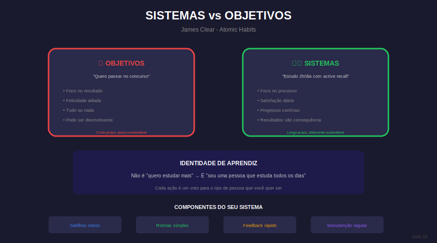

# Aula 29: Construindo Sistemas Sustentáveis

## Informações da Aula

| Item | Descrição |
|------|-----------|
| **Módulo** | 2 - Foco Disperso e Maestria |
| **Bloco** | Maestria |
| **Duração Estimada** | 22 minutos |
| **Nível** | Avançado |

---

## 1. Roteiro da Aula

### Abertura (2 min)
- Penúltima aula do curso
- De técnicas isoladas para sistema integrado
- Sustentabilidade no longo prazo

### Desenvolvimento (17 min)

#### Parte 1: Sistemas vs. Objetivos (4 min)
- Por que sistemas superam metas
- O problema do foco apenas em resultados
- Identidade > Resultado

#### Parte 2: Seu sistema de estudo completo (6 min)
- Componentes: rotina, rituais, ambiente, ferramentas
- Ciclo diário, semanal, mensal
- Flexibilidade dentro de estrutura

#### Parte 3: Manutenção do sistema (4 min)
- Revisões periódicas
- Ajustes e iteração
- Quando quebrar as regras
- Evoluindo com você

#### Parte 4: Mentalidade de longo prazo (3 min)
- Estudar para a vida, não só para a prova
- Aprendizado contínuo
- Identidade de pessoa que aprende

### Encerramento (3 min)

---

## 2. Narração em Primeira Pessoa

### Abertura

Você aprendeu dezenas de técnicas neste curso. Mas técnicas soltas não mudam vidas. **Sistemas** mudam.

Hoje vamos integrar tudo que você aprendeu em um sistema sustentável que vai funcionar não só esta semana, mas pelos próximos anos.

### Desenvolvimento

**Sistemas vs. Objetivos:**

"Quero passar no concurso" é um objetivo.
"Todo dia às 8h eu estudo por 2 horas" é um sistema.

A diferença crucial:
- Objetivos são sobre resultados (futuro)
- Sistemas são sobre processos (presente)

Quando você foca no sistema, o resultado vem como consequência. E mais importante: quando atinge um objetivo, você continua. Porque não é sobre a meta - é sobre quem você se tornou.

**Seu sistema completo:**

1. **Ambiente** - Otimizado para foco (Aula 3, 5)
2. **Rituais** - Entrada e saída do foco (Aula 7)
3. **Blocos de estudo** - Com pausas estratégicas (Aula 15)
4. **Técnicas de aprendizado** - Leitura ativa, mapas, flashcards (Aulas 10-12)
5. **Alternância** - Focado e difuso (Aula 25)
6. **Recuperação** - Pausas, sono, descanso (Aulas 23, 27)
7. **Revisão** - Semanal e mensal (Aula 18)

**Manutenção:**

Sistemas não são estáticos:
- Revisão semanal: O que funcionou? O que ajustar?
- Revisão mensal: Estou progredindo? O sistema precisa de mudanças maiores?
- Flexibilidade: Regras existem para servir você, não o contrário
- Evolução: Conforme você cresce, o sistema cresce junto

**Mentalidade de longo prazo:**

Não estude apenas para passar na prova. Estude para se tornar uma pessoa que aprende.

A diferença é enorme:
- Foco em prova: para quando passa
- Foco em aprendizado: dura a vida toda

Sua identidade define seus hábitos. Se você se vê como "alguém que estuda todo dia", estudar deixa de ser esforço e vira quem você é.

### Encerramento

Você tem todas as peças. Agora é sobre montar SEU sistema, único para você, e mantê-lo vivo ao longo do tempo.

---

## 3. Recursos Utilizados

- Template: Sistema de estudo completo
- Checklist: Revisão semanal
- Checklist: Revisão mensal
- Diagrama: Os componentes do sistema

---

## 4. Chamada para Ferramentas e Atividades

### Atividade Prática: "Documentando Meu Sistema"

1. **Escreva seu sistema completo:**
   - Ambiente: Como é/será?
   - Rituais: Quais uso?
   - Rotina diária: Horários e blocos
   - Técnicas: Quais priorizo?
   - Recuperação: Como descanso?

2. **Defina ciclos de revisão:**
   - Semanal: Quando? O que avaliar?
   - Mensal: Quando? O que avaliar?

3. **Declare sua identidade:**
   - Complete: "Eu sou uma pessoa que ___"

4. **Execute por 2 semanas** e faça primeira revisão

#### Entrega:
Submeta seu sistema documentado + primeira revisão na área **"📤 Envio de Atividade - Aula 29"**.

---

## 5. Conclusão da Aula

✅ Sistemas > Objetivos para sustentabilidade

✅ Integre: ambiente, rituais, blocos, técnicas, recuperação

✅ Manutenção: revisão semanal/mensal, flexibilidade

✅ Mentalidade: identidade de aprendiz contínuo

> "Você não sobe ao nível dos seus objetivos. Você cai ao nível dos seus sistemas." - James Clear

---

*Aula 29 de 30 - Curso Foco e Produtividade nos Estudos - Educa com Talento*

## Infográfico da Aula

Sistemas vs Objetivos (James Clear).

> **Dica de uso**: Este infográfico pode ser exibido durante a videoaula ou disponibilizado como material de apoio para download.

