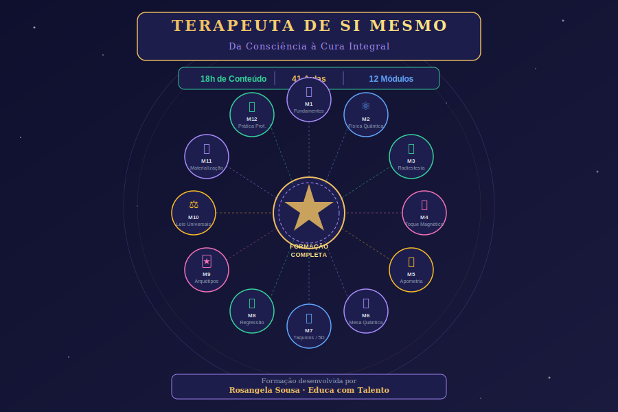
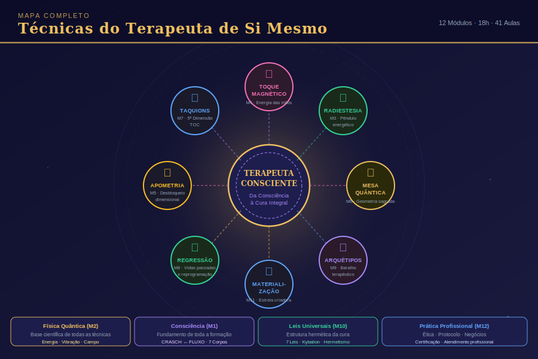
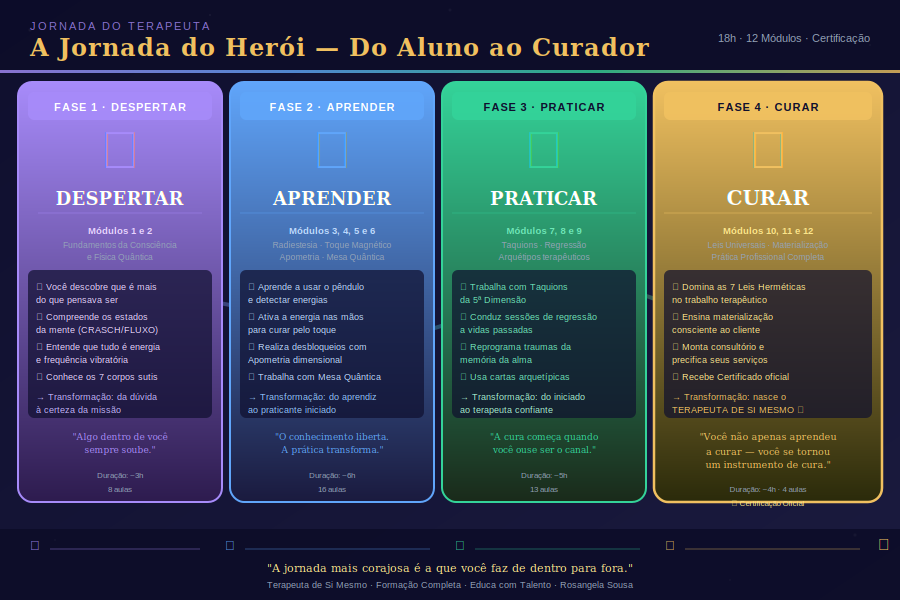

# TERAPEUTA DE SI MESMO
## Formação Completa em Terapia Holística, Energética e Quântica

---

```
╔══════════════════════════════════════════════════════════════════╗
║          TERAPEUTA DE SI MESMO                                    ║
║   Formação Completa em Terapia Holística, Energética e Quântica  ║
║                                                                  ║
║   🌿 Desperte o Terapeuta que Existe em Você                     ║
║   🔮 Da Consciência à Cura Integral                              ║
╚══════════════════════════════════════════════════════════════════╝
```

---

## 📋 Identificação do Curso

| Item | Descrição |
|------|-----------|
| **Nome** | TERAPEUTA DE SI MESMO |
| **Subtítulo** | Formação Completa em Terapia Holística, Energética e Quântica |
| **Carga Horária** | 18 horas |
| **Modalidade** | Online (EAD) |
| **Nível** | Iniciante ao Avançado |
| **Certificação** | Terapeuta Holístico — Terapia Energética Quântica |
| **Plataforma** | Hotmart / Kiwify |
| **Público-alvo** | Pessoas em busca de autoconhecimento e/ou atuação profissional como terapeuta |

---



*Infográfico de visão geral do curso — estrutura, módulos e jornada de formação.*

---

## 🎯 Proposta do Curso

O **TERAPEUTA DE SI MESMO** é uma formação completa que conduz o aluno por uma jornada profunda de autoconhecimento, expansão da consciência e domínio das principais técnicas de terapia energética e holística praticadas no Brasil.

Diferente de cursos puramente teóricos, esta formação combina **fundamentação científica** (Física Quântica, Neurociência, Psicologia Analítica) com **técnicas práticas** validadas por décadas de aplicação terapêutica — permitindo que o aluno passe a atuar como terapeuta ainda durante o curso.

A proposta é transformadora em dois níveis:
1. **Pessoal**: Expansão da consciência, cura de padrões limitantes, equilíbrio energético próprio
2. **Profissional**: Formação completa para atendimentos individuais e em grupo como terapeuta holístico

---

## 🌟 Diferenciais do Curso

- ✅ **Fundamentação quântica e científica** — técnicas explicadas pela ótica da Física Quântica e Neurociência
- ✅ **12 módulos progressivos** — do básico ao avançado, com sequência pedagógica cuidadosa
- ✅ **Práticas guiadas em vídeo** — aprenda fazendo, com protocolos passo a passo
- ✅ **Roteiros de atendimento** — templates prontos para usar no consultório
- ✅ **Certificado de Formação** — válido para atuação profissional como Terapeuta Holístico
- ✅ **Comunidade de terapeutas** — acesso a grupo exclusivo de alunos e mentoria
- ✅ **Atualizações vitalícias** — o curso é atualizado e você acessa as novidades

---

## 📚 Estrutura Completa

### MÓDULO 1 — Fundamentos da Consciência e Energia (1h30)
> *"Antes de curar o outro, é preciso compreender a si mesmo"*

- Aula 01: Apresentação — Sua Jornada como Terapeuta de Si Mesmo *(Videoaula 20min)*
- Aula 02: Estados da Mente — Do CRASCH ao Fluxo de Consciência *(Videoaula 25min)*
- Aula 03: Anatomia Energética — Os Corpos Sutis e os Chacras *(Videoaula 30min)*
- Aula 04: Frequência Vibratória e Saúde Integral *(Videoaula 25min)*
- Prática 01: Exercício de Percepção e Escaneamento Energético
- Avaliação: Quiz de Fundamentos

### MÓDULO 2 — Física Quântica e Espiritualidade (1h30)
> *"A ciência confirma o que os antigos já sabiam"*

- Aula 05: O Universo Quântico e a Consciência *(Videoaula 25min)*
- Aula 06: Frequência, Vibração e a Lei da Ressonância *(Videoaula 25min)*
- Aula 07: Água, Memória Celular e Intenção (Masaru Emoto) *(Videoaula 20min)*
- Prática 02: Experimento da Água com Intenção
- Avaliação: Quiz Quântico

### MÓDULO 3 — Radiestesia e Diagnóstico Energético (2h)
> *"Aprenda a ler o que os olhos não veem"*

- Aula 08: O que é Radiestesia — História e Fundamentos *(Videoaula 25min)*
- Aula 09: O Pêndulo — Calibração e Comunicação Energética *(Videoaula 30min)*
- Aula 10: Radiônica — Equilíbrio e Transmissão de Energia *(Videoaula 25min)*
- Aula 11: Diagnóstico Energético — Protocolo Completo *(Videoaula 25min)*
- Prática 03: Calibração do Pêndulo (guiada)
- Prática 04: Diagnóstico Energético Básico
- Avaliação: Quiz de Radiestesia

### MÓDULO 4 — Toque Magnético e Imposição de Mãos (2h)
> *"As mãos que curam carregam o magnetismo da vida"*

- Aula 12: Anton Mesmer e a Energia Animal *(Videoaula 20min)*
- Aula 13: Respiração Terapêutica — Gerando e Ampliando Energia *(Videoaula 25min)*
- Aula 14: Técnica do Toque Magnético — Passo a Passo *(Videoaula 30min)*
- Aula 15: Aplicações, Contraindicações e Autocuidado do Terapeuta *(Videoaula 25min)*
- Prática 05: Sequência Completa de Toque Magnético
- Avaliação: Quiz de Toque Magnético

### MÓDULO 5 — Apometria: Equilíbrio Multidimensional (2h)
> *"Liberte o que o tempo ainda carrega"*

- Aula 16: O que é Apometria e Como Ela Funciona *(Videoaula 25min)*
- Aula 17: Karma, Reencarnação e Bloqueios de Vidas Passadas *(Videoaula 25min)*
- Aula 18: Tipos de Obsessão — Diagnóstico e Tratamento *(Videoaula 30min)*
- Aula 19: Protocolo de Apometria Avançada *(Videoaula 30min)*
- Prática 06: Meditação de Desobstrução Multidimensional
- Avaliação: Quiz de Apometria

### MÓDULO 6 — Mesa Quântica (1h30)
> *"Um portal dimensional para a cura profunda"*

- Aula 20: Introdução à Mesa Quantiônica *(Videoaula 25min)*
- Aula 21: Geometria Sagrada, Símbolos e Intenção *(Videoaula 25min)*
- Aula 22: Protocolo Completo de Atendimento com Mesa Quântica *(Videoaula 30min)*
- Prática 07: Operação da Mesa Quântica — Guia Prático
- Avaliação: Quiz de Mesa Quântica

### MÓDULO 7 — Taquions TOC e Quinta Dimensão (1h30)
> *"Acesse a frequência mais elevada de cura"*

- Aula 23: A Energia de Quinta Dimensão *(Videoaula 25min)*
- Aula 24: Técnica Taquions TOC — Protocolo Completo *(Videoaula 30min)*
- Aula 25: Tratamento de Doenças e Bloqueios Crônicos *(Videoaula 25min)*
- Prática 08: Sequência Taquions TOC Guiada
- Avaliação: Quiz Taquions

### MÓDULO 8 — Regressão com Reprogramação (2h)
> *"Reescreva a história que não te serve mais"*

- Aula 26: Fundamentos da Regressão Consciente *(Videoaula 25min)*
- Aula 27: Reprogramação Celular — DNA e Memória Emocional *(Videoaula 25min)*
- Aula 28: Protocolo de Regressão sem Hipnose *(Videoaula 30min)*
- Aula 29: Novos Significados — A Arte da Cura Emocional *(Videoaula 25min)*
- Prática 09: Exercício de Ressignificação Guiada
- Avaliação: Quiz de Regressão

### MÓDULO 9 — Arquétipos e Terapia Holística (1h30)
> *"As imagens que curam vêm de dentro"*

- Aula 30: Arquétipos e o Inconsciente Coletivo (Jung) *(Videoaula 25min)*
- Aula 31: O Baralho Terapêutico como Ferramenta de Cura *(Videoaula 25min)*
- Aula 32: Leitura Intuitiva e Condução Terapêutica *(Videoaula 25min)*
- Prática 10: Sessão Prática com Baralho Terapêutico
- Avaliação: Quiz de Arquétipos

### MÓDULO 10 — Leis Universais e Cosmoética (1h30)
> *"Viva em harmonia com as leis que regem tudo"*

- Aula 33: As 7 Leis Universais Herméticas *(Videoaula 25min)*
- Aula 34: Ética, Moral e Cosmoética no Atendimento Terapêutico *(Videoaula 25min)*
- Aula 35: Amor Incondicional — O Fundamento de Todo Processo de Cura *(Videoaula 20min)*
- Prática 11: Reflexão dos Tipos de Amor (Exercício Filosófico)
- Avaliação: Quiz das Leis Universais

### MÓDULO 11 — Materialização Consciente (1h)
> *"Você cria sua realidade com cada pensamento e emoção"*

- Aula 36: A Estrela de Materialização — Alquimia dos Quatro Elementos *(Videoaula 25min)*
- Aula 37: Pensamentos, Emoções e Criação da Realidade *(Videoaula 25min)*
- Prática 12: Mapa de Criação Consciente
- Avaliação: Quiz de Materialização

### MÓDULO 12 — Prática Profissional e Consultório (1h30)
> *"É hora de voar com suas próprias asas"*

- Aula 38: Como Montar e Estruturar Seu Consultório *(Videoaula 25min)*
- Aula 39: Protocolo de Atendimento Completo — Do Acolhimento ao Encerramento *(Videoaula 30min)*
- Aula 40: Ética Profissional, Precificação e Marketing Terapêutico *(Videoaula 25min)*
- Aula 41: Encerramento — Sua Missão como Terapeuta de Si Mesmo *(Videoaula 15min)*
- Prática 13: Simulação de Atendimento Completo
- Avaliação Final: Estudo de Caso Terapêutico

---

## 👩‍🏫 Sobre a Terapeuta e Professora

**Rosangela Sousa** é psicanalista, neurocientista da educação, terapeuta holística e radiestesista certificada. Com formação sólida em terapias energéticas e mais de uma década de prática, ela une o rigor científico da neurociência com a profundidade das terapias integrativas para oferecer uma formação única no mercado.

> *"Cada pessoa que se forma terapeuta de si mesmo leva cura não apenas para seus clientes, mas para toda a sua família e comunidade. A terapia começa em nós."*

---



*Infográfico do mapa das técnicas terapêuticas — visão integrada de todas as abordagens do curso.*

---

## 🎓 Certificação

Ao concluir todos os módulos e a avaliação final, o aluno recebe o **Certificado de Formação em Terapia Holística, Energética e Quântica — Terapeuta de Si Mesmo**, emitido pela Educa com Talento.

**O certificado contempla:**
- Formação em Terapia Energética Integral
- Técnicas: Toque Magnético, Radiestesia, Apometria, Regressão com Reprogramação, Mesa Quântica, Taquions TOC
- Fundamentos de Física Quântica Aplicada à Saúde
- Ética e Prática Profissional

---

## 📊 Infográficos do Curso

| Infográfico | Arquivo |
|---|---|
| Visão Geral do Curso | [curso-visao-geral.svg](infograficos/curso-visao-geral.svg) |
| Módulo 1 — Fundamentos | [modulo-01-fundamentos.svg](infograficos/modulo-01-fundamentos.svg) |
| Módulo 2 — Física Quântica | [modulo-02-fisica-quantica.svg](infograficos/modulo-02-fisica-quantica.svg) |
| Módulo 3 — Radiestesia | [modulo-03-radiestesia.svg](infograficos/modulo-03-radiestesia.svg) |
| Módulo 4 — Toque Magnético | [modulo-04-toque-magnetico.svg](infograficos/modulo-04-toque-magnetico.svg) |
| Módulo 5 — Apometria | [modulo-05-apometria.svg](infograficos/modulo-05-apometria.svg) |
| Módulo 6 — Mesa Quântica | [modulo-06-mesa-quantica.svg](infograficos/modulo-06-mesa-quantica.svg) |
| Módulo 7 — Taquions TOC | [modulo-07-taquions-toc.svg](infograficos/modulo-07-taquions-toc.svg) |
| Módulo 8 — Regressão | [modulo-08-regressao.svg](infograficos/modulo-08-regressao.svg) |
| Módulo 9 — Arquétipos | [modulo-09-arquetipos.svg](infograficos/modulo-09-arquetipos.svg) |
| Módulo 10 — Leis Universais | [modulo-10-leis-universais.svg](infograficos/modulo-10-leis-universais.svg) |
| Módulo 11 — Materialização | [modulo-11-materializacao.svg](infograficos/modulo-11-materializacao.svg) |
| Mapa das Técnicas Terapêuticas | [mapa-tecnicas-terapeuticas.svg](infograficos/mapa-tecnicas-terapeuticas.svg) |
| Jornada do Terapeuta | [jornada-terapeuta.svg](infograficos/jornada-terapeuta.svg) |

---



*Infográfico da jornada do terapeuta — do autoconhecimento à atuação profissional.*

---

## 🔗 Referências e Embasamento

### Física Quântica e Consciência
- Bruce Lipton — *A Biologia da Crença* (2005)
- Joe Dispenza — *Quebrando o Hábito de Ser Você Mesmo* (2012)
- Amit Goswami — *O Médico Quântico* (2011)
- Masaru Emoto — *A Mensagem Oculta da Água* (2004)
- Max Planck, Albert Einstein — Física Quântica moderna

### Psicologia Analítica e Arquétipos
- Carl Gustav Jung — *O Homem e Seus Símbolos* (1964)
- James Hollis — *Sob a Sombra de Saturno* (1994)
- Marie-Louise von Franz — *A Individuação nos Contos de Fadas* (1970)

### Terapias Energéticas e Holísticas
- José Lacerda de Azevedo — Apometria (fundador, Brasil)
- Franz Anton Mesmer — Magnetismo Animal (séc. XVIII)
- Madame Lenormand — Baralho Cigano Terapêutico (séc. XVIII-XIX)
- Vera Lúcia Marinzeck de Carvalho — Espiritismo e Saúde (Brasil)

### Regressão e Reprogramação
- Brian Weiss — *Muitas Vidas, Muitos Mestres* (1988)
- Roger Woolger — *Outras Vidas, Outros Eus* (1987)
- Dolores Cannon — Regressão QHHT

### Leis Universais e Filosofia
- Três Iniciados — *O Kybalion* (As 7 Leis Herméticas)
- Mario Sérgio Cortella — Ética e Moral
- Clóvis de Barros Filho — Ética Contemporânea
- Emmanuel/Chico Xavier — Espiritismo Brasileiro

---

*Curso desenvolvido pela Educa com Talento | Meira e Sousa Ltda.*
*Todos os direitos reservados — 2026*
