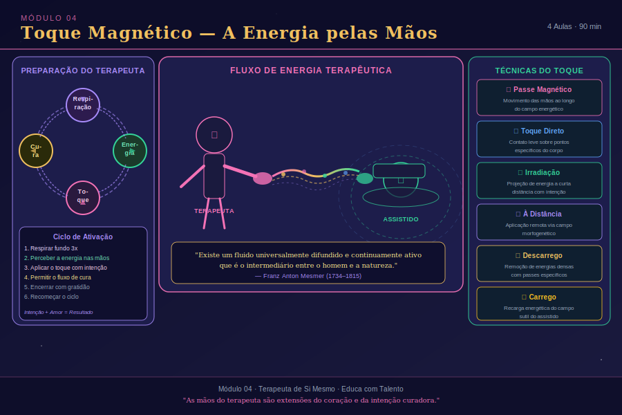

# Aula 12: Mesmer e a Energia Animal — As Raízes do Toque Magnético

## Informações da Aula
| Item | Descrição |
|------|-----------|
| **Módulo** | 4 — Toque Magnético |
| **Duração Estimada** | 35 minutos |
| **Tipo** | Videoaula |
| **Nível** | Iniciante/Intermediário |

---

*Infográfico do Módulo 4 — visão geral dos conceitos e temas abordados.*

---

## 1. Roteiro da Aula

### Abertura (5 min)
- A natureza das mãos como instrumento de cura — universal e ancestral
- Diferença fundamental entre Toque Magnético e imposição de mãos espiritual
- Bem-vindo ao Módulo 4

### Desenvolvimento (25 min)
#### Parte 1: Franz Anton Mesmer — O Pioneiro
- Quem foi Franz Anton Mesmer (1734-1815)
- A teoria do fluido magnético universal e a energia animal
- Os métodos de Mesmer: o bastão de ferro, o baquet, a imposição de mãos
- Os resultados clínicos — casos documentados de cura
- A comissão de Benjamin Franklin (1784) — confirmação das curas, questionamento do mecanismo

#### Parte 2: O que é Energia Animal (Magnetismo Pessoal)
- O magnetismo como força vital que permeia todos os seres vivos
- A diferença entre magnetismo animal e magnetismo mineral
- Anton Mesmer vs. Puységur: hipnose e transe mesmérico
- A ciência por trás do conceito — campos bioeletromagnéticos do corpo humano
- O papel da coerência cardíaca no magnetismo pessoal

#### Parte 3: O Toque Magnético na Contemporaneidade
- Como o Toque Magnético se distingue de outras práticas de imposição de mãos
- O mecanismo da transferência de magnetismo — não canalização, mas geração interna
- Requisitos para o praticante: amor incondicional, equilíbrio mental, entrega ao Mental Superior
- Aplicações contemporâneas — dores físicas, reequilíbrio energético, sedação do sistema nervoso

### Encerramento (5 min)
- Mesmer como precursor injustiçado
- A legitimidade histórica e energética do Toque Magnético
- Preparação para a próxima aula: respiração terapêutica

---

## 2. Narração em Primeira Pessoa (Roteiro de Gravação)

### Abertura

Querida, bem-vinda ao Módulo 4!

Olhe para as suas mãos por um momento. Apenas olhe. Observe as linhas, as curvas, a textura da pele. Essas mãos que você usa para escrever, para cozinhar, para abraçar as pessoas que ama.

Agora, esfregue-as suavemente por 10 segundos. E separe-as ligeiramente. Você sente o calor? Aquele leve formigamento? Aquela sensação de que há algo entre as palmas, mesmo que os olhos não vejam nada?

Essa sensação não é imaginação. É a percepção inicial — ainda despertando, ainda rudimentar — de algo que a humanidade conhece e usa há milênios: o poder curativo das mãos humanas.

Em todas as culturas, em todas as épocas, em todas as tradições espirituais, o gesto de colocar as mãos sobre quem está sofrendo é universal. O curandeiro da tribo que coloca as mãos sobre o doente. O pai que instintivamente coloca a mão na testa do filho com febre. A amiga que, ao ver outra chorar, coloca a mão nas costas dela sem dizer uma palavra. O médico que, além do estetoscópio, toca o paciente com cuidado e intenção.

Esse gesto primitivo, ancestral e universal tem uma base que vai muito além do conforto psicológico. Tem base física. Tem base energética. E tem um nome: Toque Magnético.

Hoje vamos conhecer a história fascinante desse nome — e a história do homem que, no século XVIII, ousou sistematizá-lo e apresentá-lo ao mundo científico da sua época: Franz Anton Mesmer.

### Desenvolvimento

**Franz Anton Mesmer — O Pioneiro que a História Subestimou**

Franz Anton Mesmer nasceu em 1734 em Iznang, uma pequena cidade à beira do Lago Constança, na atual Alemanha. Filho de um guarda florestal, demonstrou desde cedo uma inteligência extraordinária. Estudou teologia, filosofia e finalmente medicina na Universidade de Viena — onde se tornou doutor em medicina em 1766.

Sua tese de doutorado — "De Planetarum Influxu" — já apontava para os temas que dominariam a sua vida inteira: a influência de forças invisíveis (especialmente magnéticas e gravitacionais) sobre a saúde humana. Mesmer propunha que, assim como a lua influencia as marés, havia um fluxo cósmico que influenciava os fluidos do corpo humano.

Mas foi em Viena, praticando medicina, que Mesmer começou a desenvolver o que se tornaria a sua descoberta mais ousada.

Ele observou que alguns dos seus pacientes — especialmente os que sofriam de doenças que hoje chamaríamos de psicossomáticas — melhoravam de forma notável quando submetidos a uma técnica específica: a imposição de mãos com intenção de direcionar um "fluido magnético" através do corpo doente, desbloquear obstruções e restaurar o fluxo harmonioso dessa energia.

Mesmer chamou esse fluido de **magnetismo animal** — distinguindo-o do magnetismo mineral (dos ímãs comuns) e do magnetismo vegetal. O "animal" não se referia a animais não-humanos — mas à *anima*, a alma, o princípio vital. O magnetismo animal era, para Mesmer, a força vital que permeava e animava todos os seres vivos.

**Os Métodos de Mesmer**

Mesmer desenvolveu vários métodos de trabalho com o magnetismo animal, que foram evoluindo ao longo da sua carreira:

**A imposição de mãos direta**: O mais simples e fundamental. Mesmer passava as mãos sobre o corpo do paciente, às vezes em contato, às vezes a poucos centímetros da superfície corporal, com intenção de direcionar o magnetismo para áreas de bloqueio. Relatou resultados notáveis — convulsões que cessavam, dores que aliviavam, paralisias que se recuperavam parcialmente.

**O bastão de ferro**: Mesmer descobriu que havia formas de armazenar e transmitir o magnetismo através de objetos físicos. Usava bastões de ferro magnetizados para conduzir o fluido através do corpo dos pacientes.

**O baquet**: Quando Mesmer se mudou para Paris, em 1778, sua clientela cresceu de tal forma que ele precisou de um sistema para atender muitas pessoas simultaneamente. Criou o "baquet" — um grande recipiente de madeira preenchido com água e limalha de ferro, do qual saíam hastes de metal. Os pacientes seguravam as hastes ou as encostavam nas partes doentes, conectando-se ao campo magnético coletivo do grupo. As sessões eram realizadas com música suave, luz baixa e a presença de Mesmer, que percorria a sala em roupas chamativas, passando as mãos sobre os pacientes.

**Os resultados eram inegáveis — mas controversos**

Mesmer tornou-se o médico mais famoso de Paris. Nobres, artistas, intelectuais buscavam seus serviços. Casos de sucesso se acumulavam. Pacientes relatavam curas de doenças que a medicina convencional havia abandonado.

Mas a medicina oficial da época reagiu com hostilidade crescente. Mesmer era visto como charlatão, como explorador do anseio popular pelo sobrenatural.

Em 1784, o Rei Luís XVI da França formou uma comissão científica para investigar o magnetismo animal. Entre os membros, nomes de peso: Benjamin Franklin (inventor do para-raios e então embaixador dos Estados Unidos), Antoine Lavoisier (pai da química moderna) e o Dr. Joseph Guillotin (que daria seu nome à guilhotina).

A comissão realizou experimentos rigorosos — e os resultados foram contraditórios e fascinantes. Eles confirmaram que os efeitos clínicos observados nos pacientes de Mesmer eram reais — as pessoas de fato melhoravam. Mas concluíram que o mecanismo não era o "fluido magnético" como Mesmer propunha. Atribuíram os efeitos à "imaginação" e ao "toque físico".

A reputação de Mesmer foi destruída pela conclusão da comissão. Ele viveu seus últimos anos em relativo ostracismo, morrendo em 1815 em Meersburg, Alemanha.

Mas o que a comissão não percebeu — e que a história foi revelando gradualmente — é que ao confirmar os efeitos e apenas questionar o mecanismo, ela estava na verdade validando o que importava: **o toque de Mesmer curava**. A discussão sobre o "como" era legítima — mas não anulava o "que".

**O que é o Magnetismo Animal — À Luz do Conhecimento Atual**

O que Mesmer chamava de "fluido magnético" e "magnetismo animal", nós hoje podemos compreender através de várias lentes complementares:

**Campo bioeletromagnético**: O corpo humano gera campos eletromagnéticos mensuráveis — especialmente o coração, que emite um campo detectável a metros de distância (HeartMath Institute). Quando um terapeuta em estado de coerência cardíaca coloca as mãos sobre um assistido, esses campos interagem. Há ressonância, há interferência, há efeitos fisiológicos documentados.

**Infravermelho e fótons**: As mãos humanas emitem radiação infravermelha e, segundo pesquisas do biólogo Fritz-Albert Popp, biofótons — partículas de luz ultra-fracas emitidas pelas células vivas. A emissão de biofótons das mãos de praticantes experientes em estados meditativos é significativamente maior do que a de não-praticantes.

**Efeitos neurológicos do toque**: O toque humano estimula a liberação de ocitocina (o "hormônio do amor e do vínculo"), reduz o cortisol, ativa o parassimpático. Esses efeitos são mensuráveis e têm impacto real na saúde.

**Diferença Fundamental: Toque Magnético x Imposição de Mãos Espiritual**

Esta é uma distinção que faço questão de deixar bem clara, porque ela tem implicações práticas importantes.

A **imposição de mãos espiritual** — como se pratica em diversas tradições religiosas (cristã, kardecista, umbanda, etc.) — é uma prática de canalização. O terapeuta ou médium não usa energia própria — ele é um canal de energia cósmica, espiritual, divina. A fonte é externa ao praticante.

O **Toque Magnético** como sistematizado por Mesmer e desenvolvido pela tradição do magnetismo é diferente: o praticante **gera** a energia a partir do próprio organismo — especificamente a partir do processo de respiração celular que vamos estudar na próxima aula. A transferência é de energia viva, pessoal, gerada internamente.

Isso tem implicações para:
1. **O preparo do terapeuta**: No Toque Magnético, o terapeuta precisa estar em boa condição energética e física, pois está transferindo energia própria.
2. **O autocuidado**: É necessário repor a energia após sessões intensas.
3. **A técnica de geração**: A respiração terapêutica — que estudaremos na próxima aula — é o mecanismo central de geração da energia que será transferida.

### Encerramento

Mesmer foi, em muitos sentidos, um pioneiro injustiçado. Viveu em um tempo em que a ciência não tinha ainda os instrumentos para confirmar o que ele percebia intuitivamente e comprovava clinicamente. E pagou o preço de quem está além do seu tempo.

Mas o seu legado sobreviveu. A hipnose — que se desenvolveu a partir do "transe mesmérico" descrito por seu discípulo Puységur — é hoje amplamente reconhecida pela ciência. O Toque Terapêutico, desenvolvido por Dolores Krieger na Yale University nos anos 1970, é estudado em enfermagem em diversas universidades do mundo. A terapia Reiki tem suas raízes na mesma tradição do toque intencionado.

E o Toque Magnético, que você vai aprender a praticar nas próximas aulas, carrega esse legado de 250 anos de prática sistematizada — desde Mesmer até os dias atuais.

Na próxima aula, vamos aprender o fundamento fisiológico do Toque Magnético: a respiração terapêutica como geradora de energia. Prepare-se — é uma aula que vai mudar a forma como você respira.

Com amor,
Rosangela.

---

## 3. Conceitos-Chave

| Conceito | Definição |
|----------|-----------|
| **Franz Anton Mesmer** | Médico austríaco (1734-1815) que sistematizou o magnetismo animal e as bases do Toque Magnético |
| **Magnetismo Animal** | Conceito de Mesmer para a energia vital que permeia os seres vivos e pode ser transferida intencionalmente |
| **Fluido Magnético Universal** | Energia cósmica proposta por Mesmer que permeia todo o universo e se concentra nos seres vivos |
| **Baquet** | Dispositivo criado por Mesmer para tratamento coletivo; recipiente magnetizado com hastes condutoras |
| **Comissão de Benjamin Franklin** | Comissão científica de 1784 que confirmou os efeitos clínicos do magnetismo mas questionou o mecanismo |
| **Biofótons** | Partículas de luz ultrafraca emitidas por células vivas; base biofísica para a emissão de energia pelas mãos |
| **Toque Magnético** | Técnica de transferência de energia vital gerada internamente pelo terapeuta através da respiração e das mãos |
| **Imposição de Mãos** | Prática de canalização de energia cósmica/espiritual — fonte externa ao praticante; distinta do Toque Magnético |

---

## 4. Exercício Prático

**Pesquisa e Reflexão Histórica**

1. Pesquise o termo "Toque Terapêutico de Dolores Krieger" e a sua aplicação em enfermagem. Como esse desenvolvimento moderno se relaciona com o trabalho de Mesmer?

2. Faça a seguinte observação nas próximas 48 horas: perceba quantas vezes você instintivamente coloca a mão sobre uma área do próprio corpo que está doendo ou desconfortável. A barriga quando há ansiedade. A testa quando há dor de cabeça. O peito quando há tristeza. Registre essas observações — elas mostram que o instinto de auto-toque magnético é profundamente natural.

3. Reflexão no diário: você já recebeu o toque de alguém que foi profundamente curador — não pelo conteúdo das palavras, mas pelo próprio contato? O que havia de especial nesse toque? Como você se sentiu?

---

## 5. Para Refletir

> "Não é o bastão de ferro que cura. Não é o baquet. Não é o ritual. É a qualidade de presença — de amor e de intenção — que atravessa os instrumentos e toca o que precisa ser tocado."
> — Rosangela Sousa, sobre a herança de Mesmer

---

## 6. Indicações de Aprofundamento

- **O Magnetismo Animal** — Franz Anton Mesmer (textos clássicos, disponível em sebos)
- **Toque Terapêutico** — Dolores Krieger (Editora Pensamento)
- **A História do Magnetismo** — Adam Crabtree (Editora Pensamento)
- **Reiki: A Cura pelo Amor** — Sonia Café (Editora Pensamento)
- **Mesmer and Animal Magnetism** — Frank Pattie *(em inglês)*
