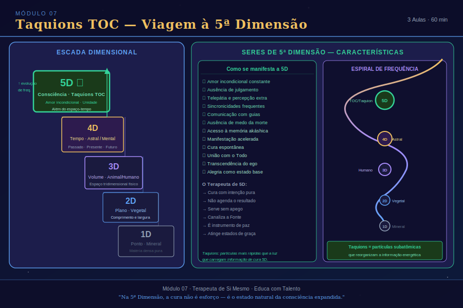

# Aula 23: Energia da Quinta Dimensão

## Informações da Aula
| Item | Descrição |
|------|-----------|
| **Módulo** | 7 — Taquions TOC |
| **Duração Estimada** | 45 minutos |
| **Tipo** | Videoaula |
| **Nível** | Avançado |

---

*Infográfico do Módulo 7 — visão geral dos conceitos e temas abordados.*

---

## 1. Roteiro da Aula

### Abertura (5 min)
- Boas-vindas ao Módulo 7
- Contextualização: por que falar de dimensões?
- A relação entre Taquions TOC e a Quinta Dimensão

### Desenvolvimento (35 min)
- As dimensões: da 1D à 5D — compreensão conceitual e espiritual
- O que é a Quinta Dimensão e como ela difere da 3D
- A realidade externa como construção do cérebro
- Comportamentos de quem está conectado com a 5D
- Como acessar a frequência da 5D
- Demônios internos: sentimentos mal usados
- Gratidão como amor incondicional — portal para a 5D
- O campo quântico e a criação pela intenção

### Encerramento (5 min)
- Síntese da compreensão dimensional
- Conexão com a prática dos Taquions
- Prévia da Aula 24 — Técnica Taquions TOC e Protocolo

---

## 2. Narração em Primeira Pessoa (Roteiro de Gravação)

Olá, meu amor! Que alegria enorme estar com você no início do Módulo 7. Este módulo me é muito especial porque ele toca em algo que transformou profundamente a minha própria vida — não apenas minha prática terapêutica, mas a maneira como percebo o mundo, a realidade, e o papel que cada um de nós tem na criação de nossa própria existência.

Hoje, antes de entrarmos na técnica dos Taquions TOC em si, precisamos construir o alicerce conceitual que torna essa técnica não apenas compreensível, mas verdadeiramente transformadora: vamos falar sobre as **dimensões de consciência** e, especialmente, sobre a **Quinta Dimensão**.

Sei que esse pode ser um tema que gera curiosidade, mas também certa desconfiança em pessoas que têm formação científica ou que valorizam muito o pensamento racional. Sou neurocientista da educação, como vocês sabem, e entendo completamente essa desconfiança. Mas convido você a manter a mente aberta, porque o que vamos explorar aqui tem bases tanto na física moderna quanto em tradições espirituais milenares — e a confluência dessas duas perspectivas é fascinante.

**Entendendo as Dimensões**

Vamos começar do começo. O que é uma dimensão?

Na matemática e na física, uma dimensão é um grau de liberdade — uma direção em que um objeto pode se mover ou existir. Compreender as dimensões de forma progressiva nos ajuda a entender o que significa "elevar a frequência" ou "conectar com a 5D".

A **Primeira Dimensão (1D)** é o **ponto** — sem extensão, sem movimento, sem possibilidade de variação. Pura existência pontual.

A **Segunda Dimensão (2D)** é o **plano** — o quadrado, a superfície. Tem comprimento e largura, mas sem profundidade. Um ser bidimensional não pode perceber a terceira dimensão — ela simplesmente não existe em sua realidade.

A **Terceira Dimensão (3D)** é o **volume** — o cubo, a realidade que conhecemos com nossos sentidos físicos. Comprimento, largura e profundidade. É o mundo material onde vivemos, onde tocamos as coisas, onde o tempo passa de forma linear e o espaço é uma barreira real.

A **Quarta Dimensão (4D)** é frequentemente associada ao **tempo** — mas numa perspectiva espiritual, ela representa uma realidade onde o tempo não existe como barreira absoluta. É a dimensão do sonho, da memória, do devaneio. É onde muitas experiências mediúnicas ocorrem.

A **Quinta Dimensão (5D)** vai além. Ela representa uma realidade onde **nem o tempo nem o espaço são barreiras**. É uma dimensão de consciência pura, de amor incondicional, de unidade. É onde, segundo as tradições espirituais, os grandes avatares e mestres habitam — e para onde toda a humanidade está evolutivamente caminhando.

**A Física Quântica e as Dimensões**

Aqui é onde a ciência e a espiritualidade se encontram de uma forma que me arrepia. A física quântica, em suas diferentes vertentes teóricas, trabalha com modelos que incluem mais do que três dimensões espaciais. A Teoria das Cordas, por exemplo, requer pelo menos 10 ou 11 dimensões para suas equações fazerem sentido.

E há algo ainda mais fascinante: os experimentos da física quântica demonstram repetidamente que a realidade, no nível subatômico, não existe de forma independente do observador. A famosa experiência da dupla fenda demonstra que a partícula se comporta como onda (potencialidade) quando não é observada, e como partícula (realidade definida) quando observada. A realidade é co-criada pela consciência que a observa.

Como Rosangela, neurocientista que sou, esse dado me impacta profundamente: o nosso cérebro não percebe a realidade como ela é — ele **constrói** uma realidade a partir de sinais elétricos. Isso significa que aquilo que chamamos de "realidade objetiva" é, na verdade, um modelo interno construído pelo nosso sistema nervoso. E se a realidade que percebemos é um modelo interno — então, ao mudarmos o modelo interno, mudamos a realidade que vivenciamos.

Isso não é magia. É neurociência. É física quântica. E é exatamente o que os Taquions TOC utilizam — trabalham no campo energético para reorganizar o modelo interno, o padrão vibracional, a frequência com que o ser existe no mundo.

**O que caracteriza a Quinta Dimensão?**

Quando digo que alguém está "conectado com a 5D", não estou dizendo que essa pessoa voou para outro planeta. Estou dizendo que ela cultivou, internamente, uma frequência vibratória que corresponde às características da consciência de quinta dimensão. Que são:

**Percepção de unidade** — a compreensão experiencial, não apenas intelectual, de que somos todos um. Que a separação que percebemos entre você e o outro é uma ilusão criada pela mente tridimensional. Quem está na 5D sente o sofrimento do outro como se fosse seu, mas sem perder a si mesmo — é compaixão sem fusão.

**Não aceita zona de conforto** — o ser conectado com a 5D está sempre em movimento evolutivo, sempre disposto a desafiar seus próprios limites, a aprender, a crescer. Não por insatisfação, mas por amor ao próprio desenvolvimento.

**Potencializa soluções** — em vez de ficar em loop no problema, o ser de 5D naturalmente direciona sua energia para as soluções. Isso não é negação da realidade — é sabedoria sobre onde colocar a atenção.

**Cria realidades pela intenção** — compreende que o que foca com emoção e consistência começa a se manifestar no campo material. Não de forma mágica e instantânea, mas de forma real e mensurável ao longo do tempo.

**Os "Demônios" como sentimentos mal usados**

Gosto muito de uma perspectiva que aprendi ao longo dos anos e que ressoa com minha formação em psicanálise: o que chamamos de "demônios" — aquelas energias de medo, raiva, ciúme, inveja, ressentimento — não são entidades externas malignas. São sentimentos que estão sendo usados de forma distorcida, sem consciência, sem integração.

O medo, por exemplo, em sua essência original, é uma inteligência de sobrevivência. Ele nos alerta para o perigo. O problema é quando o medo começa a governar tudo — quando deixa de ser um aviso momentâneo e se torna um estado permanente de existência.

A raiva, em sua essência, é a energia de estabelecer limites, de dizer "não" ao que não serve. O problema é quando a raiva vira rancor crônico, que destrói o próprio ser que a carrega.

Na perspectiva da 5D, cada sentimento difícil é uma oportunidade — de aprendizado, de integração, de expansão. O terapeuta que trabalha com Taquions TOC aprende a olhar para esses "demônios" com curiosidade e compaixão, não com julgamento ou rejeição.

**A Gratidão como amor incondicional — o portal da 5D**

E aqui chegamos ao que considero a chave mais acessível e mais poderosa para elevar a frequência vibratória: a **gratidão**.

Não a gratidão performática — aquela que falamos porque "é o certo a fazer". Mas a gratidão genuína, que nasce do reconhecimento de que cada experiência, mesmo as difíceis, nos serviu de alguma forma. Que temos mais razões para agradecer do que para lamentar, mesmo que às vezes seja difícil enxergar isso.

Pesquisas em neurociência — e aqui estou pisando em terreno científico sólido — demonstram que o cultivo consistente da gratidão reorganiza literalmente os circuitos neurais. Aumenta a produção de dopamina e serotonina. Reduz os marcadores de cortisol. Melhora a qualidade do sono. Fortalece o sistema imunológico. E, em termos energéticos, eleva a frequência vibratória do campo humano para registros compatíveis com amor incondicional.

A gratidão é o portal mais democrático para a Quinta Dimensão. Qualquer um pode praticá-la. Agora. Neste momento.

**Encerrando com uma provocação amorosa**

Quero encerrar esta aula com uma provocação que carrego comigo há muitos anos: em que dimensão você vive a maior parte do tempo? Quando você acorda de manhã, qual é a qualidade de consciência que predomina? É a 3D — o mundo de separação, escassez, tempo e limitação? Ou você já tem momentos de 5D — de unidade, de amor, de criação consciente?

A boa notícia é que não é tudo ou nada. A jornada espiritual é justamente o processo de ir habitando cada vez mais a 5D, sem negar a 3D — afinal, temos um corpo físico, pagamos contas, vivemos no espaço e no tempo. Mas podemos fazer tudo isso ancorados em uma frequência mais elevada.

Na próxima aula, vamos ao protocolo dos Taquions TOC — como eles trabalham fisicamente e energeticamente, e como utilizá-los para acessar essa frequência mais elevada nos nossos assistidos.

Com amor e gratidão por esta jornada compartilhada,
Rosangela

---

## 3. Conceitos-Chave
| Conceito | Definição |
|----------|-----------|
| **Dimensões** | Graus de liberdade ou níveis de realidade: 1D=ponto, 2D=plano, 3D=volume, 4D=sem tempo, 5D=sem tempo e sem espaço |
| **Quinta Dimensão (5D)** | Nível de consciência caracterizado pela percepção de unidade, amor incondicional e criação pela intenção |
| **Não-Localidade Quântica** | Propriedade das partículas de se influenciarem independentemente do espaço e do tempo |
| **Construção da Realidade** | Processo pelo qual o cérebro constrói a realidade percebida a partir de sinais elétricos — não uma percepção direta |
| **"Demônios"** | Na 5D, sentimentos mal usados que perderam sua função original de inteligência adaptativa |
| **Gratidão** | Prática de amor incondicional que reorganiza circuitos neurais e eleva a frequência vibratória |
| **Criação pela Intenção** | Capacidade de co-criar a realidade através do foco emocional consistente — base da 5D |
| **Frequência Vibratória** | Taxa de vibração do campo energético humano; determina o nível dimensional de consciência predominante |

---

## 4. Exercício Prático

**Diário de Frequência Dimensional**

Objetivo: desenvolver percepção sobre em qual "dimensão" você está operando ao longo do dia.

**Como fazer:**
1. Durante 7 dias consecutivos, ao final de cada dia, reserve 10 minutos para um exercício de revisão.
2. Percorra mentalmente os momentos do dia e identifique:
   - **Momentos de 3D**: quando você sentiu separação, medo, escassez, julgamento, urgência.
   - **Momentos de 5D**: quando você sentiu unidade, amor, fluxo, criatividade, gratidão.
3. Para cada momento de 3D identificado, reflita: qual sentimento estava por trás? Medo? Raiva? Ciúme? Qual seria o "uso sábio" desse sentimento na 5D?
4. Para cada momento de 5D, reflita: o que possibilitou essa elevação? O que estava presente naquele momento?
5. Ao final dos 7 dias, releia seu diário. Qual padrão você percebe? Que condições internas e externas favorecem sua frequência de 5D?

**Prática de Gratidão:** todo dia, ao acordar, liste 5 razões para agradecer — sendo pelo menos 1 relacionada a uma dificuldade que você está transformando.

---

## 5. Para Refletir
> *"Não somos seres humanos tendo uma experiência espiritual. Somos seres espirituais tendo uma experiência humana. E a 5D é simplesmente o estado de consciência em que nos lembramos disso."*
> — Rosangela Sousa (inspirada em Pierre Teilhard de Chardin)

---

## 6. Indicações de Aprofundamento

- **Livro:** *As Sete Leis Espirituais do Sucesso* — Deepak Chopra
- **Livro:** *O Poder do Agora* — Eckhart Tolle (presença como acesso à 5D)
- **Livro:** *A Física da Consciência* — Amit Goswami
- **Livro:** *Gregg Braden — A Linguagem Divina* (campo quântico e intenção)
- **Livro:** *Feliz como o Lobo* — Marcos Piangers (gratidão e reencantamento)
- **Pesquisa:** Estudos sobre gratidão e neuroplasticidade — Robert Emmons (Universidade da Califórnia)
- **Documentário:** *What the Bleep Do We Know* (A Física da Emoção) — sobre física quântica e consciência
- **Prática:** Meditação Ho'oponopono — técnica havaiana de cura pelo amor e gratidão
