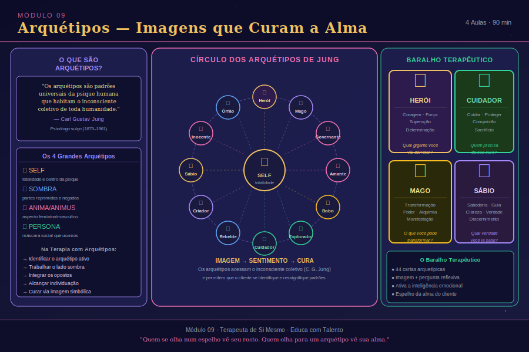

# Aula 30: Arquétipos e o Inconsciente Coletivo

## Informações da Aula
| Item | Descrição |
|------|-----------|
| **Módulo** | 9 — Arquétipos e Terapia Holística |
| **Duração Estimada** | 35 minutos |
| **Tipo** | Videoaula |
| **Nível** | Intermediário |

---

*Infográfico do Módulo 9 — visão geral dos conceitos e temas abordados.*

---

## 1. Roteiro da Aula

### Abertura (5 min)
- Boas-vindas ao Módulo 9 — a virada terapêutica
- Por que os arquétipos são pontes entre o individual e o universal
- O que Carl Gustav Jung descobriu que mudou para sempre a psicologia

### Desenvolvimento (25 min)

#### Parte 1: O que é Terapia — Retorno às Raízes
- Etimologia de "terapia": do grego *therapeia*
- O que significa tratar o ser humano em sua totalidade
- Terapia Holística: do grego *holos* (totalidade) — corpo, mente, emoção e espírito

#### Parte 2: Arquétipos — Marcas Primordiais da Humanidade
- Etimologia: *arkhe* (primeiro) + *typon* (marca, modelo)
- Jung e as imagens primordiais do inconsciente coletivo
- Como os arquétipos funcionam como matrizes da psique
- Exemplos concretos: o Herói, a Sombra, a Grande Mãe, o Velho Sábio, a Criança Divina

#### Parte 3: Arquétipos na Prática Clínica
- Como identificar arquétipos dominantes no assistido
- A linguagem simbólica como porta de acesso ao inconsciente
- Polaridade arquetípica: tridente (Diabo/medo) ↔ Nossa Senhora (bondade/acolhimento)
- Integração de sombra como caminho de cura

### Encerramento (5 min)
- Síntese: arquétipos como linguagem universal do inconsciente
- Como isso vai se conectar ao Baralho Terapêutico (próxima aula)
- Exercício de reflexão

---

## 2. Narração em Primeira Pessoa (Roteiro de Gravação)

### Abertura

Bem-vinda, bem-vindo, ao Módulo 9. Que honra ter você aqui, chegando até este ponto da nossa jornada juntos.

Se você acompanhou os módulos anteriores, já passou por uma transformação enorme. Já mergulhou na física quântica, na radiestesia, no toque magnético, na apometria, na mesa quântica, nos taquions, e nas profundezas da regressão e da reprogramação de memórias. Você não é mais a mesma pessoa que começou este curso. E isso me enche de gratidão e de alegria.

Agora, neste Módulo 9, vamos dar mais um passo — e este é um passo que eu considero uma das grandes viradas do trabalho terapêutico. Vamos falar sobre **arquétipos** e sobre como eles se conectam à terapia holística de uma forma profunda, poderosa e transformadora.

Mas antes de entrar nos arquétipos, quero fazer uma pergunta simples: você sabe o que é terapia, de verdade? Não no sentido de "ir ao psicólogo" ou "fazer uma sessão". Quero falar da raiz, da essência, da palavra mesma.

### Desenvolvimento

**O que é Terapia — A Raiz que a Gente Esquece**

A palavra "terapia" vem do grego *therapeia*, e significa literalmente "método de tratar doenças". Mas — e esse "mas" é fundamental — quando os gregos falavam em tratar, eles não estavam pensando só no corpo físico. Para a medicina grega antiga, a pessoa era um todo. O físico, o mental, o emocional e o espiritual eram inseparáveis.

E aí entra o segundo conceito que quero trazer: o "holístico". Do grego *holos*, que significa totalidade. Terapia Holística, portanto, é aquela que trata desequilíbrios no corpo físico, no mental, no espiritual e no emocional — o ser humano em sua completude, sem fragmentar, sem reduzir.

Durante séculos, a medicina ocidental foi na direção contrária. Foi fragmentando, especializando, separando. O cardiologista cuida do coração, o psiquiatra da mente, o ortopedista dos ossos. E cada um faz o seu trabalho brilhantemente — eu não estou aqui para questionar a medicina convencional. Mas a gente sabe, profundamente sabe, que um ser humano não pode ser curado em partes. A dor nas costas tem emoção. A enxaqueca tem conflito. A doença autoimune tem fronteiras que o inconsciente não consegue defender. O corpo fala o que a alma não encontra palavras para dizer.

É isso que a terapia holística vem fazer: reunir. Integrar. Tratar o todo.

**Arquétipos — As Marcas Primordiais da Humanidade**

E é aqui que entra um dos pensadores mais geniais que a humanidade já produziu: Carl Gustav Jung.

Jung era discípulo de Sigmund Freud — mas em determinado momento, ele percebeu que o inconsciente era muito maior do que Freud imaginava. Freud falava do inconsciente pessoal, aquele reservatório de memórias, traumas e desejos reprimidos de cada indivíduo. Jung foi além. Ele propôs a existência do **inconsciente coletivo** — uma camada ainda mais profunda da psique, compartilhada por toda a humanidade, por todas as culturas, em todos os tempos.

E dentro desse inconsciente coletivo, Jung identificou estruturas que ele chamou de **arquétipos**.

A palavra "arquétipo" vem do grego: *arkhe* — que significa primeiro, primordial — e *typon* — que significa marca, modelo, impressão. Arquétipos são, literalmente, **marcas ou modelos primordiais**. São formas inatas que existem na psique de todo ser humano, como matrizes que organizam nossa experiência interior.

Pensa comigo: por que em culturas completamente diferentes — que nunca tiveram contato entre si — aparecem os mesmos mitos? Por que em toda tradição espiritual existe uma figura do Grande Herói que enfrenta o monstro? Por que em toda cultura há uma imagem da Grande Mãe, do Velho Sábio, da Criança Divina? Por que o símbolo do dragão aparece tanto no Oriente quanto no Ocidente, tanto na China quanto na Europa medieval?

Porque arquétipos não são aprendidos. Eles são herdados. Estão inscritos na estrutura mais profunda da psique humana. São como moldes, como matrizes, como programas que se ativam ao longo da vida quando certas experiências disparam certas respostas.

**Os Principais Arquétipos e Como Eles Se Manifestam**

Deixa eu te apresentar alguns dos arquétipos fundamentais que Jung identificou.

O **Herói** é aquele que enfrenta o desconhecido, que parte em jornada, que luta contra as forças do caos para trazer de volta o bem. Na clínica, quando alguém te conta que está travado, que tem medo de dar o próximo passo, que sente que a vida exige demais — muitas vezes o que está em jogo é a ativação do arquétipo do Herói. Aquela pessoa precisa reconhecer que ela tem, dentro de si, a força de seguir em frente.

A **Sombra** é talvez o arquétipo mais importante para o trabalho terapêutico. É tudo aquilo que nós rejeitamos em nós mesmos — qualidades, impulsos, emoções que o ego considerou inaceitáveis e jogou para baixo do tapete. Mas a Sombra não some. Ela aparece nas projeções que fazemos sobre os outros, nos conflitos relacionais, nas compulsões, nos padrões que se repetem. E a cura — a cura real — passa sempre pela integração da Sombra. Por olhar para aquilo que a gente preferiu não ver.

A **Grande Mãe** é o arquétipo do cuidado, da nutrição, da terra, da origem. Quando está equilibrada, se manifesta como amor incondicional, acolhimento, capacidade de nutrir. Quando está desequilibrada, pode se manifestar como superproteção sufocante, ou como o oposto — a mãe devoradora, que consome ao invés de nutrir.

O **Velho Sábio** é o arquétipo do conhecimento, da orientação, da sabedoria que vem da experiência. É a intuição profunda, a voz interior que sabe o caminho. Na terapia, o terapeuta muitas vezes é investido pelo assistido com esse arquétipo — e é fundamental que o terapeuta saiba reconhecer isso e não se identificar com ele.

A **Criança Divina** é o arquétipo da renovação, do começo, da inocência, da possibilidade. É o que há de novo em nós, o que ainda não foi ferido, o que pode recomeçar. Em muitos processos terapêuticos, o trabalho de reparação da criança interior é fundamental para a cura de padrões que vêm da infância.

**Polaridade Arquetípica — O Jogo entre Luz e Sombra**

Quero te dar um exemplo muito concreto de como os arquétipos funcionam em polaridade. Pensa no **tridente** — esse símbolo que em nossa cultura ocidental está associado ao Diabo, ao medo, ao mal, ao que é perigoso. E agora pensa em **Nossa Senhora** — bondade, ternura, acolhimento, proteção.

Esses dois são arquétipos opostos que habitam o mesmo inconsciente coletivo. E na clínica, esse jogo de polaridades aparece o tempo todo. A pessoa que só consegue ser boa, que nunca consegue dizer não, que se anula completamente — está com a energia arquetípica do "Diabo", da força, do limite, totalmente reprimida. A pessoa que não consegue confiar em ninguém, que está sempre em guerra — está com a energia da "Nossa Senhora", da confiança e do acolhimento, completamente fechada.

A cura não é eliminar um polo. É integrar os dois. É encontrar o equilíbrio onde a força e a ternura coexistem, onde o limite e o amor andam juntos.

Esse é o trabalho arquetípico. E ele é profundo, delicado, poderoso.

**Como Identificar Arquétipos no Processo Terapêutico**

Na prática clínica, os arquétipos se revelam nas histórias que o assistido conta, nos sonhos que ele traz, nas palavras que ele escolhe, nos símbolos que o impactam, nas figuras que o encantam ou o aterrorizam.

Como terapeuta de si mesmo, você precisa desenvolver o olho para essa linguagem simbólica. Quando alguém diz "me sinto sempre sozinho no mundo, como se eu fosse um náufrago" — ali está uma imagem arquetípica. Quando alguém sonha repetidamente com uma velhinha sábia — o arquétipo do Velho Sábio está tentando se comunicar. Quando alguém sente que está sempre sendo devorado pelas responsabilidades — a Grande Mãe desequilibrada está em campo.

A linguagem simbólica é a língua do inconsciente. E os arquétipos são o vocabulário dessa língua.

Na próxima aula, vamos ver como o Baralho Terapêutico usa exatamente esses arquétipos como ferramenta de acesso ao inconsciente do assistido. Você vai entender por que essa ferramenta é tão poderosa — e por que ela não tem nada de adivinhação.

### Encerramento

Quero que você leve desta aula a seguinte compreensão: os arquétipos não são conceitos abstratos da psicologia acadêmica. Eles são vivos. Eles operam dentro de cada um de nós o tempo todo. Eles moldam nossos relacionamentos, nossas escolhas, nossos medos e nossos sonhos.

Como terapeuta de si mesmo, você não vai apenas aprender sobre arquétipos — você vai reconhecê-los em você mesmo. E é esse reconhecimento que vai tornar o seu trabalho verdadeiramente transformador.

Até a próxima aula, meu amor. Com muito carinho, Rosangela.

---

## 3. Conceitos-Chave
| Conceito | Definição |
|----------|-----------|
| **Terapia** | Do grego *therapeia* — método de tratar o ser humano em sua totalidade |
| **Holístico** | Do grego *holos* (totalidade) — abordagem que integra corpo, mente, emoção e espírito |
| **Arquétipo** | Do grego *arkhe* (primeiro) + *typon* (marca) — modelos primordiais do inconsciente coletivo |
| **Inconsciente Coletivo** | Camada profunda da psique compartilhada por toda a humanidade (Jung) |
| **Sombra** | Conteúdo rejeitado pelo ego que permanece no inconsciente e se manifesta em projeções |
| **Polaridade Arquetípica** | Dinâmica de opostos complementares dentro do inconsciente (ex: luz/sombra, força/ternura) |
| **Linguagem Simbólica** | Modo de expressão do inconsciente por meio de imagens, símbolos e metáforas |

---

## 4. Exercício Prático

**Mapeamento Arquetípico Pessoal**

Este exercício é para você, antes de aplicá-lo com qualquer assistido.

1. **Identifique seu arquétipo dominante** neste momento da sua vida. Você está mais no papel de Herói (em jornada, enfrentando desafios), Grande Mãe (cuidando, nutrindo), Velho Sábio (orientando, transmitindo), ou Criança (renovando, recomeçando)?

2. **Identifique sua Sombra arquetípica** — qual qualidade do polo oposto você está rejeitando? Se você é muito Herói, talvez esteja rejeitando a vulnerabilidade. Se é muito Grande Mãe, talvez esteja rejeitando sua própria necessidade de ser cuidado.

3. **Escreva em seu diário terapêutico** uma situação recente em que você percebe um arquétipo em ação — seja em você, seja em alguém próximo.

4. **Reflita**: qual arquétipo você percebe com mais frequência nos assistidos que chegam até você?

---

## 5. Para Refletir

> *"Os arquétipos são como rios que sempre existiram na paisagem da alma humana — nós não os criamos, apenas os encontramos."*
> — Carl Gustav Jung (adaptado)

---

## 6. Indicações de Aprofundamento

- **O Homem e Seus Símbolos** — Carl Gustav Jung (obra fundamental, acessível ao não especialista)
- **Os Arquétipos e o Inconsciente Coletivo** — Carl Gustav Jung (volume 9/I das Obras Completas)
- **O Herói de Mil Faces** — Joseph Campbell (a jornada do herói através das culturas)
- **Sonhos, Memórias, Reflexões** — Carl Gustav Jung (autobiografia — belíssima leitura)
- **A Sombra e o Mal em Contos de Fadas** — Marie-Louise von Franz (excelente para aplicação clínica)
