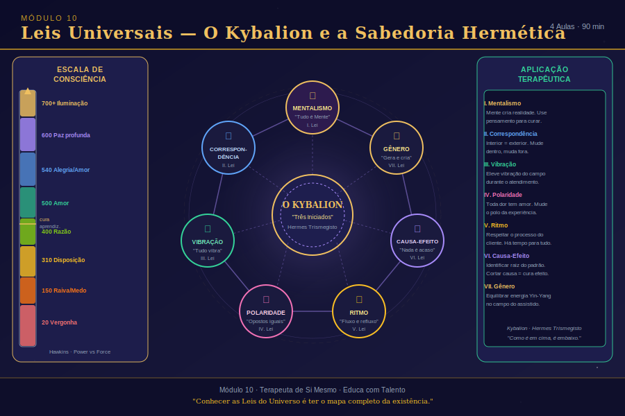

# Aula 33: As Sete Leis Universais Herméticas

## Informações da Aula
| Item | Descrição |
|------|-----------|
| **Módulo** | 10 — Leis Universais e Cosmoética |
| **Duração Estimada** | 40 minutos |
| **Tipo** | Videoaula |
| **Nível** | Intermediário |

---

*Infográfico do Módulo 10 — visão geral dos conceitos e temas abordados.*

---

## 1. Roteiro da Aula

### Abertura (5 min)
- O que é O Kybalion e por que ele importa para o terapeuta
- A diferença entre leis universais e regras culturais
- Por que conhecer as leis muda a forma de entender a vida

### Desenvolvimento (30 min)

#### Parte 1: A Tradição Hermética
- Hermes Trismegisto e a origem do hermetismo
- O Kybalion: as sete leis que governam tudo que existe
- Como as leis universais se manifestam no cotidiano e na clínica

#### Parte 2: As Sete Leis — Uma a Uma
- **Lei do Mentalismo**: "O Todo é Mente; o Universo é Mental"
- **Lei da Correspondência**: "Como acima, assim abaixo; como dentro, assim fora"
- **Lei da Vibração**: "Nada está em repouso; tudo se move, tudo vibra"
- **Lei da Polaridade**: "Tudo é dual; tudo tem polos"
- **Lei do Ritmo**: "Tudo flui e reflui; tudo tem marés"
- **Lei da Causa e Efeito**: "Toda causa tem seu efeito; todo efeito tem sua causa"
- **Lei do Gênero**: "O Gênero está em tudo; tudo tem seus princípios masculino e feminino"

#### Parte 3: Aplicação Clínica das Leis
- Como usar as leis para compreender padrões do assistido
- Leis como ferramenta de psicoeducação em sessão
- A lei que mais impacta o trabalho com cura energética

### Encerramento (5 min)
- As leis não são morais — são descritivas da realidade
- Integração com a cosmoética (próxima aula)

---

## 2. Narração em Primeira Pessoa (Roteiro de Gravação)

### Abertura

Meu amor, seja bem-vinda, bem-vindo ao Módulo 10. Se o Módulo 9 nos levou para o mundo dos arquétipos e das imagens do inconsciente, este módulo nos leva para uma dimensão ainda mais ampla — as leis que governam toda a existência.

Vamos falar sobre as Leis Universais Herméticas, sobre ética, sobre moral, sobre cosmoética, e sobre os diferentes tipos de amor que fundamentam todo processo de cura. É um módulo que vai tocar você profundamente — porque não é apenas conhecimento intelectual. É uma mudança de cosmovisão.

Começo com uma pergunta: você já parou para pensar que existem leis que governam o universo — não as leis dos homens, não as leis dos países, mas leis fundamentais, imutáveis, que funcionam independente de você acreditar nelas ou não? Assim como a Lei da Gravidade funciona independente da sua crença — você pula de uma janela e cai, quer você acredite na gravidade ou não — as Leis Universais funcionam exatamente assim.

E quando você as conhece, você não fica submetido a elas na ignorância. Você as usa conscientemente. Você as compreende. E isso muda tudo.

### Desenvolvimento

**A Tradição Hermética — De Onde Vêm Essas Leis**

A tradição hermética tem origem na figura mítica e histórica de Hermes Trismegisto — "o três vezes grande" — que a tradição identifica como um sábio do Egito Antigo, possivelmente uma fusão entre o deus egípcio Thoth e o deus grego Hermes. Ele é considerado o pai da alquimia, da astrologia, da teurgia — de todo o conhecimento que busca compreender as leis ocultas que governam a realidade.

O texto mais famoso dessa tradição é **O Kybalion** — publicado em 1908 por autores que se identificaram apenas como "Três Iniciados" — e que sistematiza as sete leis herméticas fundamentais. Essas leis não são religiosas. Não são dogmas. São princípios descritivos da realidade — como a realidade funciona, em todos os planos, desde o mais denso (o físico) até o mais sutil (o espiritual).

Como terapeuta holística, conhecer essas leis é fundamental. Porque elas explicam por que os padrões se repetem, por que o pensamento tem poder sobre a realidade, por que um desequilíbrio emocional produz doença física, por que o que está "lá fora" no relacionamento do assistido é um reflexo do que está "aqui dentro" na psique dele.

Vamos às leis.

**Lei 1 — O Mentalismo: "O Todo é Mente; o Universo é Mental"**

Esta é a lei fundante. Ela diz que a realidade, em sua essência mais profunda, é de natureza mental. O universo não é um mecanismo material funcionando cegamente — é expressão de uma Mente infinita, e tudo que existe emerge dessa Mente como pensamento.

Para o trabalho terapêutico, essa lei tem uma implicação direta e poderosa: **o pensamento cria**. Não metaforicamente — literalmente. A física quântica, que vimos no Módulo 2, já demonstrou que o observador afeta o observado. Que a consciência é parte constitutiva da realidade.

Quando um assistido vive com pensamentos repetitivos de inadequação — "eu não sirvo", "eu não mereço", "nada vai dar certo para mim" — ele está literalmente construindo, no plano mental, as condições para que essa realidade se manifeste no plano físico. A Lei do Mentalismo nos diz: mude o pensamento, mude a realidade.

**Lei 2 — A Correspondência: "Como acima, assim abaixo; como dentro, assim fora"**

Esta lei descreve a relação de espelho entre os diferentes planos da existência. O que acontece no microcosmo (o indivíduo) reflete o que acontece no macrocosmo (o universo). O que está dentro se manifesta fora.

Na clínica, uso essa lei constantemente. Quando o assistido me conta sobre um conflito com o chefe, eu sei que aquilo é um espelho de um conflito interno. Quando alguém tem dificuldade de receber — de aceitar presentes, cuidado, amor — há algo no campo interno que está bloqueado para a recepção. Quando alguém está sempre em guerra com o mundo, a guerra está primeiro dentro.

A Lei da Correspondência é o fundamento de toda psicologia projetiva. É por isso que o que nos irrita nos outros revela algo sobre nós mesmos. É por isso que os relacionamentos são nosso maior espelho.

**Lei 3 — A Vibração: "Nada está em repouso; tudo se move, tudo vibra"**

Esta lei diz que tudo na criação está em constante movimento vibratório. O que diferencia uma pedra de um pensamento, um corpo físico de uma emoção, não é a substância — é a frequência de vibração. A pedra vibra muito lentamente. O pensamento, muito rapidamente.

No trabalho terapêutico, a Lei da Vibração nos explica por que certos ambientes, certas pessoas, certas músicas nos elevam ou nos drenam. Por que o campo energético do terapeuta importa tanto quanto as técnicas que ele usa. Por que a intenção por trás de um toque magnético ou de um passe é parte constitutiva do seu efeito.

Quando dizemos que "essa pessoa baixa a minha energia" — estamos descrevendo um fenômeno real de interferência vibracional. E quando trabalhamos para elevar a vibração de um assistido — seja por meio de uma técnica, de uma palavra, de uma presença amorosa — estamos operando diretamente com esta lei.

**Lei 4 — A Polaridade: "Tudo é dual; tudo tem polos"**

Tudo que existe tem dois polos — e esses polos são expressões diferentes do mesmo contínuo, não opostos irreconciliáveis. Calor e frio não são coisas diferentes — são graus diferentes de temperatura. Amor e ódio não são emoções opostas — são expressões diferentes da mesma energia de conexão, em frequências diferentes.

Essa lei é revolucionária para o trabalho terapêutico porque nos diz que não existe sombra sem luz, não existe fraqueza sem força, não existe medo sem coragem. A transformação terapêutica não é eliminar o polo negativo — é transmutar, elevar a vibração de um polo ao outro.

Quando um assistido traz raiva — não digo "livre-se desta raiva". Digo "que amor está por baixo desta raiva? Que fronteira não respeitada? Que necessidade não atendida?" A raiva é amor em frequência distorcida. Quando entendemos isso, a cura se torna possível.

**Lei 5 — O Ritmo: "Tudo flui e reflui; tudo tem marés"**

O ritmo é a lei do movimento pendular. Tudo tem seu momento de expansão e retração, de avanço e recuo, de plenitude e vazio. As marés sobem e descem. A lua cresce e míngua. As emoções ondulam. Os relacionamentos têm ciclos. As empresas têm fases.

Para o assistido que está num momento de retração, de escuridão, de "tudo está caindo" — a Lei do Ritmo traz uma mensagem de esperança: isso vai passar. Não porque eu estou sendo otimista de forma ingênua, mas porque é lei. O pêndulo inevitavelmente volta. A maré inevitavelmente vira.

E o terapeuta que conhece essa lei não entra em pânico com os momentos difíceis do assistido — ele os acolhe como parte natural do ritmo da vida, e ajuda a pessoa a atravessá-los com maior consciência e menor sofrimento.

**Lei 6 — A Causa e o Efeito: "Toda causa tem seu efeito; todo efeito tem sua causa"**

Nada acontece por acaso. Todo evento é resultado de uma cadeia de causas. O que vivo hoje é resultado do que pensei, senti e agi no passado. O que faço hoje cria as causas do que viverei amanhã.

Essa lei desfaz o discurso de vítima de uma vez por todas — com compaixão, não com julgamento. Não digo "você criou todos os seus problemas" de forma punitiva. Digo "você tem mais poder sobre a sua realidade do que imagina — porque você é causa, não apenas efeito."

Isso é libertador. Quando o assistido percebe que ele não é apenas um joguete nas mãos do destino, mas que suas escolhas, seus pensamentos, suas ações têm consequências reais e observáveis, ele recupera a autoria da própria vida.

**Lei 7 — O Gênero: "O Gênero está em tudo; tudo tem seus princípios masculino e feminino"**

O princípio do gênero não fala de sexo biológico. Fala de qualidades complementares que existem em tudo. O princípio masculino é ativo, provedor, estruturante, centralizador. O princípio feminino é receptivo, nutritivo, gestador, fluido.

Todo ser humano — independente do gênero biológico — carrega ambos os princípios. E o equilíbrio entre eles é fundamental para a saúde. A pessoa que está excessivamente no masculino não consegue descansar, não consegue receber, não consegue sentir. A pessoa excessivamente no feminino não consegue agir, estruturar, estabelecer limites.

Na próxima aula, quando falarmos sobre cosmoética, vamos ver como esses princípios se manifestam nas relações e na vida em comunidade. E no Módulo 11, sobre materialização consciente, vamos ver como a interação entre o masculino e o feminino cósmicos é o próprio mecanismo da criação.

### Encerramento

Sete leis. Sete princípios que governam toda a existência — do cosmos ao consultório. Do universo às suas próprias emoções.

O que eu quero que você leve desta aula não é a memorização das leis. É a sensação de que a realidade tem uma ordem. Que essa ordem pode ser compreendida. E que quando você a compreende, você opera com muito mais eficácia como terapeuta, como ser humano, como criador da sua própria vida.

Na próxima aula, vamos falar sobre ética, moral e cosmoética — e você vai ver como as Leis Universais se traduzem em comportamento cotidiano e em relação com o outro.

Com amor, Rosangela.

---

## 3. Conceitos-Chave
| Conceito | Definição |
|----------|-----------|
| **Hermetismo** | Tradição filosófica e espiritual atribuída a Hermes Trismegisto, baseada em princípios universais |
| **O Kybalion** | Texto que sistematiza as sete leis herméticas; publicado em 1908 pelos "Três Iniciados" |
| **Lei do Mentalismo** | O Todo é Mente; a realidade é de natureza mental e o pensamento tem poder criador |
| **Lei da Correspondência** | Como acima assim abaixo; o mundo interno espelha o mundo externo e vice-versa |
| **Lei da Vibração** | Tudo vibra em frequências diferentes; o que nos afeta vibra em ressonância com algo em nós |
| **Lei da Polaridade** | Tudo tem dois polos; transformação é transmutação, não eliminação do polo negativo |
| **Lei do Ritmo** | Tudo tem marés e ciclos; os momentos difíceis são parte do ritmo natural da existência |
| **Lei da Causa e Efeito** | Nada é acaso; toda situação tem causas e o ser humano é agente, não apenas efeito |
| **Lei do Gênero** | Princípios masculino (ativo) e feminino (receptivo) coexistem em tudo e pedem equilíbrio |

---

## 4. Exercício Prático

**As Leis na Minha Vida — Mapa de Reconhecimento**

Para cada uma das sete leis, identifique uma situação da sua vida atual onde ela está operando claramente:

| Lei | Situação da Minha Vida | O que Eu Percebo |
|-----|----------------------|------------------|
| Mentalismo | | |
| Correspondência | | |
| Vibração | | |
| Polaridade | | |
| Ritmo | | |
| Causa e Efeito | | |
| Gênero | | |

Depois, escolha a lei que mais te desafiou a identificar — e escreva uma página no diário sobre por que ela é difícil de enxergar na sua própria vida.

---

## 5. Para Refletir

> *"Conhecer as leis do universo não nos torna mais poderosos que ele — nos torna mais sábios ao navegar dentro dele."*
> — O Kybalion (adaptado)

---

## 6. Indicações de Aprofundamento

- **O Kybalion** — Três Iniciados (leitura obrigatória — disponível gratuitamente em domínio público)
- **A Cabala e a Árvore da Vida** — Dion Fortune (hermetismo na tradição ocidental)
- **A Lei da Atração** — Esther e Jerry Hicks (aplicação prática das leis ao cotidiano)
- **Física Quântica e Consciência** — Fred Alan Wolf (a ciência por trás do Mentalismo)
- **Biologia da Crença** — Bruce Lipton (Lei da Correspondência na epigenética)
