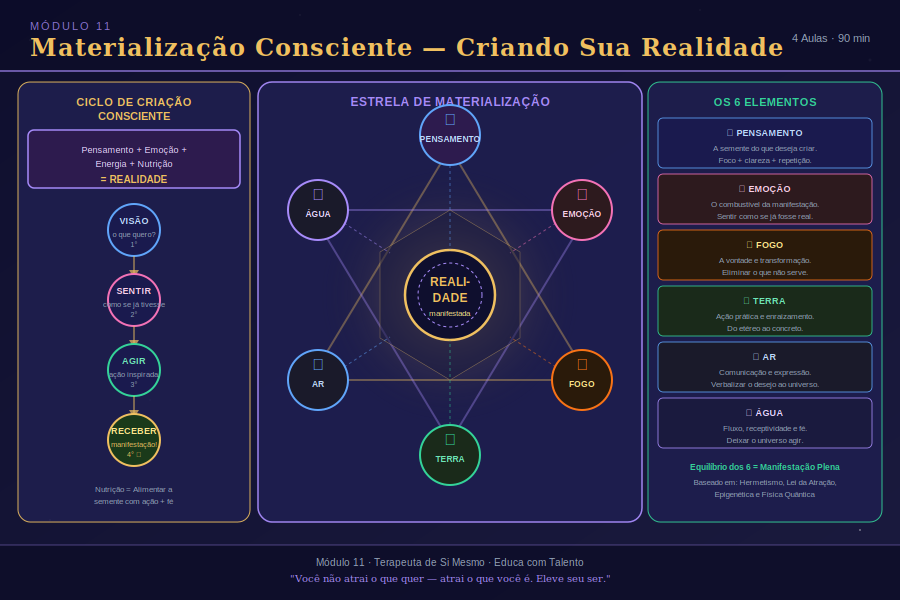

# Aula 36: A Estrela de Materialização e a Alquimia da Criação

## Informações da Aula
| Item | Descrição |
|------|-----------|
| **Módulo** | 11 — Criação e Materialização Consciente |
| **Duração Estimada** | 45 minutos |
| **Tipo** | Videoaula |
| **Nível** | Avançado |

---

*Infográfico do Módulo 11 — visão geral dos conceitos e temas abordados.*

---

## 1. Roteiro da Aula

### Abertura (5 min)
- O que significa criar conscientemente
- Por que a maioria das pessoas cria por *default* — no automático
- A Estrela de Materialização como mapa alquímico da criação

### Desenvolvimento (35 min)

#### Parte 1: A Estrutura da Estrela de Materialização
- A Estrela de 6 pontas como símbolo de equilíbrio entre polaridades
- Triângulo para baixo: o princípio feminino/receptivo/gestador
- Triângulo para cima: o princípio masculino/ativo/provedor
- A interação entre os dois triângulos como mecanismo de criação

#### Parte 2: Os Quatro Elementos e sua Função Criadora
- **ÁGUA**: o veículo das emoções — elemento feminino
- **AR**: o espaço do pensamento — elemento feminino
- **FOGO**: a força da energia e ação — elemento masculino
- **TERRA**: o suporte e a nutrição — elemento masculino
- A Forma Pensamento: ÁGUA + AR = a criação no plano mental

#### Parte 3: Da Semente à Materialização
- A semente como metáfora perfeita do potencial latente
- Como os 4 elementos ativam o que já está contido
- O Nêutron como ponto de equilíbrio e materialização saudável
- Elétron (feminino), Próton (masculino) e Nêutron (equilíbrio)

#### Parte 4: Quando a Criação Adoece
- Miasmas: criados pelo desequilíbrio emocional
- Entidades: criadas por emoções e pensamentos desequilibrados persistentes
- Demônios e Vampiros: o que são e como se formam
- "Os trabalhos externos só se manifestam em nós se dermos condição"

### Encerramento (5 min)
- O poder e a responsabilidade de criar conscientemente
- Próxima aula: pensamentos, emoções e criação da realidade

---

## 2. Narração em Primeira Pessoa (Roteiro de Gravação)

### Abertura

Meu amor, bem-vindo ao Módulo 11. Este é um módulo que considero revolucionário — não só para a sua prática terapêutica, mas para a sua vida inteira. Porque aqui vamos falar sobre **criação**.

Não criação no sentido artístico. Criação no sentido mais literal e profundo: o processo pelo qual aquilo que existe primeiro no plano invisível — como pensamento, como sentimento, como intenção — se manifesta no plano físico como realidade concreta.

Você cria a sua realidade. Esse é um dos conceitos mais importantes e, ao mesmo tempo, mais mal compreendidos do universo do desenvolvimento humano. Muitas pessoas ouvem "você cria sua realidade" e entendem: "então se eu visualizar um carro bonito, ele vai aparecer na minha garagem?" Não é assim. A lei de criação é muito mais sofisticada, muito mais multidimensional, e muito mais exigente do que qualquer fórmula simples de "pensamento positivo".

E hoje vou te explicar o mecanismo real. O mecanismo alquímico da criação, representado em uma das imagens mais antigas e sábias da humanidade: a **Estrela de Seis Pontas** — ou Estrela de Materialização.

### Desenvolvimento

**A Estrela de Materialização — Uma Imagem de Sabedoria Milenar**

A estrela de seis pontas existe em muitas tradições: no Judaísmo como Estrela de Davi, na tradição hermética como Selo de Salomão, nas tradições orientais como o Sri Yantra. Cada tradição deu a ela um nome e uma aplicação específica. Mas há algo que todas têm em comum: a imagem de dois triângulos entrelaçados, um apontando para cima e um apontando para baixo.

No trabalho terapêutico e na compreensão da materialização consciente, essa estrela representa o **mapa da criação** — o processo pelo qual qualquer coisa se manifesta na realidade física.

Vamos começar pelos dois triângulos.

**O Triângulo que Aponta para Baixo** representa o **princípio feminino**. Ele aponta para baixo porque o feminino é o princípio do útero — o espaço de gestação, de recepção, de contenção. É o espaço onde as coisas são acolhidas e nutridas antes de nascer. Pensa numa semente enterrada na terra — está em escuridão, em silêncio, em um espaço completamente receptivo. Esse é o princípio do triângulo para baixo.

O princípio feminino trabalha com dois elementos: a **Água** e o **Ar**.

**O Triângulo que Aponta para Cima** representa o **princípio masculino**. Ele aponta para cima porque o masculino é o princípio do provimento, da ação, da expansão para fora, do movimento em direção ao mundo. É a energia que empurra a semente para cima, que rompe a terra, que cresce em direção à luz.

O princípio masculino trabalha com dois elementos: o **Fogo** e a **Terra**.

**Os Quatro Elementos Como Forças de Criação**

Agora vou te apresentar cada elemento dentro desse sistema, porque cada um tem uma função muito específica no processo de criação.

A **Água** é o elemento das emoções. É feminina porque recebe, porque toma a forma do recipiente que a contém, porque flui e não resiste. As emoções são exatamente assim — elas fluem, elas tomam forma a partir das situações, elas se movem. Quando digo que a Água é o veículo das emoções, estou dizendo que as emoções são a matéria-prima do processo de criação. Você não cria sem emoção. A emoção é o combustível primário.

O **Ar** é o elemento do pensamento. Também feminino — porque o pensamento, como o ar, é invisível, sutil, capaz de penetrar em qualquer lugar. O ar não tem forma própria — ele assume a forma dos espaços que habita. Assim são os pensamentos: eles habitam os espaços da mente, dando forma ao que ainda não nasceu.

E aqui vem um conceito fundamental: quando a **Água** (emoção) se encontra com o **Ar** (pensamento) — quando você pensa sobre algo com emoção — nasce o que chamamos de **Forma Pensamento**. Uma entidade energética no plano sutil. Uma criação que ainda não tem forma física, mas já existe energeticamente.

E a Forma Pensamento pode ser boa ou ruim — dependendo da qualidade da emoção e do pensamento que a geraram. Isso é absolutamente crucial.

O **Fogo** é o elemento da energia, da ação, da força. É masculino porque é expansivo, extrovertido, transformador. O fogo não recebe — ele age. Ele transforma. Quando você coloca energia no que você criou no plano mental — quando você age sobre a Forma Pensamento — você a alimenta, você a fortalece.

A **Terra** é o elemento da nutrição, do suporte, da sustentação. Também masculino — porque é o princípio do provedor, do que sustenta. A Terra dá forma concreta. É onde a semente finalmente germina.

**A Metáfora da Semente — O Processo Completo**

Quero usar uma metáfora que eu amo, porque ela torna tudo muito claro: **a semente de laranjeira**.

Uma semente de laranjeira contém, em si mesma, toda a informação de uma laranjeira adulta. Os genes, o potencial, a capacidade de gerar frutos, folhas, raízes. Tudo já está lá — comprimido, latente, esperando.

Mas a semente, sozinha, não se torna laranjeira. Ela precisa dos quatro elementos.

Precisa da **Terra** — ser plantada, ter suporte, ter onde se enraizar. Precisa da **Água** — ser regada, ser alimentada com umidade. Precisa do **Ar** — ter espaço para respirar, trocar gases, se expandir. Precisa do **Fogo** — da luz solar, do calor, da energia que ativa o processo fotossintético.

Quando os quatro elementos estão em equilíbrio — quando nenhum excede e nenhum falta — a semente germina, cresce e se torna uma laranjeira saudável, frutífera.

A materialização consciente funciona exatamente assim. Um desejo, um sonho, um projeto — é uma semente. Ele já carrega em si a informação do que pode ser. Mas precisa dos quatro elementos para se manifestar.

Precisa da **emoção** (Água) — você precisa sentir aquilo. Precisa do **pensamento claro** (Ar) — você precisa ter clareza sobre o que quer criar. Precisa da **energia/ação** (Fogo) — você precisa agir, se mover em direção ao objetivo. E precisa da **nutrição constante** (Terra) — você precisa sustentar o processo ao longo do tempo, não desistir.

**O Nêutron — O Equilíbrio que Materializa**

Na física atômica, o átomo é composto de três partículas fundamentais: o **elétron**, o **próton** e o **nêutron**.

O elétron fica na órbita externa do átomo — é leve, móvel, ativo nas trocas químicas. Ele é o símbolo do princípio feminino — externo, fluido, receptivo.

O próton fica no núcleo — é denso, central, estruturante. É o símbolo do princípio masculino — interno, estável, provedor.

O nêutron também está no núcleo — e é o elemento de equilíbrio. Ele não tem carga — é neutro. E é a quantidade e configuração de nêutrons que define a estabilidade do átomo.

Quando os princípios feminino e masculino da Estrela de Materialização estão em equilíbrio — quando as seis pontas estão equilibradas — chegamos ao estado do **nêutron**: a materialização saudável. O que foi gerado no plano mental e emocional se manifesta de forma estável, sólida, sustentável no plano físico.

Quando há desequilíbrio — quando uma das pontas está em excesso ou em falta — a materialização adoece.

**Quando a Criação Adoece — Miasmas, Entidades e a Responsabilidade do Terapeuta**

Aqui entra uma parte do conhecimento que é fundamental para qualquer terapeuta que trabalha com energia: o que acontece quando criamos de forma desequilibrada.

Os **Miasmas** são criados pelo processo de desequilíbrio emocional. São como "marcas" energéticas — campos de distorção que se instalam no campo áurico de uma pessoa a partir de emoções não processadas, traumas não integrados, conflitos internos crônicos. O miasma não é uma entidade — é uma distorção de campo. É como uma frequência ruim que continua tocando mesmo depois que a causa original sumiu.

As **Entidades** surgem quando o desequilíbrio vai além — quando a emoção ruim e o pensamento ruim se combinam repetidamente, com intensidade, ao longo do tempo. A Forma Pensamento que foi criada pela união de emoção + pensamento começa a ganhar uma "vida própria" no campo energético. É como uma criação autônoma que alimentada continuamente, vai ficando mais densa, mais independente.

Os **Demônios** — e uso essa palavra no sentido técnico, não religioso — são entidades criadas por emoções muito densas (raiva, ódio, medo extremo) combinadas com pensamentos muito negativos, nutridos de forma constante e intensa. São criações do próprio inconsciente humano que se tornam autônomas e parasitárias no campo energético.

Os **Vampiros** são demônios com energias inferiores persistentes — que se alimentam da energia vital de quem os hospeda. Quando essa dinâmica se instala profundamente, ela começa a se manifestar como doença no plano físico, mental ou emocional.

E aqui está a frase mais importante desta aula: **"Os trabalhos e energias externas só vão se manifestar em nós se dermos condição para que se instalem."**

Nenhuma entidade, nenhum trabalho externo, nenhuma energia negativa pode se instalar em um campo que está em equilíbrio, que está protegido, que está em alta vibração. Esse é o poder da higiene energética, da prática espiritual, do equilíbrio emocional. Não é superstição — é física vibracional.

Como terapeuta, você vai encontrar assistidos com diferentes graus desses desequilíbrios. E saber identificar e trabalhar com eles — com técnica, com ética, com equilíbrio — é parte fundamental da sua formação.

### Encerramento

A Estrela de Materialização não é um símbolo mágico que você usa para atrair coisas para sua vida. É um mapa de compreensão do processo de criação — de como a realidade se manifesta a partir do que geramos internamente.

Quando você entende esse mapa, você começa a observar a sua própria vida de um jeito completamente diferente. Você vê onde está o desequilíbrio. Você percebe qual elemento está em excesso e qual está em falta. E você pode, conscientemente, fazer ajustes.

Na próxima aula, vamos mergulhar ainda mais fundo: como pensamentos e emoções específicos criam e moldam a nossa realidade, e o que fazer quando percebemos que estamos criando algo que não queremos.

Com amor e luz, Rosangela.

---

## 3. Conceitos-Chave
| Conceito | Definição |
|----------|-----------|
| **Estrela de Materialização** | Símbolo de seis pontas representando o equilíbrio entre princípios feminino e masculino na criação |
| **Princípio Feminino** | Polo receptivo, gestador e nutritivo — associado a Água e Ar |
| **Princípio Masculino** | Polo ativo, provedor e estruturante — associado a Fogo e Terra |
| **Forma Pensamento** | Criação energética no plano sutil resultante da combinação de emoção (Água) e pensamento (Ar) |
| **Nêutron** | Estado de equilíbrio entre os princípios que permite a materialização saudável |
| **Miasma** | Distorção de campo energético criada por desequilíbrio emocional crônico |
| **Entidade** | Forma pensamento que ganhou autonomia pelo acúmulo de emoções e pensamentos intensos e persistentes |

---

## 4. Exercício Prático

**Mapeando Minha Estrela Pessoal**

Pense em um objetivo importante que você tem agora. Avalie cada elemento:

| Elemento | Pergunta | Minha Avaliação (1-10) |
|----------|---------|----------------------|
| **Água (Emoção)** | Quanto eu *sinto* esse objetivo? Tenho emoção genuína em relação a ele? | |
| **Ar (Pensamento)** | Quão *claro* está o que eu quero criar? Tenho visão precisa do resultado? | |
| **Fogo (Ação)** | Quanto *energia e ação* estou colocando em direção a esse objetivo? | |
| **Terra (Nutrição)** | Estou *sustentando* esse objetivo ao longo do tempo, mesmo nos momentos difíceis? | |

**Análise**: Qual elemento tem a menor pontuação? Esse é onde está o desequilíbrio que está impedindo a materialização. Escreva o que você pode fazer concretamente para equilibrar esse elemento.

---

## 5. Para Refletir

> *"Você já está criando. A questão não é se você vai criar — é se vai criar com consciência ou no piloto automático do inconsciente."*
> — Rosangela Sousa

---

## 6. Indicações de Aprofundamento

- **Quebre o Hábito de Ser Você Mesmo** — Joe Dispenza (neurociência e criação consciente)
- **A Biologia da Crença** — Bruce Lipton (como pensamentos e emoções moldam células)
- **A Água Tem Memória** — Masaru Emoto (o poder da intenção sobre a matéria)
- **O Segredo** — Rhonda Byrne (introdução acessível — mas complementar ao estudo aqui)
- **Física Quântica para Iniciantes** — Carlos Buso (fundamentos científicos da materialização)
