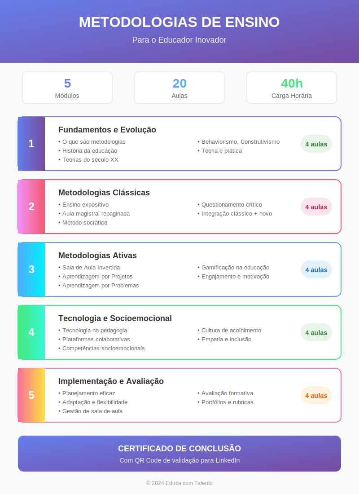

# Aula 01: O Que São e Por Que Importam as Metodologias de Ensino

## Informações da Aula

| Item | Descrição |
|------|-----------|
| **Módulo** | 1 - Fundamentos e Evolução |
| **Bloco** | Introdução |
| **Duração Estimada** | 45 minutos |
| **Nível** | Introdutório |

---

## Fundamentação Teórica

### O Conceito de Metodologia de Ensino

A metodologia de ensino constitui o conjunto de procedimentos, técnicas e estratégias que o educador utiliza para facilitar o processo de ensino-aprendizagem. Segundo **José Carlos Libâneo** (2013), em sua obra "Didática", a metodologia representa a ponte entre os objetivos educacionais e os resultados de aprendizagem, sendo determinante para o sucesso ou fracasso da ação pedagógica.

**Antoni Zabala** (1998), professor da Universidade de Barcelona, em "A Prática Educativa: Como Ensinar", define metodologia como "a maneira de organizar e articular os diferentes componentes didáticos para a consecução dos fins educativos". Esta definição nos remete à compreensão de que metodologia não é apenas "como ensinar", mas "como criar condições para que o aluno aprenda".

### Diferença entre Método, Técnica e Estratégia

É fundamental distinguir três conceitos frequentemente confundidos:

- **Método**: Caminho organizado e sistemático para atingir um objetivo educacional. Segundo **Imídeo Giuseppe Nérici** (1981), o método é o "conjunto de normas e regras que orientam a ação do professor".

- **Técnica**: Procedimento específico dentro de um método. Por exemplo, o debate é uma técnica dentro do método ativo.

- **Estratégia**: Plano de ação mais amplo que articula métodos e técnicas. **Léa Anastasiou** (UFSC) define estratégia como "a arte de aplicar meios disponíveis para alcançar objetivos específicos".

### A Neurociência e a Escolha Metodológica

Pesquisas recentes em neurociência educacional, conduzidas por instituições como o **MIT** (Massachusetts Institute of Technology) e a **Harvard Graduate School of Education**, demonstram que a escolha metodológica impacta diretamente a formação de memórias de longo prazo.

O neurocientista **John Medina** (2008), autor de "Brain Rules", demonstra que:
- O cérebro processa informações de forma mais eficiente quando há engajamento ativo
- A repetição espaçada e multimodal aumenta a retenção em até 65%
- O estresse negativo bloqueia a consolidação de memórias

### O Aluno do Século XXI

A **UNESCO** (2015), no relatório "Repensar a Educação", destaca que o aluno contemporâneo:
- É nativo digital, mas nem sempre letrado digitalmente
- Possui atenção fragmentada (média de 8 segundos de foco inicial)
- Aprende melhor por descoberta e colaboração
- Busca relevância e aplicabilidade imediata

**Marc Prensky** (2001), criador do termo "nativos digitais", argumenta que as metodologias tradicionais foram desenhadas para cérebros analógicos, sendo necessária uma ressignificação das práticas pedagógicas.

### A Pedagogia Crítica de Paulo Freire

**Paulo Freire** (1921-1997), Patrono da Educação Brasileira, revolucionou a compreensão sobre metodologias ao propor a superação da "educação bancária" — aquela em que o professor "deposita" conhecimento no aluno passivo.

Em "Pedagogia do Oprimido" (1968), Freire defende:
- **Dialogicidade**: A educação como processo de comunicação horizontal
- **Problematização**: Partir da realidade do aluno para construir conhecimento
- **Práxis**: Unidade indissociável entre teoria e prática
- **Conscientização**: Educação como ferramenta de transformação social

### Impacto das Escolhas Metodológicas

Estudos da **OCDE** (Organização para a Cooperação e Desenvolvimento Econômico) através do PISA (Programa Internacional de Avaliação de Estudantes) demonstram que países com melhores resultados educacionais investem significativamente em:
- Formação continuada docente em metodologias ativas
- Diversificação das práticas pedagógicas
- Avaliação formativa integrada ao processo de ensino

A pesquisadora **Bernardete Gatti** (Fundação Carlos Chagas) aponta que no Brasil, a formação inicial de professores ainda dedica tempo insuficiente às metodologias de ensino, resultando em práticas predominantemente expositivas.

### Referências Teóricas Fundamentais

| Autor | Obra | Contribuição |
|-------|------|--------------|
| John Dewey | "Democracia e Educação" (1916) | Aprendizagem pela experiência |
| Paulo Freire | "Pedagogia do Oprimido" (1968) | Educação dialógica e crítica |
| Philippe Perrenoud | "Dez Novas Competências para Ensinar" (2000) | Competências docentes |
| Edgar Morin | "Os Sete Saberes" (2000) | Pensamento complexo na educação |
| Antoni Zabala | "A Prática Educativa" (1998) | Sequências didáticas |

---

## Objetivos de Aprendizagem

Ao final desta aula, o educador será capaz de:

### Objetivo Geral
Compreender o conceito de metodologias de ensino e reconhecer seu papel transformador na prática pedagógica contemporânea.

### Objetivos Específicos

1. **Conceitual**: Definir metodologia de ensino diferenciando-a de método, técnica e estratégia, utilizando a terminologia adequada em discussões pedagógicas.

2. **Analítico**: Analisar como as escolhas metodológicas impactam diretamente o engajamento, a motivação e os resultados de aprendizagem dos alunos.

3. **Contextual**: Relacionar o perfil do aluno do século XXI com a necessidade de atualização das práticas pedagógicas.

4. **Crítico**: Avaliar criticamente a própria prática docente à luz dos fundamentos teóricos estudados.

5. **Propositivo**: Identificar ao menos três aspectos de sua prática que podem ser aprimorados com base nos conceitos apresentados.

---

## Roteiro da Aula

### Abertura (5 min)
- Dinâmica de entrada: "Qual foi a melhor aula que você já teve? Por quê?"
- Conexão com a experiência dos participantes
- Apresentação dos objetivos da aula

### Desenvolvimento (35 min)

#### Parte 1: O Que São Metodologias de Ensino (10 min)
- Definição conceitual a partir de Libâneo e Zabala
- Diferenciação: método, técnica, estratégia
- Exemplos práticos de cada conceito
- Discussão: Por que essa distinção importa?

#### Parte 2: O Aluno Contemporâneo (8 min)
- Dados sobre o perfil do aluno atual
- Contribuições da neurociência educacional
- O conceito de "nativos digitais" e suas implicações
- A fragmentação da atenção e estratégias de engajamento

#### Parte 3: A Perspectiva Freiriana (10 min)
- Educação bancária vs. educação libertadora
- Os pilares: dialogicidade, problematização, práxis
- Aplicações contemporâneas da pedagogia crítica
- Casos de sucesso em escolas brasileiras

#### Parte 4: Impacto das Escolhas Metodológicas (7 min)
- Dados do PISA e da OCDE
- Pesquisas brasileiras sobre formação docente
- A responsabilidade do educador na escolha metodológica
- O professor como designer de experiências de aprendizagem

### Encerramento (5 min)
- Síntese dos principais conceitos
- Conexão com a próxima aula
- Apresentação da atividade prática

---

## Narração em Primeira Pessoa

### Abertura

Bem-vindo ao curso **Metodologias de Ensino**! Eu sou muito feliz em ter você aqui, porque isso demonstra seu compromisso com a educação de qualidade.

Antes de começarmos, quero te fazer uma pergunta: **qual foi a melhor aula que você já teve na vida?** Pode ser como aluno, pode ser como observador. Pense um momento... O que fez aquela aula ser especial?

Se você pensar bem, vai perceber que provavelmente não foi apenas o conteúdo. Foi a **forma** como foi apresentado. Foi o **engajamento** que você sentiu. Foi a **conexão** com sua realidade. E é exatamente sobre isso que vamos falar: a metodologia.

### Desenvolvimento

#### O Que São Metodologias de Ensino

Vamos começar pelo básico: o que é metodologia de ensino?

José Carlos Libâneo, um dos maiores pensadores da didática no Brasil, define metodologia como o **conjunto de procedimentos e técnicas que utilizamos para facilitar a aprendizagem**. Mas eu gosto de uma definição mais simples: metodologia é a **ponte entre o que você quer ensinar e o que o aluno realmente aprende**.

E aqui está o ponto crucial: a ponte pode ser bem construída ou mal construída. Uma ponte frágil faz com que muitos alunos caiam no caminho. Uma ponte sólida permite que todos atravessem.

Agora, é importante fazer uma distinção que muita gente confunde:

- **Método** é o caminho geral que você escolhe. Por exemplo: método expositivo, método ativo, método socrático.
- **Técnica** é um procedimento específico dentro desse método. Por exemplo: uma tempestade de ideias, um debate, um estudo de caso.
- **Estratégia** é o seu plano de ação que articula métodos e técnicas para um objetivo específico.

Pense assim: se você está viajando, o **método** é o meio de transporte (carro, avião, navio). A **técnica** são as manobras específicas que você faz (ultrapassar, decolar, ancorar). E a **estratégia** é o plano completo da viagem, considerando todos os fatores.

#### O Aluno Contemporâneo

Agora, deixa eu te contar algo que talvez você já tenha percebido: o aluno de hoje não é o mesmo de 20, 10 ou até 5 anos atrás.

Marc Prensky cunhou o termo "nativos digitais" para descrever essa geração que nasceu imersa na tecnologia. Mas aqui está um insight importante: ser nativo digital não significa ser letrado digital. São coisas diferentes.

O aluno de hoje:
- Está acostumado com estímulos rápidos e múltiplos
- Busca relevância imediata — "Para que eu preciso saber isso?"
- Aprende melhor quando pode participar ativamente
- Tem acesso a informações, mas nem sempre sabe filtrá-las

A neurociência confirma: o cérebro aprende melhor quando está **engajado**. John Medina, do MIT, demonstrou que a atenção começa a cair após 10 minutos de exposição passiva. Por isso, metodologias que alternam momentos de exposição com momentos de participação ativa têm resultados muito superiores.

#### A Perspectiva Freiriana

Não podemos falar de metodologias sem falar de Paulo Freire. E olha, independente de qualquer debate político, as contribuições pedagógicas de Freire são reconhecidas mundialmente.

Freire criticava o que chamava de **"educação bancária"** — aquela em que o professor "deposita" conhecimento no aluno como se fosse uma conta de banco. O aluno é passivo, recebe, memoriza, repete.

Em oposição, Freire propunha uma **educação dialógica e libertadora**. Os pilares são:

**Dialogicidade**: Educação não é monólogo, é diálogo. O professor aprende com o aluno assim como o aluno aprende com o professor.

**Problematização**: Em vez de dar respostas prontas, partir de problemas reais que façam sentido para o aluno.

**Práxis**: Unir teoria e prática. O conhecimento só faz sentido quando pode ser aplicado e transformar a realidade.

Isso te lembra algo? Sim! As metodologias ativas que tanto falamos hoje são, em grande parte, uma atualização das ideias de Freire aplicadas ao contexto contemporâneo.

#### Impacto das Escolhas Metodológicas

Vou te dar um dado que pode te surpreender: segundo a OCDE, o fator que mais impacta a qualidade da educação não é infraestrutura, não é tecnologia — é a **qualidade do professor e suas práticas pedagógicas**.

Os países que lideram o PISA — Finlândia, Singapura, Coreia do Sul — investem massivamente em formação docente, especialmente em metodologias de ensino.

No Brasil, pesquisas da Fundação Carlos Chagas mostram que ainda dedicamos pouco tempo na formação inicial de professores às questões metodológicas. O resultado? Professores que reproduzem o modelo que vivenciaram como alunos, perpetuando práticas que nem sempre são as mais eficazes.

Mas aqui está a boa notícia: você está aqui. Você está buscando atualização. E isso já te coloca à frente.

### Encerramento

Vamos recapitular o que vimos hoje:

- **Metodologia** é a ponte entre o ensinar e o aprender
- Precisamos distinguir **método, técnica e estratégia** para usar cada um adequadamente
- O **aluno contemporâneo** demanda práticas pedagógicas atualizadas
- **Paulo Freire** nos ensinou sobre dialogicidade, problematização e práxis
- Nossas **escolhas metodológicas** impactam diretamente os resultados de aprendizagem

Na próxima aula, faremos uma viagem no tempo! Vamos conhecer a **história da educação**, desde a Antiguidade até a Idade Média, para entender de onde viemos e por que ensinamos do jeito que ensinamos.

Agora é hora da sua atividade prática. Ela é fundamental para consolidar o que aprendemos!

---

## Recursos Utilizados

### Slides/Apresentação
- Diagrama: Método vs. Técnica vs. Estratégia
- Infográfico: O Aluno do Século XXI
- Quadro comparativo: Educação Bancária vs. Educação Dialógica
- Gráfico: Impacto das metodologias nos resultados (dados PISA)

### Materiais de Apoio
- Resumo: "Os Pilares da Pedagogia Freiriana"
- Artigo: "Neurociência e Aprendizagem" (Harvard)
- Checklist: "Autoavaliação das Práticas Metodológicas"

### Referências Bibliográficas
- FREIRE, Paulo. **Pedagogia do Oprimido**. 17ª ed. Rio de Janeiro: Paz e Terra, 1987.
- LIBÂNEO, José Carlos. **Didática**. 2ª ed. São Paulo: Cortez, 2013.
- ZABALA, Antoni. **A Prática Educativa: como ensinar**. Porto Alegre: Artmed, 1998.
- MEDINA, John. **Brain Rules**. Seattle: Pear Press, 2008.
- PRENSKY, Marc. **Digital Natives, Digital Immigrants**. On the Horizon, v. 9, n. 5, 2001.

---

## Atividade Prática: Reflexão sobre a Prática Docente

> **Complete esta atividade antes de prosseguir para a próxima aula!**

### Instruções Detalhadas

Esta atividade tem como objetivo promover uma reflexão profunda sobre sua prática pedagógica à luz dos conceitos estudados. Reserve aproximadamente 60 minutos para realizá-la com qualidade.

#### Parte 1: Autobiografia Metodológica (20 minutos)

Escreva um texto de 300-400 palavras respondendo:

1. **Como você aprendeu a ensinar?** Descreva os modelos de professores que influenciaram sua prática. Quais metodologias eles utilizavam?

2. **Qual é sua "zona de conforto" metodológica?** Quais técnicas você utiliza com mais frequência? Por quê?

3. **Identifique uma situação** em que sua escolha metodológica resultou em engajamento excepcional dos alunos. O que fez a diferença?

#### Parte 2: Diagnóstico da Prática Atual (25 minutos)

Preencha a tabela de autoavaliação:

| Aspecto | Frequência (1-5) | Reflexão |
|---------|-----------------|----------|
| Utilizo aula expositiva tradicional | | Por que essa frequência? |
| Promovo discussões e debates | | Quais os desafios? |
| Uso trabalhos em grupo | | Como organizo? |
| Parto da realidade do aluno | | Exemplos concretos |
| Diversifico as estratégias | | O que me impede? |

*Escala: 1 = Nunca | 2 = Raramente | 3 = Às vezes | 4 = Frequentemente | 5 = Sempre*

#### Parte 3: Plano de Desenvolvimento (15 minutos)

Com base na reflexão anterior, responda:

1. **Três aspectos** da sua prática que você considera **pontos fortes** metodologicamente.

2. **Três aspectos** que você identifica como **oportunidades de melhoria**.

3. **Uma meta concreta** de desenvolvimento metodológico que você deseja alcançar ao final deste curso.

### Critérios de Avaliação

| Critério | Peso |
|----------|------|
| Profundidade da reflexão | 30% |
| Conexão com os conceitos da aula | 25% |
| Autocrítica construtiva | 25% |
| Clareza e organização | 20% |

### Entrega

Submeta seu trabalho na área **"Envio de Atividade - Aula 1"** do Moodle até a data indicada.

---

## Conclusão da Aula

### Resumo dos Pontos-Chave

- Metodologia de ensino é o conjunto de procedimentos que facilitam a aprendizagem
- Método, técnica e estratégia são conceitos distintos e complementares
- O aluno contemporâneo demanda práticas pedagógicas atualizadas e engajadoras
- A pedagogia de Paulo Freire oferece fundamentos essenciais para uma educação transformadora
- Nossas escolhas metodológicas impactam diretamente os resultados de aprendizagem

### Conexão com a Próxima Aula

Na **Aula 2**, embarcaremos em uma viagem pela história da educação, desde as primeiras formas de transmissão de conhecimento na pré-história até o surgimento das universidades medievais. Compreender essa trajetória nos ajudará a entender por que certas práticas pedagógicas ainda predominam e como podemos transformá-las.

### Frase de Encerramento

> "Ensinar não é transferir conhecimento, mas criar as possibilidades para a sua própria produção ou a sua construção."
> — **Paulo Freire**, Pedagogia da Autonomia

---

## Notas de Produção

### Elementos Visuais Sugeridos
- Animação inicial mostrando a "ponte" metodológica
- Fotos de Paulo Freire, Libâneo, Prensky
- Gráficos animados com dados do PISA
- Comparativo visual: educação bancária vs. dialógica

### Tom da Apresentação
- Acolhedor e motivador na abertura
- Didático e claro nas explicações conceituais
- Provocativo e reflexivo nas discussões sobre prática
- Inspirador no encerramento

### Dica de Gravação
- Usar variação de tom para manter engajamento
- Pausas estratégicas após perguntas retóricas
- Olhar direto para a câmera nos momentos de conexão pessoal
- Gesticular ao explicar conceitos abstratos

---

*Aula 01 de 20 - Curso Metodologias de Ensino - Educa com Talento*

---

## Infográfico da Aula

O infográfico "Visão Geral das Metodologias de Ensino" apresenta os conceitos fundamentais desta aula inaugural, destacando a diferença entre método, técnica e estratégia, além dos pilares da educação contemporânea.

> **Dica de uso**: Este infográfico pode ser exibido durante a videoaula ou disponibilizado como material de apoio para download.
