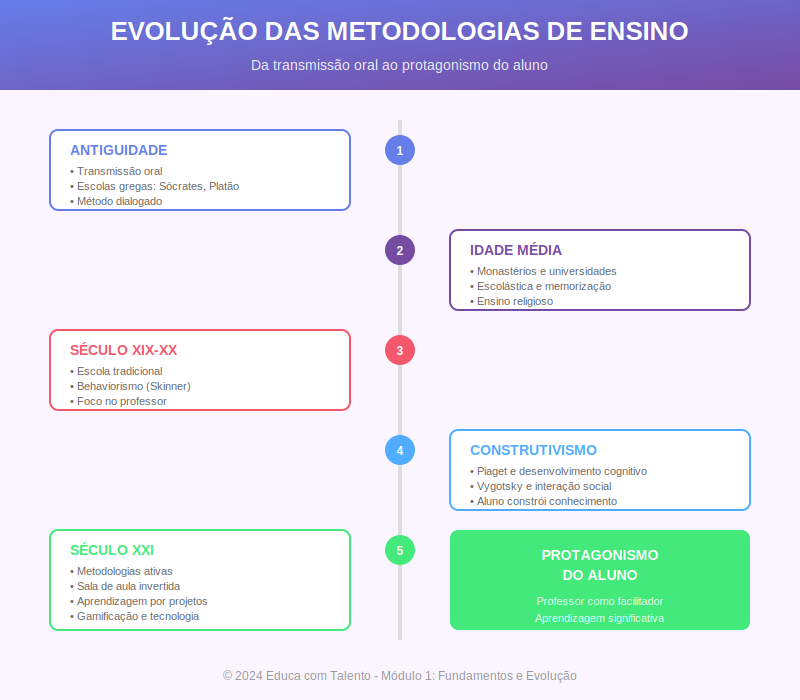

# Aula 02: A História em Sala de Aula — Da Antiguidade à Idade Média

## Informações da Aula

| Item | Descrição |
|------|-----------|
| **Módulo** | 1 - Fundamentos e Evolução |
| **Bloco** | Histórico |
| **Duração Estimada** | 50 minutos |
| **Nível** | Introdutório |

---

## Fundamentação Teórica

### A Educação nas Sociedades Primitivas

Antes da escrita, a educação acontecia de forma **oral e vivencial**. O antropólogo **Émile Durkheim** (1858-1917), considerado pai da sociologia da educação, descreveu esse período como "educação difusa" — aprendia-se pela observação, imitação e participação nas atividades do grupo.

**Características da educação primitiva:**
- Transmissão oral de conhecimentos
- Aprendizagem contextualizada (na prática da caça, agricultura, rituais)
- Ausência de instituições formais
- O conhecimento como propriedade coletiva
- Papel dos anciãos como guardiões do saber

O historiador da educação **Franco Cambi** (Universidade de Florença), em "História da Pedagogia" (1999), destaca que esse modelo de educação não-formal prevaleceu por milhares de anos e ainda persiste em comunidades tradicionais.

### A Educação na Grécia Antiga

A Grécia Antiga representa um **divisor de águas** na história da educação. Foi onde surgiram conceitos que ainda fundamentam nossa prática pedagógica.

#### Sócrates (469-399 a.C.) — O Método Maiêutico

**Sócrates** não deixou escritos, mas sua metodologia foi registrada por seu discípulo Platão. O **método maiêutico** (do grego *maieutikós*, "arte de partejar") consiste em fazer o interlocutor descobrir a verdade por si mesmo através de perguntas sistemáticas.

O processo socrático envolve:
1. **Ironia**: Fingir ignorância para estimular o outro a expor suas ideias
2. **Refutação**: Demonstrar contradições no pensamento do interlocutor
3. **Maiêutica**: "Dar à luz" o conhecimento que já está dentro da pessoa

**Werner Jaeger** (1888-1961), em sua obra magistral "Paidéia: A Formação do Homem Grego", considera o método socrático a primeira metodologia de ensino sistematizada da história ocidental.

#### Platão (428-348 a.C.) — A Academia

Discípulo de Sócrates, **Platão** fundou a **Academia** em Atenas por volta de 387 a.C. — considerada a primeira instituição de ensino superior do mundo ocidental. A Academia funcionou por quase 900 anos, até ser fechada em 529 d.C.

Contribuições pedagógicas de Platão:
- A educação como responsabilidade do Estado
- Currículos estruturados (matemática, música, dialética)
- A dialética como método de busca da verdade
- A educação diferenciada segundo as aptidões

Na obra "A República", Platão propõe um sistema educacional completo, dividindo os cidadãos segundo suas capacidades e oferecendo formação específica para cada grupo.

#### Aristóteles (384-322 a.C.) — O Liceu

**Aristóteles**, discípulo de Platão, fundou o **Liceu** em 335 a.C. Sua metodologia era conhecida como **peripatética** (do grego *peripatein*, "passear"), pois ensinava caminhando pelos jardins da escola.

Contribuições de Aristóteles para a pedagogia:
- O conhecimento parte da **observação empírica**
- A lógica como fundamento do pensamento correto
- A importância do **hábito** na formação moral
- A educação como desenvolvimento de potencialidades

O conceito aristotélico de **entelequia** (atualização das potências) influenciou toda a pedagogia posterior, incluindo pensadores como Rousseau e Piaget.

### A Educação em Roma

Os romanos adaptaram o modelo grego, mas com foco mais **prático e utilitário**.

#### Quintiliano (35-95 d.C.) — A Arte de Ensinar

**Marcus Fabius Quintilianus** é considerado o primeiro teórico da educação no sentido moderno. Sua obra "Institutio Oratoria" (Instituto Oratório) apresenta um sistema completo de formação do orador, desde a infância.

Princípios pedagógicos de Quintiliano:
- A educação deve começar cedo
- O professor deve conhecer a **individualidade** de cada aluno
- Os castigos físicos são contraproducentes
- O **jogo** é um recurso didático válido
- A competição saudável estimula a aprendizagem

Quintiliano já defendia, há dois mil anos, ideias que consideramos "modernas": respeito ao ritmo individual, aprendizagem lúdica e relação afetuosa professor-aluno.

### A Educação Medieval

A Idade Média (séculos V-XV) é frequentemente retratada como "Idade das Trevas", mas essa visão é historicamente imprecisa. Foi um período de **importantes transformações educacionais**.

#### Os Monastérios e as Escolas Monásticas

Com a queda do Império Romano (476 d.C.), a Igreja Católica tornou-se a principal guardiã do conhecimento. Os **monastérios** funcionavam como centros de preservação e transmissão do saber.

**São Bento de Núrsia** (480-547), fundador da Ordem Beneditina, estabeleceu a regra "Ora et Labora" (Ora e Trabalha), que incluía a **lectio divina** (leitura sagrada) como prática diária obrigatória.

As **escolas monásticas** ofereciam:
- Educação religiosa e formação moral
- Leitura e escrita em latim
- Canto gregoriano
- Conhecimentos básicos de aritmética

**Jacques Le Goff**, historiador medievalista da Escola dos Annales, destaca em "Os Intelectuais na Idade Média" que esses centros foram fundamentais para a preservação da cultura clássica.

#### As Escolas Catedrais e Palatinas

A partir do século VIII, surgem dois novos modelos:

**Escolas Palatinas**: Criadas junto aos palácios reais. O exemplo mais famoso é a escola de **Carlos Magno** (742-814), que trouxe o monge inglês **Alcuíno de York** para dirigir sua academia.

**Escolas Catedrais**: Ligadas às sedes episcopais, preparavam clérigos para o serviço religioso. Destas surgiram as primeiras universidades.

#### As Sete Artes Liberais

O currículo medieval foi organizado nas **Sete Artes Liberais**, divididas em dois grupos:

**Trivium** (as três vias):
1. Gramática — domínio da língua
2. Retórica — arte de persuadir
3. Dialética — arte de argumentar

**Quadrivium** (as quatro vias):
4. Aritmética — ciência dos números
5. Geometria — ciência do espaço
6. Astronomia — ciência dos astros
7. Música — ciência dos sons

Esse currículo, codificado por **Marciano Capella** (século V) e sistematizado por **Boécio** (480-524), permaneceu como base educacional por cerca de mil anos.

#### O Surgimento das Universidades

O século XII marca o nascimento das **universidades** (*universitas* = comunidade, corporação). As primeiras foram:

| Universidade | Fundação | Especialidade |
|--------------|----------|---------------|
| Bolonha (Itália) | 1088 | Direito |
| Paris (França) | c. 1150 | Teologia |
| Oxford (Inglaterra) | 1167 | Artes e Teologia |
| Cambridge (Inglaterra) | 1209 | Artes e Teologia |
| Salamanca (Espanha) | 1218 | Direito e Teologia |
| Coimbra (Portugal) | 1290 | Direito e Medicina |

O **método escolástico**, desenvolvido por **Pedro Abelardo** (1079-1142) e sistematizado por **Tomás de Aquino** (1225-1274), dominava o ensino universitário. Consistia em:

1. **Lectio**: Leitura comentada de textos autoridades
2. **Quaestio**: Formulação de questões sobre o texto
3. **Disputatio**: Debate público sobre as questões
4. **Determinatio**: Conclusão do mestre

### Legado para a Educação Contemporânea

Compreender a história nos ajuda a perceber que:

- Metodologias consideradas "inovadoras" têm raízes milenares
- O método socrático de perguntas antecipa as metodologias ativas
- Quintiliano já defendia a individualização e o lúdico
- O modelo de aula expositiva vem da *lectio* medieval
- A estrutura departamental universitária tem origens no século XII

**António Nóvoa**, historiador da educação da Universidade de Lisboa, argumenta que "conhecer a história da educação não é luxo de eruditos, mas necessidade de todos os que pretendem transformar a escola".

---

## Objetivos de Aprendizagem

Ao final desta aula, o educador será capaz de:

### Objetivo Geral
Compreender a evolução histórica das metodologias de ensino desde a Antiguidade até a Idade Média, identificando permanências e transformações.

### Objetivos Específicos

1. **Identificar** as principais características da educação nas sociedades primitivas e sua influência na educação não-formal contemporânea.

2. **Analisar** as contribuições metodológicas de Sócrates, Platão e Aristóteles, relacionando-as com práticas pedagógicas atuais.

3. **Compreender** a inovação pedagógica de Quintiliano e sua surpreendente atualidade.

4. **Descrever** a organização educacional medieval, incluindo escolas monásticas, catedrais e o surgimento das universidades.

5. **Relacionar** o método escolástico com práticas acadêmicas contemporâneas.

6. **Refletir** sobre como o conhecimento histórico pode informar e transformar a prática docente atual.

---

## Roteiro da Aula

### Abertura (5 min)
- Provocação: "Se você pudesse viajar no tempo e assistir a uma aula na Grécia Antiga, o que esperaria ver?"
- Conexão: A história como espelho e fonte de inspiração
- Objetivos da aula

### Desenvolvimento (40 min)

#### Parte 1: Da Pré-História à Grécia (12 min)
- A educação difusa nas sociedades primitivas
- Sócrates e o método maiêutico
- Platão e a Academia
- Aristóteles e o Liceu
- Demonstração: Diálogo socrático ao vivo

#### Parte 2: A Contribuição Romana (8 min)
- Adaptação do modelo grego
- Quintiliano: um educador à frente de seu tempo
- A retórica como centro da formação
- Paralelos com educação contemporânea

#### Parte 3: A Idade Média (15 min)
- O papel da Igreja na preservação do conhecimento
- Escolas monásticas, palatinas e catedrais
- As Sete Artes Liberais
- O surgimento das universidades
- O método escolástico

#### Parte 4: Síntese e Reflexões (5 min)
- Linha do tempo visual
- Permanências e rupturas
- O que podemos aprender com a história?

### Encerramento (5 min)
- Conexões com a prática atual
- Preview da próxima aula
- Apresentação da atividade

---

## Narração em Primeira Pessoa

### Abertura

Seja bem-vindo à nossa segunda aula! Hoje vamos fazer algo especial: uma **viagem no tempo**.

Imagina comigo: você tem uma máquina do tempo e pode voltar à Atenas do século V antes de Cristo. Você entra em uma praça — a Ágora — e vê um grupo de pessoas reunidas ao redor de um senhor de barba, descalço, fazendo perguntas aparentemente simples, mas que deixam os interlocutores confusos. Esse senhor é **Sócrates**.

Você observa que ele não está dando respostas. Ele está **fazendo perguntas**. E a cada resposta do interlocutor, uma nova pergunta. O objetivo? Fazer a pessoa descobrir a verdade por si mesma.

Isso te lembra algo? Talvez as metodologias ativas que tanto falamos hoje? Pois é. **Não há nada de novo sob o sol**, já dizia o Eclesiastes. E conhecer a história da educação vai te mostrar que muitas "inovações" são, na verdade, **redescobertas**.

### Desenvolvimento

#### Da Pré-História à Grécia

Antes de falarmos dos gregos, precisamos dar um passo atrás. Muito atrás.

Nas sociedades primitivas, a educação acontecia de forma **natural e integrada à vida**. Não havia escolas, não havia professores no sentido formal. O conhecimento era transmitido dos mais velhos para os mais jovens através da **vivência compartilhada**.

A criança aprendia a caçar caçando com os adultos. Aprendia a plantar plantando. Aprendia os rituais participando deles. O sociólogo Émile Durkheim chamou isso de "educação difusa" — o conhecimento difundido pela prática social.

E sabe o que é interessante? Esse modelo ainda funciona! Quando você aprende uma habilidade prática acompanhando alguém experiente — seja cozinhar, dirigir, ou até dar aula — você está usando esse modelo ancestral.

Mas vamos para a Grécia, onde a coisa fica realmente interessante.

**Sócrates** revolucionou o ensino com uma metodologia simples, mas poderosa: **fazer perguntas**. Ele chamava isso de "maiêutica", que significa "arte de partejar". Assim como a parteira ajuda a mãe a dar à luz o bebê, Sócrates ajudava seus discípulos a "dar à luz" o conhecimento que já estava dentro deles.

O método funciona assim:
1. Sócrates fingia não saber (a famosa "ironia socrática")
2. Fazia perguntas que expunham contradições
3. Através das perguntas, conduzia o interlocutor à descoberta

Isso é **incrível** porque desloca o centro do processo de ensino. Não é o professor que transmite conhecimento — é o aluno que constrói.

**Platão**, discípulo de Sócrates, fundou a Academia. Sabe qual é a origem da palavra "acadêmico" que tanto usamos? Vem daí! A Academia ficava em um bosque dedicado ao herói Academus, nos arredores de Atenas.

Platão organizou um **currículo estruturado**: matemática, música, dialética. Ele defendia que a educação era responsabilidade do Estado. Na "República", ele desenha um sistema educacional completo, do nascimento à formação dos filósofos-reis.

**Aristóteles**, por sua vez, estudou na Academia por 20 anos, depois fundou sua própria escola: o Liceu. Ele ensinava caminhando — por isso sua metodologia é chamada de "peripatética".

A grande contribuição de Aristóteles foi unir **observação empírica** com **sistematização lógica**. Enquanto Platão buscava verdades eternas no mundo das ideias, Aristóteles dizia: "Olhe para o mundo! Observe! Classifique! Analise!"

#### A Contribuição Romana

Os romanos eram práticos. Eles olharam para a educação grega e pensaram: "Ótimo, mas como isso nos ajuda a formar bons cidadãos, bons soldados, bons administradores?"

A educação romana era voltada para a **oratória** — a arte de falar bem em público. E o maior teórico da educação romana foi **Quintiliano**.

Deixa eu te contar algo surpreendente sobre Quintiliano. Estamos falando de um sujeito que viveu há quase 2000 anos. E ele já defendia:

- Que o professor deveria conhecer a **individualidade** de cada aluno
- Que **castigos físicos** prejudicam a aprendizagem
- Que o **jogo** é um recurso didático válido
- Que a competição saudável **motiva** os estudantes

Parece texto de pedagogo contemporâneo, não é? Mas é de 95 d.C.! Quintiliano estava séculos à frente de seu tempo.

#### A Idade Média

Agora vamos para um período muito mal compreendido: a Idade Média.

Você provavelmente já ouviu falar em "Idade das Trevas". Esse termo foi inventado no Renascimento por pessoas que queriam se diferenciar do período anterior. Mas historiadores sérios hoje rejeitam essa visão.

A Idade Média foi um período de **transformação e preservação**. Com a queda do Império Romano, quem assumiu o papel de guardar o conhecimento? A Igreja.

Os **monastérios** se tornaram verdadeiras fortalezas culturais. Monges copiavam manuscritos à mão, preservando obras de Platão, Aristóteles, Cícero. Sem eles, teríamos perdido grande parte da cultura clássica.

As **escolas monásticas** ensinavam leitura, escrita, canto, aritmética básica. O modelo era rígido, hierárquico, baseado na memorização e repetição. A disciplina era severa.

A partir do século VIII, surgem as **escolas palatinas** — junto aos palácios reais — e as **escolas catedrais** — junto às sedes episcopais. Carlos Magno, o grande imperador, chamou o monge inglês Alcuíno para dirigir a renovação educacional de seu império.

O currículo foi organizado nas **Sete Artes Liberais**:
- **Trivium**: gramática, retórica, dialética
- **Quadrivium**: aritmética, geometria, astronomia, música

Esse currículo dominou a educação europeia por quase mil anos!

E no século XII, acontece algo revolucionário: surgem as **universidades**. Bolonha em 1088, Paris por volta de 1150, Oxford em 1167.

A universidade era uma *universitas* — uma corporação, uma comunidade de mestres e estudantes. E o método de ensino? O **escolástico**.

O método escolástico funcionava assim:
1. **Lectio**: O mestre lia e comentava textos de autoridades
2. **Quaestio**: Formulava questões sobre o texto
3. **Disputatio**: Havia debate público
4. **Determinatio**: O mestre dava a conclusão

Percebeu? A aula expositiva que tanto criticamos hoje vem daí! É herança medieval. A *lectio* — leitura comentada pelo mestre — está na base do modelo que ainda predomina.

### Encerramento

O que podemos aprender com essa viagem no tempo?

Primeiro: **nada surge do nada**. As metodologias ativas têm raízes no método socrático. A individualização do ensino já era defendida por Quintiliano. A estrutura universitária vem do século XII.

Segundo: **conhecer a história nos liberta**. Quando entendemos que o modelo de aula expositiva é uma construção histórica, percebemos que ele pode ser transformado. O que foi construído pode ser reconstruído.

Terceiro: **há muito a aprender com os antigos**. Sócrates, Platão, Aristóteles, Quintiliano — eles tinham insights poderosos que continuam válidos.

Na próxima aula, vamos dar um grande salto: do final da Idade Média direto para o século XX. Vamos conhecer as **revoluções pedagógicas** que transformaram nossa compreensão sobre aprendizagem: Skinner, Piaget, Vygotsky, Ausubel, Gardner.

Agora, prepare-se para a atividade prática!

---

## Recursos Utilizados

### Slides/Apresentação
- Linha do tempo visual: Da Pré-História à Idade Média
- Mapa: Localização das primeiras universidades
- Diagrama: As Sete Artes Liberais
- Quadro comparativo: Educação grega vs. romana vs. medieval

### Materiais de Apoio
- Infográfico: O Método Socrático
- Trecho selecionado: Diálogo platônico "Mênon"
- Linha do tempo interativa para download

### Referências Bibliográficas
- CAMBI, Franco. **História da Pedagogia**. São Paulo: UNESP, 1999.
- JAEGER, Werner. **Paidéia: A Formação do Homem Grego**. São Paulo: Martins Fontes, 2013.
- LE GOFF, Jacques. **Os Intelectuais na Idade Média**. Rio de Janeiro: José Olympio, 2003.
- MANACORDA, Mario Alighiero. **História da Educação**. 13ª ed. São Paulo: Cortez, 2010.
- MARROU, Henri-Irénée. **História da Educação na Antiguidade**. São Paulo: EPU, 1990.

---

## Atividade Prática: Linha do Tempo Educacional Comentada

> **Complete esta atividade antes de prosseguir para a próxima aula!**

### Instruções Detalhadas

Esta atividade propõe a construção de uma linha do tempo que não apenas registre fatos históricos, mas estabeleça **conexões com a prática pedagógica contemporânea**. Reserve aproximadamente 90 minutos para realizá-la.

#### Parte 1: Construção da Linha do Tempo (40 minutos)

Crie uma linha do tempo visual (pode ser desenho à mão, digital com Canva/PowerPoint, ou outro formato de sua preferência) que contenha:

**Período 1: Antiguidade Grega (500 a.C. - 300 a.C.)**
- Mínimo 3 marcos com datas aproximadas
- Para cada marco: descrição e contribuição metodológica

**Período 2: Roma e Transição (100 a.C. - 500 d.C.)**
- Mínimo 2 marcos com datas aproximadas
- Destaque para Quintiliano

**Período 3: Idade Média (500 - 1500 d.C.)**
- Mínimo 4 marcos com datas
- Incluir: escolas monásticas, artes liberais, universidades

#### Parte 2: Análise Reflexiva (30 minutos)

Para cada período, responda:

1. **Qual metodologia predominante** caracterizava o período?

2. **O que permanece** dessa época na educação atual? Dê exemplos concretos.

3. **O que foi superado** ou transformado? Por quê?

4. **Qual insight** desse período pode inspirar sua prática docente hoje?

#### Parte 3: Conexão com a Prática (20 minutos)

Escolha **um pensador ou metodologia** estudada nesta aula e:

1. Descreva o conceito/metodologia em suas palavras

2. Proponha uma **aplicação concreta** em sua área de atuação

3. Identifique **possíveis desafios** na implementação

4. Sugira **adaptações** necessárias para o contexto atual

### Formato de Entrega

- Linha do tempo em formato visual (PDF, imagem ou link para versão digital)
- Análise reflexiva em texto (mínimo 500, máximo 800 palavras)
- Proposta de aplicação (mínimo 300 palavras)

### Critérios de Avaliação

| Critério | Peso |
|----------|------|
| Precisão histórica | 20% |
| Qualidade visual da linha do tempo | 15% |
| Profundidade da análise reflexiva | 30% |
| Criatividade na proposta de aplicação | 20% |
| Clareza e organização | 15% |

### Entrega

Submeta seu trabalho na área **"Envio de Atividade - Aula 2"** do Moodle.

---

## Conclusão da Aula

### Resumo dos Pontos-Chave

- A educação primitiva era difusa, vivencial e integrada à vida social
- Sócrates desenvolveu o método maiêutico (perguntas que levam à descoberta)
- Platão fundou a Academia e organizou currículos estruturados
- Aristóteles valorizou a observação empírica e a sistematização
- Quintiliano defendia individualização, ludicidade e respeito ao aluno
- A Idade Média preservou o conhecimento clássico nos monastérios
- As universidades medievais criaram o método escolástico
- Conhecer a história nos permite compreender e transformar o presente

### Conexão com a Próxima Aula

Na **Aula 3**, daremos um grande salto temporal para o século XX. Conheceremos as **revoluções teóricas** que transformaram nossa compreensão sobre aprendizagem: o behaviorismo de Skinner, o construtivismo de Piaget, o sociointeracionismo de Vygotsky, a aprendizagem significativa de Ausubel e as inteligências múltiplas de Gardner. Prepare-se para uma aula densa e transformadora!

### Frase de Encerramento

> "Um povo que não conhece a sua história está condenado a repeti-la."
> — **Edmund Burke** (1729-1797)

---

## Notas de Produção

### Elementos Visuais Sugeridos
- Animação da "viagem no tempo"
- Imagens/reconstituições da Ágora ateniense
- Mapas da Europa medieval
- Fotos de universidades históricas (Bolonha, Oxford)

### Tom da Apresentação
- Narrativo e envolvente ("Imagine...")
- Didático nas explicações conceituais
- Provocativo nas conexões com o presente
- Respeitoso com a complexidade histórica

### Dica de Gravação
- Variar o ritmo conforme os períodos históricos
- Usar pausas dramáticas antes de insights importantes
- Demonstrar ao vivo um mini-diálogo socrático
- Entusiasmo ao revelar "surpresas" (como Quintiliano)

---

*Aula 02 de 20 - Curso Metodologias de Ensino - Educa com Talento*

---

## Infográfico da Aula

O infográfico "Evolução da Educação" apresenta uma linha do tempo visual desde a Antiguidade até a Idade Média, destacando os principais pensadores, metodologias e instituições educacionais de cada período.

> **Dica de uso**: Este infográfico funciona como mapa conceitual da aula e pode ser impresso pelos participantes como material de consulta.
