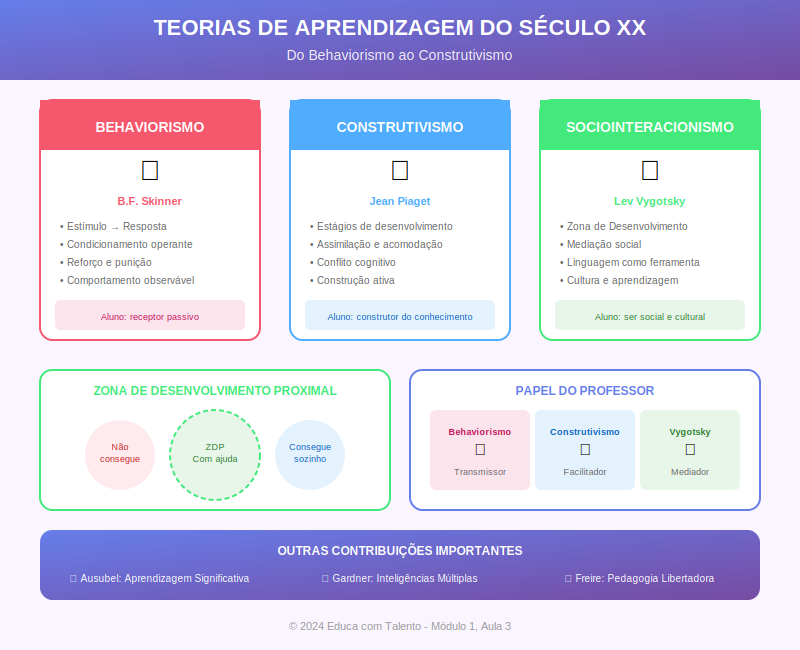

# Aula 03: As Revoluções do Século XX — Do Behaviorismo ao Construtivismo

## Informações da Aula

| Item | Descrição |
|------|-----------|
| **Módulo** | 1 - Fundamentos e Evolução |
| **Bloco** | Teórico |
| **Duração Estimada** | 55 minutos |
| **Nível** | Intermediário |

---

## Fundamentação Teórica

### Introdução: O Século das Revoluções Pedagógicas

O século XX foi marcado por **transformações radicais** na compreensão de como os seres humanos aprendem. Enquanto os séculos anteriores se baseavam em intuições filosóficas e tradições estabelecidas, o século XX trouxe a **ciência** para o centro do debate educacional.

Nesta aula, estudaremos as principais teorias que revolucionaram a educação:

1. Behaviorismo (Skinner)
2. Construtivismo Cognitivo (Piaget)
3. Sociointeracionismo (Vygotsky)
4. Aprendizagem Significativa (Ausubel)
5. Inteligências Múltiplas (Gardner)

### Behaviorismo: B.F. Skinner e o Condicionamento Operante

**Burrhus Frederic Skinner** (1904-1990) foi um psicólogo americano de Harvard que desenvolveu a teoria do **condicionamento operante**, baseada nos trabalhos anteriores de John Watson e Ivan Pavlov.

#### Princípios Fundamentais

O behaviorismo parte de uma premissa radical: **a ciência deve estudar apenas comportamentos observáveis**. Estados mentais, pensamentos e emoções são considerados "caixas-pretas" inacessíveis à investigação científica.

**Conceitos-chave:**

| Conceito | Definição | Exemplo Educacional |
|----------|-----------|---------------------|
| **Reforço positivo** | Estímulo que aumenta a probabilidade de um comportamento | Elogio após resposta correta |
| **Reforço negativo** | Remoção de estímulo aversivo que aumenta o comportamento | Retirar tarefa extra se melhorar notas |
| **Punição** | Estímulo que diminui a probabilidade de um comportamento | Advertência por indisciplina |
| **Extinção** | Desaparecimento do comportamento por falta de reforço | Ignorar comportamento inadequado |

#### Aplicações Educacionais

O behaviorismo influenciou profundamente a educação:

- **Instrução Programada**: Conteúdo dividido em pequenos passos com feedback imediato
- **Máquinas de Ensinar**: Precursoras do ensino assistido por computador
- **Objetivos Comportamentais**: Verbos observáveis (identificar, listar, calcular)
- **Sistemas de Recompensa**: Estrelas, pontos, certificados

**Críticas contemporâneas:**
- Reduz o ser humano a respostas mecânicas
- Ignora processos cognitivos internos
- Valoriza memorização em detrimento da compreensão
- Motivação extrínseca pode prejudicar a intrínseca

Apesar das críticas, o behaviorismo deixou contribuições valiosas: a importância do feedback, a estruturação do ensino em etapas e a avaliação baseada em comportamentos observáveis.

### Construtivismo Cognitivo: Jean Piaget

**Jean Piaget** (1896-1980), biólogo e epistemólogo suíço, desenvolveu uma teoria revolucionária sobre o **desenvolvimento cognitivo** que transformou a educação mundial.

#### A Epistemologia Genética

Piaget não era educador, mas suas descobertas tiveram enorme impacto na pedagogia. Sua questão central era epistemológica: **"Como o conhecimento é construído?"**

A resposta de Piaget: o conhecimento não é transmitido, é **construído ativamente** pelo sujeito através de sua interação com o ambiente.

#### Os Quatro Estágios do Desenvolvimento

| Estágio | Idade Aproximada | Características |
|---------|------------------|-----------------|
| **Sensório-motor** | 0-2 anos | Conhecimento através dos sentidos; permanência do objeto |
| **Pré-operatório** | 2-7 anos | Pensamento simbólico; egocentrismo; irreversibilidade |
| **Operatório concreto** | 7-11 anos | Operações lógicas com objetos concretos; conservação |
| **Operatório formal** | 12+ anos | Pensamento abstrato; raciocínio hipotético-dedutivo |

#### Processos de Equilibração

Piaget identificou dois processos fundamentais:

**Assimilação**: Incorporar novas informações em esquemas existentes.
*Exemplo*: Uma criança que conhece "cachorro" vê um gato e diz "cachorro" (assimila à categoria conhecida).

**Acomodação**: Modificar esquemas existentes para incorporar novas informações.
*Exemplo*: A criança aprende que gatos são diferentes de cachorros e cria uma nova categoria.

**Equilibração**: Busca constante de equilíbrio entre assimilação e acomodação.

#### Implicações Pedagógicas

- **Aprendizagem ativa**: O aluno deve agir sobre o objeto de conhecimento
- **Respeito ao desenvolvimento**: Não se pode "pular" estágios
- **Papel do erro**: O erro é parte do processo de construção
- **Professor como facilitador**: Criar situações-problema desafiadoras
- **Manipulação de materiais**: Especialmente importante nos estágios iniciais

**Constança Kamii**, discípula de Piaget na Universidade de Genebra, em "A Criança e o Número", demonstra aplicações práticas do construtivismo no ensino de matemática.

### Sociointeracionismo: Lev Vygotsky

**Lev Semyonovich Vygotsky** (1896-1934), psicólogo russo, desenvolveu a teoria **sociointeracionista** (também chamada sociocultural ou histórico-cultural), que enfatiza o papel da cultura e das relações sociais no desenvolvimento cognitivo.

#### O Desenvolvimento como Processo Social

Enquanto Piaget focava na interação sujeito-objeto, Vygotsky enfatizava a interação **sujeito-sujeito-objeto**. Para ele, **"toda função psicológica superior aparece primeiro no nível social (interpsíquico) e depois no nível individual (intrapsíquico)"**.

#### Zona de Desenvolvimento Proximal (ZDP)

O conceito mais influente de Vygotsky na educação é a **Zona de Desenvolvimento Proximal**:

> "A distância entre o nível de desenvolvimento real, determinado pela capacidade de resolver um problema de forma independente, e o nível de desenvolvimento potencial, determinado pela resolução de um problema sob orientação ou em colaboração com colegas mais capazes."
> — **Vygotsky**, *A Formação Social da Mente*, 1984

**Representação visual:**

```
[Já sabe] ◄─────► [ZDP: Pode aprender com ajuda] ◄─────► [Ainda não pode aprender]
```

#### Mediação

Vygotsky introduz o conceito de **mediação**: o conhecimento é sempre mediado por instrumentos (ferramentas físicas) e signos (ferramentas psicológicas, especialmente a linguagem).

A **linguagem** é o instrumento mediador por excelência. Através dela, internalizamos a cultura e desenvolvemos o pensamento.

#### Implicações Pedagógicas

- **Trabalho colaborativo**: Alunos mais avançados podem ajudar colegas
- **Scaffolding** (andaimento): Suporte temporário que é retirado gradualmente
- **Papel ativo do professor**: Mediador que atua na ZDP
- **Valorização da linguagem**: Diálogo, argumentação, escrita
- **Contexto cultural**: O ensino deve considerar a cultura do aluno

### Aprendizagem Significativa: David Ausubel

**David Paul Ausubel** (1918-2008), psicólogo educacional americano, desenvolveu a teoria da **Aprendizagem Significativa**, que se tornou referência para o planejamento de ensino.

#### Aprendizagem Significativa vs. Mecânica

| Aprendizagem Significativa | Aprendizagem Mecânica |
|---------------------------|----------------------|
| Nova informação se relaciona com conhecimento prévio | Nova informação é armazenada isoladamente |
| Compreensão profunda | Memorização superficial |
| Transferência para novas situações | Dificuldade de aplicação |
| Retenção duradoura | Esquecimento rápido |

#### Condições para Aprendizagem Significativa

Ausubel estabelece três condições:

1. **Material potencialmente significativo**: Organizado de forma lógica e relacionável
2. **Conhecimentos prévios relevantes**: O aluno deve ter "âncoras" conceituais
3. **Disposição para aprender**: O aluno deve querer relacionar o novo ao conhecido

#### Organizadores Prévios

Ausubel propõe o uso de **organizadores prévios**: materiais introdutórios apresentados antes do conteúdo principal para criar pontes cognitivas.

*Exemplo*: Antes de ensinar fotossíntese, fazer uma revisão sobre transformação de energia, fornecendo a "âncora" conceitual necessária.

#### A Famosa Citação

> "O fator isolado mais importante que influencia a aprendizagem é aquilo que o aluno já sabe. Averigue isso e ensine-o de acordo."
> — **Ausubel**, *Psicologia Educacional*, 1968

#### Mapas Conceituais

**Joseph Novak**, colaborador de Ausubel na Universidade de Cornell, desenvolveu os **mapas conceituais** como ferramenta para representar e facilitar a aprendizagem significativa.

### Inteligências Múltiplas: Howard Gardner

**Howard Gardner** (1943-), psicólogo de Harvard, revolucionou a compreensão sobre inteligência ao propor, em 1983, a teoria das **Inteligências Múltiplas**.

#### Questionando o QI

Gardner questionou a visão tradicional de inteligência como capacidade única, mensurável pelo QI. Para ele, a mente humana possui **múltiplas capacidades** relativamente independentes.

#### As Oito Inteligências

| Inteligência | Descrição | Profissões Associadas |
|--------------|-----------|----------------------|
| **Linguística** | Sensibilidade às palavras, linguagem | Escritores, poetas, jornalistas |
| **Lógico-matemática** | Raciocínio lógico, padrões numéricos | Cientistas, engenheiros, contadores |
| **Espacial** | Visualização, manipulação mental de espaços | Arquitetos, artistas, navegadores |
| **Musical** | Sensibilidade a sons, ritmos, melodias | Músicos, compositores |
| **Corporal-cinestésica** | Uso do corpo para expressão e resolução de problemas | Atletas, dançarinos, cirurgiões |
| **Interpessoal** | Compreensão das intenções e motivações dos outros | Professores, terapeutas, líderes |
| **Intrapessoal** | Autoconhecimento, autorregulação | Filósofos, psicólogos, escritores |
| **Naturalista** | Reconhecimento e classificação de espécies naturais | Biólogos, geólogos, ambientalistas |

#### Implicações Pedagógicas

- **Diversificação metodológica**: Usar múltiplas formas de apresentar conteúdo
- **Avaliação diversificada**: Permitir diferentes formas de demonstrar aprendizagem
- **Valorização de talentos**: Todos os alunos têm pontos fortes
- **Personalização**: Identificar e desenvolver inteligências predominantes
- **Projetos interdisciplinares**: Mobilizar múltiplas inteligências

**Críticas:**
- Falta de evidência neurocientífica definitiva
- Confusão entre inteligência, talento e estilo de aprendizagem
- Dificuldade de aplicação prática

### Síntese Comparativa

| Teoria | Foco | Papel do Aluno | Papel do Professor |
|--------|------|----------------|-------------------|
| **Behaviorismo** | Comportamento observável | Receptor de estímulos | Manipulador de contingências |
| **Construtivismo (Piaget)** | Estruturas cognitivas | Construtor ativo | Facilitador/desafiador |
| **Sociointeracionismo (Vygotsky)** | Interação social | Participante de comunidade | Mediador cultural |
| **Aprendizagem Significativa (Ausubel)** | Conhecimentos prévios | Relacionador de informações | Organizador de conteúdo |
| **Inteligências Múltiplas (Gardner)** | Diversidade cognitiva | Múltiplas capacidades | Diversificador de estratégias |

---

## Objetivos de Aprendizagem

Ao final desta aula, o educador será capaz de:

### Objetivo Geral
Compreender as principais teorias de aprendizagem do século XX e suas implicações para a prática pedagógica contemporânea.

### Objetivos Específicos

1. **Explicar** os princípios fundamentais do behaviorismo de Skinner, identificando suas contribuições e limitações para a educação.

2. **Descrever** os estágios do desenvolvimento cognitivo de Piaget e os processos de assimilação, acomodação e equilibração.

3. **Compreender** o conceito de Zona de Desenvolvimento Proximal (ZDP) de Vygotsky e suas implicações para a intervenção pedagógica.

4. **Aplicar** os princípios da aprendizagem significativa de Ausubel no planejamento de sequências didáticas.

5. **Analisar** a teoria das inteligências múltiplas de Gardner e suas implicações para a diversificação metodológica.

6. **Comparar** as diferentes teorias, identificando complementaridades e tensões.

7. **Refletir** sobre qual(is) teoria(s) mais influencia(m) sua prática atual e por quê.

---

## Roteiro da Aula

### Abertura (5 min)
- Provocação: "Como você acha que as pessoas aprendem?"
- Introdução: O século XX como período revolucionário
- Objetivos da aula

### Desenvolvimento (45 min)

#### Parte 1: Behaviorismo (10 min)
- Contexto histórico: Watson e Pavlov
- Skinner e o condicionamento operante
- Reforço, punição e extinção
- Aplicações educacionais
- Críticas e contribuições

#### Parte 2: Construtivismo de Piaget (10 min)
- A epistemologia genética
- Os quatro estágios do desenvolvimento
- Assimilação, acomodação, equilibração
- Implicações para a sala de aula

#### Parte 3: Sociointeracionismo de Vygotsky (10 min)
- O desenvolvimento como processo social
- Zona de Desenvolvimento Proximal
- Mediação e linguagem
- Scaffolding e trabalho colaborativo

#### Parte 4: Ausubel e Gardner (10 min)
- Aprendizagem significativa vs. mecânica
- Conhecimentos prévios e organizadores prévios
- Inteligências múltiplas
- Implicações para diversificação metodológica

#### Parte 5: Síntese Comparativa (5 min)
- Quadro comparativo das teorias
- Complementaridades e tensões
- Qual teoria para qual situação?

### Encerramento (5 min)
- Conexão com a prática docente
- Preview da próxima aula
- Atividade prática

---

## Narração em Primeira Pessoa

### Abertura

Bem-vindo à aula 3! Hoje vamos explorar um dos temas mais fascinantes da educação: **como as pessoas aprendem?**

Parece uma pergunta simples, mas pense um momento: quando você ensina algo a alguém, o que está acontecendo na mente dessa pessoa? Como o conhecimento "entra" na cabeça do aluno? Como ele é processado, armazenado, recuperado?

Por milhares de anos, filósofos especularam sobre essas questões. Mas foi no século XX que a **ciência** entrou em campo. Psicólogos, biólogos, neurocientistas começaram a investigar empiricamente o processo de aprendizagem. E o que descobriram transformou a educação para sempre.

### Desenvolvimento

#### Behaviorismo

Vamos começar com uma escola que dominou a psicologia americana na primeira metade do século XX: o **behaviorismo**.

O behaviorismo tinha uma premissa provocadora: se a psicologia quer ser ciência, deve estudar apenas o que é **observável**. Pensamentos, sentimentos, intenções — tudo isso é inacessível. O que podemos estudar são **comportamentos**.

B.F. Skinner, professor de Harvard, desenvolveu o **condicionamento operante**. A ideia básica é simples: comportamentos seguidos de consequências agradáveis tendem a se repetir; comportamentos seguidos de consequências desagradáveis tendem a diminuir.

Na educação, isso se traduziu em:
- Sistemas de recompensa (estrelas, pontos, elogios)
- Feedback imediato
- Instrução programada (conteúdo em pequenos passos)
- Objetivos comportamentais ("o aluno será capaz de...")

E sabe o que é interessante? Você provavelmente usa técnicas behavioristas sem perceber! Quando elogia um aluno por uma resposta correta, quando dá feedback imediato, quando estrutura o conteúdo em etapas — tudo isso vem do behaviorismo.

Mas há problemas. Reduzir o ser humano a respostas mecânicas parece... insuficiente. E a pesquisa mostrou que recompensas externas podem, paradoxalmente, diminuir a motivação intrínseca. Se você paga uma criança para ler, ela pode parar de ler por prazer.

#### Construtivismo de Piaget

Enquanto os behavioristas olhavam para o comportamento, Jean Piaget olhava para a **mente**. E o que ele descobriu revolucionou tudo.

Piaget observou seus próprios filhos por anos. Fazia pequenos experimentos. E concluiu algo radical: **a criança não é um adulto em miniatura**. Ela pensa de forma qualitativamente diferente.

Piaget identificou quatro estágios de desenvolvimento:

1. **Sensório-motor** (0-2 anos): O bebê conhece o mundo através dos sentidos e movimentos. Uma conquista importante é entender que os objetos continuam existindo mesmo quando não são vistos.

2. **Pré-operatório** (2-7 anos): Surge a capacidade de usar símbolos (linguagem, desenho, faz-de-conta). Mas o pensamento é egocêntrico — a criança tem dificuldade de ver perspectivas diferentes.

3. **Operatório concreto** (7-11 anos): A criança consegue fazer operações lógicas, mas precisa de material concreto. Entende conservação — se você transfere água de um copo largo para um estreito, a quantidade é a mesma.

4. **Operatório formal** (12+ anos): Surge o pensamento abstrato, a capacidade de raciocinar sobre hipóteses e possibilidades.

E como o conhecimento é construído? Através de dois processos:

**Assimilação**: Incorporar novidades em esquemas existentes. A criança que conhece "cachorro" vê um gato e diz "cachorro".

**Acomodação**: Modificar esquemas para dar conta das novidades. Ela aprende que gato é diferente de cachorro e cria uma nova categoria.

Para Piaget, o conhecimento **não é transmitido**, é **construído**. O professor não "deposita" conhecimento no aluno — o aluno constrói conhecimento através de sua ação sobre o mundo.

#### Sociointeracionismo de Vygotsky

Se Piaget olhava para a interação sujeito-objeto, Vygotsky olhava para a interação **sujeito-sociedade**.

Lev Vygotsky foi um psicólogo russo brilhante que morreu jovem, aos 37 anos, de tuberculose. Mas deixou uma obra que só foi "descoberta" no Ocidente décadas depois de sua morte.

A grande sacada de Vygotsky: **o desenvolvimento cognitivo é um processo fundamentalmente social**. Primeiro aprendemos com os outros (plano interpsíquico), depois internalizamos (plano intrapsíquico).

A linguagem é central nesse processo. Através da linguagem, absorvemos a cultura, as formas de pensar de nossa sociedade. A linguagem não apenas expressa o pensamento — ela **forma** o pensamento.

O conceito mais famoso de Vygotsky é a **Zona de Desenvolvimento Proximal**. Imagine três áreas:

1. O que o aluno **já sabe** fazer sozinho
2. O que o aluno **pode aprender** com ajuda (a ZDP!)
3. O que o aluno **ainda não consegue** aprender

A mágica da aprendizagem acontece na ZDP. É ali que o professor deve atuar — não revisando o que o aluno já sabe, nem tentando ensinar o que está além de seu alcance, mas trabalhando exatamente na zona onde a ajuda faz diferença.

**Scaffolding** é a metáfora do andaime: o professor oferece suporte temporário, que vai sendo retirado à medida que o aluno ganha autonomia.

#### Ausubel e Gardner

David Ausubel fez uma pergunta simples, mas poderosa: qual é o fator mais importante na aprendizagem? Resposta: **o que o aluno já sabe**.

Sua teoria da **aprendizagem significativa** distingue dois tipos de aprendizagem:

- **Mecânica**: O aluno memoriza informações isoladas, desconectadas de seus conhecimentos prévios. Decoreba.

- **Significativa**: O aluno relaciona novas informações com o que já sabe. Compreensão profunda.

A implicação é clara: antes de ensinar algo novo, descubra o que o aluno já sabe. Crie "pontes cognitivas" — os **organizadores prévios** — que conectem o novo ao conhecido.

Howard Gardner, também de Harvard, questionou a visão de inteligência única. Se Einstein era um gênio, e Mozart também, eles eram gênios da mesma forma? Não! Einstein tinha inteligência lógico-matemática excepcional; Mozart, musical.

Gardner propôs oito inteligências:
- Linguística
- Lógico-matemática
- Espacial
- Musical
- Corporal-cinestésica
- Interpessoal
- Intrapessoal
- Naturalista

A implicação? **Diversifique suas estratégias!** Se você só usa aula expositiva, privilegia a inteligência linguística. Mas e os alunos com outras inteligências predominantes?

### Encerramento

Ufa! Passamos por cinco teorias revolucionárias em uma única aula. Vamos recapitular:

- **Skinner** nos ensinou sobre reforço e estruturação do ensino
- **Piaget** mostrou que o conhecimento é construído, não transmitido
- **Vygotsky** enfatizou o papel social e a Zona de Desenvolvimento Proximal
- **Ausubel** destacou a importância dos conhecimentos prévios
- **Gardner** nos alertou para a diversidade cognitiva

Qual dessas teorias está certa? **Todas e nenhuma!** Cada uma captura uma dimensão da complexidade do processo de aprendizagem. O educador competente conhece todas e sabe quando aplicar cada uma.

Na próxima aula, vamos fazer a **ponte entre teoria e prática**. Como transformar esses conceitos em ação? Como planejar uma aula que considere o desenvolvimento cognitivo, atue na ZDP, parta dos conhecimentos prévios e diversifique estratégias? Vai ser incrível!

---

## Recursos Utilizados

### Slides/Apresentação
- Linha do tempo: Os teóricos e suas épocas
- Diagrama: Os estágios de Piaget
- Ilustração visual: Zona de Desenvolvimento Proximal
- Quadro comparativo das cinco teorias
- Diagrama: As 8 inteligências de Gardner

### Materiais de Apoio
- Tabela-resumo: Behaviorismo na prática educacional
- Checklist: "Está na ZDP do meu aluno?"
- Teste informal: "Qual é sua inteligência predominante?"

### Referências Bibliográficas
- SKINNER, B.F. **Tecnologia do Ensino**. São Paulo: EPU, 1972.
- PIAGET, Jean. **A Epistemologia Genética**. Petrópolis: Vozes, 1971.
- VYGOTSKY, Lev. **A Formação Social da Mente**. São Paulo: Martins Fontes, 1984.
- AUSUBEL, David. **Psicologia Educacional**. Rio de Janeiro: Interamericana, 1980.
- GARDNER, Howard. **Estruturas da Mente: A Teoria das Inteligências Múltiplas**. Porto Alegre: Artes Médicas, 1994.
- COLL, César et al. **O Construtivismo na Sala de Aula**. São Paulo: Ática, 2006.

---

## Atividade Prática: Análise Comparativa de Teorias

> **Complete esta atividade antes de prosseguir para a próxima aula!**

### Instruções Detalhadas

Esta atividade visa aprofundar a compreensão das teorias estudadas através de análise comparativa e aplicação prática. Reserve aproximadamente 90 minutos.

#### Parte 1: Tabela Comparativa (30 minutos)

Construa uma tabela detalhada comparando as cinco teorias estudadas:

| Dimensão | Behaviorismo | Piaget | Vygotsky | Ausubel | Gardner |
|----------|--------------|--------|----------|---------|---------|
| Visão de aprendizagem | | | | | |
| Papel do aluno | | | | | |
| Papel do professor | | | | | |
| Método principal | | | | | |
| Contribuição para minha prática | | | | | |
| Limitação que identifico | | | | | |

Preencha cada célula com suas palavras, demonstrando compreensão dos conceitos.

#### Parte 2: Caso para Análise (30 minutos)

Leia o caso abaixo e responda às questões:

> **O Caso de Marina**
>
> Marina, 9 anos, está no 4º ano do Ensino Fundamental. Ela tem dificuldade em matemática, especialmente em problemas que envolvem multiplicação. Em uma avaliação, errou todos os problemas de multiplicação, embora tenha acertado as contas de adição e subtração. A professora observou que Marina sabe a tabuada de cor, mas não consegue aplicá-la em situações-problema. Quando a professora pede que Marina resolva "3 x 4", ela responde corretamente "12". Mas quando pergunta "Se cada caixa tem 3 maçãs e temos 4 caixas, quantas maçãs temos no total?", Marina não consegue resolver.

Analise o caso usando cada teoria:

1. **Através da lente behaviorista**: O que está acontecendo? Qual seria a intervenção?

2. **Através da lente piagetiana**: Em qual estágio Marina provavelmente está? O que isso implica?

3. **Através da lente vygotskiana**: Onde está a ZDP de Marina? Como atuar nela?

4. **Através da lente de Ausubel**: Qual é o problema segundo a aprendizagem significativa?

5. **Através da lente de Gardner**: Quais inteligências poderiam ser mobilizadas para ajudar Marina?

#### Parte 3: Aplicação na Prática (30 minutos)

Escolha um conteúdo que você ensina regularmente e desenvolva:

1. **Uma atividade behaviorista**: Com estímulo, resposta e feedback

2. **Uma atividade construtivista**: Que desafie o aluno a construir conhecimento

3. **Uma atividade vygotskiana**: Com trabalho colaborativo e scaffolding

4. **Uma atividade ausubeliana**: Com organizador prévio conectando ao conhecimento anterior

5. **Uma atividade que mobilize múltiplas inteligências**: Especifique quais

### Formato de Entrega

- Tabela comparativa (PDF ou imagem)
- Análise do caso de Marina (texto de 600-800 palavras)
- Cinco atividades aplicadas (descrição detalhada de cada uma)

### Critérios de Avaliação

| Critério | Peso |
|----------|------|
| Precisão conceitual na tabela | 25% |
| Profundidade da análise do caso | 35% |
| Criatividade e viabilidade das atividades | 25% |
| Clareza e organização | 15% |

### Entrega

Submeta seu trabalho na área **"Envio de Atividade - Aula 3"** do Moodle.

---

## Conclusão da Aula

### Resumo dos Pontos-Chave

- O behaviorismo de Skinner enfatiza comportamentos observáveis, reforço e feedback
- Piaget demonstrou que o conhecimento é construído através de estágios de desenvolvimento
- Vygotsky destacou o papel social e a importância da ZDP na aprendizagem
- Ausubel mostrou que conhecimentos prévios são o fator mais importante na aprendizagem
- Gardner ampliou a compreensão sobre inteligência, propondo oito inteligências distintas
- Cada teoria captura uma dimensão da aprendizagem; o educador competente conhece e integra todas

### Conexão com a Próxima Aula

Na **Aula 4**, faremos a ponte entre teoria e prática. Como transformar esses conceitos em planejamento e ação? Discutiremos o ciclo teoria-prática-reflexão, estudaremos casos reais e desenvolveremos a postura de **professor reflexivo**. Você sairá com ferramentas concretas para aplicar as teorias em sua sala de aula.

### Frase de Encerramento

> "A mente que se abre a uma nova ideia jamais voltará ao seu tamanho original."
> — **Albert Einstein**

---

## Notas de Produção

### Elementos Visuais Sugeridos
- Fotos dos teóricos (Skinner, Piaget, Vygotsky, Ausubel, Gardner)
- Diagrama animado dos estágios de Piaget
- Ilustração interativa da ZDP
- Ícones representando as 8 inteligências

### Tom da Apresentação
- Didático e claro nas explicações teóricas
- Exemplos concretos para cada conceito
- Perguntas retóricas para manter engajamento
- Entusiasmo ao mostrar aplicações práticas

### Dica de Gravação
- Usar linguagem acessível sem perder o rigor
- Demonstrações visuais para conceitos abstratos
- Pausas para absorção após conceitos densos
- Conexões constantes com a prática docente

---

*Aula 03 de 20 - Curso Metodologias de Ensino - Educa com Talento*

---

## Infográfico da Aula

O infográfico "Teorias de Aprendizagem do Século XX" apresenta uma síntese visual das cinco teorias estudadas, destacando os principais conceitos, teóricos e implicações práticas de cada abordagem.



> **Dica de uso**: Este infográfico funciona como ferramenta de revisão e pode ser impresso como pôster para sala de aula ou espaço de estudo.
