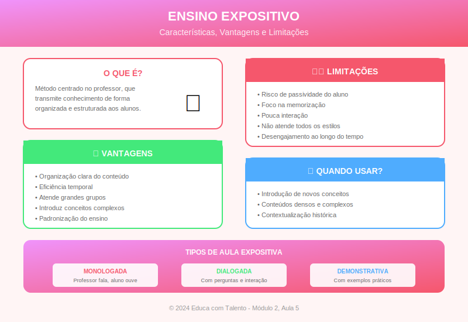

# Aula 05: O Ensino Expositivo — Fundamentos e Técnicas para Eficácia

## Informações da Aula

| Item | Descrição |
|------|-----------|
| **Módulo** | 2 - Metodologias Clássicas |
| **Bloco** | Fundamentos |
| **Duração Estimada** | 50 minutos |
| **Nível** | Intermediário |

---

## Fundamentação Teórica

### A Aula Expositiva: Entre a Tradição e a Renovação

A aula expositiva é, provavelmente, a metodologia mais utilizada no mundo. Presente desde os primórdios da educação formal, ela atravessou séculos e continua predominante em escolas e universidades. Mas por que essa permanência? E como podemos torná-la mais eficaz?

**José Carlos Libâneo** (2013), em "Didática", define a aula expositiva como:

> "Uma forma de ensino em que o professor apresenta verbalmente o conteúdo, organizando-o de modo que facilite a compreensão e assimilação pelo aluno."

É fundamental distinguir dois tipos:

| Tipo | Características | Papel do Aluno |
|------|-----------------|----------------|
| **Exposição dogmática** | Professor como autoridade absoluta; transmissão unidirecional | Passivo, receptor |
| **Exposição dialogada** | Interação constante; espaço para perguntas e debate | Ativo, participante |

### Por Que a Aula Expositiva Persiste?

Segundo **Guy Brousseau**, matemático e didaticista francês, a exposição persiste porque:

1. **Eficiência temporal**: Permite transmitir grande quantidade de informação em pouco tempo
2. **Controle do conteúdo**: O professor determina exatamente o que será abordado
3. **Organização lógica**: O conteúdo pode ser estruturado de forma sistemática
4. **Tradição acadêmica**: É o modelo que a maioria dos professores vivenciou

**Richard Mayer** (Universidade da Califórnia), especialista em aprendizagem multimídia, argumenta que a exposição bem feita é eficaz porque:

> "A instrução direta, quando bem estruturada, reduz a carga cognitiva desnecessária e permite que o aluno concentre seus recursos mentais na compreensão do conteúdo essencial."

### As Críticas ao Ensino Expositivo

As críticas são antigas e conhecidas. **Paulo Freire** denunciou a "educação bancária" onde o professor deposita conhecimento em alunos passivos. **John Dewey** já no início do século XX defendia a aprendizagem ativa e experiencial.

Pesquisas em neurociência educacional, como as conduzidas por **John Medina** (autor de "Brain Rules"), mostram que:

- A atenção diminui significativamente após 10 minutos de exposição contínua
- O cérebro processa melhor informações em "pacotes" menores
- A participação ativa aumenta a retenção em até 90%

**Eric Mazur**, professor de física em Harvard, documentou em suas pesquisas que alunos expostos a aulas expositivas tradicionais frequentemente têm desempenho inferior em problemas conceituais, apesar de conseguirem resolver problemas algorítmicos.

### Os Princípios para uma Exposição Eficaz

A partir das pesquisas em ciências cognitivas e didática, podemos identificar princípios para tornar a exposição mais eficaz:

#### 1. Teoria da Carga Cognitiva (John Sweller)

**John Sweller**, da Universidade de Nova Gales do Sul (Austrália), desenvolveu a **Teoria da Carga Cognitiva**, que explica por que algumas exposições funcionam e outras não.

**Tipos de carga cognitiva:**

| Tipo | Definição | Implicação para o Professor |
|------|-----------|----------------------------|
| **Intrínseca** | Complexidade inerente ao conteúdo | Sequenciar do simples ao complexo |
| **Estranha** | Elementos que não contribuem para a aprendizagem | Eliminar distrações e redundâncias |
| **Relevante** | Processamento que constrói esquemas mentais | Maximizar através de exemplos e prática |

**Princípios derivados:**
- Evitar o **efeito de redundância**: não ler exatamente o que está nos slides
- Reduzir o **efeito de divisão de atenção**: integrar texto e imagem, não separar
- Usar o **princípio de modalidade**: combinar áudio (voz) com visual (imagens), não só texto escrito

#### 2. Princípios de Aprendizagem Multimídia (Richard Mayer)

**Mayer** identificou princípios para instrução com apoio visual:

| Princípio | Descrição | Aplicação |
|-----------|-----------|-----------|
| **Multimídia** | Palavras + imagens > só palavras | Use recursos visuais |
| **Contiguidade** | Palavras e imagens relacionadas devem estar próximas | Não separe explicação da figura |
| **Coerência** | Eliminar material irrelevante | Corte o que não contribui |
| **Sinalização** | Destacar informações essenciais | Use destaques, cores, ênfases |
| **Segmentação** | Dividir em partes manejáveis | Quebre a exposição em blocos |
| **Personalização** | Linguagem conversacional | Fale "você", não "o aluno" |

#### 3. A Estrutura da Exposição Eficaz

**David Ausubel** e seus colaboradores propuseram uma estrutura que facilita a aprendizagem significativa:

**a) Organizadores Prévios**
Material introdutório que conecta o novo ao conhecido:
- Analogias
- Perguntas geradoras
- Revisão de pré-requisitos
- Mapa conceitual antecipado

**b) Apresentação do Conteúdo**
- Sequência lógica (do geral ao específico ou do simples ao complexo)
- Exemplos concretos para conceitos abstratos
- Comparações e contrastes
- Pausas para verificação de compreensão

**c) Integração e Consolidação**
- Sínteses parciais e final
- Conexões com conhecimentos anteriores e futuros
- Aplicações práticas
- Espaço para perguntas e esclarecimentos

### Técnicas para Aumentar o Engajamento

**Doug Lemov**, em "Teach Like a Champion" (2010), identificou técnicas de professores excepcionais:

#### Técnica "Cold Call" (Chamada Fria)
Fazer perguntas a alunos específicos, não apenas aos voluntários. Isso mantém todos atentos.

#### Técnica "Wait Time" (Tempo de Espera)
Após fazer uma pergunta, aguardar 3-5 segundos antes de aceitar respostas. Isso permite que mais alunos processem a questão.

#### Técnica "Turn and Talk"
Após um bloco expositivo, pedir que alunos discutam com o colega ao lado por 1-2 minutos. Isso processa a informação e identifica dúvidas.

#### Técnica "Everybody Writes"
Antes de discutir, pedir que todos escrevam uma resposta. Isso engaja 100% da turma, não apenas os voluntários.

### A Exposição no Contexto Digital

Com a popularização de tecnologias educacionais, a exposição ganhou novos formatos:

**Videoaulas**: A exposição gravada permite que o aluno:
- Assista no próprio ritmo
- Pause e reveja trechos
- Acesse de qualquer lugar

**Sala de Aula Invertida** (Flipped Classroom):
A exposição acontece em casa (via vídeo) e o tempo presencial é usado para atividades práticas e discussões.

**Pesquisas de Jonathan Bergmann e Aaron Sams** (pioneiros do Flipped Classroom) mostram que esse modelo pode:
- Aumentar o tempo de interação professor-aluno
- Liberar tempo presencial para atividades de alto valor
- Permitir que cada aluno processe a exposição em seu ritmo

---

## Objetivos de Aprendizagem

Ao final desta aula, o educador será capaz de:

### Objetivo Geral
Compreender os fundamentos teóricos do ensino expositivo e desenvolver técnicas para torná-lo mais eficaz e engajador.

### Objetivos Específicos

1. **Distinguir** entre exposição dogmática e dialogada, optando conscientemente pela segunda.

2. **Aplicar** os princípios da Teoria da Carga Cognitiva no planejamento de aulas expositivas.

3. **Utilizar** os princípios de aprendizagem multimídia de Mayer na elaboração de recursos visuais.

4. **Estruturar** exposições usando organizadores prévios, desenvolvimento e consolidação.

5. **Implementar** técnicas de engajamento (Cold Call, Wait Time, Turn and Talk) durante exposições.

6. **Avaliar** criticamente suas próprias aulas expositivas, identificando pontos de melhoria.

---

## Roteiro da Aula

### Abertura (5 min)
- Provocação: "A aula expositiva está morta?"
- Objetivo: Resgatar e renovar uma metodologia essencial
- Conexão com o Módulo 1

### Desenvolvimento (40 min)

#### Parte 1: A Defesa da Exposição (10 min)
- Por que a aula expositiva persiste?
- Quando ela é a melhor escolha?
- As críticas legítimas e ilegítimas

#### Parte 2: Fundamentos Cognitivos (12 min)
- Teoria da Carga Cognitiva (Sweller)
- Princípios de Aprendizagem Multimídia (Mayer)
- O que a neurociência nos ensina

#### Parte 3: Estrutura e Técnicas (12 min)
- Organizadores prévios, desenvolvimento, consolidação
- Técnicas de Lemov: Cold Call, Wait Time, Turn and Talk
- Demonstração ao vivo

#### Parte 4: A Exposição Digital (6 min)
- Videoaulas e sala de aula invertida
- Quando usar cada formato?
- Tendências e pesquisas

### Encerramento (5 min)
- Síntese dos princípios
- Desafio: aplicar uma técnica na próxima aula
- Preview da próxima aula

---

## Narração em Primeira Pessoa

### Abertura

Bem-vindo ao Módulo 2! A partir de agora, vamos estudar metodologias específicas. E começamos com uma que você certamente conhece bem: **a aula expositiva**.

Deixa eu começar com uma provocação: se você pesquisar "aula expositiva" na internet, vai encontrar muitas críticas. "Ultrapassada". "Professor falando, aluno dormindo". "Educação bancária". Parece que a aula expositiva está morta e enterrada.

Mas espera aí. Se ela é tão ruim, por que continua sendo usada em 90% das salas de aula do mundo? Por que os melhores professores de Harvard, MIT, Stanford ainda dão aulas expositivas?

A verdade é mais complexa. **A aula expositiva mal feita é um desastre. A aula expositiva bem feita é uma arte.** E é exatamente isso que vamos aprender hoje: como transformar a exposição em uma experiência de aprendizagem poderosa.

### Desenvolvimento

#### A Defesa da Exposição

Vamos começar com uma pergunta honesta: **quando a aula expositiva é a melhor escolha?**

Primeiro, quando você precisa **transmitir muita informação em pouco tempo**. Se você tem 50 minutos para apresentar um panorama histórico, você não vai conseguir fazer isso só com trabalho em grupo.

Segundo, quando o conteúdo é **novo e complexo**. Se os alunos não têm nenhuma base sobre um tema, começar com uma exposição bem estruturada pode ser mais eficaz do que jogá-los em uma atividade sem direção.

Terceiro, quando você quer **modelar o pensamento**. Quando um especialista explica como analisa um problema, como conecta informações, como chega a conclusões — isso é valioso. O aluno aprende observando o mestre pensar em voz alta.

Agora, as críticas são legítimas? Algumas sim. A exposição que ignora o aluno, que não permite perguntas, que é um monólogo de uma hora — isso é problemático. Mas a solução não é abandonar a exposição. É **melhorá-la**.

#### Fundamentos Cognitivos

A ciência cognitiva nos ajuda a entender por que algumas exposições funcionam e outras não.

John Sweller desenvolveu a **Teoria da Carga Cognitiva**. A ideia básica: nossa memória de trabalho é limitada. Se sobrecarregamos ela com informação demais, ou com informação mal organizada, o aprendizado não acontece.

Sweller distingue três tipos de carga:

**Carga intrínseca**: A complexidade do próprio conteúdo. Equações diferenciais têm alta carga intrínseca. "O que é um substantivo" tem baixa. Você não controla isso diretamente.

**Carga estranha**: Elementos que atrapalham sem contribuir. Slides cheios de texto. Música de fundo. Explicações confusas. **Isso você controla**. E deve minimizar.

**Carga relevante**: O processamento que constrói aprendizagem. Exemplos, conexões, prática. **Isso você quer maximizar**.

Uma aplicação prática: não leia seus slides! Se você coloca texto no slide e lê exatamente aquele texto, está criando **redundância** — o aluno lê e ouve a mesma coisa, sobrecarregando sem benefício.

Richard Mayer, por sua vez, pesquisou como combinar **palavras e imagens**. Alguns achados importantes:

- Imagens + narração > só imagens ou só narração
- Imagens + narração > imagens + texto na tela (sobrecarga visual)
- Linguagem conversacional ("você vai perceber que...") > linguagem formal ("o estudante perceberá que...")

#### Estrutura e Técnicas

Como estruturar uma exposição eficaz?

**Primeiro: Organizadores Prévios**. Antes de entrar no conteúdo novo, crie ganchos. Pode ser uma pergunta provocativa, uma revisão rápida do que já sabem, uma analogia que conecta o novo ao familiar.

Por exemplo, se vou ensinar o sistema circulatório, posso começar perguntando: "O que acontece quando você corre e seu coração acelera? Por que isso acontece?" Isso ativa conhecimentos prévios e cria curiosidade.

**Segundo: Desenvolvimento em blocos**. A pesquisa de John Medina mostra que a atenção cai após cerca de 10 minutos. Então, divida sua exposição em blocos de 10-15 minutos, intercalando com momentos de processamento.

**Terceiro: Técnicas de engajamento**. Doug Lemov estudou centenas de professores excepcionais e identificou técnicas simples, mas poderosas:

**Cold Call**: Em vez de perguntar "Quem sabe a resposta?", pergunte diretamente: "Maria, qual você acha que é a resposta?". Isso mantém TODOS atentos, porque qualquer um pode ser chamado.

**Wait Time**: Depois de fazer uma pergunta, conte mentalmente até cinco antes de aceitar respostas. Parece estranho, mas funciona. Dá tempo para mais alunos processarem.

**Turn and Talk**: Após explicar um conceito importante, diga: "Virem para o colega ao lado e expliquem com suas palavras o que acabei de dizer. Vocês têm 1 minuto." Isso processa a informação e identifica confusões.

**Quarto: Síntese e consolidação**. Não termine a aula abruptamente. Faça uma síntese. Conecte com o que vem depois. Deixe um gancho.

#### A Exposição Digital

E no mundo digital? A exposição ganhou novos formatos.

A **sala de aula invertida** propõe: a exposição acontece em casa, via vídeo. O tempo presencial é usado para atividades, discussões, resolução de problemas.

Pesquisas de Bergmann e Sams mostram resultados promissores. Mas atenção: não basta gravar uma aula de 50 minutos e mandar o aluno assistir. Os mesmos princípios se aplicam: segmentação, engajamento, design instrucional.

Videoaulas eficazes costumam ter:
- Duração curta (6-12 minutos)
- Um conceito principal por vídeo
- Linguagem conversacional
- Perguntas ao longo do caminho

### Encerramento

Vamos recapitular:

- A aula expositiva não está morta — precisa ser renovada
- Fundamentos cognitivos nos ajudam a entender o que funciona
- Estrutura clara: organizadores prévios, desenvolvimento em blocos, consolidação
- Técnicas de engajamento mantêm todos atentos
- Formatos digitais ampliam as possibilidades

Na próxima aula, vamos ao **próximo nível**: como criar aulas expositivas realmente engajadoras. Storytelling, uso de exemplos, comunicação não-verbal — tudo o que transforma uma exposição competente em uma experiência memorável.

Mas antes, aqui está seu desafio: na sua próxima aula expositiva, aplique **pelo menos uma técnica** que aprendeu hoje. Pode ser o Cold Call, pode ser o Turn and Talk. Depois, reflita: o que mudou?

---

## Recursos Utilizados

### Slides/Apresentação
- Comparativo: Exposição dogmática vs. dialogada
- Diagrama: Os três tipos de carga cognitiva
- Infográfico: Princípios de Mayer
- Quadro: Estrutura da exposição eficaz
- Demonstração visual das técnicas de engajamento

### Materiais de Apoio
- Checklist: "Minha exposição está bem planejada?"
- Cartões de referência: Técnicas de Lemov
- Template: Planejamento de aula expositiva

### Referências Bibliográficas
- SWELLER, John. **Cognitive Load Theory**. Springer, 2011.
- MAYER, Richard. **Multimedia Learning**. Cambridge University Press, 2009.
- LEMOV, Doug. **Teach Like a Champion**. Jossey-Bass, 2010.
- LIBÂNEO, José Carlos. **Didática**. 2ª ed. São Paulo: Cortez, 2013.
- BERGMANN, J.; SAMS, A. **Flip Your Classroom**. ISTE, 2012.
- MEDINA, John. **Brain Rules**. Pear Press, 2008.

---

## Atividade Prática: Análise e Redesign de Aula Expositiva

> **Complete esta atividade antes de prosseguir para a próxima aula!**

### Instruções Detalhadas

Esta atividade convida você a analisar criticamente uma aula expositiva (sua ou observada) e propor melhorias baseadas nos princípios estudados. Reserve aproximadamente 90 minutos.

#### Parte 1: Análise Crítica (40 minutos)

Escolha uma aula expositiva recente (que você ministrou ou assistiu) e analise:

**Aspectos Estruturais:**
| Elemento | Estava Presente? | Descrição/Observação |
|----------|-----------------|---------------------|
| Organizador prévio | Sim / Não / Parcial | |
| Divisão em blocos | Sim / Não / Parcial | |
| Momentos de interação | Sim / Não / Parcial | |
| Síntese/consolidação | Sim / Não / Parcial | |

**Aspectos Cognitivos (Carga Cognitiva):**
- A carga intrínseca foi gerenciada? (sequenciamento adequado?)
- Houve carga estranha? (distrações, redundâncias?)
- A carga relevante foi maximizada? (exemplos, conexões?)

**Aspectos de Engajamento:**
- Como a atenção foi mantida?
- Houve técnicas como Cold Call, Wait Time, Turn and Talk?
- Qual foi o nível percebido de engajamento dos alunos?

**Aspectos Multimídia (se aplicável):**
- Os slides/recursos visuais seguiam os princípios de Mayer?
- Houve redundância entre fala e texto?
- As imagens eram relevantes ou decorativas?

#### Parte 2: Redesign (35 minutos)

Com base na análise, proponha um **redesign da mesma aula**, incorporando os princípios estudados:

**1. Abertura (organizador prévio)**
- O que você usaria para conectar o novo ao conhecido?
- Que pergunta geradora faria?

**2. Desenvolvimento (estruture em blocos de ~10 min)**

| Bloco | Conteúdo | Técnica de Engajamento | Duração |
|-------|----------|----------------------|---------|
| 1 | | | |
| 2 | | | |
| 3 | | | |

**3. Consolidação**
- Como faria a síntese?
- Que conexões estabeleceria?

**4. Recursos visuais**
- Que slides/imagens usaria?
- Como evitaria redundância?

#### Parte 3: Reflexão (15 minutos)

Responda:

1. Quais os **três principais ajustes** que você fará em suas próximas aulas expositivas?

2. Qual técnica de engajamento você se compromete a **experimentar esta semana**?

3. Como você pretende **monitorar** se as mudanças estão funcionando?

### Formato de Entrega

- Análise crítica (tabelas preenchidas e comentários)
- Redesign detalhado da aula
- Reflexão pessoal (200-300 palavras)

### Critérios de Avaliação

| Critério | Peso |
|----------|------|
| Profundidade da análise crítica | 30% |
| Adequação do redesign aos princípios estudados | 35% |
| Viabilidade das propostas | 20% |
| Clareza da reflexão e compromissos | 15% |

### Entrega

Submeta seu trabalho na área **"Envio de Atividade - Aula 5"** do Moodle.

---

## Conclusão da Aula

### Resumo dos Pontos-Chave

- A aula expositiva permanece relevante quando bem estruturada e executada
- A Teoria da Carga Cognitiva explica por que algumas exposições funcionam e outras não
- Os princípios de aprendizagem multimídia orientam o uso eficaz de recursos visuais
- A estrutura ideal inclui: organizador prévio, desenvolvimento em blocos, consolidação
- Técnicas como Cold Call, Wait Time e Turn and Talk aumentam o engajamento
- Formatos digitais (videoaulas, sala invertida) ampliam as possibilidades

### Conexão com a Próxima Aula

Na **Aula 6**, vamos além da estrutura e entramos no território da **arte de expor**. Como contar histórias que capturam a atenção? Como usar a comunicação não-verbal? Como criar momentos memoráveis? Prepare-se para transformar suas aulas expositivas em experiências envolventes!

### Frase de Encerramento

> "O objetivo da educação não é aumentar a quantidade de conhecimento, mas criar as possibilidades para uma criança inventar e descobrir, criar homens que sejam capazes de fazer coisas novas."
> — **Jean Piaget**

---

## Notas de Produção

### Elementos Visuais Sugeridos
- Gráfico de curva de atenção ao longo do tempo
- Diagrama dos três tipos de carga cognitiva
- Comparativo visual: slide ruim vs. slide bom
- Demonstração das técnicas de engajamento

### Tom da Apresentação
- Desconstrutor de mitos na abertura
- Científico ao explicar fundamentos cognitivos
- Prático e demonstrativo nas técnicas
- Desafiador no encerramento

### Dica de Gravação
- Demonstrar as técnicas ao vivo
- Usar slides bons e ruins como exemplo
- Fazer pausas intencionais (modelar o Wait Time)
- Chamar o espectador pelo "você" (personalização)

---

*Aula 05 de 20 - Curso Metodologias de Ensino - Educa com Talento*

---

## Infográfico da Aula

O infográfico "Ensino Expositivo Eficaz" apresenta os princípios fundamentais da Teoria da Carga Cognitiva, a estrutura ideal de uma exposição e as principais técnicas de engajamento.

> **Dica de uso**: Este infográfico pode ser impresso e mantido próximo durante o planejamento de aulas expositivas como checklist de qualidade.
