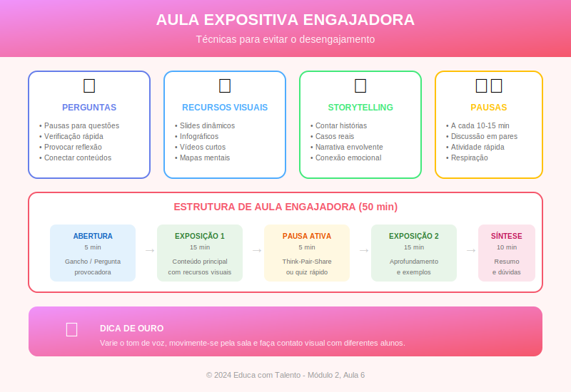

# Aula 06: Como Criar Aulas Expositivas Engajadoras

## Informações da Aula

| Item | Descrição |
|------|-----------|
| **Módulo** | 2 - Metodologias Clássicas |
| **Bloco** | Aplicação |
| **Duração Estimada** | 50 minutos |
| **Nível** | Intermediário |

---

## Fundamentação Teórica

### Além da Estrutura: A Arte de Ensinar

Na aula anterior, estudamos a estrutura e os fundamentos cognitivos da exposição eficaz. Agora, vamos além: como transformar uma aula bem estruturada em uma **experiência memorável**?

A diferença entre uma aula competente e uma aula excepcional não está apenas na estrutura. Está na **capacidade de conectar**, de **capturar a atenção**, de **criar significado**. É aqui que entra a arte.

**Ken Robinson**, educador britânico e um dos palestrantes mais vistos do TED, argumenta:

> "Os grandes professores sabem que não estão apenas transmitindo informação — estão inspirando pessoas a querer aprender mais."

### O Poder do Storytelling na Educação

**Chip e Dan Heath**, em "Made to Stick" (2007), pesquisaram por que algumas ideias grudam e outras são esquecidas. Uma de suas descobertas: **histórias são 22 vezes mais memoráveis que estatísticas isoladas**.

A neurociência explica por quê. **Uri Hasson**, neurocientista de Princeton, demonstrou através de ressonância magnética que quando ouvimos uma história, nossos cérebros "sincronizam" com o cérebro do contador. Áreas ligadas a emoções, memória e até sensações físicas são ativadas.

#### Elementos de uma Boa História para Ensinar

| Elemento | Função | Exemplo em Aula |
|----------|--------|-----------------|
| **Personagem** | Criar identificação | "Imagine uma professora chamada Ana..." |
| **Conflito** | Gerar tensão e interesse | "Ela enfrentava um problema grave..." |
| **Contexto** | Situar o ouvinte | "Era uma escola de periferia em 2020..." |
| **Transformação** | Mostrar mudança/aprendizado | "Quando ela descobriu que..." |
| **Resolução** | Fechar o arco | "Hoje, seus alunos..." |

#### Tipos de Histórias para o Ensino

**Paul Smith**, em "Lead with a Story", categoriza:

1. **Histórias de origem**: Como algo começou ou foi descoberto
   *Exemplo*: Contar como Newton "descobriu" a gravidade

2. **Histórias de desafio superado**: Alguém enfrentando obstáculo
   *Exemplo*: A saga de uma empresa que quase faliu

3. **Histórias de antes/depois**: Contraste entre situações
   *Exemplo*: A vida antes e depois da internet

4. **Histórias de ponte**: Conectando teoria à prática
   *Exemplo*: Um médico usando o conceito X para salvar uma vida

### Comunicação Não-Verbal na Sala de Aula

**Albert Mehrabian**, pesquisador da UCLA, ficou famoso pela "regra 7-38-55": 7% da comunicação seria verbal, 38% vocal (tom) e 55% visual (corpo). Embora essa regra seja frequentemente mal interpretada (ela se aplica a contextos específicos de comunicação emocional), o princípio é válido: **como você diz importa tanto quanto o que você diz**.

#### Elementos da Comunicação Não-Verbal

**Contato Visual**
- Distribua o olhar por toda a sala
- Mantenha contato de 3-5 segundos com cada região
- Evite olhar apenas para um lado ou para suas anotações

**Posicionamento**
- Movimente-se pelo espaço (não fique estático)
- Aproxime-se dos alunos em momentos chave
- Use o espaço para marcar transições

**Gestos**
- Use as mãos para ilustrar conceitos
- Gestos abertos transmitem confiança
- Evite gestos repetitivos que viram cacoete

**Voz**
- Varie o volume (enfatizar ≠ gritar)
- Varie o ritmo (desacelere em pontos importantes)
- Use pausas estratégicas

**Amy Cuddy**, psicóloga social de Harvard, demonstrou que nossa linguagem corporal não apenas comunica aos outros, mas afeta a nós mesmos. Posturas de confiança aumentam testosterona e reduzem cortisol, afetando nosso desempenho.

### Uso de Exemplos e Analogias

**George Lakoff** e **Mark Johnson**, em "Metáforas da Vida Cotidiana", demonstraram que pensamos fundamentalmente através de metáforas. Conceitos abstratos são compreendidos através de mapeamentos para domínios concretos.

#### Características de Boas Analogias

| Critério | Descrição | Exemplo |
|----------|-----------|---------|
| **Familiar** | O domínio fonte deve ser conhecido | Comparar célula a uma fábrica |
| **Estrutural** | As relações devem corresponder | Núcleo = diretoria; mitocôndrias = usinas |
| **Limitada** | Reconhecer onde a analogia quebra | "Mas diferente de uma fábrica, a célula..." |

#### Tipos de Exemplos

1. **Exemplos prototípicos**: Casos claros e representativos
2. **Contraexemplos**: O que NÃO se encaixa no conceito
3. **Casos-limite**: Exemplos ambíguos que desafiam a compreensão
4. **Exemplos pessoais**: Experiências vividas (criam conexão)

**Jerome Bruner**, psicólogo de Harvard, propôs três modos de representação:
- **Enativo**: Através da ação
- **Icônico**: Através de imagens
- **Simbólico**: Através de linguagem/símbolos

O professor eficaz transita entre os três, usando demonstrações, visualizações e explicações verbais.

### Técnicas de Abertura que Capturam

Os primeiros minutos são cruciais. **Vanessa Van Edwards**, pesquisadora de comportamento, demonstra que formamos impressões nos primeiros 7 segundos.

#### Tipos de Abertura

**1. A Pergunta Provocativa**
*"Se você tivesse que escolher entre salvar seu emprego ou sua integridade, o que faria?"*

**2. O Dado Surpreendente**
*"90% das pessoas que iniciam dietas voltam ao peso original em um ano. Por quê?"*

**3. A História Pessoal**
*"Quando eu tinha 12 anos, aconteceu algo que mudou completamente minha visão sobre..."*

**4. A Demonstração**
*Começar a aula com um experimento ou demonstração visual*

**5. O Paradoxo**
*"A ciência mostrou que quanto mais opções temos, mais infelizes ficamos. Como isso é possível?"*

**6. A Citação Impactante**
*"Einstein disse que 'Educação não é encher um balde, é acender uma chama'. Hoje vamos entender por quê."*

### O Uso Estratégico do Humor

**Rod Martin**, professor da Universidade de Western Ontario, pesquisou o humor em contextos educacionais. Suas descobertas:

- Humor relevante ao conteúdo aumenta a retenção
- Humor autodepreciativo cria conexão (mas com moderação)
- Humor agressivo ou irrelevante prejudica a aprendizagem
- O humor funciona melhor como tempero, não como prato principal

**Benefícios do humor apropriado:**
- Reduz ansiedade
- Aumenta atenção
- Cria clima positivo
- Facilita conexão professor-aluno

**Cuidados:**
- Evitar piadas que possam ofender
- Não forçar — o humor deve parecer natural
- Não usar humor para fugir do conteúdo
- Ler a turma — nem todo grupo responde igual

### Criando Momentos Memoráveis

**O Efeito de Primazia e Recência**: Pesquisas mostram que lembramos mais do começo e do fim de uma experiência. Por isso, abertura e encerramento merecem atenção especial.

**O Pico Emocional**: **Daniel Kahneman**, Nobel de Economia, descobriu que avaliamos experiências pela intensidade do pico emocional e pelo final (peak-end rule). Uma aula com um momento marcante será mais lembrada.

Como criar picos?
- Uma demonstração surpreendente
- Uma revelação inesperada
- Uma atividade diferenciada
- Uma conexão emocional profunda

### Design Visual de Apresentações

Se usar slides, considere os princípios de **Nancy Duarte**, especialista em apresentações:

**1. Uma ideia por slide**
Slides lotados dividem a atenção

**2. Menos texto, mais visual**
Use imagens de alta qualidade, não clip-arts

**3. Contraste forte**
Texto legível, cores que funcionam juntas

**4. Consistência visual**
Mesmo estilo ao longo da apresentação

**5. Slides como apoio, não como script**
Você conta a história; os slides ilustram

---

## Objetivos de Aprendizagem

Ao final desta aula, o educador será capaz de:

### Objetivo Geral
Desenvolver habilidades de comunicação e engajamento que transformam aulas expositivas em experiências memoráveis.

### Objetivos Específicos

1. **Utilizar** técnicas de storytelling para tornar conceitos abstratos concretos e memoráveis.

2. **Aplicar** princípios de comunicação não-verbal (olhar, postura, voz, gestos) conscientemente.

3. **Criar** analogias e exemplos eficazes que facilitam a compreensão.

4. **Desenvolver** aberturas que capturam a atenção nos primeiros minutos.

5. **Usar** humor de forma estratégica e apropriada ao contexto.

6. **Planejar** momentos memoráveis ("picos") em suas aulas.

7. **Aplicar** princípios de design visual em apresentações.

---

## Roteiro da Aula

### Abertura (5 min)
- Demonstração: Uma abertura que captura
- O desafio: ir além da estrutura
- Objetivos da aula

### Desenvolvimento (40 min)

#### Parte 1: O Poder do Storytelling (12 min)
- Por que histórias funcionam?
- Elementos de uma boa história
- Tipos de histórias para ensinar
- Exercício: transformando um conceito em história

#### Parte 2: Comunicação Não-Verbal (10 min)
- Olhar, postura, gestos, voz
- Demonstração dos elementos
- O impacto no engajamento
- Dicas práticas

#### Parte 3: Exemplos, Analogias e Aberturas (10 min)
- Criando boas analogias
- Tipos de exemplos
- Aberturas que capturam
- Demonstração de cada tipo

#### Parte 4: Humor e Momentos Memoráveis (8 min)
- Quando e como usar humor
- Primazia, recência e picos
- Design visual de slides
- Criando sua "assinatura" como professor

### Encerramento (5 min)
- Síntese: A arte além da técnica
- Desafio: escolher um elemento para desenvolver
- Preview da próxima aula

---

## Narração em Primeira Pessoa

### Abertura

*[O professor entra em silêncio, olha para a câmera/turma por 3 segundos, depois pergunta em tom dramático:]*

"Em 1986, um único erro de comunicação matou sete pessoas. O ônibus espacial Challenger explodiu 73 segundos após o lançamento. Os engenheiros sabiam do risco. Tentaram avisar. Mas não conseguiram comunicar de forma que os decisores entendessem. Sete astronautas morreram porque uma informação crucial não foi transmitida efetivamente."

*[Pausa]*

"Não estou comparando a sala de aula a um lançamento espacial. Mas há uma lição aqui: **a forma como comunicamos pode ser a diferença entre a mensagem chegar ou se perder**."

Bem-vindo à Aula 6! Na aula anterior, vimos a estrutura de uma exposição eficaz. Hoje, vamos além: vamos aprender a **arte** de comunicar de forma que as pessoas queiram ouvir, entendam e lembrem.

### Desenvolvimento

#### O Poder do Storytelling

Você percebeu o que eu fiz na abertura? Contei uma história. E aposto que você estava prestando atenção.

Isso não é coincidência. **Histórias são a forma mais antiga de transmitir conhecimento**. Por centenas de milhares de anos, antes da escrita, era assim que a humanidade passava informação entre gerações.

E a neurociência explica: quando ouvimos uma história, nosso cérebro se comporta como se estivéssemos **vivendo** aquela experiência. Áreas ligadas a emoções, memória, até sensações físicas são ativadas.

Chip e Dan Heath descobriram que histórias são **22 vezes mais memoráveis** que estatísticas isoladas. Vinte e duas vezes!

Então, como transformar seu conteúdo em história?

Toda boa história tem:
- **Personagem**: Alguém com quem nos identificamos
- **Conflito**: Um problema a ser resolvido
- **Contexto**: Onde e quando acontece
- **Transformação**: O que muda
- **Resolução**: Como termina

Você pode usar histórias reais (casos, biografias) ou criar cenários hipotéticos ("Imagine que você é um gerente e descobre que...").

#### Comunicação Não-Verbal

Agora, vamos falar de algo que muitos professores negligenciam: seu corpo fala.

**Olhar**: Quando você mantém contato visual, transmite confiança e cria conexão. Quando desvia, transmite insegurança ou desinteresse. Distribua seu olhar por toda a sala — ninguém quer se sentir ignorado.

**Posição**: Um professor que fica estático atrás de uma mesa cria barreira. Mova-se! Aproxime-se dos alunos em momentos importantes. Use o espaço.

**Gestos**: Suas mãos são ferramentas de comunicação. Use-as para ilustrar tamanhos, direções, processos. Gestos abertos (palmas visíveis) transmitem honestidade.

**Voz**: Este é o instrumento mais versátil que você tem.
- Fale mais alto para enfatizar
- Fale mais baixo para criar intimidade
- Fale mais devagar antes de um ponto crucial
- Use pausas! O silêncio estratégico é poderoso.

Vou demonstrar: *[diz em tom monótono]* "A Segunda Guerra Mundial foi o conflito mais devastador da história humana." Agora: *[com variação, pausas e ênfase]* "A Segunda Guerra Mundial... foi o conflito MAIS devastador... da história humana." Sente a diferença?

#### Exemplos, Analogias e Aberturas

Conceitos abstratos precisam de âncoras concretas. É aí que entram exemplos e analogias.

Uma boa analogia conecta algo desconhecido a algo conhecido. "O DNA é como um manual de instruções da célula." Imediatamente, você entende a função, mesmo sem saber bioquímica.

Mas toda analogia tem limites. O DNA não é literalmente um livro. Bons professores reconhecem onde a analogia funciona e onde ela quebra.

Exemplos vêm em tipos diferentes:
- **Prototípicos**: O caso mais claro e representativo
- **Contraexemplos**: O que NÃO é o conceito (às vezes mais útil!)
- **Casos-limite**: Os casos ambíguos que fazem pensar
- **Pessoais**: Suas próprias experiências (criam conexão poderosa)

E as aberturas? Os primeiros minutos determinam se a turma vai embarcar ou desligar. Você pode:
- Fazer uma pergunta provocativa
- Apresentar um dado surpreendente
- Contar uma história pessoal
- Começar com uma demonstração
- Apresentar um paradoxo

#### Humor e Momentos Memoráveis

Humor é uma ferramenta poderosa, mas perigosa. Usado bem, cria conexão, reduz ansiedade, aumenta retenção. Usado mal, ofende, distrai, prejudica.

Algumas dicas:
- O humor deve ser **relevante** ao conteúdo
- Humor **autodepreciativo** funciona bem (com moderação)
- Evite qualquer coisa que possa ofender
- Não force — se não é natural para você, não use

E por falar em memorável: pesquisas mostram que lembramos mais do começo, do fim, e dos picos emocionais de uma experiência. Então:
- Capriche na abertura
- Capriche no encerramento
- Crie pelo menos um momento marcante durante a aula

O que pode ser um pico? Uma demonstração surpreendente. Uma revelação inesperada. Uma atividade diferente. Uma história emocionante.

### Encerramento

Hoje viajamos pelo território da arte:
- Storytelling que conecta
- Comunicação não-verbal consciente
- Exemplos e analogias que ancoram
- Aberturas que capturam
- Humor estratégico
- Momentos memoráveis

Lembre-se: **técnica sem arte é mecânica. Arte sem técnica é amadorismo**. O professor excepcional combina os dois.

Seu desafio: escolha **um elemento** desta aula para desenvolver conscientemente nas próximas semanas. Pode ser variar mais a voz, usar mais histórias, criar aberturas melhores. Foque em um e pratique até virar natural.

Na próxima aula, vamos estudar uma metodologia milenar que permanece poderosa: **o Método Socrático**. A arte de ensinar fazendo perguntas.

---

## Recursos Utilizados

### Slides/Apresentação
- Demonstração de storytelling com elementos identificados
- Vídeo: exemplos de comunicação não-verbal
- Comparativo: slides eficazes vs. ineficazes
- Galeria: tipos de aberturas

### Materiais de Apoio
- Guia: "Estrutura de Storytelling para Educadores"
- Checklist: Comunicação não-verbal
- Template: Planejando aberturas engajadoras

### Referências Bibliográficas
- HEATH, Chip; HEATH, Dan. **Made to Stick**. Random House, 2007.
- CUDDY, Amy. **O Poder da Presença**. Sextante, 2016.
- DUARTE, Nancy. **Slide:ology**. O'Reilly Media, 2008.
- MARTIN, Rod. **The Psychology of Humor**. Academic Press, 2007.
- BRUNER, Jerome. **The Process of Education**. Harvard University Press, 1960.

---

## Atividade Prática: Laboratório de Comunicação

> **Complete esta atividade antes de prosseguir para a próxima aula!**

### Instruções Detalhadas

Esta atividade é prática e criativa. Você vai desenvolver elementos de comunicação para uma aula específica. Reserve aproximadamente 90 minutos.

#### Parte 1: Criação de Storytelling (30 minutos)

Escolha um conceito que você ensina regularmente e crie uma **história** para introduzi-lo ou ilustrá-lo.

Sua história deve conter:
- **Personagem**: Quem? (pode ser real ou fictício)
- **Contexto**: Onde e quando?
- **Conflito**: Qual problema/desafio?
- **Transformação**: O que muda?
- **Resolução**: Como termina?
- **Conexão com o conceito**: O que essa história ensina?

Escreva a história completa (300-500 palavras) e identifique cada elemento.

#### Parte 2: Planejamento de Abertura (20 minutos)

Para a mesma aula, crie **três opções diferentes de abertura**:

| Tipo | Descrição Detalhada |
|------|---------------------|
| Pergunta provocativa | |
| Dado surpreendente ou paradoxo | |
| História pessoal ou demonstração | |

Para cada abertura, explique por que funcionaria para esse conteúdo específico.

#### Parte 3: Analogias e Exemplos (20 minutos)

Ainda para o mesmo conteúdo, desenvolva:

**Uma analogia principal:**
- Conceito a ser ensinado:
- Domínio familiar escolhido:
- Como as partes se correspondem:
- Onde a analogia tem limites:

**Três tipos de exemplos:**
- Exemplo prototípico:
- Contraexemplo:
- Caso-limite ou pessoal:

#### Parte 4: Autoavaliação de Comunicação (20 minutos)

Grave-se (vídeo ou áudio) explicando um conceito por 3-5 minutos. Depois, analise:

| Aspecto | Avaliação (1-5) | Observações |
|---------|-----------------|-------------|
| Variação de tom de voz | | |
| Uso de pausas | | |
| Ritmo | | |
| Clareza | | |
| Uso de gestos (se vídeo) | | |
| Contato visual (se vídeo) | | |

Identifique **um ponto forte** e **um ponto a desenvolver**.

### Formato de Entrega

- História completa com elementos identificados
- Três opções de abertura
- Analogia e exemplos desenvolvidos
- Autoavaliação com gravação (opcional submeter o vídeo/áudio)

### Critérios de Avaliação

| Critério | Peso |
|----------|------|
| Qualidade e relevância da história | 25% |
| Criatividade e adequação das aberturas | 20% |
| Eficácia da analogia e exemplos | 25% |
| Honestidade e profundidade da autoavaliação | 20% |
| Clareza e organização | 10% |

### Entrega

Submeta seu trabalho na área **"Envio de Atividade - Aula 6"** do Moodle.

---

## Conclusão da Aula

### Resumo dos Pontos-Chave

- Storytelling é 22x mais memorável que estatísticas — use histórias para ensinar
- A comunicação não-verbal (olhar, postura, voz, gestos) impacta a recepção da mensagem
- Boas analogias conectam o desconhecido ao conhecido, respeitando limites
- Aberturas nos primeiros minutos determinam o engajamento
- Humor estratégico cria conexão, mas deve ser relevante e apropriado
- Momentos memoráveis (picos) aumentam a retenção

### Conexão com a Próxima Aula

Na **Aula 7**, vamos estudar o **Método Socrático** — uma metodologia que tem 2.400 anos e continua revolucionária. Como ensinar fazendo perguntas? Como guiar o aluno à descoberta? Sócrates tinha as respostas, ou melhor, tinha as perguntas certas. Prepare-se!

### Frase de Encerramento

> "As pessoas vão esquecer o que você disse. Vão esquecer o que você fez. Mas nunca vão esquecer como você as fez sentir."
> — **Maya Angelou**

---

## Notas de Produção

### Elementos Visuais Sugeridos
- Demonstração ao vivo de storytelling
- Comparativo: comunicação eficaz vs. ineficaz (vídeo)
- Exemplos de slides bons e ruins
- Montagem de diferentes tipos de abertura

### Tom da Apresentação
- Performático na abertura (demonstrar o que ensina)
- Demonstrativo ao longo (mostrar, não só falar)
- Encorajador (todos podem melhorar)
- Desafiador no encerramento

### Dica de Gravação
- Esta aula deve SER o que ensina — modelar os princípios
- Variar intencionalmente tom, ritmo, volume
- Usar storytelling real
- Demonstrar cada técnica, não apenas explicar

---

*Aula 06 de 20 - Curso Metodologias de Ensino - Educa com Talento*

---

## Infográfico da Aula

O infográfico "A Arte da Aula Engajadora" apresenta os elementos-chave da comunicação eficaz em sala de aula: storytelling, linguagem corporal, aberturas que capturam e design visual de apresentações.

> **Dica de uso**: Este infográfico funciona como lembrete visual dos elementos de comunicação eficaz e pode ser consultado antes de aulas importantes.
