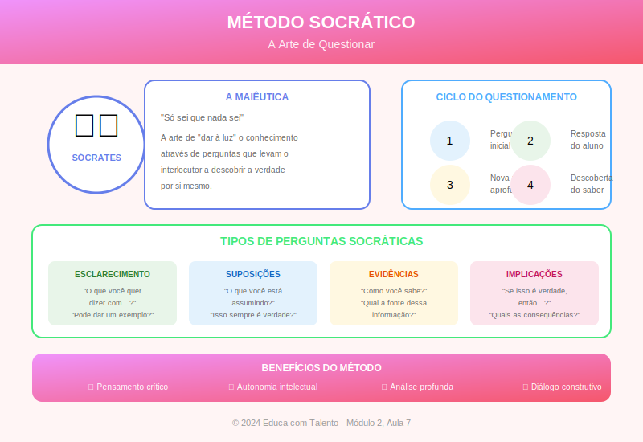

# Aula 07: O Método Socrático — A Arte de Ensinar Fazendo Perguntas

## Informações da Aula

| Item | Descrição |
|------|-----------|
| **Módulo** | 2 - Metodologias Clássicas |
| **Bloco** | Metodologia |
| **Duração Estimada** | 55 minutos |
| **Nível** | Intermediário |

---

## Fundamentação Teórica

### Sócrates e a Revolução do Conhecimento

**Sócrates** (469-399 a.C.) não deixou nenhuma obra escrita. Tudo o que sabemos sobre seu método vem de seus discípulos, especialmente **Platão**, que registrou diálogos entre Sócrates e seus interlocutores.

O que tornava Sócrates revolucionário não era dar respostas — era **fazer perguntas**. Enquanto os sofistas da época se apresentavam como mestres do conhecimento, Sócrates declarava: "Só sei que nada sei."

Essa humildade não era falsa modéstia. Era **método**. Sócrates acreditava que o conhecimento verdadeiro não pode ser transmitido — precisa ser descoberto por cada pessoa através da reflexão crítica.

### A Maiêutica: A Arte de Partejar Ideias

O método socrático é também chamado de **maiêutica**, do grego *maieutikós* (arte de partejar). Sócrates usava essa metáfora para explicar seu papel: assim como a parteira ajuda a mãe a dar à luz o bebê, o professor ajuda o aluno a "dar à luz" o conhecimento que já carrega dentro de si.

**Etapas do processo maiêutico:**

1. **Ironia**: Sócrates fingia ignorância, pedindo que o interlocutor explicasse suas convicções
2. **Refutação**: Através de perguntas, mostrava contradições no pensamento do outro
3. **Aporia**: O interlocutor chegava a um impasse, percebendo que não sabia o que pensava saber
4. **Maiêutica**: Novas perguntas conduziam a insights e descobertas genuínas

### O Diálogo Socrático na Prática

Analisemos um trecho do diálogo "Mênon" de Platão, onde Sócrates demonstra seu método ensinando geometria a um escravo sem nenhum conhecimento formal:

**Sócrates**: Se este lado tem dois pés, e este lado também tem dois pés, qual é a área do quadrado?
**Escravo**: Quatro pés.
**Sócrates**: Correto. Agora, se quisermos um quadrado com o dobro da área, qual seria?
**Escravo**: Oito pés.
**Sócrates**: E qual seria o tamanho do lado desse novo quadrado?
**Escravo**: Quatro pés.
**Sócrates**: *[desenha o quadrado de lado quatro]* Mas veja: quatro vezes quatro é dezesseis, não oito. Então o lado não pode ser quatro.
**Escravo**: É verdade...
**Sócrates**: Também não pode ser dois, porque daria quatro. Então qual seria?

O escravo, guiado pelas perguntas, eventualmente descobre que o lado deve ser a diagonal do quadrado original — descobrindo sozinho um conceito geométrico que não conhecia.

### A Taxonomia de Perguntas

Nem todas as perguntas são iguais. **Benjamin Bloom**, em sua famosa taxonomia (1956, revisada em 2001), classificou níveis cognitivos que podem guiar a formulação de perguntas:

| Nível | Verbos | Tipo de Pergunta |
|-------|--------|------------------|
| **Lembrar** | Definir, listar, nomear | O que é X? |
| **Compreender** | Explicar, resumir, comparar | Por que X acontece? |
| **Aplicar** | Usar, demonstrar, resolver | Como você usaria X? |
| **Analisar** | Diferenciar, organizar, relacionar | Quais as partes de X? |
| **Avaliar** | Julgar, criticar, justificar | Qual a melhor alternativa? |
| **Criar** | Planejar, produzir, propor | O que aconteceria se...? |

Perguntas de níveis mais altos estimulam pensamento crítico e profundo.

### Tipos de Perguntas Socráticas

**Richard Paul**, filósofo e educador, sistematizou as perguntas socráticas em categorias:

#### 1. Perguntas de Clarificação
- O que você quer dizer com...?
- Pode dar um exemplo?
- Como isso se relaciona com o que disse antes?

#### 2. Perguntas sobre Pressupostos
- O que você está assumindo?
- Por que você assume isso?
- E se assumíssemos o contrário?

#### 3. Perguntas sobre Evidências
- Que evidência suporta isso?
- Como você sabe?
- Há razões para duvidar dessa evidência?

#### 4. Perguntas sobre Perspectivas
- Há outra forma de ver isso?
- O que alguém que discorda diria?
- Como X responderia?

#### 5. Perguntas sobre Implicações
- Se isso for verdade, o que mais deve ser verdade?
- Quais as consequências?
- Isso leva a que conclusão?

#### 6. Perguntas sobre a Própria Pergunta
- Por que essa pergunta é importante?
- O que você espera descobrir?
- Há uma pergunta melhor a ser feita?

### Aplicações Contemporâneas

O método socrático permanece vivo em diversos contextos:

#### Na Educação Jurídica
Faculdades de Direito, especialmente nos EUA (inspiradas pela Harvard Law School), usam o **método do caso socrático**: professores interrogam estudantes sobre casos jurídicos, forçando-os a articular e defender posições.

#### Na Terapia Cognitivo-Comportamental
**Aaron Beck**, criador da TCC, adaptou o questionamento socrático para ajudar pacientes a examinar pensamentos disfuncionais:
- "Que evidência você tem para esse pensamento?"
- "Há outra forma de interpretar essa situação?"
- "O que você diria a um amigo nessa situação?"

#### No Coaching e Mentoria
Coaches treinados frequentemente usam perguntas abertas em vez de dar conselhos diretos:
- "O que você realmente quer?"
- "O que está te impedindo?"
- "Que opções você vê?"

#### Em Metodologias Ativas
O **Problem-Based Learning (PBL)**, originado em McMaster (Canadá), usa questionamento para guiar a investigação de problemas complexos.

### Vantagens do Método Socrático

1. **Desenvolve pensamento crítico**: Força o aluno a examinar suas próprias ideias
2. **Promove autonomia**: O aluno descobre, não recebe passivamente
3. **Revela concepções errôneas**: Expõe falhas no entendimento
4. **Aumenta engajamento**: Exige participação ativa
5. **Promove humildade intelectual**: Mostra os limites do próprio conhecimento
6. **Desenvolve habilidades argumentativas**: Treina articulação e defesa de ideias

### Limitações e Cuidados

**Desafios do método:**
- Consome mais tempo que exposição direta
- Pode gerar ansiedade em alguns alunos
- Requer habilidade do professor em formular perguntas
- Pode parecer manipulativo se mal conduzido
- Depende do conhecimento prévio do aluno

**Cuidados éticos:**
- Não usar para humilhar ou constranger
- Respeitar quem não quer participar publicamente
- Criar ambiente seguro para "errar"
- Ser genuíno, não fingir não saber quando sabe
- Valorizar o processo, não apenas a resposta "certa"

### Integrando com Outras Metodologias

O método socrático não precisa ser usado isoladamente. Pode ser combinado com:

- **Exposição**: Introduzir conceito, depois questionar
- **Discussão em grupo**: Questionar para aprofundar debate
- **Estudo de caso**: Usar perguntas para analisar o caso
- **Trabalhos práticos**: Questionar sobre o processo e resultados

---

## Objetivos de Aprendizagem

Ao final desta aula, o educador será capaz de:

### Objetivo Geral
Compreender e aplicar o método socrático como ferramenta para desenvolver pensamento crítico e autonomia nos alunos.

### Objetivos Específicos

1. **Explicar** os fundamentos filosóficos do método socrático e o conceito de maiêutica.

2. **Distinguir** níveis de perguntas (Taxonomia de Bloom) e tipos de perguntas socráticas.

3. **Formular** perguntas de diferentes níveis cognitivos e categorias socráticas.

4. **Conduzir** um diálogo socrático básico em sua área de conhecimento.

5. **Identificar** contextos apropriados para o uso do método (e quando evitá-lo).

6. **Integrar** o questionamento socrático com outras metodologias.

---

## Roteiro da Aula

### Abertura (5 min)
- Demonstração: Conduzir um mini-diálogo socrático com a turma
- Revelar: O que acabou de acontecer?
- Objetivos da aula

### Desenvolvimento (45 min)

#### Parte 1: Fundamentos Históricos e Filosóficos (10 min)
- Sócrates: vida e legado
- A maiêutica: partejar ideias
- Análise de um diálogo platônico
- Por que Sócrates era tão eficaz?

#### Parte 2: A Taxonomia das Perguntas (12 min)
- Níveis de Bloom
- Tipos de perguntas socráticas (Paul)
- Demonstração de cada tipo
- Exercício: identificando níveis

#### Parte 3: Aplicações Contemporâneas (10 min)
- No direito (método de caso)
- Na terapia (TCC)
- No coaching
- Em metodologias ativas
- Discussão: aplicações em nossa área

#### Parte 4: Conduzindo um Diálogo Socrático (13 min)
- Preparação: conhecer o terreno
- Início: perguntas de abertura
- Desenvolvimento: aprofundando
- Cuidados éticos
- Prática guiada em duplas/grupos

### Encerramento (5 min)
- Síntese: O poder das perguntas
- Reflexão: Que pergunta você faria a si mesmo?
- Preview da próxima aula

---

## Narração em Primeira Pessoa

### Abertura

*[O professor começa sem introdução formal, fazendo uma pergunta direta]*

"O que é justiça?"

*[Espera uma resposta]*

"Interessante. Mas dar a cada um o que merece também é justo? E quem decide o que cada um merece?"

*[Continua questionando por 2-3 minutos, depois para]*

Você percebeu o que acabou de acontecer? Eu não dei nenhuma resposta. Só fiz perguntas. E mesmo assim, você provavelmente pensou mais profundamente sobre justiça nesses dois minutos do que pensaria se eu passasse vinte minutos explicando o conceito.

Isso é o **método socrático**. E hoje vamos entender por que funciona e como você pode usá-lo.

### Desenvolvimento

#### Fundamentos Históricos e Filosóficos

Sócrates viveu em Atenas há 2.400 anos. Não escreveu nada — sabemos de suas ideias através de seu discípulo Platão, que registrou diálogos onde Sócrates aparece questionando cidadãos sobre conceitos como justiça, verdade, beleza, coragem.

O interessante é: Sócrates raramente dava respostas. Ele fazia perguntas. E não qualquer pergunta — perguntas que faziam o interlocutor perceber contradições em seu próprio pensamento.

Ele chamava isso de **maiêutica** — arte de partejar. Como a parteira não cria o bebê, mas ajuda a trazê-lo ao mundo, Sócrates não "criava" conhecimento no aluno, mas ajudava a "dar à luz" o conhecimento que já estava lá.

O processo funcionava assim:

**Primeiro, ironia**: Sócrates fingia não saber. "Você é especialista em justiça. Me ensine: o que é justiça?"

**Depois, refutação**: Através de perguntas, mostrava problemas na definição. "Mas e se devolver a arma ao dono significar que ele vai matar alguém? Ainda é justo devolver?"

**Então, aporia**: O interlocutor chegava a um impasse, percebendo que não sabia o que achava que sabia.

**Finalmente, maiêutica**: Novas perguntas guiavam a construção de uma compreensão mais profunda.

#### A Taxonomia das Perguntas

Nem todas as perguntas são iguais. Bloom nos ajuda a classificar:

**Perguntas de baixo nível** pedem informação factual:
- "Qual é a capital da França?"
- "Em que ano foi a Revolução Francesa?"

**Perguntas de alto nível** pedem processamento complexo:
- "Por que a Revolução Francesa aconteceu?"
- "O que teria sido diferente se Napoleão não tivesse existido?"

Richard Paul classificou as perguntas socráticas em seis tipos. Deixa eu demonstrar cada uma:

**Clarificação**: "Quando você diz 'democracia', o que exatamente quer dizer?"

**Pressupostos**: "Você está assumindo que mais dinheiro traz mais felicidade. Por que assume isso?"

**Evidências**: "Que evidência você tem de que isso é verdade?"

**Perspectivas**: "Como alguém do século XIX veria essa situação?"

**Implicações**: "Se isso for verdade, o que mais deve ser verdade?"

**Meta-pergunta**: "Por que você acha que essa é a pergunta importante a fazer?"

#### Aplicações Contemporâneas

O método socrático está vivo em diversos campos.

Nas **faculdades de Direito**, especialmente americanas, professores usam o "método de caso socrático". Um aluno é chamado e interrogado sobre um caso jurídico. Não há respostas certas — há argumentos melhores e piores.

Na **terapia cognitivo-comportamental**, psicólogos usam perguntas para ajudar pacientes a examinar pensamentos distorcidos:
- "Que evidência você tem de que todos te acham incompetente?"
- "Há outra forma de interpretar o comportamento do seu chefe?"

No **coaching**, bons coaches fazem mais perguntas do que dão conselhos:
- "O que você realmente quer?"
- "O que está te impedindo de conseguir?"
- "Que opções você vê?"

#### Conduzindo um Diálogo Socrático

Como fazer isso na prática?

**Preparação**: Você precisa conhecer bem o terreno. Sócrates sabia muito sobre os temas que questionava — a "ignorância" era estratégica.

**Abertura**: Comece com uma pergunta genuinamente aberta. "O que é X?" ou "Por que você acha que X acontece?"

**Escuta**: Preste atenção real na resposta. Sua próxima pergunta deve se conectar ao que foi dito.

**Aprofundamento**: Use os tipos de perguntas para ir mais fundo. Peça exemplos. Questione pressupostos. Explore implicações.

**Cuidados éticos**: Isso é fundamental. O método socrático não é para humilhar ou constranger. Crie um ambiente seguro onde errar é parte do processo. Não use as perguntas para provar que você sabe mais.

Vamos praticar? Formem duplas. Um será o "Sócrates", outro será o interlocutor. Escolham um conceito do dia a dia — amor, sucesso, educação, qualquer coisa. O "Sócrates" vai fazer apenas perguntas por 5 minutos. Depois, trocam.

### Encerramento

O que aprendemos hoje?

- O método socrático tem 2.400 anos e continua poderoso
- Perguntas bem formuladas são mais transformadoras que respostas prontas
- Há níveis e tipos diferentes de perguntas
- O método exige preparação, escuta e cuidado ético

Vou te deixar com uma reflexão: **que pergunta você deveria estar fazendo a si mesmo sobre sua prática como educador?**

Na próxima aula, vamos fazer uma **síntese das metodologias clássicas** e aprender a integrá-las com abordagens mais contemporâneas. Como combinar o melhor do clássico com as inovações do século XXI?

---

## Recursos Utilizados

### Slides/Apresentação
- Linha do tempo: Sócrates e seu legado
- Diagrama: O processo maiêutico
- Quadro: Taxonomia de Bloom para perguntas
- Tabela: Tipos de perguntas socráticas

### Materiais de Apoio
- Trecho do diálogo "Mênon" comentado
- Cartões de referência: Tipos de perguntas
- Roteiro para prática de diálogo socrático

### Referências Bibliográficas
- PLATÃO. **Mênon**. Tradução de Maura Iglésias. Rio de Janeiro: PUC-Rio, 2001.
- PAUL, Richard; ELDER, Linda. **Critical Thinking**. Foundation for Critical Thinking, 2008.
- BLOOM, Benjamin et al. **Taxonomy of Educational Objectives**. New York: Longman, 1956.
- MARINOFF, Lou. **Mais Platão, Menos Prozac**. Rio de Janeiro: Record, 2001.
- HADOT, Pierre. **O Que é a Filosofia Antiga?**. São Paulo: Loyola, 1999.

---

## Atividade Prática: Laboratório Socrático

> **Complete esta atividade antes de prosseguir para a próxima aula!**

### Instruções Detalhadas

Esta atividade desenvolve sua habilidade de formular e conduzir perguntas socráticas. Reserve aproximadamente 90 minutos.

#### Parte 1: Banco de Perguntas (30 minutos)

Escolha um tema de sua área de atuação e desenvolva um banco de perguntas cobrindo todos os tipos:

**Tema escolhido:** ________________________________

| Tipo de Pergunta | Exemplo 1 | Exemplo 2 |
|------------------|-----------|-----------|
| Clarificação | | |
| Pressupostos | | |
| Evidências | | |
| Perspectivas | | |
| Implicações | | |
| Meta-pergunta | | |

Para cada tipo, formule pelo menos duas perguntas que você poderia usar em uma aula real.

#### Parte 2: Mapeamento de um Diálogo (30 minutos)

Escolha um conceito central de sua disciplina e planeje um diálogo socrático completo:

**Conceito:** ________________________________

**Pergunta de abertura:**

**Possíveis respostas dos alunos e perguntas de follow-up:**

| Se o aluno disser... | Eu perguntaria... | Tipo de pergunta |
|---------------------|-------------------|------------------|
| | | |
| | | |
| | | |

**Onde quero que o aluno chegue (sem dar a resposta diretamente):**

**Possíveis aporias (impasses) que podem surgir:**

**Como conduziria à descoberta:**

#### Parte 3: Prática Gravada (20 minutos)

Conduza um mini-diálogo socrático (5-7 minutos) com um colega, familiar ou mesmo sozinho (fazendo ambos os papéis). Grave em áudio ou vídeo.

Após a gravação, faça uma autoavaliação:

| Aspecto | 1-5 | Observações |
|---------|-----|-------------|
| Qualidade das perguntas | | |
| Escuta ativa | | |
| Conexão entre perguntas | | |
| Respeito ao interlocutor | | |
| Condução ao aprofundamento | | |

**O que faria diferente na próxima vez?**

#### Parte 4: Reflexão (10 minutos)

Responda:

1. Em que situações de sua prática o método socrático seria mais útil?

2. Quais os principais desafios que você antecipa ao usar esse método?

3. Como você poderia integrar perguntas socráticas em aulas que não são puramente baseadas no método?

### Formato de Entrega

- Banco de perguntas (tabela)
- Mapeamento de diálogo (documento estruturado)
- Autoavaliação da prática (tabela + reflexão)
- Reflexão final (200-300 palavras)
- Opcional: Arquivo de áudio/vídeo da prática

### Critérios de Avaliação

| Critério | Peso |
|----------|------|
| Qualidade e variedade das perguntas | 30% |
| Profundidade do mapeamento de diálogo | 30% |
| Honestidade e utilidade da autoavaliação | 25% |
| Reflexão sobre aplicação | 15% |

### Entrega

Submeta seu trabalho na área **"Envio de Atividade - Aula 7"** do Moodle.

---

## Conclusão da Aula

### Resumo dos Pontos-Chave

- Sócrates revolucionou o ensino ao privilegiar perguntas sobre respostas
- A maiêutica é a arte de ajudar o outro a descobrir conhecimento
- Perguntas têm níveis (Bloom) e tipos (Paul) diferentes
- O método socrático permanece vivo no direito, terapia, coaching e educação
- Conduzir um bom diálogo exige preparação, escuta e cuidado ético
- O método pode ser integrado com outras abordagens

### Conexão com a Próxima Aula

Na **Aula 8**, encerraremos o Módulo 2 fazendo uma **síntese das metodologias clássicas** e discutindo como integrá-las com abordagens contemporâneas. Como combinar a eficácia da exposição bem estruturada, a arte do storytelling, o poder das perguntas socráticas com metodologias ativas e tecnologias do século XXI? Prepare-se para uma aula de integração!

### Frase de Encerramento

> "Não posso ensinar nada a ninguém; só posso fazê-los pensar."
> — **Sócrates** (atribuído)

---

## Notas de Produção

### Elementos Visuais Sugeridos
- Demonstração ao vivo de diálogo socrático
- Animação do processo maiêutico
- Quadro interativo com tipos de perguntas
- Vídeo: Exemplo de aula socrática

### Tom da Apresentação
- Começar demonstrando (fazer, depois explicar)
- Socrático (fazer perguntas à câmera/turma)
- Reflexivo ao discutir aplicações
- Prático ao orientar a condução

### Dica de Gravação
- Começar com demonstração real do método
- Fazer pausas para que espectador pense nas perguntas
- Usar exemplos de diferentes áreas
- Terminar com pergunta reflexiva

---

*Aula 07 de 20 - Curso Metodologias de Ensino - Educa com Talento*

---

## Infográfico da Aula

O infográfico "O Método Socrático" apresenta o processo maiêutico, os tipos de perguntas socráticas e dicas para conduzir um diálogo eficaz.

> **Dica de uso**: Este infográfico pode ser usado como referência rápida durante a preparação de aulas que utilizem questionamento socrático.
