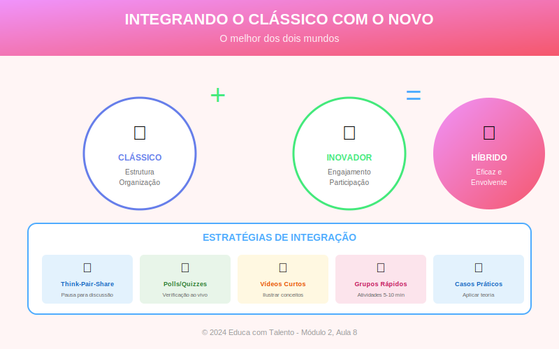

# Aula 08: Integrando o Clássico com o Novo — Síntese do Módulo 2

## Informações da Aula

| Item | Descrição |
|------|-----------|
| **Módulo** | 2 - Metodologias Clássicas |
| **Bloco** | Síntese e Integração |
| **Duração Estimada** | 50 minutos |
| **Nível** | Intermediário |

---

## Fundamentação Teórica

### O Falso Dilema: Clássico versus Moderno

Um dos debates mais improdutivos na educação é a oposição entre metodologias "tradicionais" e "inovadoras". De um lado, defensores do ensino expositivo, da disciplina e do rigor. De outro, entusiastas das metodologias ativas, da tecnologia e da autonomia do aluno.

**António Nóvoa** alertou para esse "excesso de discursos" que criam falsas oposições:

> "A pedagogia vive de slogans que se opõem uns aos outros, mas que pouco traduzem em práticas reais de mudança."

A verdade é que **não há metodologia universalmente superior**. Cada abordagem tem forças e limitações. O professor competente conhece múltiplas metodologias e sabe quando usar cada uma.

### O Conceito de "Blend" Metodológico

**Michael Horn** e **Heather Staker**, em "Blended: Using Disruptive Innovation to Improve Schools" (2015), popularizaram o conceito de **ensino híbrido** (blended learning). Embora o termo seja frequentemente associado à combinação de presencial e online, o princípio se aplica mais amplamente: **combinar o melhor de diferentes abordagens**.

A ideia de integração não é nova. **John Dewey** (1859-1952) já defendia que boas práticas educacionais combinam:
- Direcionamento do professor com descoberta do aluno
- Teoria com prática
- Individual com coletivo
- Rigor com criatividade

### O Framework TPACK

**Punya Mishra** e **Matthew Koehler** (Universidade Estadual de Michigan) desenvolveram o framework **TPACK** para pensar a integração de conhecimentos na prática docente:

- **T** (Technological Knowledge): Conhecimento tecnológico
- **P** (Pedagogical Knowledge): Conhecimento pedagógico
- **C** (Content Knowledge): Conhecimento do conteúdo
- **K** (Knowledge): A interseção dos três

O professor eficaz integra:
- **PCK**: Saber ensinar seu conteúdo
- **TCK**: Usar tecnologia para representar/explorar o conteúdo
- **TPK**: Usar tecnologia para fins pedagógicos
- **TPACK**: Integrar tudo harmoniosamente

### Quando Usar Cada Metodologia?

A partir das pesquisas e práticas estudadas, podemos propor diretrizes:

#### Exposição Direta é Indicada Quando:
- O conteúdo é novo e complexo
- Os alunos têm poucos conhecimentos prévios
- Há restrição severa de tempo
- O objetivo é transmitir informação factual
- É necessário modelar pensamento especializado

#### Questionamento Socrático é Indicado Quando:
- Há concepções prévias a serem examinadas
- O objetivo é desenvolver pensamento crítico
- O conteúdo envolve conceitos complexos ou controversos
- Há tempo para exploração profunda
- A turma tem maturidade para participar

#### Metodologias Ativas são Indicadas Quando:
- O objetivo é aplicação prática
- Os alunos têm base conceitual suficiente
- Há recursos (tempo, espaço, materiais)
- O conteúdo permite investigação/experimentação
- Competências de colaboração são valorizadas

### O Modelo de Instrução Direta de Rosenshine

**Barak Rosenshine** (1930-2017), professor da Universidade de Illinois, sintetizou décadas de pesquisa sobre ensino eficaz em **10 Princípios de Instrução** que integram elementos de várias abordagens:

| Princípio | Descrição |
|-----------|-----------|
| 1. Revisão | Começar com revisão de aprendizagem anterior |
| 2. Passos pequenos | Apresentar novo material em passos manejáveis |
| 3. Perguntas | Fazer muitas perguntas e verificar compreensão |
| 4. Modelos | Fornecer modelos e exemplos trabalhados |
| 5. Prática guiada | Guiar a prática inicial dos alunos |
| 6. Verificação | Checar compreensão frequentemente |
| 7. Alto taxa de sucesso | Garantir que alunos acertem ~80% |
| 8. Scaffolding | Oferecer suporte para tarefas difíceis |
| 9. Prática independente | Promover prática autônoma |
| 10. Revisão periódica | Fazer revisões semanais e mensais |

Note como Rosenshine integra: exposição (princípios 2, 4), questionamento (princípios 3, 6), prática (princípios 5, 7, 9) e repetição espaçada (princípios 1, 10).

### Sequências Didáticas Integradas

**Antoni Zabala** propõe pensar em **sequências didáticas** — conjuntos de atividades ordenadas, estruturadas e articuladas. Uma boa sequência:

1. **Ativa conhecimentos prévios** (organizador prévio)
2. **Apresenta novos conteúdos** (exposição)
3. **Promove reflexão** (questionamento)
4. **Oferece prática guiada** (demonstração + acompanhamento)
5. **Permite prática autônoma** (exercícios, projetos)
6. **Avalia e oferece feedback** (formativo)
7. **Consolida e conecta** (síntese, transferência)

### O Papel da Tecnologia: Potencializador, Não Substituto

Tecnologias educacionais não substituem metodologias — elas potencializam. Um vídeo pode ser tão expositivo quanto uma aula tradicional. Um fórum online pode ser tão socrático quanto um debate presencial.

**Ruben Puentedura** desenvolveu o modelo **SAMR** para avaliar o uso de tecnologia:

- **S (Substituição)**: Tecnologia substitui ferramenta anterior sem mudança funcional
- **A (Ampliação)**: Substituição com melhoria funcional
- **M (Modificação)**: Tecnologia permite redesign significativo da tarefa
- **R (Redefinição)**: Tecnologia permite tarefas antes impossíveis

O objetivo não é usar tecnologia por usar, mas usá-la para potencializar aprendizagem.

### Planejando uma Aula Integrada

Propomos um modelo de planejamento que integra metodologias:

#### 1. Diagnóstico (Antes da Aula)
- O que os alunos já sabem?
- Que concepções errôneas podem existir?
- Quais são os objetivos de aprendizagem?
- Que recursos tenho disponíveis?

#### 2. Abertura (5-10% do tempo)
- Ativador: conectar com conhecimento prévio
- Gancho: capturar atenção
- Objetivos: explicitar o que será aprendido

#### 3. Desenvolvimento (70-80% do tempo)

**Bloco A: Introdução Conceitual (exposição)**
- Apresentar conceitos-chave
- Usar exemplos e analogias
- Verificar compreensão com perguntas

**Bloco B: Aprofundamento (socrático/discussão)**
- Questionar para revelar nuances
- Explorar implicações
- Confrontar perspectivas

**Bloco C: Aplicação (prática/ativo)**
- Exercícios guiados
- Trabalho colaborativo
- Resolução de problemas

#### 4. Fechamento (10-15% do tempo)
- Síntese dos pontos principais
- Conexões com conteúdos anteriores e futuros
- Avaliação formativa rápida
- Indicação de próximos passos

### Perfil do Professor Versátil

O educador que integra metodologias precisa desenvolver:

**Competências Técnicas:**
- Domínio de múltiplas metodologias
- Habilidade de planejamento integrado
- Capacidade de avaliação formativa

**Competências Relacionais:**
- Leitura de turma (adaptar em tempo real)
- Gestão de dinâmicas de grupo
- Comunicação eficaz em diferentes registros

**Competências Reflexivas:**
- Autoavaliação constante
- Abertura a feedback
- Disposição para experimentar e ajustar

---

## Objetivos de Aprendizagem

Ao final desta aula, o educador será capaz de:

### Objetivo Geral
Sintetizar os aprendizados do módulo sobre metodologias clássicas e desenvolver capacidade de integração metodológica.

### Objetivos Específicos

1. **Superar** a falsa dicotomia entre metodologias tradicionais e inovadoras.

2. **Identificar** quando cada metodologia clássica é mais indicada.

3. **Aplicar** os princípios de instrução de Rosenshine em planejamentos.

4. **Estruturar** sequências didáticas que integram múltiplas abordagens.

5. **Avaliar** o uso de tecnologia segundo o modelo SAMR.

6. **Planejar** uma aula integrada usando o modelo proposto.

---

## Roteiro da Aula

### Abertura (5 min)
- Retomada: O que aprendemos no Módulo 2?
- Provocação: "Existe a metodologia perfeita?"
- Objetivos da aula

### Desenvolvimento (40 min)

#### Parte 1: Superando Falsas Dicotomias (8 min)
- O debate improdutivo: tradicional vs. inovador
- Cada metodologia tem seu lugar
- O conceito de blend metodológico

#### Parte 2: Quando Usar o Quê (10 min)
- Diretrizes para escolha metodológica
- Princípios de Rosenshine
- Discussão: casos práticos

#### Parte 3: Sequências Didáticas Integradas (12 min)
- O modelo de Zabala
- Tecnologia como potencializador (SAMR)
- Exemplo de sequência integrada

#### Parte 4: Planejando na Prática (10 min)
- Modelo de planejamento integrado
- Exercício: esboçando uma aula
- Compartilhamento e feedback

### Encerramento (5 min)
- Síntese do Módulo 2
- O perfil do professor versátil
- Preview do Módulo 3

---

## Narração em Primeira Pessoa

### Abertura

Chegamos à última aula do Módulo 2! Antes de avançar, vamos fazer uma retomada. O que vimos até aqui?

Na **Aula 5**, estudamos a estrutura do ensino expositivo — carga cognitiva, princípios de Mayer, técnicas de engajamento.

Na **Aula 6**, fomos além da estrutura: storytelling, comunicação não-verbal, criação de momentos memoráveis.

Na **Aula 7**, mergulhamos no método socrático — perguntas que fazem pensar.

E agora, **Aula 8**, vamos integrar tudo isso.

Deixa eu começar com uma provocação: **existe a metodologia perfeita?**

Se você respondeu "metodologias ativas" ou "sala de aula invertida" ou qualquer outra coisa específica... eu discordo. Não existe metodologia universalmente superior. E hoje vamos entender por quê.

### Desenvolvimento

#### Superando Falsas Dicotomias

Um dos debates mais cansativos na educação é: tradicional versus inovador. De um lado, os que defendem que "no meu tempo era melhor". De outro, os que acham que qualquer coisa que pareça tradicional está ultrapassada.

Sabe o que eu acho? **Esse debate é inútil**.

A pergunta certa não é "qual metodologia é melhor?", mas sim "**qual metodologia é melhor para este objetivo, com estes alunos, neste contexto?**".

Exposição é ruim? Não! Exposição **mal feita** é ruim. Uma exposição bem estruturada, com storytelling, interação e verificação de compreensão é poderosa.

Metodologias ativas são sempre melhores? Não! Se os alunos não têm base conceitual suficiente, jogá-los em um projeto sem direcionamento pode ser confuso e improdutivo.

O professor competente conhece múltiplas ferramentas e sabe quando usar cada uma. É como um carpinteiro: ele não usa só martelo ou só chave de fenda. Ele tem uma caixa de ferramentas completa.

#### Quando Usar o Quê

Vou te dar algumas diretrizes baseadas em pesquisa.

**Use exposição direta quando**:
- O conteúdo é novo e os alunos não têm onde ancorar
- Você precisa transmitir muita informação em pouco tempo
- O objetivo é modelar pensamento especializado

**Use questionamento socrático quando**:
- Há concepções errôneas a serem desafiadas
- O objetivo é desenvolver pensamento crítico
- O conteúdo é controverso ou complexo

**Use metodologias ativas quando**:
- Os alunos já têm base conceitual
- O objetivo é aplicação prática
- Competências de colaboração são importantes

E aqui está a chave: **na maioria das vezes, você vai combinar**.

Barak Rosenshine, após décadas de pesquisa, identificou 10 princípios que os professores mais eficazes seguem. Vou destacar alguns:

- Começam com revisão
- Apresentam novo material em passos pequenos
- Fazem muitas perguntas
- Oferecem modelos e exemplos
- Guiam a prática inicial
- Verificam compreensão frequentemente

Percebe? Isso combina exposição, questionamento e prática. Não é uma coisa ou outra. É **integração**.

#### Sequências Didáticas Integradas

Antoni Zabala propõe pensar em **sequências didáticas** — não aulas isoladas, mas conjuntos articulados.

Uma boa sequência pode parecer assim:

**Abertura** (5 min): Pergunta geradora que ativa conhecimentos prévios

**Bloco A** (15 min): Exposição do conceito central, com exemplos

**Bloco B** (10 min): Perguntas socráticas para aprofundar

**Bloco C** (15 min): Atividade prática em duplas

**Fechamento** (5 min): Síntese coletiva e conexão com próxima aula

E a tecnologia? Ela entra como **potencializador**, não como fim em si mesma.

O modelo SAMR ajuda a avaliar: estou apenas substituindo quadro por PowerPoint? Ou estou usando a tecnologia para permitir coisas que antes eram impossíveis — como colaboração em tempo real, acesso a fontes primárias, visualizações interativas?

#### Planejando na Prática

Deixa eu te dar um modelo de planejamento que uso:

**Antes: Diagnóstico**
- O que os alunos já sabem?
- Quais os objetivos específicos?
- Que metodologias são mais adequadas?

**Durante: Estrutura**
- 10% Abertura: gancho + conexão com prévio + objetivos
- 80% Desenvolvimento: alternando exposição, questionamento, prática
- 10% Fechamento: síntese + avaliação formativa + próximos passos

**Depois: Reflexão**
- O que funcionou?
- O que ajustar?
- O que aprendi para a próxima vez?

### Encerramento

Vamos sintetizar o Módulo 2:

- A exposição bem feita é arte — estrutura cognitiva + storytelling + comunicação + design
- O questionamento socrático desenvolve pensamento crítico — perguntas certas > respostas prontas
- Integração > dicotomia — combine metodologias conforme objetivos e contexto
- O professor versátil tem caixa de ferramentas completa

No **Módulo 3**, vamos mergulhar nas **Metodologias Ativas**: sala de aula invertida, aprendizagem baseada em projetos, aprendizagem baseada em problemas, gamificação. Prepare-se para expandir ainda mais seu repertório!

---

## Recursos Utilizados

### Slides/Apresentação
- Diagrama: O falso dilema (tradicional vs. inovador)
- Quadro: Quando usar cada metodologia
- Infográfico: 10 Princípios de Rosenshine
- Modelo visual: Sequência didática integrada
- Pirâmide SAMR

### Materiais de Apoio
- Template: Planejamento de aula integrada
- Checklist: Integração metodológica
- Resumo: Princípios de Rosenshine

### Referências Bibliográficas
- ROSENSHINE, Barak. **Principles of Instruction**. American Educator, 2012.
- ZABALA, Antoni. **A Prática Educativa**. Porto Alegre: Artmed, 1998.
- HORN, M.; STAKER, H. **Blended**. Jossey-Bass, 2015.
- MISHRA, P.; KOEHLER, M. **TPACK**. Teachers College Record, 2006.
- DEWEY, John. **Democracia e Educação**. São Paulo: Cia. Editora Nacional, 1959.

---

## Atividade Prática: Projeto Integrador do Módulo 2

> **Esta é a atividade de encerramento do Módulo 2. Dedique tempo e atenção especiais!**

### Instruções Detalhadas

Este projeto integra todos os aprendizados do módulo em um planejamento prático. Reserve aproximadamente 2 horas.

#### Parte 1: Planejamento de Sequência Integrada (60 minutos)

Escolha um tema de sua área de atuação e planeje uma **sequência didática de 3 aulas** que integre:
- Exposição dialogada
- Questionamento socrático
- Elementos de engajamento (storytelling, etc.)

**Para cada aula, detalhe:**

| Elemento | Aula 1 | Aula 2 | Aula 3 |
|----------|--------|--------|--------|
| Objetivo específico | | | |
| Metodologia predominante | | | |
| Abertura (atividade) | | | |
| Desenvolvimento (blocos) | | | |
| Fechamento | | | |
| Recursos/tecnologia | | | |
| Avaliação formativa | | | |

**Justifique suas escolhas metodológicas** para cada aula (por que essa metodologia para esse objetivo?).

#### Parte 2: Roteiro Detalhado de Uma Aula (40 minutos)

Escolha UMA das três aulas e desenvolva um roteiro detalhado:

1. **Abertura** (tempo, script resumido, recursos)
2. **Desenvolvimento** (cada bloco detalhado, perguntas a fazer, atividades)
3. **Fechamento** (síntese, avaliação, conexão)

Inclua:
- Pelo menos 3 perguntas socráticas que usaria
- Um elemento de storytelling
- Uma técnica de engajamento (Cold Call, Turn and Talk, etc.)

#### Parte 3: Reflexão sobre Integração (20 minutos)

Responda:

1. **Quais foram os principais desafios** de planejar integrando metodologias?

2. **Como você decidiu** o momento de usar cada abordagem?

3. **O que mudou** em sua compreensão sobre metodologias após este módulo?

4. **Que competência** você mais precisa desenvolver para se tornar um professor mais versátil?

### Formato de Entrega

- Planejamento das 3 aulas (tabela + justificativas)
- Roteiro detalhado de 1 aula
- Reflexão (400-500 palavras)

### Critérios de Avaliação

| Critério | Peso |
|----------|------|
| Coerência da sequência didática | 25% |
| Qualidade da integração metodológica | 25% |
| Detalhamento e viabilidade do roteiro | 25% |
| Profundidade da reflexão | 15% |
| Clareza e organização | 10% |

### Entrega

Submeta seu trabalho na área **"Projeto Integrador - Módulo 2"** do Moodle.

---

## Conclusão da Aula e do Módulo

### Resumo dos Pontos-Chave da Aula

- Não existe metodologia universalmente superior — contexto determina escolha
- O professor versátil domina múltiplas ferramentas e sabe quando usar cada uma
- Os princípios de Rosenshine integram exposição, questionamento e prática
- Sequências didáticas articulam diferentes abordagens
- Tecnologia é potencializador, não fim em si mesma

### Síntese do Módulo 2

Ao longo deste módulo, você:

✅ Compreendeu os fundamentos cognitivos da exposição eficaz

✅ Desenvolveu habilidades de comunicação e engajamento

✅ Dominou os princípios do método socrático

✅ Aprendeu a integrar metodologias clássicas de forma estratégica

### Conexão com o Módulo 3

No **Módulo 3: Metodologias Ativas**, você expandirá seu repertório com abordagens centradas no aluno:

- **Aula 9**: Sala de Aula Invertida (Flipped Classroom)
- **Aula 10**: Aprendizagem Baseada em Projetos (ABP)
- **Aula 11**: Aprendizagem Baseada em Problemas (PBL)
- **Aula 12**: Gamificação na Educação

Prepare-se para metodologias que colocam o aluno no centro do processo!

### Frase de Encerramento

> "O melhor professor não é o que dá as melhores respostas, mas o que faz as melhores perguntas e cria as melhores condições para que os alunos encontrem suas próprias respostas."
> — **Adaptado de várias fontes**

---

## Notas de Produção

### Elementos Visuais Sugeridos
- Diagrama: Falso dilema superado
- Infográfico: Princípios de Rosenshine
- Modelo visual de sequência integrada
- Exemplos de planejamento

### Tom da Apresentação
- Síntese e integração (conectando os pontos)
- Prático e aplicado
- Encorajador para experimentação
- Entusiasmado sobre próximo módulo

### Dica de Gravação
- Retomar visualmente o que foi visto no módulo
- Demonstrar integração na própria aula
- Usar exemplos de diferentes áreas
- Criar expectativa para Módulo 3

---

*Aula 08 de 20 - Curso Metodologias de Ensino - Educa com Talento*

---

## Infográfico da Aula

O infográfico "Integrando o Clássico com o Novo" apresenta o modelo de planejamento integrado, os princípios de Rosenshine e diretrizes para escolha metodológica.

> **Dica de uso**: Este infográfico serve como guia de referência para o planejamento de aulas que integram diferentes metodologias.
