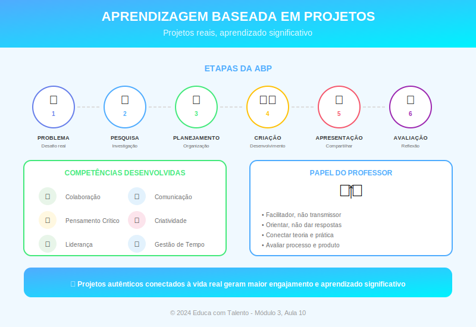

# Aula 10: Aprendizagem Baseada em Projetos (ABP)

## Informações da Aula

| Item | Descrição |
|------|-----------|
| **Módulo** | 3 - Metodologias Ativas |
| **Bloco** | Metodologia |
| **Duração Estimada** | 55 minutos |
| **Nível** | Intermediário |

---

## Fundamentação Teórica

### O que é Aprendizagem Baseada em Projetos?

A **Aprendizagem Baseada em Projetos** (ABP ou PBL - Project Based Learning) é uma metodologia em que os alunos aprendem desenvolvendo **projetos autênticos** que respondem a problemas ou questões do mundo real.

**John Larmer** e **John Mergendoller**, do Buck Institute for Education (BIE), definem:

> "ABP é um método de ensino no qual os alunos ganham conhecimento e habilidades trabalhando por um período extenso para investigar e responder a uma questão, problema ou desafio autêntico, complexo e engajador."

### Raízes Históricas

A ABP tem raízes em **John Dewey** (1859-1952), que defendia o "aprender fazendo" (learning by doing) e a conexão entre escola e vida real. **William Heard Kilpatrick** (1871-1965), discípulo de Dewey, desenvolveu o "Método de Projetos" em 1918.

### Elementos Essenciais da ABP de Qualidade

O Buck Institute for Education identifica **7 elementos essenciais**:

| Elemento | Descrição |
|----------|-----------|
| **1. Problema/Questão Desafiadora** | Uma questão aberta que engaja e direciona o projeto |
| **2. Investigação Sustentada** | Processo rigoroso de questionamento, pesquisa e aplicação |
| **3. Autenticidade** | Contexto, tarefa ou impacto real |
| **4. Voz e Escolha do Aluno** | Decisões sobre produto, processo ou problema |
| **5. Reflexão** | Sobre o aprendizado e o processo |
| **6. Crítica e Revisão** | Feedback iterativo para melhorar o trabalho |
| **7. Produto Público** | Resultado compartilhado além da sala de aula |

### A Questão Motriz

O projeto começa com uma **questão motriz** (driving question) — uma pergunta aberta que:
- É provocativa e engajante
- Requer conhecimento substantivo para responder
- Está conectada a objetivos de aprendizagem
- Permite múltiplas abordagens

**Exemplos:**
- "Como podemos reduzir o desperdício de alimentos em nossa escola?"
- "Que cidade queremos ter em 2050?"
- "Como a matemática pode ajudar a resolver problemas de trânsito?"

### Fases de um Projeto

**Fase 1: Lançamento**
- Apresentação da questão motriz
- Ativação de conhecimentos prévios
- Levantamento do que sabem e precisam saber

**Fase 2: Investigação**
- Pesquisa guiada e autônoma
- Aulas de conteúdo (workshops) conforme necessidade
- Coleta de dados e informações

**Fase 3: Desenvolvimento**
- Criação do produto/solução
- Ciclos de crítica e revisão
- Prototipagem e iteração

**Fase 4: Apresentação**
- Produto público compartilhado
- Audiência autêntica quando possível
- Celebração do aprendizado

**Fase 5: Reflexão**
- Autoavaliação
- Avaliação de pares
- Conexão com próximos passos

### Papel do Professor na ABP

| Função | Descrição |
|--------|-----------|
| **Designer** | Planeja o projeto, questão motriz, avaliação |
| **Facilitador** | Guia sem dar respostas prontas |
| **Coach** | Oferece feedback, apoio individualizado |
| **Expert** | Fornece conhecimento quando necessário |
| **Avaliador** | Monitora progresso, avalia processo e produto |

### Avaliação na ABP

A avaliação deve contemplar:

- **Produto final**: Qualidade, atendimento aos critérios
- **Processo**: Colaboração, gestão de tempo, persistência
- **Conhecimento**: Domínio dos conteúdos curriculares
- **Habilidades**: Pensamento crítico, comunicação, criatividade

**Ferramentas comuns:**
- Rubricas detalhadas
- Portfólios de processo
- Apresentações avaliadas por múltiplas audiências
- Autoavaliação e avaliação de pares

### ABP e o Currículo

A ABP pode ser:
- **Interdisciplinar**: Integrando várias disciplinas
- **Disciplinar**: Dentro de uma única matéria
- **Suplementar**: Projeto adicional ao currículo regular
- **Central**: Currículo organizado em torno de projetos

### Desafios e Estratégias

| Desafio | Estratégia |
|---------|------------|
| Tempo | Começar com projetos menores; integrar ao currículo |
| Avaliação | Usar rubricas; avaliar processo e produto |
| Gestão de grupos | Definir papéis; check-ins regulares |
| Cobertura curricular | Mapear conteúdos no projeto; workshops pontuais |
| Alunos perdidos | Marcos intermediários; scaffolding |

---

## Objetivos de Aprendizagem

Ao final desta aula, o educador será capaz de:

1. **Definir** ABP e distingui-la de atividades pontuais com projetos
2. **Identificar** os 7 elementos essenciais de um projeto de qualidade
3. **Formular** questões motrizes eficazes
4. **Planejar** as fases de um projeto educacional
5. **Desenvolver** estratégias de avaliação para ABP
6. **Antecipar** desafios e propor soluções

---

## Atividade Prática

### Desafio: Esboçando um Projeto

1. Escolha um conteúdo curricular de sua disciplina

2. Crie uma **questão motriz** que atenda aos critérios estudados

3. Esboce as **4 fases** do projeto (lançamento, investigação, desenvolvimento, apresentação)

4. Liste **3 conteúdos curriculares** que seriam trabalhados

5. Descreva o **produto final** esperado e a **audiência** para apresentação

6. Identifique **2 desafios** potenciais e estratégias para superá-los

**Entrega**: Documento com esboço do projeto (máximo 2 páginas)

---

## Conclusão

### Pontos-Chave
- ABP é aprender através de projetos autênticos, não apenas "fazer projetos"
- Os 7 elementos do BIE garantem qualidade
- A questão motriz é o coração do projeto
- Professor como designer e facilitador
- Avaliação de processo e produto

### Frase de Encerramento
> "Diga-me e eu esqueço. Ensine-me e eu lembro. Envolva-me e eu aprendo."
> — **Benjamin Franklin** (atribuído)

---

*Aula 10 de 20 - Curso Metodologias de Ensino - Educa com Talento*

