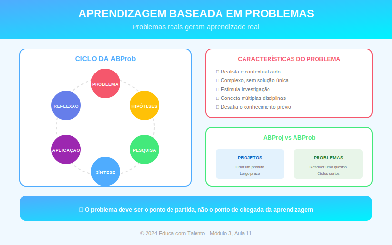

# Aula 11: Aprendizagem Baseada em Problemas (PBL)

## Informações da Aula

| Item | Descrição |
|------|-----------|
| **Módulo** | 3 - Metodologias Ativas |
| **Bloco** | Metodologia |
| **Duração Estimada** | 55 minutos |
| **Nível** | Intermediário |

---

## Fundamentação Teórica

### O que é Aprendizagem Baseada em Problemas?

A **Aprendizagem Baseada em Problemas** (PBL - Problem Based Learning) é uma metodologia em que a aprendizagem acontece através da **investigação de problemas complexos e mal-estruturados**.

Diferente de "resolver exercícios", o PBL trabalha com problemas que:
- Não têm uma única resposta correta
- Requerem investigação para serem compreendidos
- Simulam situações reais da vida profissional
- Demandam integração de conhecimentos

### Origem: McMaster e a Revolução na Medicina

O PBL surgiu na **Universidade de McMaster** (Canadá) no final dos anos 1960. O currículo médico tradicional era criticado: alunos memorizavam conteúdos por anos antes de ver um paciente.

**Howard Barrows** e colegas propuseram uma revolução: começar pelo problema clínico. Os alunos recebiam um caso e, para resolvê-lo, precisavam buscar conhecimento — anatomia, fisiologia, farmacologia — de forma integrada e significativa.

### Diferença entre ABP e PBL

Embora frequentemente confundidos:

| Aspecto | ABP (Projetos) | PBL (Problemas) |
|---------|---------------|-----------------|
| **Foco** | Criar um produto | Resolver um problema |
| **Duração** | Semanas/meses | Dias/semanas |
| **Problema** | Questão motriz ampla | Caso específico |
| **Resultado** | Produto tangível | Solução/diagnóstico |
| **Origem** | Educação geral | Medicina/profissões |

Na prática, as metodologias podem se combinar.

### O Processo PBL Clássico (Ciclo de Maastricht)

A **Universidade de Maastricht** (Holanda) sistematizou o PBL em 7 passos:

1. **Esclarecer termos**: Definir conceitos desconhecidos
2. **Definir o problema**: Identificar o que precisa ser explicado
3. **Brainstorming**: Levantar hipóteses e explicações prévias
4. **Estruturar**: Organizar as ideias levantadas
5. **Definir objetivos de aprendizagem**: O que preciso aprender?
6. **Estudo individual**: Buscar conhecimento nas fontes
7. **Síntese e avaliação**: Compartilhar achados, aplicar ao problema

### Características de Bons Problemas

**Barrows** estabelece critérios para problemas eficazes:

| Critério | Descrição |
|----------|-----------|
| **Mal-estruturado** | Não há caminho único óbvio |
| **Complexo** | Requer integração de conhecimentos |
| **Autêntico** | Baseado em situações reais |
| **Desafiador** | Está na ZDP dos alunos |
| **Currículo-alinhado** | Permite trabalhar objetivos de aprendizagem |

### Exemplo de Problema PBL

**Contexto:** Administração de Empresas

**Problema:**
> A Padaria Sabor de Casa, negócio familiar de 30 anos, está perdendo clientes para redes de supermercados. O faturamento caiu 40% em dois anos. O proprietário, Sr. João, tem recursos limitados e não pode competir em preço. O filho, recém-formado, quer ajudar, mas pai e filho discordam sobre o que fazer. Como consultor, você foi chamado para analisar a situação e propor um plano.

**O que esse problema mobiliza:**
- Marketing e posicionamento
- Análise financeira
- Gestão de pessoas e conflitos
- Planejamento estratégico
- Empreendedorismo

### O Papel do Tutor no PBL

O tutor (professor) no PBL **não dá respostas**, mas:
- Facilita a discussão do grupo
- Faz perguntas para aprofundar
- Garante que todos participem
- Ajuda a identificar gaps de conhecimento
- Aponta recursos quando necessário
- Avalia o processo

### O Papel do Grupo

No PBL, os alunos trabalham em **pequenos grupos** (5-8 pessoas) com papéis definidos:

- **Coordenador**: Conduz a discussão
- **Relator**: Registra e organiza as ideias
- **Membros**: Participam ativamente

Os papéis rotacionam a cada sessão.

### Avaliação no PBL

A avaliação é **multimodal**:

- **Processual**: Participação nas discussões
- **Individual**: Provas, trabalhos individuais
- **Grupal**: Qualidade da solução proposta
- **Autoavaliação e avaliação de pares**

### Evidências de Eficácia

Pesquisas mostram que o PBL desenvolve especialmente:
- Habilidades de resolução de problemas
- Aprendizagem autodirigida
- Trabalho em equipe
- Retenção de longo prazo

Resultados em conteúdo factual são similares ao ensino tradicional, mas a transferência para novos contextos é superior.

---

## Objetivos de Aprendizagem

Ao final desta aula, o educador será capaz de:

1. **Diferenciar** PBL de ABP e de exercícios tradicionais
2. **Explicar** o processo de 7 passos de Maastricht
3. **Criar** problemas que atendam aos critérios de qualidade
4. **Facilitar** sessões de PBL como tutor
5. **Avaliar** aprendizagem em contexto de PBL

---

## Atividade Prática

### Desafio: Criando um Problema PBL

1. Escolha um conjunto de conteúdos de sua disciplina

2. Crie um **problema mal-estruturado** que:
   - Seja baseado em situação real/realista
   - Não tenha resposta única óbvia
   - Requeira integração de conhecimentos
   - Esteja na ZDP de seus alunos

3. Escreva o problema em formato narrativo (1 parágrafo)

4. Liste os **objetivos de aprendizagem** que o problema mobiliza

5. Descreva como conduziria a **primeira sessão** (30 min)

**Entrega**: Documento com problema e planejamento

---

## Conclusão

### Pontos-Chave
- PBL usa problemas complexos como ponto de partida
- Origem na medicina, hoje usado em diversas áreas
- O ciclo de 7 passos estrutura o processo
- Professor como tutor/facilitador, não transmissor
- Desenvolve especialmente habilidades de resolução de problemas

### Frase de Encerramento
> "Não é suficiente ter uma boa mente; o principal é usá-la bem."
> — **René Descartes**

---

*Aula 11 de 20 - Curso Metodologias de Ensino - Educa com Talento*

