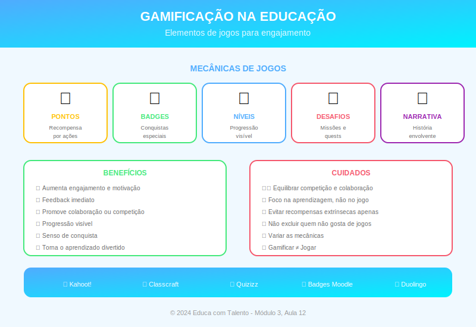

# Aula 12: Gamificação na Educação

## Informações da Aula

| Item | Descrição |
|------|-----------|
| **Módulo** | 3 - Metodologias Ativas |
| **Bloco** | Metodologia |
| **Duração Estimada** | 55 minutos |
| **Nível** | Intermediário |

---

## Fundamentação Teórica

### O que é Gamificação?

**Gamificação** é o uso de elementos de jogos em contextos que não são jogos para aumentar engajamento, motivação e aprendizagem.

**Karl Kapp**, especialista em gamificação educacional, define:

> "Gamificação é usar mecânicas, estética e pensamento de jogos para engajar pessoas, motivar ação, promover aprendizagem e resolver problemas."

**Importante:** Gamificação não é usar jogos prontos (isso é Game-Based Learning). É aplicar **elementos** de jogos ao design de experiências de aprendizagem.

### Por que Jogos Engajam?

A psicologia explica o poder dos jogos:

**Teoria da Autodeterminação** (Deci & Ryan):
- **Autonomia**: Poder fazer escolhas
- **Competência**: Sentir que está progredindo
- **Relacionamento**: Conexão com outros

**Estado de Flow** (Csikszentmihalyi):
- Desafio equilibrado com habilidade
- Feedback imediato
- Objetivos claros

Jogos bem desenhados atendem a esses princípios naturalmente.

### Elementos de Jogos Aplicáveis à Educação

| Elemento | Descrição | Aplicação Educacional |
|----------|-----------|----------------------|
| **Pontos** | Quantificam progresso | Sistema de pontuação por atividades |
| **Badges/Emblemas** | Reconhecem conquistas | Certificados por habilidades |
| **Leaderboards** | Ranking comparativo | Quadro de líderes (com cuidado!) |
| **Níveis** | Progressão estruturada | Desbloqueio de conteúdos |
| **Missões/Quests** | Tarefas com narrativa | Atividades como "missões" |
| **Narrativa** | História envolvente | Contexto ficcional para aprendizagem |
| **Feedback** | Retorno imediato | Correção instantânea |
| **Barras de progresso** | Visualização do avanço | "Você completou 60% do módulo" |

### Gamificação Estrutural vs. de Conteúdo

**Gamificação Estrutural:**
Aplica elementos de jogos à estrutura do curso sem alterar o conteúdo.
- Pontos por participação
- Badges por conclusão de módulos
- Ranking de desempenho

**Gamificação de Conteúdo:**
Incorpora narrativa e mecânicas ao próprio conteúdo.
- Conteúdo apresentado como história
- Aluno assume papel de personagem
- Decisões afetam o percurso

### Cuidados e Armadilhas

**Riscos da gamificação mal feita:**

| Armadilha | Problema | Como Evitar |
|-----------|----------|-------------|
| **Pointsification** | Só adicionar pontos não transforma a experiência | Usar múltiplos elementos integrados |
| **Motivação extrínseca** | Pode minar motivação intrínseca | Balancear recompensas; focar em progresso |
| **Rankings tóxicos** | Pode desmotivar os que ficam atrás | Usar rankings opcionais ou por grupos |
| **Superficialidade** | Foco em "ganhar" sem aprender | Vincular recompensas a aprendizagem real |

### Ferramentas de Gamificação

**Plataformas completas:**
- Classcraft: Transforma sala em RPG
- Kahoot!: Quiz gamificado
- Quizizz: Quiz com ritmo individual
- Socrative: Respostas em tempo real

**Elementos em LMS:**
- Moodle: Plugins de gamificação (Level Up!, Badges)
- Canvas: Badges e rubricas gamificadas
- Google Classroom: Integrações externas

### Planejando uma Experiência Gamificada

1. **Defina objetivos de aprendizagem** (o jogo serve ao conteúdo)
2. **Conheça seus jogadores** (perfil dos alunos)
3. **Escolha mecânicas adequadas** (nem todos gostam de competição)
4. **Desenhe o percurso** (progressão, desafios, feedback)
5. **Teste e itere** (ajuste conforme feedback)

### Exemplos de Gamificação na Prática

**Exemplo 1: Curso de Idiomas (Duolingo)**
- Pontos por exercícios (XP)
- Sequência de dias (streak)
- Ligas competitivas
- Vidas limitadas

**Exemplo 2: Sala de Aula Gamificada**
- Alunos escolhem "classes" (mago, guerreiro = estilos de aprendizagem)
- Missões = atividades
- XP acumulado = nota
- Boss battles = provas

**Exemplo 3: Gamificação Leve**
- "Missão da Semana" em vez de "Tarefa"
- Barra de progresso visível
- Celebração de conquistas

---

## Objetivos de Aprendizagem

Ao final desta aula, o educador será capaz de:

1. **Definir** gamificação e diferenciá-la de Game-Based Learning
2. **Explicar** por que jogos engajam (autodeterminação, flow)
3. **Identificar** elementos de jogos aplicáveis à educação
4. **Distinguir** gamificação estrutural e de conteúdo
5. **Evitar** armadilhas comuns da gamificação
6. **Planejar** uma experiência gamificada básica

---

## Atividade Prática: Projeto Integrador do Módulo 3

### Desafio: Gamificando uma Unidade

1. Escolha uma unidade de sua disciplina (2-4 semanas)

2. Identifique **3 elementos de jogos** que você aplicaria

3. Desenhe o **sistema de progressão** (como o aluno avança?)

4. Crie **pelo menos uma missão** com descrição narrativa

5. Defina como a gamificação se conecta à **avaliação**

6. Liste **2 riscos** e como você os mitigaria

### Reflexão sobre o Módulo 3

Após estudar as 4 metodologias ativas (Sala Invertida, ABP, PBL, Gamificação):

1. Qual você considera mais **viável** para seu contexto? Por quê?
2. Que **combinações** entre elas seriam interessantes?
3. Que **apoio** você precisaria para implementar?

**Entrega**: Planejamento da gamificação + reflexão (máximo 3 páginas)

---

## Conclusão do Módulo 3

### Síntese das Metodologias Ativas

| Metodologia | Foco | Quando Usar |
|-------------|------|-------------|
| **Sala Invertida** | Otimizar tempo presencial | Conteúdo denso; autonomia do aluno |
| **ABP (Projetos)** | Criar produto autêntico | Desenvolver competências; integrar disciplinas |
| **PBL (Problemas)** | Resolver problema complexo | Profissionalização; pensamento crítico |
| **Gamificação** | Aumentar engajamento | Motivação baixa; conteúdo repetitivo |

### Frase de Encerramento
> "Jogos são a forma mais elevada de investigação."
> — **Albert Einstein** (atribuído)

---

*Aula 12 de 20 - Curso Metodologias de Ensino - Educa com Talento*

