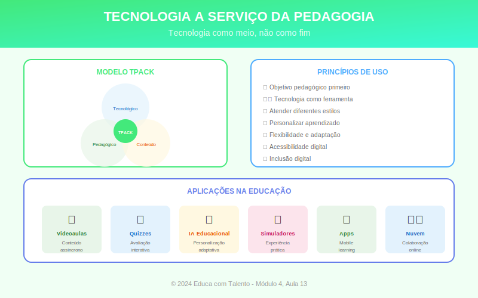

# Aula 13: Tecnologia a Serviço da Pedagogia

## Informações da Aula

| Item | Descrição |
|------|-----------|
| **Módulo** | 4 - Tecnologia e Socioemocional |
| **Bloco** | Fundamentos |
| **Duração Estimada** | 50 minutos |
| **Nível** | Intermediário |

---

## Fundamentação Teórica

### Tecnologia como Meio, Não como Fim

**Seymour Papert** (1928-2016), matemático do MIT e pioneiro da tecnologia educacional, alertava:

> "A questão não é se a tecnologia na sala de aula é boa ou ruim. A questão é: o que fazemos com ela?"

A tecnologia educacional só faz sentido quando **potencializa a aprendizagem**. Usar tecnologia por usar não traz benefícios — pode até ser prejudicial se distrai do essencial.

### O Modelo SAMR

**Ruben Puentedura** desenvolveu o modelo **SAMR** para avaliar o uso de tecnologia:

| Nível | Descrição | Exemplo |
|-------|-----------|---------|
| **S - Substituição** | Tecnologia substitui ferramenta sem mudança funcional | Ler PDF em vez de papel |
| **A - Ampliação** | Substituição com melhoria funcional | PDF com links e busca |
| **M - Modificação** | Redesign significativo da tarefa | Documento colaborativo em tempo real |
| **R - Redefinição** | Tarefas antes impossíveis | Colaboração global; realidade virtual |

Os níveis S e A são **melhoria**; M e R são **transformação**.

### O Framework TPACK

**Mishra & Koehler** (2006) propuseram o **TPACK** — integração de três tipos de conhecimento:

- **T** (Technological): Conhecer ferramentas tecnológicas
- **P** (Pedagogical): Saber ensinar
- **C** (Content): Dominar o conteúdo

O professor eficaz integra os três, sabendo **quando, como e por que** usar tecnologia para ensinar seu conteúdo específico.

### Categorias de Ferramentas Educacionais

| Categoria | Função | Exemplos |
|-----------|--------|----------|
| **LMS** | Gestão de aprendizagem | Moodle, Canvas, Google Classroom |
| **Comunicação** | Interação síncrona/assíncrona | Zoom, Teams, fóruns |
| **Criação de conteúdo** | Produzir materiais | Canva, Powtoon, Genially |
| **Avaliação** | Verificar aprendizagem | Kahoot, Quizizz, Google Forms |
| **Colaboração** | Trabalho coletivo | Google Docs, Padlet, Miro |
| **Simulação** | Experiências virtuais | PhET, Labster |
| **IA educacional** | Personalização, assistência | ChatGPT, ferramentas adaptativas |

### Critérios para Escolha de Ferramentas

Antes de adotar uma tecnologia, pergunte:

1. **Objetivo pedagógico**: O que quero que os alunos aprendam?
2. **Valor agregado**: A tecnologia faz algo que não seria possível sem ela?
3. **Acessibilidade**: Todos os alunos podem acessar?
4. **Usabilidade**: É fácil de usar para mim e para os alunos?
5. **Privacidade**: Os dados dos alunos estão protegidos?
6. **Sustentabilidade**: Terei suporte e continuidade?

### Ensino Híbrido (Blended Learning)

O **ensino híbrido** combina presencial e online de forma integrada. Modelos comuns:

| Modelo | Descrição |
|--------|-----------|
| **Rotação por estações** | Alunos rotacionam entre estações (uma online) |
| **Laboratório rotacional** | Parte do tempo em laboratório de informática |
| **Sala invertida** | Teoria online, prática presencial |
| **Flex** | Aprendizagem online, professor como suporte |
| **À la carte** | Cursos online complementam currículo |

### A Inteligência Artificial na Educação

A IA está transformando possibilidades:

**Aplicações atuais:**
- Tutoria adaptativa (IXL, Khan Academy)
- Correção automática de textos
- Geração de exercícios personalizados
- Assistentes virtuais para dúvidas
- Análise de dados de aprendizagem

**Considerações éticas:**
- Privacidade de dados dos alunos
- Viés nos algoritmos
- Risco de desvalorização do professor
- Importância de alfabetização crítica em IA

### Cuidados e Armadilhas

| Armadilha | Como Evitar |
|-----------|-------------|
| Tecnologia pela tecnologia | Sempre começar pelo objetivo pedagógico |
| Sobrecarga de ferramentas | Menos é mais; dominar poucas bem |
| Exclusão digital | Verificar acesso; oferecer alternativas |
| Distração | Design intencional; regras claras |
| Dependência | Ter plano B analógico |

---

## Objetivos de Aprendizagem

Ao final desta aula, o educador será capaz de:

1. **Posicionar** tecnologia como meio, não fim
2. **Avaliar** uso de tecnologia pelo modelo SAMR
3. **Integrar** conhecimento tecnológico, pedagógico e de conteúdo (TPACK)
4. **Selecionar** ferramentas adequadas para objetivos específicos
5. **Planejar** experiências de ensino híbrido
6. **Refletir** criticamente sobre IA na educação

---

## Atividade Prática

### Auditoria Tecnológica

1. Liste **5 ferramentas tecnológicas** que você usa (ou poderia usar) em sua prática

2. Para cada uma, classifique no modelo **SAMR**

3. Identifique **uma oportunidade** de subir de nível (de S para A, de A para M, etc.)

4. Escolha **uma ferramenta nova** para experimentar e descreva como a usaria

5. Reflita: Que **barreira** você enfrenta para usar tecnologia de forma mais transformadora?

**Entrega**: Documento com auditoria e reflexão

---

## Conclusão

### Pontos-Chave
- Tecnologia deve servir à pedagogia, não o contrário
- SAMR ajuda a avaliar se estamos transformando ou só substituindo
- TPACK integra tecnologia, pedagogia e conteúdo
- Escolha de ferramentas deve partir do objetivo de aprendizagem
- IA traz oportunidades e desafios éticos

### Frase de Encerramento
> "A tecnologia é apenas uma ferramenta. O professor é o mais importante."
> — **Bill Gates**

---

*Aula 13 de 20 - Curso Metodologias de Ensino - Educa com Talento*

