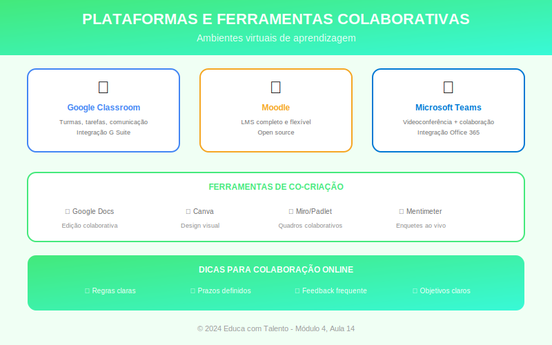

# Aula 14: Plataformas e Ferramentas Colaborativas

## Informações da Aula

| Item | Descrição |
|------|-----------|
| **Módulo** | 4 - Tecnologia e Socioemocional |
| **Bloco** | Aplicação |
| **Duração Estimada** | 50 minutos |
| **Nível** | Intermediário |

---

## Fundamentação Teórica

### A Aprendizagem Colaborativa

**Vygotsky** já demonstrava: aprendemos com os outros. A tecnologia amplifica essa possibilidade, permitindo colaboração síncrona e assíncrona, local e global.

**Johnson & Johnson** (1999), pesquisadores da Universidade de Minnesota, identificaram elementos da **colaboração eficaz**:

1. **Interdependência positiva**: Sucesso individual depende do grupo
2. **Responsabilidade individual**: Cada um presta contas
3. **Interação promotora**: Ajuda mútua, feedback
4. **Habilidades sociais**: Comunicação, resolução de conflitos
5. **Processamento grupal**: Reflexão sobre funcionamento do grupo

### Categorias de Ferramentas Colaborativas

#### Comunicação Síncrona
| Ferramenta | Uso | Destaque |
|------------|-----|----------|
| Zoom | Videoconferência | Breakout rooms |
| Google Meet | Videoconferência | Integração Google |
| Microsoft Teams | Comunicação integrada | Canais por projeto |
| Discord | Chat e voz | Comunidades |

#### Comunicação Assíncrona
| Ferramenta | Uso | Destaque |
|------------|-----|----------|
| Fóruns (Moodle) | Discussões estruturadas | Organização por tópicos |
| Slack | Comunicação por canais | Integrações |
| Loom | Vídeos rápidos | Feedback em vídeo |
| Flipgrid | Vídeos curtos | Discussões em vídeo |

#### Criação Colaborativa
| Ferramenta | Uso | Destaque |
|------------|-----|----------|
| Google Docs/Slides | Documentos/apresentações | Edição simultânea |
| Canva | Design visual | Templates prontos |
| Miro/Mural | Quadros brancos | Brainstorming visual |
| Notion | Wiki/documentação | Organização flexível |
| Padlet | Murais colaborativos | Simplicidade |

#### Organização de Projetos
| Ferramenta | Uso | Destaque |
|------------|-----|----------|
| Trello | Kanban visual | Simplicidade |
| Asana | Gestão de projetos | Recursos avançados |
| Google Tasks | Tarefas simples | Integração Google |

### Estratégias para Colaboração Online Eficaz

**Antes:**
- Defina **objetivos claros** para a colaboração
- Estabeleça **regras de participação** (netiqueta)
- Distribua **papéis** no grupo
- Crie **estrutura** no ambiente (pastas, canais)

**Durante:**
- Faça **check-ins** regulares
- Ofereça **modelos** e exemplos
- Monitore participação (todos contribuindo?)
- Intervenha quando necessário

**Depois:**
- Promova **reflexão** sobre o processo
- Celebre conquistas
- Colete feedback para melhorar

### Desafios da Colaboração Online

| Desafio | Estratégia |
|---------|------------|
| Free riders (caronas) | Responsabilidade individual; avaliação de pares |
| Conflitos | Regras claras; mediação; espaço para resolver |
| Dificuldades técnicas | Tutorial inicial; suporte disponível |
| Falta de engajamento | Tarefas significativas; feedback frequente |
| Comunicação superficial | Estruturar discussões; exigir aprofundamento |

### Avaliando Trabalho Colaborativo

**O que avaliar:**
- Produto final (coletivo)
- Processo (contribuições individuais)
- Habilidades de colaboração

**Instrumentos:**
- Rubricas com critérios claros
- Autoavaliação
- Avaliação de pares
- Observação do processo
- Logs de atividade (quando disponíveis)

---

## Objetivos de Aprendizagem

Ao final desta aula, o educador será capaz de:

1. **Identificar** elementos da colaboração eficaz
2. **Selecionar** ferramentas adequadas para diferentes necessidades colaborativas
3. **Estruturar** experiências de colaboração online
4. **Facilitar** trabalho colaborativo em ambientes virtuais
5. **Avaliar** processo e produto de trabalhos colaborativos

---

## Atividade Prática

### Design de Experiência Colaborativa

1. Planeje uma **atividade colaborativa online** para seu contexto

2. Defina:
   - Objetivo de aprendizagem
   - Composição dos grupos (tamanho, critério de formação)
   - Ferramentas que serão utilizadas
   - Papéis dentro do grupo
   - Cronograma e marcos
   - Critérios de avaliação

3. Crie um **documento de orientação** para os alunos (1 página)

4. Descreva como você **monitorará** o processo

**Entrega**: Planejamento + documento de orientação

---

## Conclusão

### Pontos-Chave
- Colaboração eficaz tem elementos estruturais (Johnson & Johnson)
- Há ferramentas para diferentes necessidades: comunicação, criação, organização
- Estrutura antes, durante e depois é crucial
- Desafios como free riders exigem estratégias proativas
- Avaliar processo é tão importante quanto avaliar produto

### Frase de Encerramento
> "Sozinhos podemos fazer tão pouco; juntos podemos fazer muito."
> — **Helen Keller**

---

*Aula 14 de 20 - Curso Metodologias de Ensino - Educa com Talento*

