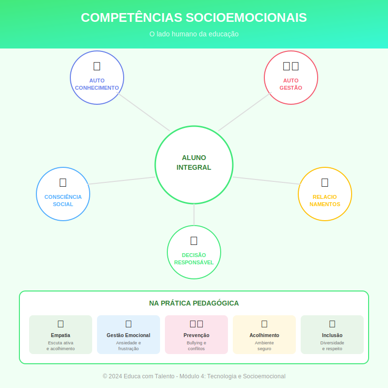

# Aula 15: Competências Socioemocionais na Sala de Aula

## Informações da Aula

| Item | Descrição |
|------|-----------|
| **Módulo** | 4 - Tecnologia e Socioemocional |
| **Bloco** | Socioemocional |
| **Duração Estimada** | 55 minutos |
| **Nível** | Intermediário |

---

## Fundamentação Teórica

### O que São Competências Socioemocionais?

Competências socioemocionais são habilidades que permitem ao indivíduo **gerenciar emoções, estabelecer relacionamentos saudáveis e tomar decisões responsáveis**.

A **CASEL** (Collaborative for Academic, Social, and Emotional Learning), referência mundial no tema, define cinco competências centrais:

| Competência | Descrição |
|-------------|-----------|
| **Autoconsciência** | Reconhecer emoções, pensamentos e valores próprios |
| **Autogestão** | Regular emoções, pensamentos e comportamentos |
| **Consciência social** | Compreender perspectivas dos outros; empatia |
| **Habilidades de relacionamento** | Comunicar, colaborar, resolver conflitos |
| **Tomada de decisão responsável** | Escolhas éticas e construtivas |

### Competências Socioemocionais na BNCC

A **Base Nacional Comum Curricular** (BNCC) do Brasil integra competências socioemocionais em suas **10 competências gerais**, incluindo:

- Competência 8: **Autoconhecimento e autocuidado**
- Competência 9: **Empatia e cooperação**
- Competência 10: **Responsabilidade e cidadania**

### Por Que Desenvolver Competências Socioemocionais?

**Pesquisas mostram correlação com:**
- Melhor desempenho acadêmico
- Menos problemas de comportamento
- Melhor saúde mental
- Maior sucesso profissional futuro
- Relacionamentos mais saudáveis

**Meta-análise de Durlak et al. (2011)** com 270.000 estudantes mostrou que programas de educação socioemocional produziram:
- +11 pontos percentuais em desempenho acadêmico
- Redução de problemas de conduta
- Melhora em habilidades sociais

### Abordagens para Desenvolvimento

#### 1. Currículo Explícito
Aulas ou programas dedicados ao tema:
- Programas como MindUP, PATHS, Programa Semente
- Horário específico no currículo
- Sequência de atividades estruturadas

#### 2. Integração Curricular
Trabalhar competências socioemocionais dentro das disciplinas:
- Literatura: explorar emoções de personagens
- História: discutir dilemas éticos
- Ciências: trabalho colaborativo em projetos
- Educação Física: gestão de frustração, fair play

#### 3. Clima Escolar
Criar ambiente que desenvolva competências:
- Modelagem pelo professor
- Rituais de acolhimento
- Resolução restaurativa de conflitos
- Participação estudantil

### Estratégias Práticas

| Competência | Estratégias |
|-------------|-------------|
| **Autoconsciência** | Diários reflexivos; check-in de emoções; autoavaliação |
| **Autogestão** | Técnicas de respiração; estabelecimento de metas; organização |
| **Consciência social** | Role-playing; análise de perspectivas; discussões sobre diversidade |
| **Relacionamento** | Trabalhos em grupo estruturados; comunicação não-violenta; feedback entre pares |
| **Tomada de decisão** | Dilemas morais; análise de consequências; projetos de impacto social |

### Círculos de Construção de Paz

Uma metodologia específica para desenvolver competências socioemocionais:

**Estrutura:**
1. Abertura (ritual, respiração)
2. Check-in (cada um compartilha como está)
3. Discussão de tema (com objeto da fala)
4. Check-out
5. Fechamento (ritual)

**Princípios:**
- Todos falam, todos escutam
- Respeito às diferenças
- Confidencialidade
- Falar de si (não dos outros)

### O Papel do Professor

O desenvolvimento socioemocional exige que o professor:

- **Modele** as competências (autorregulação, empatia)
- **Crie** ambiente seguro para expressão
- **Aproveite** momentos de ensino (conflitos como oportunidade)
- **Integre** ao conteúdo quando pertinente
- **Cuide** de si mesmo (para poder cuidar dos outros)

### Avaliação de Competências Socioemocionais

**Desafios:**
- Não são facilmente mensuráveis por provas
- Desenvolvimento é gradual e não-linear
- Risco de "ensinar para o teste"

**Abordagens:**
- Observação estruturada
- Autoavaliação e reflexão
- Rubricas de comportamentos observáveis
- Portfólios de desenvolvimento
- Feedback qualitativo

---

## Objetivos de Aprendizagem

Ao final desta aula, o educador será capaz de:

1. **Definir** competências socioemocionais e o modelo CASEL
2. **Justificar** a importância do desenvolvimento socioemocional na educação
3. **Identificar** diferentes abordagens (currículo explícito, integração, clima)
4. **Aplicar** estratégias práticas para cada competência
5. **Conduzir** um círculo de construção de paz básico
6. **Refletir** sobre seu papel como modelo de competências socioemocionais

---

## Atividade Prática

### Planejando Desenvolvimento Socioemocional

1. Escolha **uma competência socioemocional** que você considera prioritária para seus alunos

2. Justifique a **escolha** (por que essa competência?)

3. Proponha **3 estratégias** para desenvolvê-la:
   - Uma de currículo explícito
   - Uma de integração com sua disciplina
   - Uma de clima de sala de aula

4. Descreva como você **avaliaria** o desenvolvimento

5. Reflita: Como **você** pode modelar essa competência?

**Entrega**: Planejamento + reflexão

---

## Conclusão

### Pontos-Chave
- Competências socioemocionais são desenvolvíveis e impactam resultados acadêmicos e de vida
- Modelo CASEL: autoconsciência, autogestão, consciência social, relacionamento, tomada de decisão
- BNCC integra competências socioemocionais
- Abordagens: currículo explícito, integração, clima escolar
- Professor como modelo é fundamental

### Frase de Encerramento
> "A educação não é preparação para a vida; educação é a própria vida."
> — **John Dewey**

---

*Aula 15 de 20 - Curso Metodologias de Ensino - Educa com Talento*

