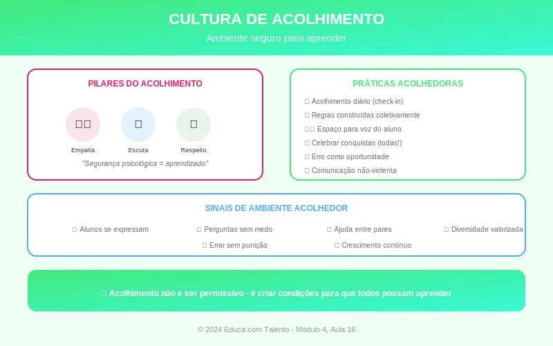

# Aula 16: Criando uma Cultura de Acolhimento e Pertencimento

## Informações da Aula

| Item | Descrição |
|------|-----------|
| **Módulo** | 4 - Tecnologia e Socioemocional |
| **Bloco** | Síntese |
| **Duração Estimada** | 50 minutos |
| **Nível** | Intermediário |

---

## Fundamentação Teórica

### A Importância do Pertencimento

**Abraham Maslow** (1908-1970), em sua hierarquia de necessidades, posicionou **pertencimento** logo acima das necessidades básicas e de segurança. Sem sentir-se parte de uma comunidade, é difícil avançar para necessidades de estima e autorealização.

Na educação, pesquisas de **Carol Dweck** (Stanford) e **Claude Steele** (Columbia) demonstram que o sentimento de pertencimento afeta diretamente:
- Motivação para aprender
- Persistência diante de dificuldades
- Desempenho acadêmico
- Saúde mental

### Ameaças ao Pertencimento

Estudantes podem sentir que "não pertencem" quando:
- São de grupos minoritários
- Têm dificuldades acadêmicas
- Sofreram bullying
- Enfrentam transições (nova escola, nova turma)
- Percebem diferenças socioeconômicas

**Ameaça de estereótipo** (Steele): O medo de confirmar estereótipos negativos sobre seu grupo pode prejudicar o desempenho.

### Construindo uma Cultura de Acolhimento

#### 1. Primeiros Dias: Contratos de Convivência
Construir coletivamente as regras da turma:
- O que precisamos para aprender bem juntos?
- Como queremos ser tratados?
- O que faremos quando alguém descumprir?

#### 2. Rotinas de Acolhimento
Rituais que criam conexão:
- Roda inicial com check-in
- Celebração de aniversários
- Reconhecimento de conquistas
- Momentos de compartilhar

#### 3. Linguagem Inclusiva
- Usar nomes corretos
- Evitar comparações entre alunos
- Normalizar o erro como parte da aprendizagem
- Feedback que separa pessoa de comportamento

#### 4. Representatividade
- Materiais que refletem diversidade
- Autores e exemplos de diferentes grupos
- Valorização das culturas presentes na turma

#### 5. Resolução Restaurativa de Conflitos
Em vez de punição, foco em:
- O que aconteceu?
- Quem foi afetado e como?
- O que precisa ser feito para reparar?
- Como evitar que aconteça novamente?

### O Conceito de "Warm Demander"

**Lisa Delpit** e **Judith Kleinfeld** descrevem o professor eficaz como "warm demander" (exigente afetuoso):

- **Warm (afetuoso)**: Demonstra carinho, acredita no potencial, cria relacionamento
- **Demander (exigente)**: Mantém expectativas altas, não aceita menos do que o aluno pode dar

O equilíbrio é crucial: só afeto sem exigência pode comunicar baixas expectativas; só exigência sem afeto pode ser percebido como hostil.

### Acolhimento na Diversidade

**Princípios de ensino culturalmente responsivo** (Gloria Ladson-Billings):

1. **Excelência acadêmica**: Altas expectativas para todos
2. **Competência cultural**: Valorizar e usar as culturas dos alunos
3. **Consciência sociopolítica**: Desenvolver pensamento crítico sobre desigualdades

### Avaliação do Clima da Sala

Ferramentas para avaliar:
- Pesquisas de clima (anônimas)
- Observação de interações
- Conversas individuais
- Sociogramas (mapeamento de relações)
- Indicadores: participação, frequência, ocorrências

---

## Objetivos de Aprendizagem

Ao final desta aula, o educador será capaz de:

1. **Compreender** a importância do pertencimento para a aprendizagem
2. **Identificar** fatores que ameaçam o sentimento de pertencimento
3. **Implementar** estratégias de acolhimento (contratos, rotinas, linguagem)
4. **Aplicar** princípios de resolução restaurativa
5. **Equilibrar** afeto e exigência (warm demander)
6. **Avaliar** o clima de sua sala de aula

---

## Atividade Prática: Projeto Integrador do Módulo 4

### Diagnóstico e Plano de Ação

**Parte 1: Diagnóstico**

1. Avalie sua sala de aula em relação a:
   - Rotinas de acolhimento existentes
   - Linguagem utilizada
   - Como conflitos são tratados
   - Representatividade nos materiais

2. Identifique **2 pontos fortes** e **2 oportunidades de melhoria**

**Parte 2: Plano de Ação**

Para cada oportunidade de melhoria, proponha:
- Ação concreta
- Prazo para implementação
- Como saberá se funcionou

**Parte 3: Reflexão sobre o Módulo 4**

1. Qual a relação entre **tecnologia** e **competências socioemocionais**?

2. Como você pode usar tecnologia para **fortalecer** (não enfraquecer) conexões?

3. Que **competência socioemocional** você precisa desenvolver em si mesmo?

**Entrega**: Diagnóstico + Plano de Ação + Reflexão

---

## Conclusão do Módulo 4

### Síntese

| Aula | Tema Central |
|------|--------------|
| 13 | Tecnologia a serviço da pedagogia (SAMR, TPACK) |
| 14 | Ferramentas colaborativas |
| 15 | Competências socioemocionais (CASEL, BNCC) |
| 16 | Cultura de acolhimento e pertencimento |

**Mensagem central**: Tecnologia e desenvolvimento humano não são opostos — quando bem integrados, potencializam a educação integral.

### Frase de Encerramento
> "As pessoas esquecerão o que você disse, esquecerão o que você fez, mas nunca esquecerão como você as fez sentir."
> — **Maya Angelou**

---

*Aula 16 de 20 - Curso Metodologias de Ensino - Educa com Talento*

